# Graphe ADG-M — Méthodologie d'ingestion, typage et corrélation

> **Note** : la section 2.2 (Phase 2 — Extraction Chat→Graph) décrit l'architecture initiale du
> pipeline d'extraction (un appel GPT-4o unique par document, troncature à 14 000 caractères,
> classification par nom de fichier, taxonomie C1-C7). Cette phase a depuis été refondue en un
> pipeline multi-étapes par document (chunking par titres, inventaire → enrichissement par couche
> et par sous-prompt → complétion, taxonomie GraphRAG Legacy-Modernisation v2.0 à 19 labels/15
> relations). La référence à jour est le code de `api/routers/extract.py`
> (`_run_extract_job`, `_ALL_LABELS_BLOCK`, `_ENRICH_TEMPLATES`).

---

## Table des matières

1. [Pipeline global](#1-pipeline-global)
2. [Constitution du dataset](#2-constitution-du-dataset)
3. [Schéma du graphe Neo4j](#3-schéma-du-graphe-neo4j)
4. [Typage des nœuds — labels et propriétés](#4-typage-des-nœuds--labels-et-propriétés)
5. [Relations — types et sémantique](#5-relations--types-et-sémantique)
6. [Couche d'analyse post-ingestion](#6-couche-danalyse-post-ingestion)
7. [Filtrage IHM — les 4 vues](#7-filtrage-ihm--les-4-vues)
8. [Glossaire et taxonomie](#8-glossaire-et-taxonomie)

---

## 1. Pipeline global

Le pipeline ADG-M est composé de **5 phases** distinctes. Les deux premières (Upload + Indexation) sont déclenchées à chaque upload de document. Les trois suivantes (Extraction, Import Neo4j, Analyse) sont manuelles.

### 1.1 Vue d'ensemble des 5 phases

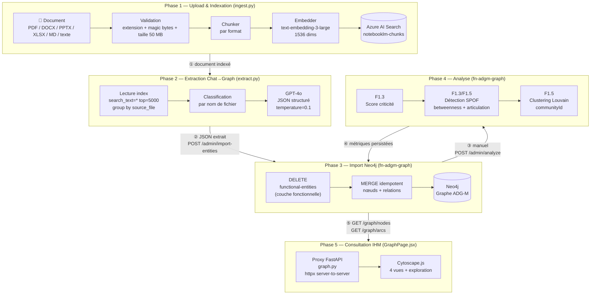

### 1.2 Couche réseau et sécurité

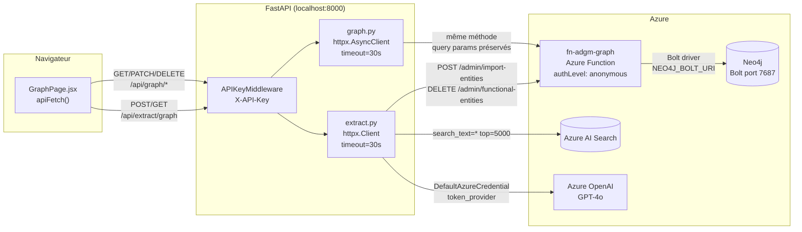

> **Pourquoi un proxy ?** Le frontend est servi par FastAPI sur `localhost:8000`. La CSP `connect-src 'self'` interdit au navigateur d'appeler directement `fn-adgm-graph` (autre origine Azure). Le proxy `graph.py` relaie les requêtes en server-to-server — pas de contournement CORS, les requêtes passent toutes par `/api/`.

### 1.3 Séquence complète d'un cycle upload → graphe visible

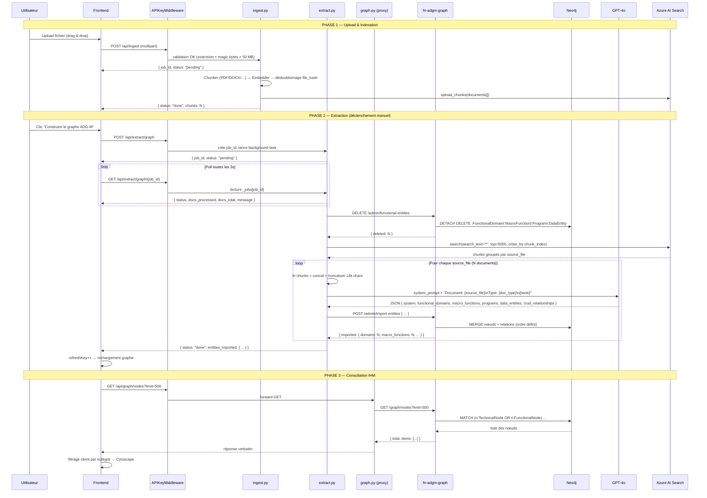

### 1.4 Gestion des erreurs et reprise

| Situation | Comportement |
|---|---|
| **Cold start Azure Function** | Retry automatique : 4 tentatives, backoff exponentiel (3s × 1.5), déclenché sur HTTP 500 uniquement |
| **Erreur GPT-4o sur un document** | `import_errors++`, le job continue sur les documents suivants — non bloquant |
| **Erreur POST /admin/import-entities** | `import_errors++`, le job continue — comptabilisé dans le résultat final |
| **Erreur DELETE /admin/functional-entities** | Warning loggé, le job continue quand même — cohérence éventuelle |
| **Document déjà indexé** (même `file_hash`) | Skip silencieux dans `ingest.py` : `status: "done", chunks: 0` |
| **Proxy 502** | `httpx.RequestError` → `HTTPException(502)` → message d'erreur dans l'IHM |

---

## 2. Phases détaillées

### 2.1 Phase 1 — Upload & Indexation

#### Validation à l'entrée

Trois niveaux de contrôle avant tout traitement :

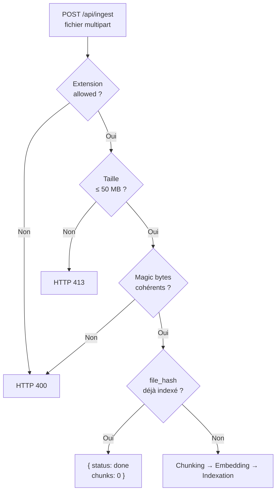

**Extensions acceptées :**

| Catégorie | Extensions |
|---|---|
| Documents | `.pdf`, `.docx`, `.pptx`, `.xlsx`, `.md` |
| Code & texte | `.txt`, `.py`, `.js`, `.ts`, `.jsx`, `.tsx`, `.java`, `.cpp`, `.c`, `.h`, `.cs`, `.go`, `.rs`, `.rb`, `.php`, `.sh`, `.bash`, `.yaml`, `.yml`, `.json`, `.xml`, `.html`, `.css`, `.sql`, `.r`, `.scala`, `.kt`, `.swift` |

**Vérification magic bytes :**

| Format | Signature attendue |
|---|---|
| `.pdf` | `%PDF` (4 octets, `b"%PDF"`) |
| `.docx`, `.pptx`, `.xlsx` | `PK` (ZIP) (`b"PK\x03\x04"`) |
| Texte / code | Décodable en UTF-8 (test sur les 512 premiers octets) |

#### Stratégies de découpage par format

| Format | Chunker | Stratégie |
|---|---|---|
| `.pdf` | `PDFChunker` | Azure Document Intelligence OCR — découpe par page avec layout recognition |
| `.docx` | `DOCXChunker` | python-docx — extraction paragraphe par paragraphe |
| `.pptx` | `PPTXChunker` | python-pptx — **1 slide = 1 chunk** |
| `.xlsx` | `XLSXChunker` | openpyxl — lignes groupées par feuille (sheet) |
| `.md` | `MDChunker` | Sections délimitées par les titres Markdown (`#`, `##`, `###`) |
| Texte / code | `TextChunker` | Sliding window avec chevauchement, `doc_type` = extension sans point |

#### Structure d'un chunk dans Azure AI Search

Chaque chunk est un document indexé avec les champs suivants :

| Champ | Type | Description |
|---|---|---|
| `id` | String | `{file_hash}_{chunk_index}` — clé unique dans l'index |
| `content` | String | Texte extrait du chunk |
| `content_vector` | Float[1536] | Embedding text-embedding-3-large |
| `source_file` | String | Nom du fichier d'origine — clé de groupement pour l'extraction |
| `page_number` | Integer\|null | Numéro de page (PDF uniquement) |
| `chunk_index` | Integer | Position ordonnée dans le document source (0-based) |
| `doc_type` | String | Type dérivé du format (`pdf`, `docx`, `pptx`, extension code…) |
| `section` | String\|null | Titre de section (MDChunker) ou titre de slide (PPTXChunker) |
| `title` | String\|null | Titre du document ou de la section |
| `file_hash` | String | Hash SHA du fichier — clé de dédoublonnage |
| `created_at` | ISO 8601 | Date d'indexation |

> **Dédoublonnage :** avant d'indexer, `ingest.py` récupère tous les `file_hash` déjà présents dans l'index (`get_indexed_hashes()`). Si le `file_hash` du fichier en cours figure dans cette liste, l'ingestion est annulée silencieusement. Cela évite de doubler les chunks si l'utilisateur re-uploade le même fichier.

---

### 2.2 Phase 2 — Extraction Chat→Graph

#### Nettoyage préalable de la couche fonctionnelle

Avant toute extraction, le pipeline supprime les nœuds fonctionnels existants :

```
DELETE /admin/functional-entities
→ MATCH (n) WHERE n:FunctionalDomain OR n:MacroFunction OR n:Program OR n:DataEntity
  DETACH DELETE n
```

**Ce qui est préservé :** les `:TechnicalNode` et leurs annotations `candidate7R`. L'objectif est de reconstruire la couche fonctionnelle depuis zéro (cohérence du corpus complet) sans perdre les qualifications 7R saisies manuellement.

#### Lecture du corpus depuis Azure AI Search

```python
search_client.search(
    search_text="*",              # Aucun filtre sémantique — tout le corpus
    select=["source_file", "chunk_index", "content"],
    order_by=["chunk_index asc"], # Ordre stable pour la reconstitution
    top=5000,                     # Plafond de résultats
)
```

Les résultats sont groupés par `source_file` en mémoire. Chaque groupe est trié par `chunk_index` puis concaténé avec `"\n\n"`. Si le texte dépasse **14 000 caractères**, il est tronqué avec le suffixe `\n[document tronqué]`.

#### Classification par nom de fichier

```mermaid
flowchart LR
    FN[Nom du fichier\nen minuscules]
    FN -->|contient "crud"| T1["crud_matrix\nPrioritaire : relations CRUD"]
    FN -->|contient "cartographie"\nou "functional_overview"| T2["cartographie\nPrioritaire : domaines / MF"]
    FN -->|contient "c4 level 3"| T3["program_detail\nPrioritaire : programmes"]
    FN -->|contient "c4 level 2"| T4["architecture\nPrioritaire : systèmes"]
    FN -->|contient "consolidation"| T5["consolidation"]
    FN -->|contient "mcd "| T6["data_model\nPrioritaire : DataEntity"]
    FN -->|contient "macro-mainframe"\nou "transverse it"| T7["macro_overview"]
    FN -->|aucun match| T8["generic"]
```

Le `doc_type` est transmis dans le prompt utilisateur : `"Type: {doc_type}"`. Il permet à GPT-4o d'orienter son attention — un fichier `crud_matrix` sera analysé en priorité pour les relations CRUD, un `program_detail` pour les noms exacts de programmes.

#### Appel GPT-4o

**Prompt système** (fixe, envoyé à chaque requête) :

```
You are a software architecture knowledge extractor.
Given a technical/functional document, extract entities and relationships.
Output JSON with EXACT structure:
{
  "system":             {"id": "<kebab-slug>", "name": "<full name>"},
  "functional_domains": [{"id","code","name","description"}],
  "macro_functions":    [{"id","code","name","mode","domain_id","description"}],
  "programs":           [{"name","technology","mode","macro_function_ids","description"}],
  "data_entities":      [{"name","type","description"}],
  "crud_relationships": [{"program_name","entity_name","operations":["C","R","U","D"]}]
}
Rules:
- Use explicit codes (DF-01, MF-07) as IDs if present; else kebab-slug
- Include ONLY entities explicitly mentioned, NEVER invent
- Preserve exact program/file names (e.g. COSGN00C, ACTRANET)
- CRUD only if explicitly stated (matrix or explicit access description)
- Use empty arrays for entity types not present in the document
```

**Prompt utilisateur** (variable, par document) :

```
Document: {source_file}
Type: {doc_type}

{texte_reconstitué}
```

**Paramètres d'appel GPT-4o :**

| Paramètre | Valeur | Raison |
|---|---|---|
| `temperature` | `0.1` | Reproduction fidèle des entités mentionnées, pas d'inférences |
| `response_format` | `{"type": "json_object"}` | Garantit un JSON parsable, pas de texte libre |
| `max_tokens` | `4000` | Suffisant pour un graphe de taille raisonnable par document |
| `api_version` | `2024-10-21` | Version Azure OpenAI supportant `json_object` |

**Règles d'identification des entités :**

| Entité | Règle d'ID | Exemple |
|---|---|---|
| `functional_domains` | Code documentaire (`DF-01`) si présent, sinon slug kebab | `"Gestion des comptes"` → `"gestion-des-comptes"` |
| `macro_functions` | Code documentaire (`MF-07`) si présent, sinon slug | `"Calcul des intérêts"` → `"calcul-des-interets"` |
| `programs` | **Nom exact** préservé tel quel | `"COSGN00C"`, `"ACTRANET"` — jamais slugifié |
| `data_entities` | **Nom exact** préservé tel quel | `"USRSEC"`, `"ACCTDAT"` — jamais slugifié |

---

### 2.3 Phase 3 — Import Neo4j

#### Ordre de création des entités

L'import suit un ordre strict pour que les relations de parenté puissent être créées immédiatement après chaque entité :

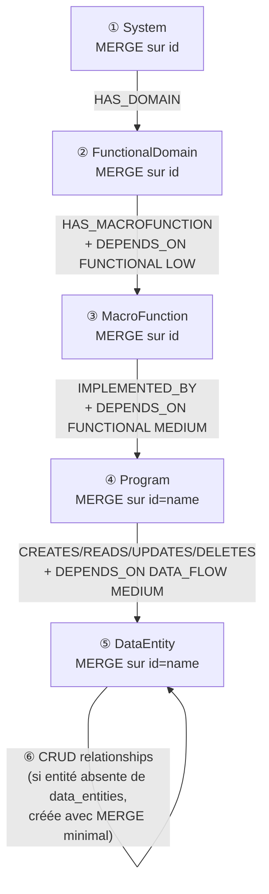

#### Comportement MERGE : ON CREATE vs ON MATCH

Pour chaque type de nœud, les propriétés sont divisées en deux groupes :

| Groupe | Clause | Propriétés typiques |
|---|---|---|
| **Initialisation** | `ON CREATE SET` | Toutes les propriétés + valeurs par défaut (ex. `candidate7R = 'UNQUALIFIED'`, `isSPOF = false`) |
| **Mise à jour safe** | `ON MATCH SET` | Propriétés descriptives seulement (name, description, technology, mode…) |
| **Jamais écrasées** | *(absentes de ON MATCH SET)* | `candidate7R`, `isSPOF`, `betweenness`, `criticalityScore`, `communityId` |

> **Protection des annotations 7R :** `candidate7R` est initialisé à `UNQUALIFIED` à la création mais **jamais touché lors d'un re-import**. Les qualifications saisies manuellement par les architectes survivent à tous les re-lancements de l'extraction.

#### Garanties d'idempotence

- Toutes les opérations utilisent `MERGE` — aucun doublon possible.
- Les arcs `DEPENDS_ON` ont un `id` calculé de façon déterministe (`fn-{source}-{target}`, `data-{prog}-{entity}`) — pas de doublon même sur plusieurs imports du même document.
- Un arc CRUD (ex. `CREATES`) utilise aussi `MERGE` — idempotent.

---

### 2.4 Phase 4 — Analyse post-ingestion

L'analyse est **déclenchée manuellement** via `POST /admin/analyze`. Elle n'est **pas** chaînée sur l'import pour deux raisons : (1) garder l'import rapide, (2) les algorithmes GDS sont coûteux en mémoire et ne doivent pas s'exécuter à chaque document.

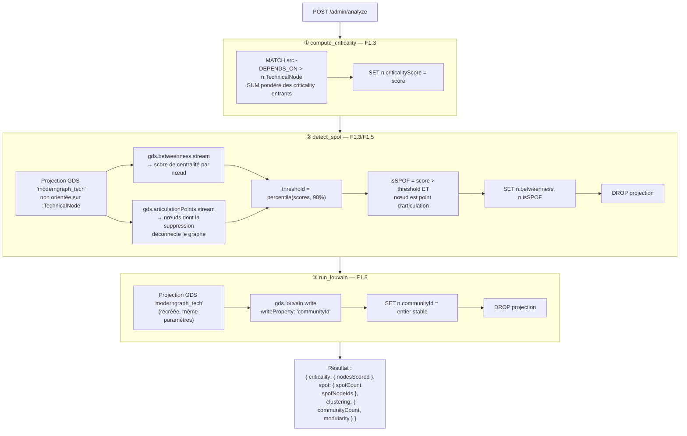

> **Cycle de vie de la projection GDS :** la projection `moderngraph_tech` est créée, utilisée pour les calculs, puis **supprimée** dans un bloc `finally` à la fin de chaque algorithme. Elle ne persiste jamais entre deux exécutions — cela évite les conflits si le job est relancé.

---

### 2.5 Phase 5 — Consultation IHM

#### Chargement initial du graphe

Au montage du composant `GraphPage`, deux requêtes parallèles sont émises :

```
GET /api/graph/nodes?limit=500   → tous les nœuds (FunctionalNode + TechnicalNode)
GET /api/graph/arcs?limit=1000   → tous les arcs DEPENDS_ON
```

Le proxy `graph.py` relaie ces requêtes vers `fn-adgm-graph` en conservant les query params. En cas de réponse HTTP 500 (cold start Azure Function), le frontend réessaie automatiquement jusqu'à **4 tentatives** avec un délai exponentiel (3s, 4.5s, 6.75s).

#### Filtrage côté client

Le filtrage par vue (Fonctionnel / Technique / Données / Global) se fait **entièrement côté client** en JS, sur les données déjà chargées. Aucune nouvelle requête n'est émise lors d'un changement de vue. Le filtre est appliqué sur le champ `subtype` de chaque nœud.

```
Vue Fonctionnel → subtype ∈ { 'domain', 'macrofunction' }
Vue Technique   → subtype ∈ { 'program', 'component', 'system' }
Vue Données     → subtype ∈ { 'dataentity' }
Vue Global      → tous les subtypes (aucun filtre)
```

#### Mode exploration (double-clic)

```
GET /api/graph/nodes/{id}/neighbors
→ traverse TOUTES les relations Neo4j adjacentes (pas seulement DEPENDS_ON)
→ retourne { center, neighbors[], edges[] }
```

L'expansion est progressive : chaque double-clic **merge** les nouveaux nœuds et arcs dans le bundle existant sans réinitialiser la vue. Les nœuds hors-plan sont affichés en pointillés (`isOutOfPlan`).

---

## 3. Schéma du graphe Neo4j

### 3.1 Modèle de données complet

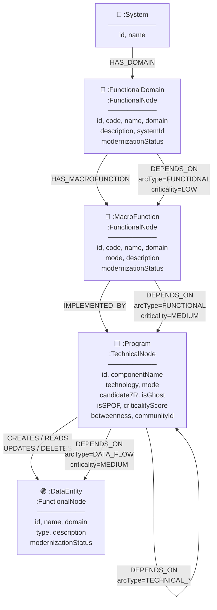

### 3.2 Principe du multi-label

Neo4j permet à un même nœud de porter plusieurs labels simultanément. Le graphe ADG-M utilise un **label de catégorie** et un **label de sous-type** :

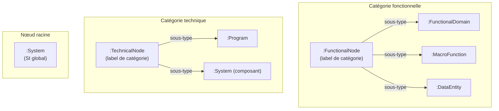

**Exemple concret :**

```cypher
// Un programme COBOL est à la fois :Program ET :TechnicalNode
MATCH (n:Program) RETURN labels(n)
// → ["Program", "TechnicalNode"]

// get_nodes() interroge sur le label de catégorie
MATCH (n:TechnicalNode) RETURN n  // retourne Program + System (technique)
MATCH (n:FunctionalNode) RETURN n // retourne FunctionalDomain + MacroFunction + DataEntity
```

---

## 4. Typage des nœuds — labels et propriétés

### 4.1 `:System` — Nœud racine SI

Représente le système d'information global extrait d'un document. Un seul par import (MERGE sur `id`).

| Propriété | Type | Valeur par défaut | Source | Description |
|---|---|---|---|---|
| `id` | String | — | GPT-4o (slug) | Identifiant unique, ex. `"applicatif-bancaire"` |
| `name` | String | = `id` | GPT-4o | Nom lisible du SI |
| `createdAt` | DateTime | `datetime()` | Système | Date de première création |
| `updatedAt` | DateTime | — | Système | Date de dernière mise à jour |

**Subtype IHM :** non affiché dans les vues filtrées (pas de subtype assigné dans `node_to_dto`).

---

### 4.2 `:FunctionalDomain:FunctionalNode` — Domaine fonctionnel

Regroupe un ensemble cohérent de macro-fonctions métier. Correspond typiquement à une "ligne métier" ou un "domaine applicatif" dans les documents d'architecture.

| Propriété | Type | Valeur par défaut | Source | Description |
|---|---|---|---|---|
| `id` | String | — | GPT-4o | Code doc (`DF-01`) ou slug (`"gestion-de-compte"`) |
| `code` | String\|null | null | GPT-4o | Code documentaire explicite, ex. `"DF-01"` |
| `name` | String | = `id` | GPT-4o | Nom complet du domaine |
| `domain` | String | = `name` | Système | Alias de `name` — utilisé par `_functional_node_dto` |
| `description` | String\|null | null | GPT-4o | Description en 1 phrase |
| `systemId` | String\|null | null | Import | ID du `:System` parent |
| `modernizationStatus` | Enum | `"EXISTING"` | Système | Statut de modernisation |
| `docCoveragePercent` | Float\|null | null | Futur | Couverture documentaire |
| `sourceDocIds` | List[String] | `[]` | Futur | Documents sources |
| `createdAt` | DateTime | `datetime()` | Système | — |
| `updatedAt` | DateTime | — | Système | — |

**Subtype IHM :** `domain` → ellipse bleue foncée (`#1565c0`).

**`modernizationStatus` :** voir [Glossaire §8.4](#84-valeurs-énumérées).

---

### 4.3 `:MacroFunction:FunctionalNode` — Macro-fonction

Fonction métier portée par un domaine. Correspond à un processus ou service fonctionnel identifié dans les matrices fonctionnelles ou les documents C4 Level 2.

| Propriété | Type | Valeur par défaut | Source | Description |
|---|---|---|---|---|
| `id` | String | — | GPT-4o | Code doc (`MF-07`) ou slug |
| `code` | String\|null | null | GPT-4o | Code documentaire, ex. `"MF-07"` |
| `name` | String | = `id` | GPT-4o | Nom de la macro-fonction |
| `domain` | String | = `name` | Système | Alias de `name` pour `_functional_node_dto` |
| `mode` | Enum\|null | null | GPT-4o | Mode d'exécution : `Online`, `Batch`, `MQ`, `Hybrid` |
| `description` | String\|null | null | GPT-4o | Description en 1 phrase |
| `modernizationStatus` | Enum | `"EXISTING"` | Système | Statut de modernisation |
| `docCoveragePercent` | Float\|null | null | Futur | — |
| `sourceDocIds` | List[String] | `[]` | Futur | — |
| `createdAt` | DateTime | `datetime()` | Système | — |
| `updatedAt` | DateTime | — | Système | — |

**Subtype IHM :** `macrofunction` → rectangle arrondi bleu clair (`#64b5f6`).

---

### 4.4 `:DataEntity:FunctionalNode` — Entité de données

Entité de données persistante manipulée par les programmes. Correspond aux fichiers VSAM, tables Db2, GDG, segments IMS mentionnés dans les matrices CRUD ou les documents de modèle de données.

| Propriété | Type | Valeur par défaut | Source | Description |
|---|---|---|---|---|
| `id` | String | = `name` | GPT-4o | Nom exact de l'entité (`"USRSEC"`, `"ACCTDAT"`) |
| `name` | String | — | GPT-4o | Nom exact (préservé tel quel) |
| `domain` | String | = `name` | Système | Alias de `name` pour `_functional_node_dto` |
| `type` | Enum\|null | null | GPT-4o | Technologie de stockage |
| `description` | String\|null | null | GPT-4o | Description en 1 phrase |
| `modernizationStatus` | Enum | `"EXISTING"` | Système | — |
| `createdAt` | DateTime | `datetime()` | Système | — |
| `updatedAt` | DateTime | — | Système | — |

**Valeurs de `type` :** `VSAM`, `Db2`, `IMS`, `PS` (Physical Sequential), `GDG` (Generation Data Group), `Other`.

**Subtype IHM :** `dataentity` → hexagone violet (`#7b1fa2`).

---

### 4.5 `:Program:TechnicalNode` — Programme applicatif

Composant technique directement identifié dans les documents : programme COBOL, JCL, transaction CICS, etc. C'est le nœud central de la qualification 7R.

| Propriété | Type | Valeur par défaut | Protégé au re-import | Description |
|---|---|---|---|---|
| `id` | String | = `name` | — | Nom exact du programme (`"COSGN00C"`) |
| `componentName` | String | = `name` | Non | Nom affiché dans l'IHM |
| `technology` | String\|null | null | Non | Technologie : `COBOL/CICS`, `JCL`, `COBOL`, `PL/I`… |
| `mode` | Enum\|null | null | Non | `Online`, `Batch` |
| `description` | String\|null | null | Non | Description en 1 phrase |
| `candidate7R` | Enum | `"UNQUALIFIED"` | **Oui** | Trajectoire de modernisation |
| `isGhost` | Boolean | `false` | Non | Composant référencé mais non documenté |
| `isSPOF` | Boolean | `false` | Non | Calculé par F1.3/F1.5 (admin/analyze) |
| `criticalityScore` | Integer | `0` | Non | Calculé par F1.3 |
| `betweenness` | Float | `0.0` | Non | Centralité GDS (F1.5) |
| `communityId` | Integer\|null | null | Non | Partition Louvain (F1.5) |
| `linesOfCode` | Integer\|null | null | Non | Non extrait automatiquement |
| `callFrequency` | String\|null | null | Non | Non extrait automatiquement |
| `knowledgeOwner` | String\|null | null | Non | Non extrait automatiquement |
| `regulatoryTags` | List[String] | `[]` | Non | Non extrait automatiquement |
| `docCoveragePercent` | Float\|null | null | Non | — |
| `clusterId` | String\|null | null | Non | Généré par get_clusters (`cl-{communityId}`) |
| `sourceDocIds` | List[String] | `[]` | Non | — |
| `createdAt` | DateTime | `datetime()` | — | — |
| `updatedAt` | DateTime | — | — | — |

> **Protection du `candidate7R` :** la clause `ON MATCH SET` de l'import ne touche **jamais** `candidate7R`. Les annotations 7R saisies manuellement par les architectes survivent à tous les re-imports.

**Subtype IHM :** `program` → diamant, couleur selon `candidate7R` (palette 7R).

---

### 4.6 Résolution du subtype dans `node_to_dto()`

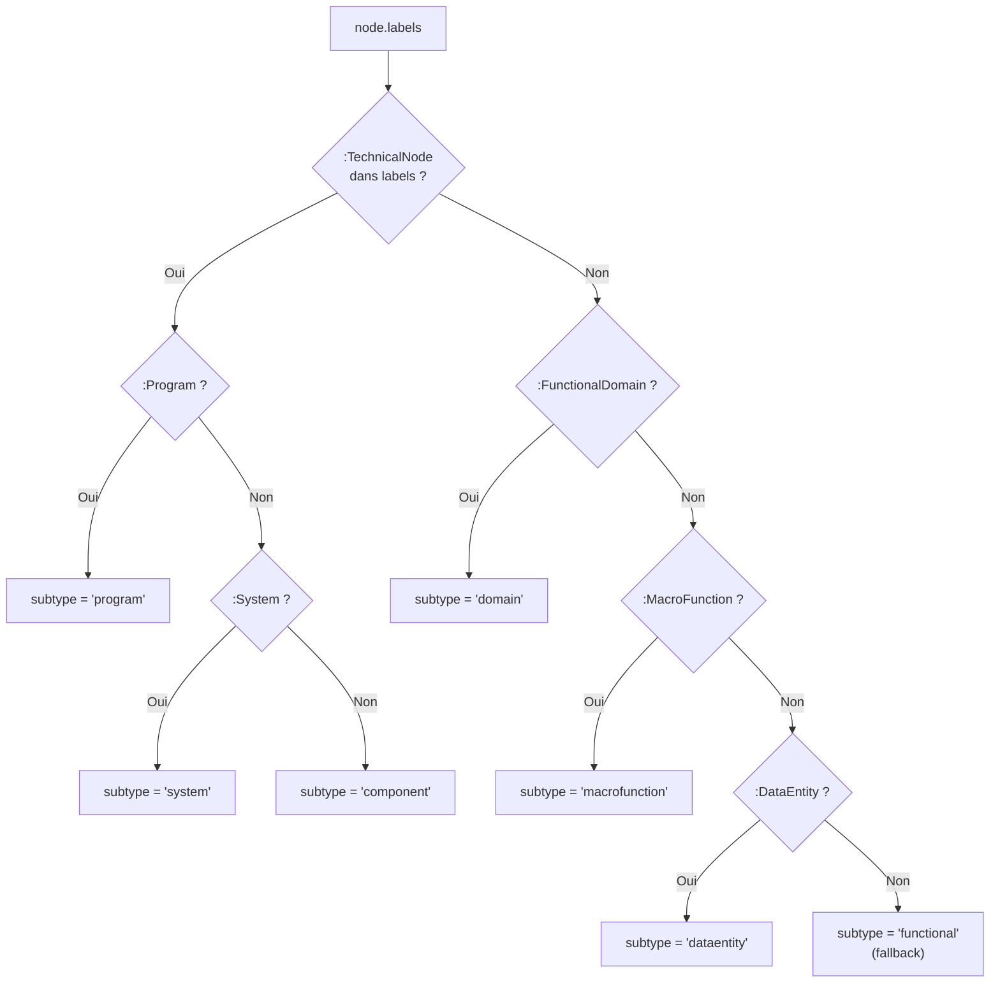

---

## 5. Relations — types et sémantique

### 5.1 Relations sémantiques (structurelles)

Ces relations encodent la **hiérarchie métier** du graphe.

| Relation | Source → Cible | Créée quand | Sémantique |
|---|---|---|---|
| `HAS_DOMAIN` | `:System` → `:FunctionalDomain` | Si `system.id` présent dans le payload | Le SI contient ce domaine |
| `HAS_MACROFUNCTION` | `:FunctionalDomain` → `:MacroFunction` | Si `macro_function.domain_id` renseigné | Le domaine porte cette macro-fonction |
| `IMPLEMENTED_BY` | `:MacroFunction` → `:Program` | Pour chaque `macro_function_ids` d'un programme | La MF est réalisée par ce programme |
| `CREATES` | `:Program` → `:DataEntity` | CRUD operation `"C"` | Le programme crée l'entité |
| `READS` | `:Program` → `:DataEntity` | CRUD operation `"R"` | Le programme lit l'entité |
| `UPDATES` | `:Program` → `:DataEntity` | CRUD operation `"U"` | Le programme met à jour l'entité |
| `DELETES` | `:Program` → `:DataEntity` | CRUD operation `"D"` | Le programme supprime l'entité |

### 5.2 Relation universelle `DEPENDS_ON`

`DEPENDS_ON` est créée **en parallèle** de chaque relation sémantique. Elle permet aux algorithmes d'analyse (criticité, SPOF, Louvain) et aux requêtes de graphe génériques de traverser l'ensemble du graphe avec un seul type de relation.

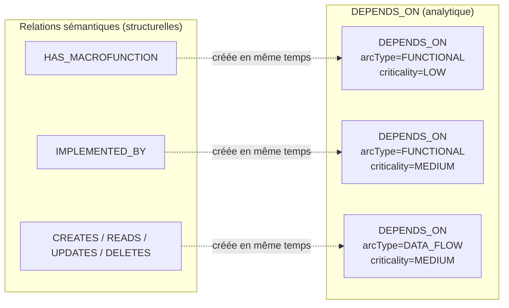

**Propriétés d'un arc `DEPENDS_ON` :**

| Propriété | Type | Valeurs possibles | Description |
|---|---|---|---|
| `id` | String | `fn-{source}-{target}`, `data-{prog}-{entity}` | Identifiant unique de l'arc |
| `arcType` | Enum | `FUNCTIONAL`, `TECHNICAL_CALL_SYNC`, `TECHNICAL_CALL_ASYNC`, `TECHNICAL_BATCH`, `DATA_FLOW`, `TRANSITIONAL_COHABITATION` | Nature de la dépendance |
| `direction` | Enum | `UNIDIRECTIONAL`, `BIDIRECTIONAL` | Sens du flux |
| `criticality` | Enum | `CRITICAL`, `HIGH`, `MEDIUM`, `LOW` | Niveau de risque |
| `dataFormat` | String\|null | Libre | Format des données échangées |

**Valeurs par défaut selon le contexte de création :**

| Contexte | `arcType` | `criticality` |
|---|---|---|
| Domaine → MacroFunction | `FUNCTIONAL` | `LOW` |
| MacroFunction → Programme | `FUNCTIONAL` | `MEDIUM` |
| Programme → DataEntity (CRUD) | `DATA_FLOW` | `MEDIUM` |

### 5.3 Vue exploration — toutes les relations

En mode exploration (double-clic), le endpoint `/neighbors` traverse **toutes** les relations Neo4j adjacentes au nœud, pas seulement `DEPENDS_ON` :

```cypher
MATCH (center {id: $id})-[r]-(neighbor)
WHERE (center:TechnicalNode OR center:FunctionalNode)
  AND (neighbor:TechnicalNode OR neighbor:FunctionalNode)
RETURN DISTINCT neighbor, type(r) AS relType,
       startNode(r).id AS sourceId, endNode(r).id AS targetId, ...
```

Les types de relation affichés peuvent être : `DEPENDS_ON`, `HAS_MACROFUNCTION`, `IMPLEMENTED_BY`, `CREATES`, `READS`, `UPDATES`, `DELETES`.

---

## 6. Couche d'analyse post-ingestion

L'analyse est **découplée de l'ingestion** et doit être lancée manuellement via `POST /graph/admin/analyze`. Elle calcule trois métriques successivement.

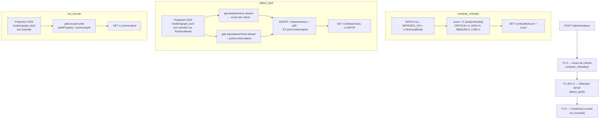

### 6.1 Score de criticité (F1.3)

```
criticalityScore = Σ { CRITICAL→4, HIGH→3, MEDIUM→2, LOW→1 }
                   pour chaque arc DEPENDS_ON entrant
```

Un nœud sans arc entrant garde `criticalityScore = 0`.

### 6.2 Détection SPOF (F1.3 / F1.5)

Un nœud est `isSPOF = true` si **les deux conditions** sont remplies :

1. **Betweenness > p90** : sa centralité de chemin dépasse le 90e percentile des TechnicalNode.
2. **Point d'articulation** : sa suppression déconnecterait au moins deux sous-graphes (aucun chemin alternatif).

> Avoir une betweenness élevée sans être un point d'articulation signifie qu'il existe des chemins de secours — ce nœud n'est pas un vrai SPOF.

### 6.3 Clustering Louvain (F1.5)

L'algorithme maximise la modularité du graphe pour partitionner les TechnicalNode en communautés. Seul `communityId` (entier) est persisté sur chaque nœud.

Les métriques de cluster sont calculées **à la lecture** par `GET /graph/clusters` :

```
cohésion         = arcs internes / (n × (n-1) / 2)   [densité du sous-graphe]
couplage externe = arcs sortants / (arcs internes + arcs sortants)
candidat         = cohésion > 0.70 ET couplage externe < 0.30
```

---

## 7. Filtrage IHM — les 4 vues

### 7.1 Mapping subtype → vue

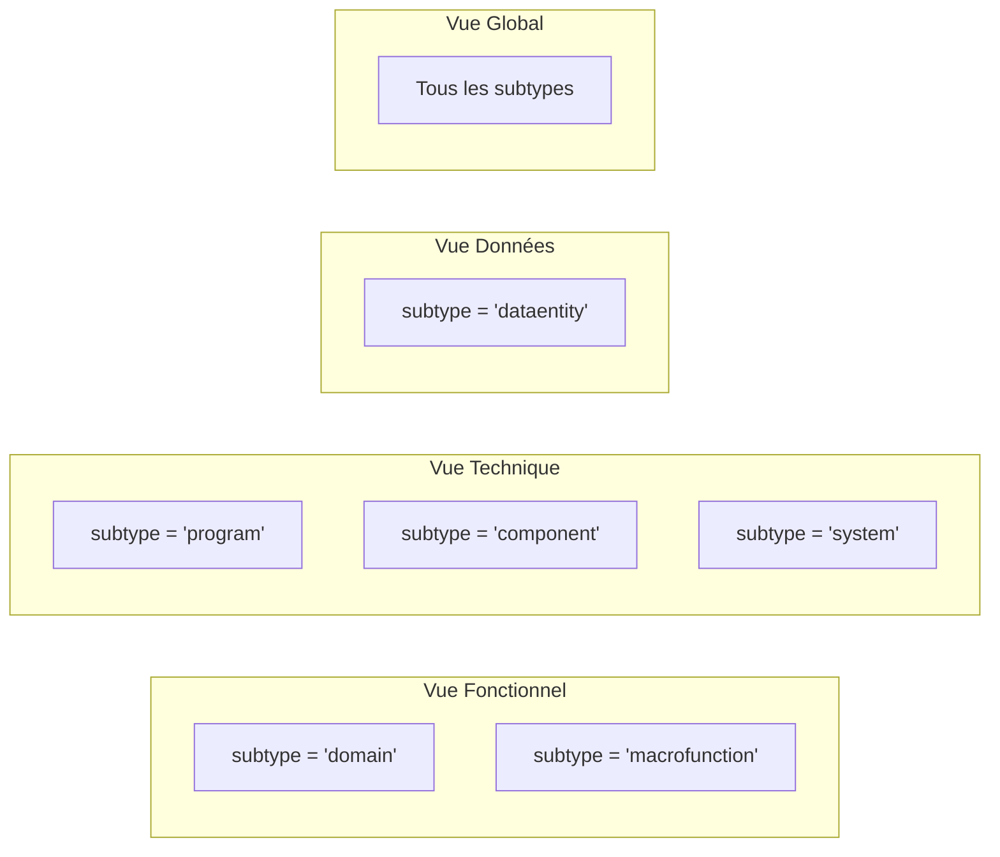

### 7.2 Encodage visuel par subtype

| Subtype | Vue(s) | Forme | Couleur | Couleur secondaire (7R) |
|---|---|---|---|---|
| `domain` | Fonctionnel, Global | Ellipse | `#1565c0` (bleu foncé) | — |
| `macrofunction` | Fonctionnel, Global | Rectangle arrondi | `#64b5f6` (bleu clair) | — |
| `dataentity` | Données, Global | Hexagone | `#7b1fa2` (violet) | — |
| `program` | Technique, Global | Diamant | `#ffffff` (blanc) | Palette 7R |
| `component` | Technique, Global | Ellipse | `#ffffff` (blanc) | Palette 7R |
| `system` | Technique, Global | Triangle | `#2e7d32` (vert) | — |

### 7.3 Paramètres de layout Cytoscape

| Vue | Algorithme | Paramètres clés |
|---|---|---|
| Fonctionnel | cose | `idealEdgeLength: 220`, `nodeRepulsion: 80000`, `gravity: 0.2` |
| Technique | breadthfirst | `directed: true`, `spacingFactor: 2.8` |
| Données | cose | `idealEdgeLength: 180`, `nodeRepulsion: 60000`, `gravity: 0.2` |
| Global | cose | `idealEdgeLength: 250`, `nodeRepulsion: 90000`, `gravity: 0.15` |
| Exploration | cose | `idealEdgeLength: 200`, `nodeRepulsion: 70000`, `gravity: 0.2` |

---

## 8. Glossaire et taxonomie

### 8.1 Entités du graphe

| Terme | Label(s) Neo4j | Subtype IHM | Définition |
|---|---|---|---|
| **Système** | `:System` | — | Nœud racine représentant le SI global extrait d'un document. Un seul par import. |
| **Domaine fonctionnel** | `:FunctionalDomain:FunctionalNode` | `domain` | Regroupement de haut niveau de macro-fonctions métier. Correspond aux grands périmètres fonctionnels (ex. "Authentification", "Paiements"). |
| **Macro-fonction** | `:MacroFunction:FunctionalNode` | `macrofunction` | Service ou processus fonctionnel porté par un domaine. Granularité intermédiaire entre le domaine et le programme. |
| **Entité de données** | `:DataEntity:FunctionalNode` | `dataentity` | Entité de données persistante (fichier, table, segment). Nœud cible des relations CRUD. |
| **Programme** | `:Program:TechnicalNode` | `program` | Composant logiciel identifié dans les documents (COBOL, CICS, JCL). Unité de qualification 7R. |
| **Composant** | `:TechnicalNode` (sans sous-type) | `component` | TechnicalNode sans label de sous-type spécifique. Cas de fallback. |
| **Nœud fantôme** | `:TechnicalNode` avec `isGhost=true` | — | Composant référencé dans les relations mais absent des documents sources. |
| **SPOF** | Tout nœud avec `isSPOF=true` | — | Single Point of Failure : betweenness > p90 ET point d'articulation du graphe. |
| **Appartement candidat** | Cluster avec `isCandidateApartment=true` | — | Groupe de TechnicalNode à haute cohésion (>0.7) et faible couplage externe (<0.3). |

### 8.2 Relations

| Terme | Type Neo4j | Sens | Sémantique |
|---|---|---|---|
| **Arc de dépendance** | `DEPENDS_ON` | → | Relation universelle de dépendance. Présente sur toutes les paires liées. Supporte les analyses de graphe. |
| **Arc fonctionnel** | `HAS_DOMAIN`, `HAS_MACROFUNCTION` | → | Hiérarchie structurelle : SI → Domaine → MacroFunction. |
| **Arc d'implémentation** | `IMPLEMENTED_BY` | → | MacroFunction → Programme qui la réalise. |
| **Arc CRUD** | `CREATES`, `READS`, `UPDATES`, `DELETES` | → | Accès d'un programme à une entité de données. Extrait uniquement si explicitement documenté. |

### 8.3 Concepts d'analyse

| Terme | Définition | Propriété Neo4j |
|---|---|---|
| **Betweenness centrality** | Nombre de plus courts chemins passant par un nœud, normalisé. Mesure le rôle de "pont" du nœud dans le graphe. | `betweenness` |
| **Point d'articulation** | Nœud dont la suppression déconnecte le graphe. Calculé par `gds.articulationPoints`. | — (calculé à la volée) |
| **Score de criticité** | Somme pondérée des arcs entrants (CRITICAL=4, HIGH=3, MEDIUM=2, LOW=1). | `criticalityScore` |
| **Communauté Louvain** | Partition du graphe maximisant la modularité (densité interne vs. externe). | `communityId` (entier) |
| **Cohésion de cluster** | Densité du sous-graphe induit par la communauté : arcs internes / paires possibles. | Calculé dans `get_clusters()` |
| **Couplage externe** | Part des arcs sortants : arcs sortants / (arcs internes + arcs sortants). | Calculé dans `get_clusters()` |

### 8.4 Valeurs énumérées

**`candidate7R` — Trajectoire de modernisation (TechnicalNode uniquement)**

| Valeur | Signification |
|---|---|
| `UNQUALIFIED` | Non qualifié (valeur initiale — ne peut pas être re-soumise comme cible) |
| `RETIRE` | Décommissionner |
| `RETAIN` | Conserver en l'état |
| `REHOST` | Migrer sans modification (lift & shift) |
| `REPLATFORM` | Migrer avec optimisations légères |
| `REPURCHASE` | Remplacer par un produit du marché (SaaS) |
| `REFACTOR` | Refactoriser / re-architecturer |
| `REBUILD` | Reconstruire de zéro |

**`modernizationStatus` — Statut de modernisation (FunctionalNode uniquement)**

| Valeur | Signification |
|---|---|
| `EXISTING` | Existant (valeur initiale) |
| `IN_TRANSITION` | En cours de modernisation |
| `TARGET` | Cible de l'architecture |

**`arcType` — Nature d'un arc `DEPENDS_ON`**

| Valeur | Signification |
|---|---|
| `FUNCTIONAL` | Dépendance fonctionnelle (hiérarchie domaine/MF/programme) |
| `TECHNICAL_CALL_SYNC` | Appel technique synchrone |
| `TECHNICAL_CALL_ASYNC` | Appel technique asynchrone (MQ, event) |
| `TECHNICAL_BATCH` | Traitement batch (JCL, scheduler) |
| `DATA_FLOW` | Flux de données (CRUD sur une entité) |
| `TRANSITIONAL_COHABITATION` | Cohabitation temporaire en période de transition |

**`criticality` — Niveau de risque d'un arc**

| Valeur | Poids (F1.3) | Signification |
|---|---|---|
| `CRITICAL` | 4 | Impact majeur en cas de défaillance |
| `HIGH` | 3 | Impact significatif |
| `MEDIUM` | 2 | Impact modéré (valeur par défaut à l'import) |
| `LOW` | 1 | Impact limité |

**`mode` — Mode d'exécution (MacroFunction et Program)**

| Valeur | Signification |
|---|---|
| `Online` | Traitement transactionnel temps réel (CICS, API) |
| `Batch` | Traitement différé (JCL, scheduler nocturne) |
| `MQ` | Traitement piloté par message (MQ Series, event-driven) |
| `Hybrid` | Combinaison des modes |

**`type` — Technologie de stockage (DataEntity uniquement)**

| Valeur | Signification |
|---|---|
| `VSAM` | Virtual Storage Access Method (fichiers mainframe indexés) |
| `Db2` | Base de données relationnelle IBM Db2 |
| `IMS` | Information Management System (base hiérarchique IBM) |
| `PS` | Physical Sequential (fichier séquentiel plat) |
| `GDG` | Generation Data Group (versionnement de fichiers) |
| `Other` | Autre technologie de stockage |

### 8.5 Concepts d'ingestion

| Terme | Définition |
|---|---|
| **Chunk** | Fragment de document stocké dans Azure AI Search. Unité de base de l'index. |
| **source_file** | Nom du fichier source — clé de groupement des chunks pour reconstituer le document complet. |
| **chunk_index** | Position ordinale du chunk dans le document source. Utilisé pour la reconstitution ordonnée. |
| **MERGE** | Opération Neo4j qui crée le nœud/relation s'il n'existe pas, ou le met à jour s'il existe. Garantit l'idempotence. |
| **Import idempotent** | Propriété garantissant qu'un import successif ne crée pas de doublons et ne dégrade pas l'état existant. |
| **Couche fonctionnelle** | Ensemble des nœuds `:FunctionalDomain`, `:MacroFunction`, `:Program`, `:DataEntity` — supprimés avant chaque reconstruction. |
| **Couche technique** | Ensemble des `:TechnicalNode` et leurs annotations 7R — préservés lors de la reconstruction. |
| **re-import** | Exécution successive du pipeline d'extraction sur le même corpus. Les annotations 7R existantes sont préservées. |
