# Dossier d'Architecture — NotebookLM Azure

> **Projet** : Agent documentaire RAG sur Azure  
> **Auteur** : Vincent Gicquiau — Lead Solution Architect  
> **Date** : Juin 2026  
> **Version** : 1.0

---

## Table des matières

1. [Vue d'ensemble](#1-vue-densemble)
2. [Architecture fonctionnelle](#2-architecture-fonctionnelle)
3. [Architecture technique](#3-architecture-technique)
4. [Pipeline d'ingestion documentaire](#4-pipeline-dingestion-documentaire)
5. [Pipeline de requête (RAG)](#5-pipeline-de-requête-rag)
6. [Interface utilisateur](#6-interface-utilisateur)
7. [Sécurité et identité](#7-sécurité-et-identité)
8. [Infrastructure Azure](#8-infrastructure-azure)
9. [Choix techniques et justifications](#9-choix-techniques-et-justifications)
10. [Limites et axes d'amélioration](#10-limites-et-axes-damélioration)
11. [Spécifications des fonctionnalités](#11-spécifications-des-fonctionnalités)
    - [F1 — Chat RAG](#f1--chat-rag)
    - [F2 — Modes d'analyse](#f2--modes-danalyse)
    - [F3 — Rail de notes](#f3--rail-de-notes)
    - [F4 — Injection de notes dans le contexte](#f4--injection-de-notes-dans-le-contexte)
    - [F5 — Viewer de citation](#f5--viewer-de-citation)
    - [F6 — Upload de document](#f6--upload-de-document)
    - [F7 — Graphe ADG-M](#f7--graphe-adg-m)
    - [F8 — Module Exploration](#f8--module-exploration)

---

## 1. Vue d'ensemble

### Qu'est-ce que c'est ?

NotebookLM Azure est un **agent de question-réponse documentaire** inspiré de Google NotebookLM. Il permet d'interroger en langage naturel un corpus de documents techniques (cahiers des charges, spécifications, règles métier, annexes) et d'obtenir des réponses sourcées, structurées et corrélées entre plusieurs documents.

### Quel problème résout-il ?

Dans un programme de modernisation applicative, l'équipe accumule des dizaines de documents hétérogènes — spécifications fonctionnelles, documentation legacy, rapports d'audit, politiques de sécurité. Les retrouver, les croiser et en extraire des synthèses est une tâche longue et manuelle.

Cet agent permet de :
- Poser des questions en français sur l'ensemble du corpus
- Obtenir des réponses avec les références exactes (fichier + page + section)
- Générer des synthèses, inventaires, matrices et diagrammes à la demande
- Faire corréler automatiquement des informations disséminées dans plusieurs sources

### Positionnement par rapport à NotebookLM (Google)

| Critère | Google NotebookLM | NotebookLM Azure |
|---|---|---|
| Modèle | Gemini 1.5/2.0 Pro | GPT-4o (Azure OpenAI) |
| Contexte | ~1M tokens (corpus entier en mémoire) | RAG — 5 à 20 extraits par requête |
| Données | Cloud Google | Azure — données souveraines |
| Auth | Compte Google | Entra ID / Managed Identity |
| Personnalisation | Aucune | System prompt, modes, UI customisables |
| Coût | Abonnement Google One | Pay-as-you-go Azure |

---

## 2. Architecture fonctionnelle

### Blocs fonctionnels

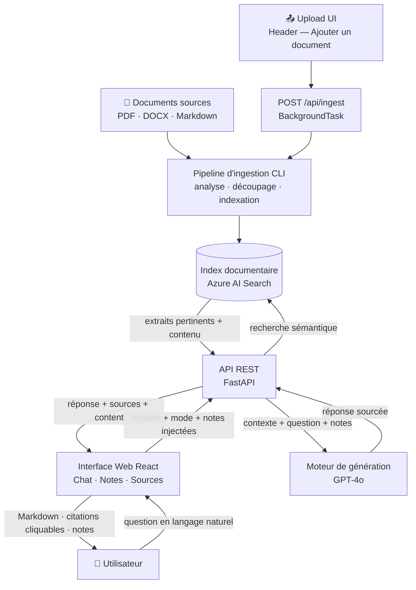

### Parcours utilisateur

**1. Ingestion — deux modes possibles**

*Mode CLI (lot de documents) :*
- L'administrateur dépose des documents dans le dossier `documents/`
- Lance le script `ingest.py`
- Les documents sont analysés, découpés, transformés en vecteurs et indexés
- Les documents déjà indexés sont automatiquement ignorés (déduplication par hash SHA-256)

*Mode UI (document à la volée) :*
- L'utilisateur clique sur **"Ajouter un document"** dans le bandeau supérieur
- Sélectionne un fichier PDF, DOCX ou Markdown (max 50 Mo)
- L'upload part immédiatement ; un toast de progression apparaît en bas à droite
- L'ingestion tourne en arrière-plan (`BackgroundTask`) : extraction → chunks → embeddings → indexation
- Toast final : nombre de chunks indexés, ou message d'erreur si échec

**2. Interrogation (usage quotidien)**
- L'utilisateur ouvre l'interface web
- Choisit un mode d'analyse : Rapide / Standard / Approfondi
- Pose sa question en langage naturel
- Reçoit une réponse structurée avec badges de citation `[N]` cliquables
- Peut cliquer sur un badge `[N]` ou une fiche source pour lire le passage exact extrait du document
- Peut **enregistrer une réponse** comme note dans le rail droit, ou **créer une note manuelle**
- Peut **épingler des notes** pour les injecter dans le contexte des prochaines questions
- Peut copier le Markdown brut pour Notion, Confluence ou tout éditeur

---

## 3. Architecture technique

### Vue d'ensemble des composants

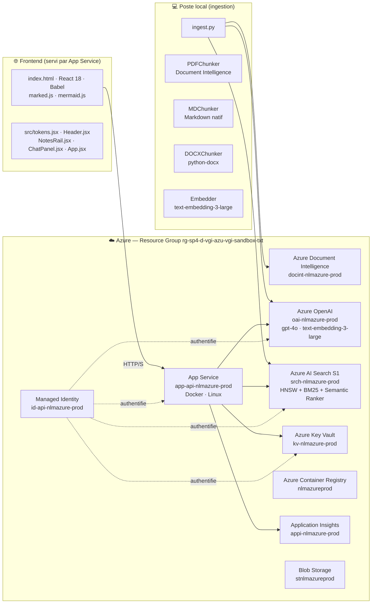

### Stack technologique

| Couche | Technologie | Version |
|---|---|---|
| **Framework UI** | React 18 (CDN, sans étape de build) | 18.x |
| **Transpilation JSX** | Babel Standalone (CDN) | — |
| **Rendu Markdown** | marked.js | 9.x |
| **Rendu diagrammes** | mermaid.js | 11.x |
| **Police + design tokens** | Hanken Grotesk + objet `T` centralisé | — |
| **Persistence client** | localStorage (notes + session_id) | — |
| **Upload fichier** | FormData + polling SSE simplifié | — |
| **API backend** | FastAPI | 0.11x |
| **Upload multipart** | python-multipart | — |
| **Serveur ASGI** | Uvicorn | — |
| **SDK Azure** | azure-sdk-for-python | dernière stable |
| **Authentification** | azure-identity (DefaultAzureCredential) | — |
| **Embeddings** | Azure OpenAI text-embedding-3-large | dim. 3072 |
| **LLM** | Azure OpenAI GPT-4o | 2024-11-20 |
| **Recherche** | Azure AI Search (SDK Python) | — |
| **Extraction PDF** | Azure Document Intelligence prebuilt-layout | — |
| **Tokenisation** | tiktoken cl100k_base | — |
| **Infrastructure** | Bicep (IaC) | — |
| **Conteneur** | Docker / App Service for Containers | — |
| **Monitoring** | Application Insights | — |

---

## 4. Pipeline d'ingestion documentaire

L'ingestion transforme des fichiers bruts en fragments vectorisés indexés dans Azure AI Search.

### Schéma du pipeline

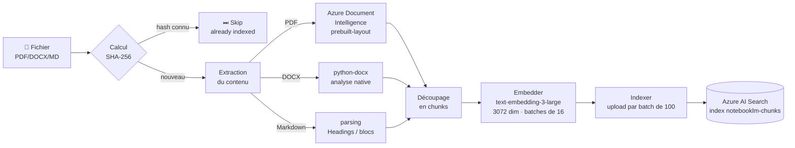

### Stratégie de découpage (chunking)

Le découpage est la clé de la qualité de la recherche. Une stratégie trop grossière noie l'information pertinente ; trop fine, elle perd le contexte.

**Paramètres appliqués :**
- Taille cible : **1 000 tokens** (unité : token tiktoken cl100k_base)
- Recouvrement : **200 tokens** entre chunks consécutifs
- Raison du recouvrement : garantir que les phrases à cheval sur deux chunks restent accessibles par les deux

**Traitement spécifique PDF (Document Intelligence) :**
1. L'API `prebuilt-layout` analyse le PDF et renvoie des paragraphes structurés avec rôles (`title`, `sectionHeading`, `paragraph`)
2. Le chunker regroupe les paragraphes consécutifs jusqu'à 1 000 tokens
3. Il suit les headings pour propager `section` et `title` à chaque chunk
4. Un paragraphe > 1 000 tokens est lui-même subdivisé avec recouvrement

**Métadonnées indexées par chunk :**

| Champ | Type | Usage |
|---|---|---|
| `id` | `{file_hash}_{chunk_index}` | Clé unique, idempotente |
| `content` | texte brut | Recherche BM25 + affichage |
| `content_vector` | float[3072] | Recherche vectorielle HNSW |
| `source_file` | nom du fichier | Citation dans les réponses |
| `page_number` | entier | Citation précise page |
| `section` | texte | Citation section + reranking |
| `title` | texte | Reranking sémantique |
| `file_hash` | SHA-256 | Déduplication |
| `created_at` | datetime | Audit, gestion des versions |

### Déduplication

À chaque lancement, `ingest.py` récupère l'ensemble des `file_hash` déjà présents dans l'index. Si le hash d'un fichier est connu, le fichier est ignoré. Cela permet de relancer l'ingestion sans doublon même si de nouveaux fichiers sont ajoutés au dossier.

Pour forcer la réingestion d'un fichier (après modification), utiliser `--force-reindex`.

---

## 5. Pipeline de requête (RAG)

RAG = **Retrieval-Augmented Generation** — le modèle de langage ne répond pas depuis sa mémoire mais depuis des extraits retrouvés en temps réel dans l'index.

### Schéma du pipeline

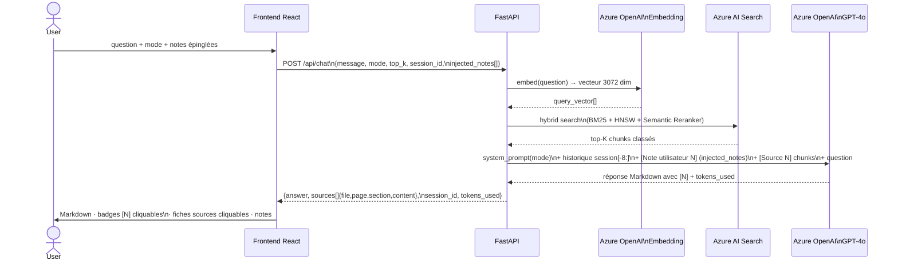

### Endpoints API

| Méthode | Route | Description | Corps / Paramètres |
|---|---|---|---|
| `POST` | `/api/chat` | Requête RAG — génère une réponse sourcée | `{message, mode, top_k, session_id?, injected_notes[]}` |
| `DELETE` | `/api/chat/{session_id}` | Purge l'historique d'une session | — |
| `POST` | `/api/ingest` | Upload + lancement de l'ingestion (202) | `multipart/form-data` — champ `file` (PDF/DOCX/MD, max 50 Mo) |
| `GET` | `/api/ingest/{job_id}` | Polling du statut d'un job d'ingestion | — → `{job_id, status, filename, message, chunks}` |
| `GET` | `/health` | Health check | — → `{status: "ok"}` |

### Recherche hybride dans Azure AI Search

La recherche combine trois mécanismes complémentaires fusionnés par **RRF (Reciprocal Rank Fusion)** :

```
Score final = RRF(BM25_score, HNSW_score) → reranking sémantique → top-K
```

| Mécanisme | Principe | Force |
|---|---|---|
| **BM25** | Correspondance lexicale (mots-clés exacts, fréquence) | Acronymes, noms propres, termes techniques |
| **HNSW** | Similarité cosinus entre vecteurs 3072 dim | Synonymes, paraphrases, intentions |
| **Semantic Ranker** | Modèle de reranking Microsoft sur le texte brut | Pertinence contextuelle fine |

L'index HNSW est configuré avec :
- `m = 4` (connexions par nœud) — compromis mémoire/précision
- `ef_construction = 400` — précision à la construction
- `ef_search = 500` — précision à la recherche
- Métrique : **cosinus** (standard pour embeddings de texte normalisés)

### Modes d'analyse

Les trois modes ajustent simultanément le comportement du LLM et la quantité de contexte injectée :

| Mode | top_k | max_tokens | temperature | Usage typique |
|---|---|---|---|---|
| ⚡ **Rapide** | 5 | 600 | 0.2 | Question factuelle simple ("c'est quoi X ?") |
| 📋 **Standard** | 10 | 2 000 | 0.3 | Usage quotidien, réponses structurées sourcées |
| 🔬 **Approfondi** | 20 | 4 000 | 0.3 | Inventaires, corrélations multi-sources, diagrammes |

### Mémoire conversationnelle

Chaque session est identifiée par un `session_id` UUID généré côté serveur. L'historique est conservé en mémoire (dict Python) jusqu'à 40 messages (20 tours).

À chaque requête, les **8 derniers messages** (4 tours) sont injectés dans le contexte envoyé au LLM — fenêtre glissante pour limiter la consommation de tokens tout en maintenant la cohérence conversationnelle.

**Limite** : les sessions sont perdues au redémarrage de l'application (mémoire volatile). Pour une persistance durable, il faudrait stocker les sessions dans Azure Cosmos DB ou Redis Cache.

---

## 6. Interface utilisateur

### Structure de l'application web

L'UI est une **Single Page Application React 18** servie statiquement par le même App Service que l'API. Elle utilise React via CDN avec Babel Standalone pour transpiler le JSX à la volée — **aucune étape de build** (`npm`, `webpack`, `vite`) n'est nécessaire.

```
frontend/
├── index.html          — point d'entrée : CDN React/ReactDOM/Babel/marked/mermaid,
│                          CSS global (design tokens, .nlaz-md, .nlaz-cite, mermaid)
└── src/
    ├── tokens.jsx      — design tokens (objet T), 16 icônes SVG (Ic.*),
    │                      Logo, composant MarkdownContent
    ├── Header.jsx      — bandeau supérieur : upload fichier, nouvelle conversation,
    │                      nouvelle note
    ├── NotesRail.jsx   — rail droit : NoteCard (hover → supprimer/épingler),
    │                      NoteModal (portal plein écran), bouton "Nouvelle note"
    ├── ChatPanel.jsx   — panneau chat : messages, saisie, ModeSelector,
    │                      CitationModal (portal), bandeau notes injectées
    └── App.jsx         — état global, logique sendMessage/notes/ingestion,
                           IngestToast (portal)
```

> **Pattern cross-scripts** : chaque fichier `.jsx` exporte ses symboles vers `window` via `Object.assign(window, {...})`. Les scripts chargés ensuite y accèdent comme globals. Ce pattern contourne la limitation de Babel Standalone qui transpile chaque `<script>` dans un scope isolé.

### Architecture des composants React

```
App
├── IngestToast (portal → document.body)
├── Header
│   └── <input type="file"> caché
├── ChatPanel
│   ├── AssistantMessage
│   │   ├── CitationModal (portal → document.body, conditionnel)
│   │   ├── MarkdownContent  ← event delegation sur .nlaz-cite
│   │   └── SourceCard (cliquable → CitationModal)
│   ├── ModeSelector
│   └── barre notes injectées (pinnedNotes)
└── NotesRail
    ├── NoteCard (hover state au niveau carte)
    └── NoteModal (portal → document.body, conditionnel)
```

### Fonctionnalités

| Fonctionnalité | Implémentation |
|---|---|
| Rendu Markdown complet | `MarkdownContent` → marked.js (GFM : headers, tables, listes, code, blockquotes) |
| Diagrammes Mermaid | `useEffect` post-render — détecte `code.language-mermaid`, appelle `mermaid.render()` |
| 3 modes d'analyse | `ModeSelector` — ajuste `top_k` (5/10/20) et `max_tokens` (600/2000/4000) |
| Indicateur du mode utilisé | Tag coloré sur chaque message utilisateur |
| Citations filtrées | Seules les sources dont le numéro `[N]` apparaît dans le texte sont affichées |
| Viewer de citation | Clic sur badge `[N]` (event delegation) ou fiche source → `CitationModal` avec texte complet du chunk |
| Copie Markdown brut | Bouton "Copier" — clipboard API |
| Rail de notes | Enregistrement d'une réponse + création manuelle ; survol → bouton supprimer |
| Modale de note | Clic sur une note → overlay Notion-style (portal) avec texte complet |
| Injection de notes | Épingler une note → `injected_notes[]` envoyé dans chaque requête suivante |
| Bandeau notes actives | Rappel visuel des notes épinglées au-dessus de la saisie, clic pour désépingler |
| Upload de document | Bouton "Ajouter un document" → `FormData POST /api/ingest` → polling `GET /api/ingest/{job_id}` |
| Toast d'ingestion | Progression temps réel (pending → running → done/error) avec auto-dismiss succès 6s |
| Persistance locale | Notes et `session_id` conservés dans `localStorage` (survie au reload) |
| Nouvelle conversation | Purge l'historique serveur (`DELETE /api/chat/{session_id}`) + reset état local |

---

## 7. Sécurité et identité

### Principe : zéro clé d'API dans le code

**Aucune clé secrète n'est stockée dans le code ou les variables d'environnement de production.** L'authentification repose intégralement sur Azure Managed Identity et Azure Key Vault.

### Architecture d'identité

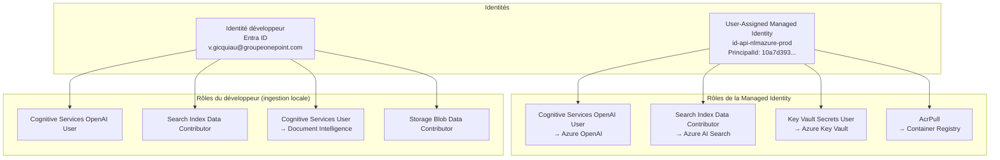

### DefaultAzureCredential — chaîne de credentials

En local, le SDK Azure utilise `DefaultAzureCredential` qui essaie les providers dans cet ordre :

1. `EnvironmentCredential` — variables d'env (non configurées → skip)
2. `ManagedIdentityCredential` — IMDS endpoint (non disponible en local → skip)
3. `AzureCliCredential` ✅ — token `az login` — **utilisé en local**
4. En production (App Service) : `ManagedIdentityCredential` ✅ via `AZURE_CLIENT_ID`

### Contrôle d'accès Azure OpenAI

`disableLocalAuth: true` est configuré sur le compte Azure OpenAI — les clés d'API sont désactivées au niveau du service. Seule l'authentification Entra ID (tokens Bearer) est acceptée.

---

## 8. Infrastructure Azure

### Ressources déployées

Toutes les ressources appartiennent au resource group `rg-sp4-d-vgi-azu-vgi-sandbox-txt`, région `France Central`, convention de nommage `{type}-{projet}-{env}`.

| Ressource | Nom | SKU/Tier | Rôle |
|---|---|---|---|
| Azure OpenAI | `oai-nlmazure-prod` | S0 | Embeddings (text-embedding-3-large) + Chat (gpt-4o) |
| Azure AI Search | `srch-nlmazure-prod` | Standard S1 | Index vectoriel + BM25 + Semantic Ranker |
| Azure Document Intelligence | `docint-nlmazure-prod` | S0 | Extraction et analyse structurelle des PDF |
| Azure Key Vault | `kv-nlmazure-prod` | Standard | Stockage des endpoints et secrets |
| Azure Container Registry | `nlmazureprod` | Basic | Stockage des images Docker de l'API |
| App Service Plan | `asp-nlmazure-prod` | B2 Linux | Hébergement du plan App Service |
| App Service | `app-api-nlmazure-prod` | (B2) | API FastAPI + frontend servi en conteneur Docker |
| Blob Storage | `stnlmazureprod` | Standard LRS | Stockage des documents sources |
| Application Insights | `appi-nlmazure-prod` | — | Monitoring, traces, logs de l'application |
| Managed Identity | `id-api-nlmazure-prod` | User-Assigned | Identité de l'App Service pour tous les appels Azure |

### Déploiements Azure OpenAI

| Modèle | Deployment name | Capacité | Usage |
|---|---|---|---|
| `gpt-4o` (2024-11-20) | `gpt-4o` | 30K TPM | Génération des réponses |
| `text-embedding-3-large` (v1) | `text-embedding-3-large` | 100K TPM | Vectorisation des chunks et des requêtes |

### Infrastructure as Code (Bicep)

```
infra/
├── main.bicep                  — orchestration, role assignments, secrets KV
└── modules/
    ├── containerapp.bicep      — App Service + Managed Identity + ACR Pull
    ├── openai.bicep            — Azure OpenAI + 2 déploiements
    ├── search.bicep            — Azure AI Search S1 + semantic search
    ├── keyvault.bicep          — Key Vault + accès déployeur
    ├── docint.bicep            — Document Intelligence
    ├── storage.bicep           — Blob Storage
    ├── registry.bicep          — Container Registry
    └── monitoring.bicep        — Application Insights
```

**Commande de déploiement :**
```powershell
az deployment group create \
  --resource-group rg-sp4-d-vgi-azu-vgi-sandbox-txt \
  --template-file infra/main.bicep \
  --parameters projectName=nlmazure environment=prod deployerObjectId=$env:DEPLOYER_OID
```

---

## 9. Choix techniques et justifications

### Pourquoi Azure AI Search S1 (et non S0) ?

Le **Semantic Ranker** n'est disponible qu'à partir du tier **Standard S1**. Ce composant est critique : il reranke les résultats de la recherche hybride (BM25 + HNSW) avec un modèle de langage léger, ce qui améliore significativement la pertinence des chunks transmis au LLM.

Sans Semantic Ranker, les chunks récupérés correspondraient aux mots-clés et aux vecteurs les plus proches, mais pas nécessairement aux extraits les plus utiles pour répondre à la question.

### Pourquoi text-embedding-3-large avec 3072 dimensions ?

`text-embedding-3-large` est le modèle d'embedding le plus performant d'OpenAI sur les benchmarks MTEB (Massive Text Embedding Benchmark). Les 3 072 dimensions (vs 1 536 pour `text-embedding-3-small`) capturent des nuances sémantiques plus fines, ce qui est important pour des documents techniques avec un vocabulaire métier spécialisé.

Contrepartie : les vecteurs sont 2× plus lourds en stockage et la recherche HNSW est légèrement plus lente.

### Pourquoi la recherche hybride (BM25 + HNSW) ?

- **BM25 seul** : échoue sur les synonymes et paraphrases ("flux financier" ≠ "transfert d'argent")
- **Vectoriel seul** : échoue sur les termes exacts rares (codes, acronymes, noms de modules)
- **Hybride RRF** : combine les deux — les termes exacts sont trouvés par BM25, les intentions par les vecteurs

### Pourquoi App Service et non Container Apps ?

La souscription Azure sandbox utilisée ne dispose pas des droits nécessaires pour enregistrer le fournisseur de ressources `Microsoft.App` (requis par Container Apps). App Service for Containers offre les mêmes capacités (Docker, Managed Identity, HTTPS) sur `Microsoft.Web`, qui est déjà enregistré.

### Pourquoi un system prompt en 3 variantes (modes) ?

Un LLM puissant comme GPT-4o adapte sa stratégie de réponse aux instructions système. Un prompt trop restrictif ("réponds uniquement depuis les extraits") inhibe la synthèse et produit des réponses pauvres. Un prompt trop libre génère des hallucinations.

Les 3 modes permettent d'optimiser le ratio qualité/coût :
- **Rapide** : prompt minimaliste, peu de tokens → vérification factuelle rapide
- **Standard** : équilibre synthèse + citations
- **Approfondi** : instructions analytiques complètes, invitant à corréler et inférer

---

## 10. Limites et axes d'amélioration

### Limites actuelles

| Limite | Statut | Explication |
|---|---|---|
| **Contexte partiel** | Structurel | Le LLM ne voit que 5 à 20 extraits par requête. Pour les questions transversales ("tous les flux"), certains éléments peuvent être manqués si les chunks correspondants ne sont pas dans le top-K récupéré. |
| **Sessions volatiles** | Structurel | Les historiques de conversation sont perdus au redémarrage de l'App Service (stockage in-memory). |
| **Ingestion manuelle** | Partiellement résolu ✅ | L'upload via l'interface UI permet d'ajouter des documents à la volée. L'ingestion automatique sur nouveau blob (Azure Function) n'est pas encore en place. |
| **Pas de streaming** | Structurel | La réponse est affichée en une seule fois après génération complète (pas de streaming token-by-token). |
| **Formats non supportés** | Structurel | Seuls PDF, DOCX et Markdown sont supportés. Les fichiers Excel, PowerPoint ou images scannées ne sont pas ingérés. |
| **Viewer document original** | Connu | Le viewer de citation affiche le texte extrait du chunk (déjà dans l'index). Le fichier original (PDF visuel, mise en page) n'est pas accessible car supprimé après ingestion. |

### Axes d'amélioration prioritaires

1. **Streaming de la réponse** — Server-Sent Events (SSE) côté API + rendu progressif côté frontend → meilleure expérience pour les réponses longues en mode Approfondi

2. **Persistance des sessions** — Stocker les historiques dans Azure Cosmos DB ou Azure Cache for Redis → survie aux redémarrages

3. **Ingestion automatisée** — Azure Function déclenchée sur nouveau blob dans le Storage Account → ingestion en continu sans intervention manuelle (complémentaire à l'upload UI existant)

4. **Viewer PDF natif** — Conserver le fichier original après ingestion (Azure Blob Storage), exposer un endpoint `GET /api/document/{hash}`, intégrer PDF.js → affichage du document à la page citée

5. **Support Excel/PowerPoint** — Document Intelligence supporte `.xlsx` et `.pptx` via le modèle `prebuilt-layout`

6. **Feedback utilisateur** — Boutons 👍/👎 sur les réponses, stockés dans Cosmos DB → données pour évaluer et améliorer la qualité du RAG

7. **Évaluation RAG** — Mettre en place des métriques (faithfulness, context precision) via Azure AI Evaluation ou Ragas pour mesurer objectivement la qualité des réponses

---

## 11. Spécifications des fonctionnalités

> Chaque fonctionnalité est documentée selon quatre axes : **I. Contexte métier**, **II. Spécifications fonctionnelles**, **III. Architecture technique**, **IV. Exploitation et résilience**.

---

### F1 — Chat RAG

#### I. Contexte et Vision Métier

**Objectif et Valeur Ajoutée**

Permet à tout membre de l'équipe d'interroger en langage naturel l'ensemble du corpus documentaire sans chercher manuellement dans des dizaines de fichiers. La réponse est sourcée, reproductible et corrélée entre plusieurs documents.

**Acteurs**

| Persona | Usage |
|---|---|
| Consultant / Analyste | Questions métier sur les spécifications et règles de gestion |
| Développeur | Questions techniques sur l'architecture, les APIs, les flux |
| Chef de projet | Synthèses, inventaires, comparaisons inter-documents |

**Indicateurs de succès**
- Taux de réponses avec au moins une citation (`sources.length > 0`)
- Absence de réponse "Aucun document pertinent trouvé" (signe d'un corpus mal indexé)
- Temps de réponse < 8s en mode Standard (P95)

---

#### II. Spécifications Fonctionnelles

**Périmètre**

| ✅ In Scope | ❌ Out of Scope |
|---|---|
| Questions en langage naturel (français) | Réponses depuis la mémoire générale du LLM |
| Réponses Markdown structurées avec citations `[N]` | Streaming token-by-token |
| Historique conversationnel (4 tours glissants) | Persistance des sessions entre redémarrages |
| 3 modes d'analyse (voir F2) | Modes personnalisés par utilisateur |

**Parcours Utilisateur**

```gherkin
Given l'utilisateur est sur l'interface et des documents sont indexés
When il saisit une question et appuie sur Entrée
Then un indicateur de chargement s'affiche
And une réponse Markdown structurée apparaît avec des badges [N] dans le texte
And seules les sources effectivement citées apparaissent dans "Références"

Given l'utilisateur a reçu une réponse
When il pose une question de suivi implicite ("Et pour le module B ?")
Then la requête inclut les 8 derniers messages d'historique
And la réponse tient compte du contexte conversationnel

Given aucun chunk pertinent n'est trouvé
When l'utilisateur pose une question
Then l'API retourne "Aucun document pertinent trouvé pour cette question."
```

**Règles de Gestion**
- Message : 1 à 4 000 caractères (validation Pydantic)
- `top_k` : 5 / 10 / 20 selon le mode
- `max_tokens` : 600 / 2 000 / 4 000 selon le mode
- Historique envoyé au LLM : 8 derniers messages (fenêtre glissante)
- Session expirée au redémarrage de l'API (stockage in-memory)

**Cas Limites et Gestion des Erreurs**

| Cas | Comportement |
|---|---|
| Azure OpenAI indisponible (503) | Message d'erreur dans le chat |
| Azure AI Search indisponible | HTTP 503 → message d'erreur dans le chat |
| Quota TPM dépassé (429) | Retry backoff exponentiel — tenacity, 3 essais |
| Message vide soumis | Bouton désactivé côté front + validation Pydantic (`min_length=1`) |
| Réponse tronquée par `max_tokens` | Comportement GPT-4o attendu en mode Rapide |

---

#### III. Architecture Technique

**Composants impactés** : `ChatPanel.jsx` · `App.jsx` · `api/routers/chat.py` · `api/services/retriever.py` · `api/services/generator.py`

**Contrat d'Interface**

```
POST /api/chat
Body: { message, session_id?, top_k, mode, injected_notes[] }
Response 200: { answer, session_id, sources[]{file,page,section,score,content}, tokens_used }
DELETE /api/chat/{session_id}   → purge historique
```

**Diagramme d'états — message**

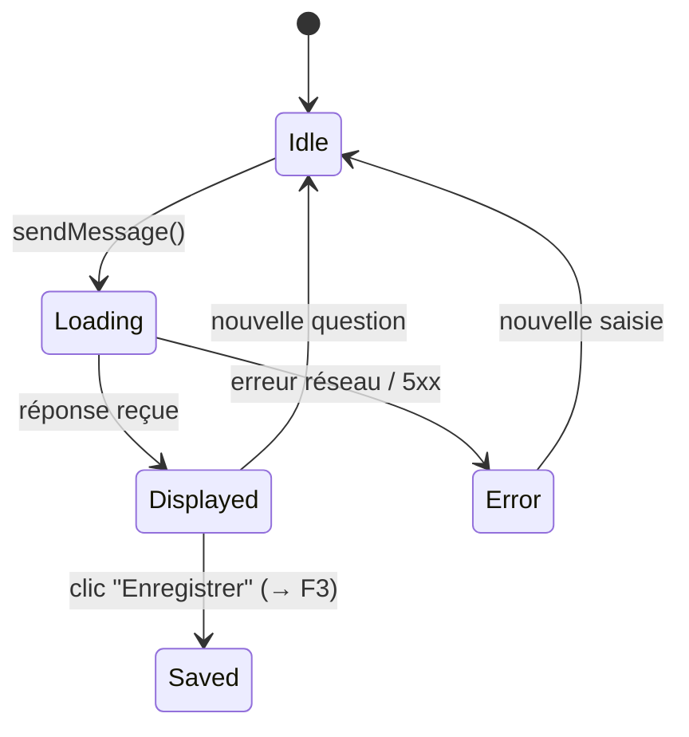

**Performance**
- Budget tokens LLM : system_prompt + historique (8 msg) + contexte (top_k × ~1 000 tokens) + question → rester sous 128k tokens (limite GPT-4o)
- Cible P95 : < 4s (Rapide) · < 8s (Standard) · < 15s (Approfondi)

---

#### IV. Exploitation et Résilience

**Observabilité** : Application Insights trace chaque appel `/api/chat` avec `tokens_used` et `session_id`. Surveiller : `tokens_used` moyen (dérive = prompt trop long) · taux d'erreurs 5xx.

**Troubleshooting**

| Symptôme | Cause probable | Action |
|---|---|---|
| "Aucun document pertinent" systématique | Index vide | Vérifier `$count` sur l'index AI Search ; réindexer |
| Réponses sans badges `[N]` | LLM ignore format numérique | Vérifier system prompt dans `generator.py` |
| Timeout > 30s | Quota TPM dépassé | Passer en mode Rapide ; vérifier quotas Azure OpenAI |

---

### F2 — Modes d'analyse

#### I. Contexte et Vision Métier

**Objectif et Valeur Ajoutée**

Un mode unique forcerait un compromis sous-optimal. Les 3 modes permettent à l'utilisateur de choisir explicitement le ratio qualité / coût / vitesse selon la nature de sa question.

**Acteurs** : Tous les utilisateurs du chat.

**Indicateurs de succès**
- Distribution d'usage : > 50% Standard, < 20% Rapide, < 30% Approfondi
- Corrélation Approfondi ↔ questions longues (> 100 caractères)

---

#### II. Spécifications Fonctionnelles

**Périmètre**

| ✅ In Scope | ❌ Out of Scope |
|---|---|
| 3 modes fixes | Modes personnalisés par utilisateur |
| Sélecteur persistant pendant la session | Persistance du mode choisi entre sessions |
| Tag coloré sur chaque message utilisateur | Modification du mode d'un message déjà envoyé |

**Règles de Gestion**

| Mode | top_k | max_tokens | temperature | Orientation du prompt |
|---|---|---|---|---|
| ⚡ Rapide | 5 | 600 | 0.2 | Réponse directe et concise |
| 📋 Standard | 10 | 2 000 | 0.3 | Synthèse structurée + citations |
| 🔬 Approfondi | 20 | 4 000 | 0.3 | Corrélations, inventaires, diagrammes |

**Parcours Utilisateur**

```gherkin
Given l'interface est ouverte (mode par défaut : Standard)
When l'utilisateur clique sur "Rapide"
Then le sélecteur affiche "Rapide" actif (fond vert)
And le prochain envoi utilise top_k=5, max_tokens=600

Given un message a été envoyé en mode "Approfondi"
When la réponse s'affiche
Then un tag violet "Approfondi" est visible au-dessus du message utilisateur
```

**Cas Limites** : changement de mode pendant le chargement → le mode en cours de requête ne change pas ; le nouveau mode s'applique à la suivante.

---

#### III. Architecture Technique

**Composants impactés** : `ChatPanel.jsx` (`ModeSelector`, `MODE_CONFIG`, `MODE_TOP_K`) · `App.jsx` (state `mode`) · `api/models/schemas.py` · `api/services/generator.py` (`SYSTEM_PROMPTS`, `max_tokens` par mode)

**Diagramme d'activité — sélection de mode**

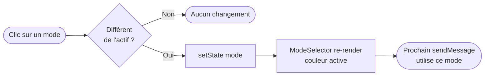

---

#### IV. Exploitation et Résilience

**Observabilité** : Loguer le mode dans chaque trace Application Insights pour corréler coût (tokens) ↔ mode utilisé.

**Troubleshooting** : Réponse vide ou tronquée → vérifier que `max_tokens` n'est pas inférieur à la longueur naturelle de la réponse pour la question posée.

---

### F3 — Rail de notes

#### I. Contexte et Vision Métier

**Objectif et Valeur Ajoutée**

Lors d'une session de recherche intensive, l'utilisateur accumule des insights dans différentes réponses. Le rail de notes permet de **capitaliser ces insights en temps réel** : sauvegarder une réponse pertinente, la relire, l'annoter et la réutiliser dans les questions suivantes (voir F4).

**Acteurs**

| Persona | Usage |
|---|---|
| Analyste / Consultant | Construire une analyse par accumulation progressive d'extraits |
| Chef de projet | Préparer un compte-rendu à partir de réponses sourcées |

**Indicateurs de succès**
- Taux de sessions avec ≥ 1 note créée
- Taux de rétention des notes entre sessions (localStorage → survie au reload)

---

#### II. Spécifications Fonctionnelles

**Périmètre**

| ✅ In Scope | ❌ Out of Scope |
|---|---|
| Enregistrer une réponse AI comme note | Édition du contenu après création |
| Créer une note manuelle (texte libre) | Organisation en dossiers / tags |
| Afficher la note complète (modale) | Export (PDF, Notion, etc.) |
| Supprimer une note | Partage entre utilisateurs |
| Persistence `localStorage` | Synchronisation serveur |

**Parcours Utilisateur**

```gherkin
# Enregistrement d'une réponse
Given l'utilisateur a reçu une réponse
When il clique sur "Enregistrer"
Then le bouton passe en "Enregistré" (fond bleu, non re-cliquable)
And une note apparaît en tête du rail droit
And la note est persistée en localStorage

# Note manuelle
Given l'utilisateur clique sur "Nouvelle note"
When la zone de saisie apparaît et il confirme le texte
Then une note manuelle apparaît en tête du rail

# Consultation
Given une note existe dans le rail
When l'utilisateur clique dessus
Then une modale plein écran s'ouvre avec le texte complet rendu en Markdown
And la modale se ferme sur Échap ou clic en dehors

# Suppression
Given l'utilisateur survole une note
When il clique sur le bouton × (visible au survol)
Then la note est supprimée du rail et du localStorage
And si elle était épinglée (F4), elle est retirée de pinnedNotes
```

**Règles de Gestion**
- Notes triées anti-chronologiquement (nouvelle note en tête)
- Texte extrait en texte brut depuis le Markdown de la réponse
- Première citation de la réponse attachée comme `source` (optionnel)
- `messageId` mémorisé pour empêcher le double enregistrement d'une même réponse

**Cas Limites**

| Cas | Comportement |
|---|---|
| localStorage saturé | Écriture silencieusement échoue ; les notes peuvent ne pas être sauvegardées |
| Suppression d'une note épinglée | Retrait automatique de `pinnedNotes` via `handleDeleteNote()` |

---

#### III. Architecture Technique

**Composants impactés** : `NotesRail.jsx` (`NoteCard`, `NoteModal`) · `App.jsx` (`notes`, `handleSaveNote()`, `handleDeleteNote()`, `handleBlankConfirm()`)

**Modèle de données (localStorage — clé `nlaz-notes`)**

```typescript
interface Note {
  id: string;           // uid() — 8 chars aléatoires
  text: string;         // texte brut extrait du Markdown
  source?: string;      // nom du fichier de la première citation
  messageId?: string;   // id du message d'origine
  timestamp: string;    // ISO 8601
}
```

**Diagramme d'états — note**

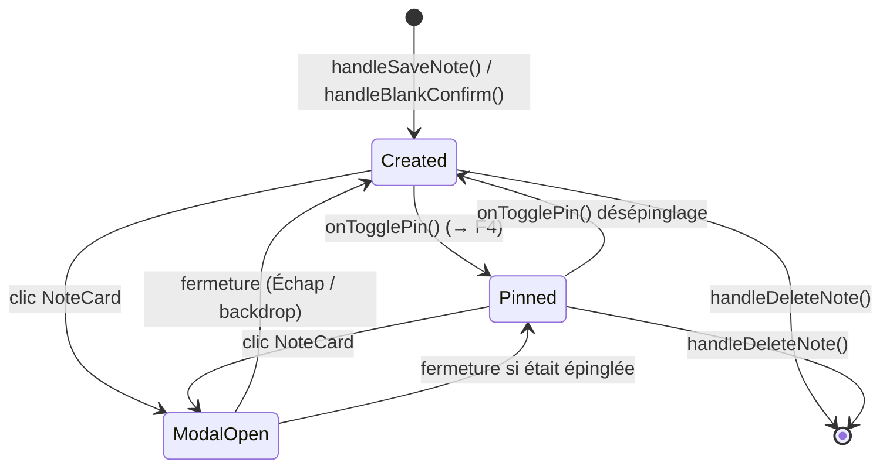

**Sécurité** : Les notes transitent sur le réseau uniquement si épinglées (incluses dans `injected_notes[]` du corps de requête HTTPS).

---

#### IV. Exploitation et Résilience

**Limite connue** : Notes liées au navigateur — pas de synchronisation multi-appareils. Pour une persistance partagée : API de stockage des notes côté serveur (axe d'amélioration futur).

**Troubleshooting**

| Symptôme | Cause | Action |
|---|---|---|
| Notes disparaissent au reload | localStorage désactivé ou mode privé | Vérifier `localStorage.getItem('nlaz-notes')` en console |
| Bouton × non visible | Survol de la carte requis (opacity 0 → 1 on hover) | Comportement attendu |

---

### F4 — Injection de notes dans le contexte

#### I. Contexte et Vision Métier

**Objectif et Valeur Ajoutée**

La recherche RAG est stateless par nature : chaque question repart de zéro. L'injection de notes permet de **construire un raisonnement itératif** : l'utilisateur épingle les conclusions d'une première analyse et les injecte dans les questions suivantes, orientant le LLM sans avoir à tout reformuler.

**Acteurs** : Utilisateurs avancés construisant des analyses en plusieurs étapes.

**Indicateurs de succès**
- Taux de sessions avec ≥ 1 note injectée
- Amélioration perçue de la pertinence des réponses avec notes injectées (qualitatif)

---

#### II. Spécifications Fonctionnelles

**Périmètre**

| ✅ In Scope | ❌ Out of Scope |
|---|---|
| Épingler / désépingler une note depuis le rail ou la modale | Injection automatique de toutes les notes |
| Bandeau de rappel des notes actives au-dessus de la saisie | Pondération ou priorité entre notes injectées |
| Notes injectées visibles dans le contexte LLM | Persistance de l'état épinglé entre sessions |
| Désépinglage depuis le bandeau (clic sur le chip) | Édition du texte avant injection |

**Parcours Utilisateur**

```gherkin
# Épinglage depuis la modale de note
Given une note est ouverte dans sa modale
When l'utilisateur clique sur "Injecter dans le contexte"
Then la note est ajoutée à pinnedNotes
And un bandeau bleu "N note(s) dans le contexte" apparaît au-dessus de la saisie
And le bouton devient "Retirer du contexte"

# Question avec note injectée
Given une note est épinglée
When l'utilisateur envoie une question
Then la requête inclut injected_notes: [texte de la note]
And le contexte LLM contient "[Note utilisateur 1]: <texte>"
And la réponse peut référencer le contenu de la note

# Désépinglage depuis le bandeau
Given le bandeau est visible avec une note
When l'utilisateur clique sur son chip
Then la note est retirée de pinnedNotes
And le bandeau disparaît si pinnedNotes est vide
```

**Règles de Gestion**
- Notes labelisées `[Note utilisateur N]` dans le contexte LLM (N = index dans la liste)
- Insérées **avant** les chunks RAG dans le contexte (signale leur priorité au LLM)
- Aucune limite en nombre, mais chaque note contribue au budget tokens
- `pinnedNotes` en état React session — perdues à la fermeture du tab

**Cas Limites**

| Cas | Comportement |
|---|---|
| Note longue (> 2 000 tokens) + mode Rapide | Notes s'ajoutent même si elles dépassent le budget tokens → risque de troncature GPT-4o |
| Note supprimée pendant qu'elle est épinglée | `handleDeleteNote()` la retire automatiquement de `pinnedNotes` |
| Reload de la page | Notes épinglées perdues (state React, non persisté) |

---

#### III. Architecture Technique

**Composants impactés** : `NotesRail.jsx` (`NoteModal` — bouton injecter/retirer, `NoteCard` — icône inject) · `ChatPanel.jsx` (bandeau pinnedNotes) · `App.jsx` (state `pinnedNotes`, `togglePinNote()`) · `api/models/schemas.py` · `api/services/generator.py` (`_build_context()`)

**Construction du contexte LLM**

```
[Note utilisateur 1]
<texte de la note 1>

[Note utilisateur 2]
<texte de la note 2>

[Source 1] — fichier.pdf, p.12
<contenu chunk 1>

[Source 2] — autre.pdf, p.3
<contenu chunk 2>
```

**Diagramme d'activité — épinglage**

```mermaid
flowchart TD
    A([Clic "Injecter dans le contexte"]) --> B{Note déjà\népinglée ?}
    B -->|Oui| C[Retirer de pinnedNotes]
    B -->|Non| D[Ajouter à pinnedNotes]
    C --> E([Bandeau mis à jour · Bouton → Injecter])
    D --> F([Bandeau mis à jour · Bouton → Retirer])
```

---

#### IV. Exploitation et Résilience

**Limite connue** : L'injection augmente la consommation de tokens proportionnellement à la longueur des notes. Pour de très longues notes (> 3 000 tokens), préférer le mode Approfondi.

---

### F5 — Viewer de citation

#### I. Contexte et Vision Métier

**Objectif et Valeur Ajoutée**

Les agents RAG sont sujets à la sur-interprétation ou à l'hallucination. La possibilité de **vérifier en un clic le passage exact** qui a fondé une affirmation renforce la confiance et permet de détecter immédiatement les erreurs d'attribution.

**Acteurs** : Tous les utilisateurs souhaitant valider les affirmations de l'agent.

**Indicateurs de succès**
- Taux de clics sur les badges `[N]` ou les fiches source
- Réduction du temps de vérification manuelle des sources

---

#### II. Spécifications Fonctionnelles

**Périmètre**

| ✅ In Scope | ❌ Out of Scope |
|---|---|
| Afficher le texte brut du chunk indexé | Afficher le PDF original mis en page |
| Ouvrir depuis badge `[N]` dans le texte | Naviguer entre chunks adjacents |
| Ouvrir depuis la fiche source "Références" | Surligner le passage dans un viewer PDF |
| Modale avec fichier, page, section, contenu | Télécharger le document source |

**Parcours Utilisateur**

```gherkin
Given une réponse contient des badges [N] cliquables
When l'utilisateur clique sur [3]
Then une modale s'ouvre : nom fichier, numéro page, titre section, texte du chunk en Markdown

Given les fiches "Références" sont affichées
When l'utilisateur clique sur une fiche source
Then la même modale s'ouvre pour le chunk correspondant

Given la modale est ouverte
When l'utilisateur appuie sur Échap ou clique en dehors
Then la modale se ferme
```

**Règles de Gestion**
- Seules les sources dont le numéro `[N]` apparaît dans le texte sont cliquables
- Correspondance badge ↔ source par `id` (1-indexed, ordre des `sources[]` de l'API)
- Contenu affiché = champ `content` du chunk tel qu'indexé (texte brut, pas le PDF)

**Cas Limites**

| Cas | Comportement |
|---|---|
| Chunk sans contenu (`content = ""`) | Modale affiche "Contenu non disponible." |
| Réponse sans aucune citation | Badges absents, fiches absentes, viewer inaccessible |

---

#### III. Architecture Technique

**Composants impactés** : `tokens.jsx` (`MarkdownContent` + event delegation) · `ChatPanel.jsx` (`CitationModal`, `SourceCard`, `AssistantMessage`) · `index.html` (`.nlaz-cite` CSS) · `api/models/schemas.py` · `api/routers/chat.py`

**Mécanisme d'event delegation**

Le HTML des badges `[N]` est généré par `marked.parse()` injecté via `dangerouslySetInnerHTML` — pas de `onClick` React direct possible. Solution : `onClick` sur le container `<div>`, détection via `e.target.closest('.nlaz-cite')`.

**Diagramme de séquence — ouverture du viewer**

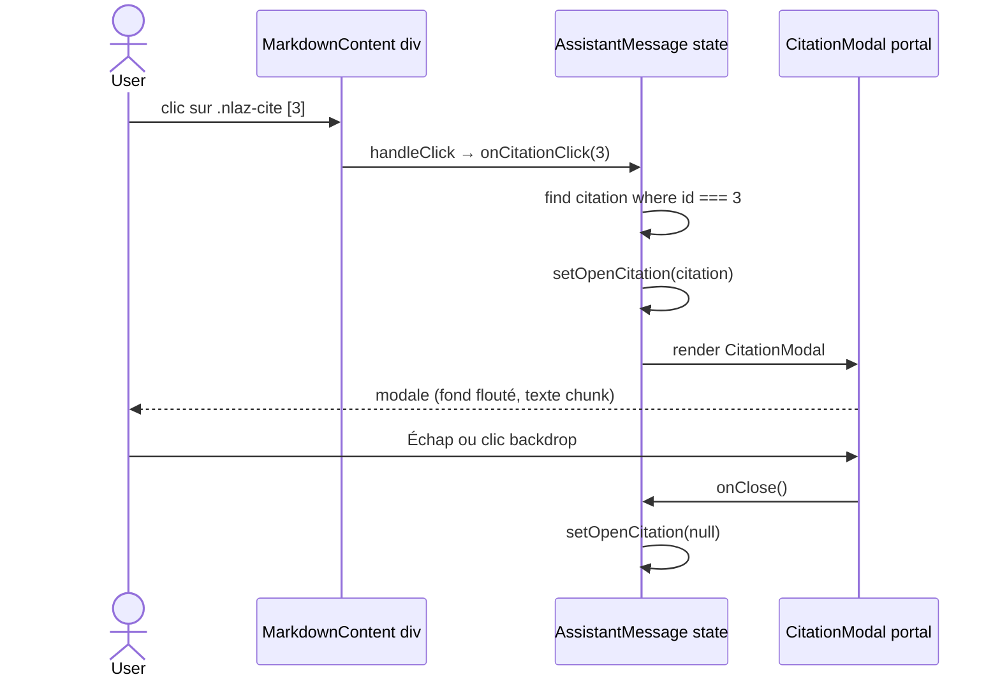

**Diagramme d'états — CitationModal**

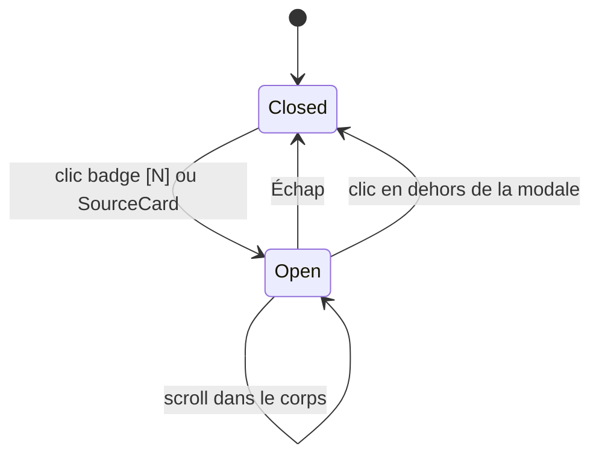

**Sécurité** : Contenu des chunks affiché via `dangerouslySetInnerHTML` après `marked.parse()`. Pour un corpus externe ou public, envisager DOMPurify.

---

#### IV. Exploitation et Résilience

**Limite connue** : Le viewer affiche le texte extrait lors de l'indexation. Si un document source a été modifié depuis, le contenu affiché peut différer du fichier actuel.

**Troubleshooting**

| Symptôme | Cause | Action |
|---|---|---|
| Badges `[N]` non cliquables | `onCitationClick` non passé | Vérifier `hasCitations` dans `AssistantMessage` |
| Modale vide | `content` vide dans la réponse API | Vérifier `content=c.content` dans `chat.py` |
| Badges sans hover visuel | Cache CSS | `Ctrl+Shift+R` hard refresh |

---

### F6 — Upload de document

#### I. Contexte et Vision Métier

**Objectif et Valeur Ajoutée**

L'ingestion documentaire était une opération CLI réservée aux administrateurs. L'upload UI **démocratise cette opération** : n'importe quel utilisateur enrichit le corpus depuis l'interface, sans accès SSH ni connaissance Python.

**Acteurs**

| Persona | Usage |
|---|---|
| Utilisateur final | Ajouter un document fraîchement reçu avant de l'interroger |
| Administrateur | Enrichissement ponctuel sans accès serveur |

**Indicateurs de succès**
- Taux de succès des uploads (`done` / total)
- Temps de traitement moyen (chunks/minute)
- Taux d'erreur lié à des dépendances manquantes = 0 en production

---

#### II. Spécifications Fonctionnelles

**Périmètre**

| ✅ In Scope | ❌ Out of Scope |
|---|---|
| Upload fichier unique (PDF, DOCX, Markdown, max 50 Mo) | Upload multiple / batch |
| Toast de progression temps réel | Barre de progression par chunk |
| Déduplication automatique (hash SHA-256) | Suppression ou mise à jour d'un document indexé |
| Message d'erreur si format / taille invalide | Prévisualisation avant ingestion |

**Parcours Utilisateur**

```gherkin
# Upload réussi
Given l'utilisateur clique sur "Ajouter un document"
When il sélectionne un fichier PDF
Then le fichier est uploadé (POST /api/ingest)
And un toast "Envoi du fichier…" apparaît en bas à droite
And le toast progresse : "Analyse…" → "Découpage…" → "Embeddings…" → "Indexation…"
And le toast final affiche "42 chunks indexés avec succès"
And le toast disparaît automatiquement après 6 secondes

# Fichier déjà indexé
Given le même fichier a déjà été ingéré (hash SHA-256 identique)
When l'utilisateur le re-uploade
Then le toast affiche "Document déjà indexé — aucune action nécessaire"

# Format non supporté
Given l'utilisateur sélectionne un .xlsx
Then le file picker HTML accepte uniquement .pdf,.md,.docx
And si contourné, l'API retourne 400 avec un message d'erreur clair

# Dépendance manquante
Given python-multipart n'est pas installé
When le serveur démarre
Then FastAPI lève RuntimeError et refuse de démarrer (erreur visible dans les logs)
```

**Règles de Gestion**
- Formats acceptés : `.pdf` · `.md` · `.docx`
- Taille max : 50 Mo (validé côté API — HTTP 413 sinon)
- Déduplication : `file_hash` déjà dans l'index → status `done`, chunks = 0
- Un seul job suivi à la fois côté front (nouvel upload annule l'intervalle précédent)
- API retourne `202 Accepted` immédiatement ; traitement asynchrone (BackgroundTask)
- Fichier temporaire supprimé après traitement (succès ou erreur)

**Cas Limites**

| Cas | Comportement |
|---|---|
| Fichier > 50 Mo | API retourne 413 ; toast d'erreur rouge |
| Format non supporté (contournement) | API retourne 400 ; toast d'erreur rouge |
| Réseau coupé pendant l'upload | `fetch` rejette ; toast d'erreur |
| Azure Document Intelligence indisponible | BackgroundTask échoue ; toast d'erreur avec message |
| API redémarrée pendant l'ingestion | Job perdu en mémoire ; polling retourne 404 ; toast d'erreur |
| Deuxième upload lancé pendant le premier | Polling du premier annulé (`clearInterval`) ; seul le second est suivi |

---

#### III. Architecture Technique

**Composants impactés** : `Header.jsx` (bouton, `<input type="file">` caché) · `App.jsx` (`IngestToast`, state `ingestJob`, `handleFileUpload()`, `ingestPollRef`) · `api/routers/ingest.py` (endpoints, `_run_ingest()`, `_jobs` dict)

**Contrats d'Interface**

```
POST /api/ingest  (multipart/form-data, champ: file)
→ 202: { job_id, status:"pending", filename, message, chunks:0 }
→ 400: format non supporté
→ 413: fichier trop volumineux

GET /api/ingest/{job_id}
→ 200: { job_id, status, filename, message, chunks }
→ 404: job inconnu (API redémarrée)
```

**Diagramme d'états — job d'ingestion**

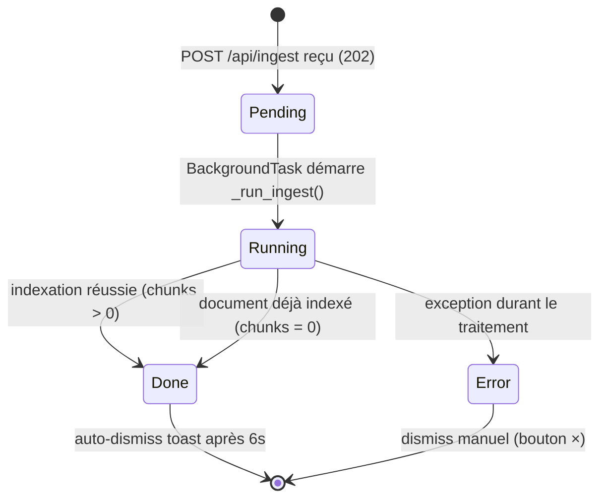

**Diagramme de séquence — flux complet**

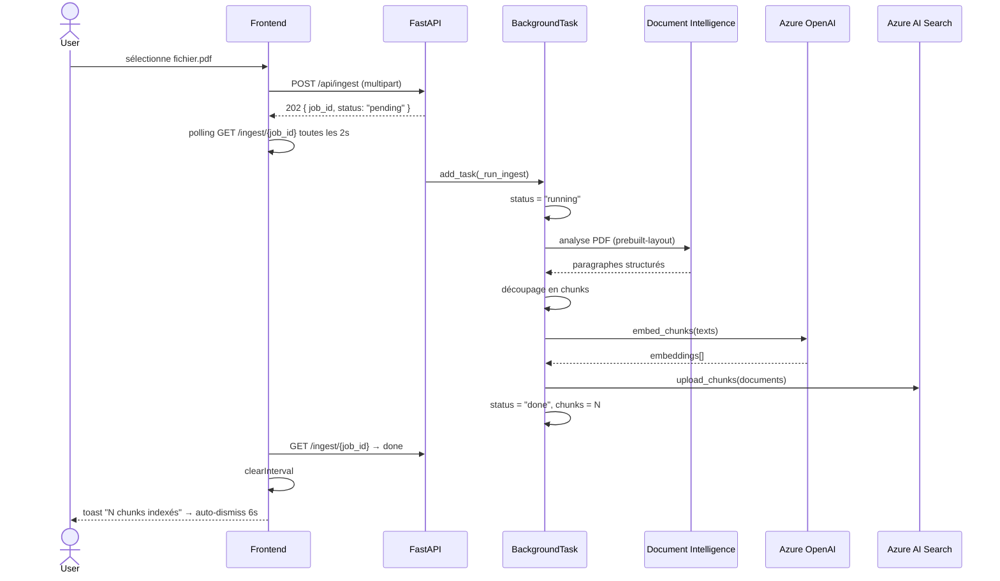

**Sécurité et Conformité**
- Fichier écrit dans `tempfile.gettempdir()` et supprimé après traitement — ne persiste pas sur disque
- Validation extension + taille côté API ; le contenu du fichier n'est pas inspecté au-delà

**Performance**
- Temps estimé : PDF 50 pages ≈ 2-4 min (Document Intelligence ~1-2 min + embeddings ~30s)
- Polling toutes les 2s : réactif sans surcharger l'API

---

#### IV. Exploitation et Résilience

**Observabilité** : `_jobs` dict en mémoire — les jobs sont perdus au redémarrage. Logger les erreurs des BackgroundTasks avec `logger.error()` pour Application Insights.

**Stratégie de déploiement** : `python-multipart` **obligatoire** dans `api/requirements.txt` (FastAPI refuse de démarrer sans lui). `tiktoken`, `azure-ai-documentintelligence`, `python-docx` requis pour que l'ingestion fonctionne en arrière-plan.

**Troubleshooting**

| Symptôme | Cause | Action |
|---|---|---|
| `RuntimeError: Form data requires "python-multipart"` au démarrage | Package absent | `pip install python-multipart` |
| Toast bloqué sur "En file d'attente…" | ImportError silencieuse dans BackgroundTask | Vérifier logs uvicorn pour `ImportError` |
| Toast d'erreur "Dépendance manquante" | tiktoken / azure-ai-documentintelligence / python-docx absent | `pip install tiktoken azure-ai-documentintelligence python-docx` |
| Polling retourne 404 après redémarrage | `_jobs` dict réinitialisé | Comportement attendu — toast passe en erreur |

---

### F7 — Graphe ADG-M

#### I. Vue d'ensemble

La fonctionnalité **Graphe ADG-M** (Architecture de la Décomposition Grand-Mainframe) ajoute une deuxième vue à l'interface, accessible depuis le toggle "Graphe ADG-M" dans le header. Elle visualise l'architecture applicative du corpus documentaire sous forme de graphe interactif, propose un workflow de qualification 7R (stratégie de modernisation), et détecte automatiquement les clusters de composants via l'algorithme de Louvain.

Cette fonctionnalité s'appuie sur un backend séparé — la Function App Azure `fn-adgm-graph` (Neo4j + Azure SQL) — qui est appelée en server-to-server via un proxy FastAPI pour contourner la CSP du frontend.

#### II. Architecture de la fonctionnalité

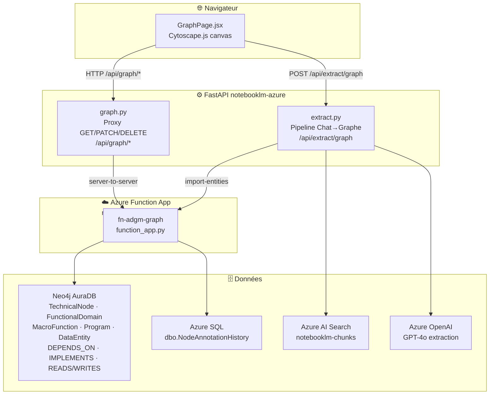

#### III. Composants et responsabilités

**`frontend/src/GraphPage.jsx`**

Composant React (Babel standalone, vendorisé Cytoscape.js) gérant la vue complète :
- Canvas Cytoscape — rendu nœuds/arcs avec stylesheets `STATUS_COLORS`/`R7_COLORS`
- Bi-plan switch (Fonctionnel / Technique / Overlay) — `GET /api/graph/nodes` filtré par `plane`
- Detail panel — `GET /api/graph/nodes/{id}` + `GET /api/graph/nodes/{id}/impact`
- Formulaire annotation 7R — `PATCH /api/graph/nodes/{id}/qualification`
- Cluster highlight — `GET /api/graph/clusters`
- Exports JSON (clusters) et CSV (nœuds non qualifiés)

**`api/routers/graph.py`**

Proxy async `httpx.AsyncClient` → `fn-adgm-graph`. Relaie uniquement les verbes de la surface utilisateur :
- `GET /api/graph/{path}` — consultation (health, nodes, arcs, clusters, impact)
- `PATCH /api/graph/{path}` — qualification 7R
- `DELETE /api/graph/{path}` — reset et nettoyage couche fonctionnelle

Ne relaie **pas** `POST /admin/analyze` ni `POST /admin/import-entities` (administration back-office appelée directement depuis `extract.py`).

**`api/routers/extract.py`**

Pipeline asynchrone Chat→Graphe (pattern `BackgroundTask` + polling, identique à `ingest.py`) :

```
POST /api/extract/graph → 202 { job_id }
GET  /api/extract/graph/{job_id} → { status, docs_total, docs_processed, entities_imported }
```

Étapes internes :
1. `DELETE fn-adgm-graph/admin/functional-entities` — vide la couche fonctionnelle (préserve `:TechnicalNode`)
2. Lecture complète de l'index Azure AI Search (`search_text="*"`, top=5000)
3. Pour chaque document : GPT-4o (prompt structuré → JSON `{system, functional_domains, macro_functions, programs, data_entities, crud_relationships}`)
4. `POST fn-adgm-graph/admin/import-entities` avec le JSON extrait

**`fn-adgm-graph/function_app.py`**

Azure Function Python HTTP trigger gérant toutes les routes ADG-M. Dispatcher manuel sur `(method, parts)`. Backends :
- Neo4j AuraDB via `neo4j` driver (GDS pour SPOF/Louvain)
- Azure SQL via `pyodbc` (historique annotations)

Principaux endpoints :

| Méthode | Route | Description |
|---|---|---|
| GET | `/graph/health` | `{status, neo4j, sql, version}` |
| GET | `/graph/nodes` | Liste nœuds avec filtres plan/7R/SPOF |
| GET | `/graph/nodes/{id}` | Détail nœud + métriques |
| GET | `/graph/nodes/{id}/impact` | Nœuds en aval dans `DEPENDS_ON` |
| GET | `/graph/arcs` | Toutes les relations |
| GET | `/graph/clusters` | Clusters Louvain agrégés (409 si non calculés) |
| PATCH | `/graph/nodes/{id}/qualification` | Mise à jour `candidate7R` + historique SQL |
| POST | `/graph/admin/analyze` | Calcul SPOF (betweenness) + Louvain |
| POST | `/graph/admin/import-entities` | Import entités extraites par GPT-4o |
| DELETE | `/graph/admin/functional-entities` | Supprime `:FunctionalDomain/:MacroFunction/:Program/:DataEntity` |
| DELETE | `/graph/admin/reset` | `MATCH (n) DETACH DELETE n` — reset complet |

#### IV. Modèle de données Neo4j

```
(:TechnicalNode {
    nodeId, name, technology, description,
    candidate7R,          -- UNQUALIFIED|RETAIN|RETIRE|REHOST|REPLATFORM|REPURCHASE|REFACTOR|REARCHITECT
    isSPOF,               -- bool (betweenness > seuil)
    isGhost,              -- bool (aucune relation entrante)
    communityId,          -- int (Louvain, null avant POST /admin/analyze)
    betweenness,          -- float
    inDegree, outDegree
})

(:FunctionalDomain { id, code, name, description })
(:MacroFunction    { id, code, name, mode, description })
(:Program          { name, technology, mode, description })
(:DataEntity       { name, type, description })

(:TechnicalNode)  -[:DEPENDS_ON]->  (:TechnicalNode)
(:MacroFunction)  -[:BELONGS_TO]->  (:FunctionalDomain)
(:Program)        -[:IMPLEMENTS]->  (:MacroFunction)
(:Program)        -[:READS|WRITES|UPDATES|DELETES]-> (:DataEntity)
(:TechnicalNode)  -[:IMPLEMENTS]->  (:Program)
```

Historique des qualifications dans Azure SQL (`dbo.NodeAnnotationHistory`) :

```sql
nodeId VARCHAR(255), previous7R VARCHAR(50), new7R VARCHAR(50),
justification NVARCHAR(1000), source VARCHAR(50), author VARCHAR(255),
createdAt DATETIME2 DEFAULT GETUTCDATE()
```

#### V. Mécanique Reset vs Mise à jour

| Action | Bouton UI | Endpoint | Effet Neo4j |
|---|---|---|---|
| **Reset complet** | "Reset graphe" (orange→rouge, 2 clics) | `DELETE /admin/reset` | `MATCH (n) DETACH DELETE n` — tout effacé |
| **Mise à jour** | "Mettre à jour" (bleu clair→foncé) | `DELETE /admin/functional-entities` puis pipeline extract | Couche fonctionnelle reconstruite ; annotations 7R des `TechnicalNode` préservées |

La mise à jour est **idempotente** : MERGE sur les nœuds techniques permet de relancer sans doublon, et les annotations 7R existantes sont conservées même si de nouveaux documents structurants viennent compléter les liens fonctionnels.

#### VI. Vendoring Cytoscape.js

`cytoscape.min.js` est copié dans `frontend/vendor/` et chargé par `<script>` dans `index.html` (après React/Babel, avant `GraphPage.jsx`). Il expose `window.cytoscape`. Même pattern que `mermaid.min.js` et `marked.min.js` — pas de npm, pas de build step.

#### VII. Troubleshooting

| Symptôme | Cause | Action |
|---|---|---|
| `DELETE /api/graph/admin/reset` → 404 | `"delete"` absent du tableau `methods` dans `function.json` | Vérifier `function.json` — Azure rejette avant d'atteindre Python |
| `GET /api/graph/clusters` → 409 | `communityId` absent des nœuds (Louvain non lancé) | Lancer `POST /api/graph/admin/analyze` |
| ExtractButton bloqué sur "running" | GPT-4o ou `import-entities` en erreur silencieuse | Vérifier les logs uvicorn (`WARNING import-entities returned ...`) |
| `window.cytoscape` undefined | Script non chargé ou ordre incorrect dans `index.html` | Vérifier que `cytoscape.min.js` est avant `GraphPage.jsx` dans `index.html` |
| `sql: "down"` dans `/graph/health` | `SQL_CONNECTION_STRING` au format ADO.NET au lieu de ODBC | Reformater en `Driver={ODBC Driver 18 for SQL Server};Server=tcp:...` |

### F8 — Module Exploration

#### I. Vue d'ensemble

Le **Module Exploration**, troisième onglet de l'interface (`Exploration ArchiMate`, aux côtés de `Chat` et `Graphe ADG-M`), est une interface CRUD complète sur le graphe Neo4j pour les éléments et relations **ArchiMate 3.x** (`:ArchiMateElement`). Il permet de créer, consulter, modifier et supprimer des nœuds et relations à la main — en complément de l'extraction automatique GPT-4o (F7) — avec validations ArchiMate, RBAC par rôle et journal d'audit.

Référence détaillée : `notebooklm-azure/docs/specs/SDD_Exploration_v1.md` et `PLAN_EXPLORATION_v1.md`.

#### II. RBAC — rôles et en-tête `X-User-Role`

Le sélecteur de rôle (`RoleSelector`, persistant en `localStorage`) place un en-tête `X-User-Role` sur chaque appel `explorationApi`. `fn-adgm-graph` (`function_app.py`) applique `require_role(req, ...)` par opération :

| Rôle | Lecture (nœuds/relations/orphelins) | Création/modification/suppression simple | Suppression cascade | Bulk-tag | Audit (`/exploration/audit`) |
|---|---|---|---|---|---|
| `VIEWER` | ✅ | ❌ (403 `AUTH_INSUFFICIENT_ROLE`) | ❌ | ❌ | ❌ |
| `ARCHITECT` | ✅ | ✅ | ❌ (403) | ✅ | ❌ |
| `ADMIN` | ✅ | ✅ | ✅ | ✅ | ✅ |

#### III. Endpoints `/api/graph/exploration/*`

Tous relayés par le proxy `api/routers/graph.py` vers `fn-adgm-graph` (Azure Function).

| Méthode | Route | Description |
|---|---|---|
| GET | `/exploration/nodes` | Liste paginée, filtres `layer`/`elementType`/`aspect`/`name`/`tags`/`orphansOnly` |
| GET | `/exploration/nodes/{id}` | Détail nœud + relations entrantes/sortantes |
| POST | `/exploration/nodes` | Création (ARCHITECT/ADMIN) |
| PATCH | `/exploration/nodes/{id}` | Modification (ARCHITECT/ADMIN) |
| DELETE | `/exploration/nodes/{id}` | Suppression — `?cascade=true` requiert ADMIN ; sans cascade, 409 `NODE_HAS_RELATIONS` si `relCount > 0` |
| GET | `/exploration/orphans` | Nœuds sans aucune relation |
| POST | `/exploration/nodes/bulk-tag` | Ajout/retrait d'un tag sur une liste de nœuds (ARCHITECT/ADMIN) |
| GET | `/exploration/relations` | Liste paginée, filtres `relationType`/`sourceId`/`targetId`/`sourceLayer`/`targetLayer` |
| GET | `/exploration/relations/{id}` | Détail relation |
| POST | `/exploration/relations` | Création — valide ArchiMate (VAL-03/05/06/07/08), `confirmWarnings` pour outrepasser un avertissement 422 `ARCHIMATE_WARN` |
| PATCH | `/exploration/relations/{id}` | Modification (`name`, `description`, `weight`, `accessType`) |
| DELETE | `/exploration/relations/{id}` | Suppression directe |
| GET | `/exploration/audit` | Journal `:AuditLog` (ADMIN) — filtres `entityId`/`entityType`/`operation`/`userId`/`since` |
| GET | `/exploration/health` | Healthcheck |

#### IV. Journal d'audit (`:AuditLog`)

Chaque mutation (création/modification/suppression de nœud ou relation, suppression cascade, bulk-tag) écrit, dans la **même transaction Neo4j**, un nœud `:AuditLog { id, operation, entityType, entityId, userId, userRole, payload, timestamp, ipAddress }` via `_exploration_write_audit`. `payload` est un JSON `{before, after}` (`after: null` pour une suppression, `before: null` pour une création). `ipAddress` est masquée sur les deux derniers octets (`_exploration_client_ip`).

`operation` ∈ `CREATE | UPDATE | DELETE | DELETE_CASCADE`. Pour `DELETE_CASCADE`, `payload.after.relCount` indique le nombre de relations supprimées avec le nœud.

Consultable via la vue **Audit** (onglet visible uniquement pour `ADMIN`), avec filtres opération/type/ID/date et détail JSON dépliable par ligne.

#### V. Invalidation cross-onglets

Toute mutation Exploration émet `window.dispatchEvent(new CustomEvent('adgm:graph-changed'))`. `GraphPage.jsx` écoute cet événement et incrémente son `refreshKey`, déclenchant un refetch de `/graph/nodes` et `/graph/arcs` — sans rechargement de page (cf. `frontend/tests/e2e/exploration_cross_tab.md`).

#### VI. Gestion des erreurs (toasts)

`explorationApi.handleApiError(err)` normalise toute erreur HTTP en `{ message, retryable, retryAfter }` (cf. SDD §7) :

- **403 / 404** (formulaires nœud/relation) : toast rouge + fermeture du formulaire (retour à la liste/détail) ; un 404 déclenche aussi `adgm:graph-changed`.
- **404** (consultation détail nœud) : toast + retour automatique à la liste.
- **500 / 503** : toast + bannière d'erreur inline avec bouton **Réessayer** (relance le `load()` du composant).
- **429** : toast incluant le délai `Retry-After` si fourni par le serveur.
- Erreur réseau (pas de réponse) : traitée comme 503 — toast + bouton Réessayer.

Les toasts sont émis via l'événement `adgm:toast` (même convention que `adgm:graph-changed`) et affichés par `<ToastStack>` dans `ExplorationPage.jsx`, avec auto-dismiss après 6 s.

#### VII. Composants frontend (`frontend/src/ExplorationPage.jsx`)

| Composant | Rôle |
|---|---|
| `NodeListView` | Liste filtrable des nœuds, sélection multiple + bulk-tag (ARCHITECT/ADMIN) |
| `NodeDetailView` | Détail nœud, relations entrantes/sortantes, actions édition/suppression |
| `NodeFormView` | Création/édition d'un nœud (couche, type, aspect, tags, stéréotype, métadonnées) |
| `OrphanListView` | Nœuds sans relation (N7) |
| `RelListView` / `RelFormView` | Liste et formulaire de relations, avec avertissements ArchiMate (422) |
| `AuditListView` | Journal d'audit (ADMIN uniquement) |
| `DeleteConfirmModal` / `DeleteRelationConfirmModal` | Confirmation de suppression, avec option cascade pour ADMIN |
| `ToastStack` | Notifications transversales (succès implicite via fermeture, erreurs via toasts) |
