# Dossier d'Architecture — NotebookLM Azure

> **Projet** : Agent documentaire RAG sur Azure  
> **Auteur** : Vincent Gicquiau — Lead Solution Architect  
> **Date** : Juin 2026  
> **Version** : 1.2

---

## Table des matières

1. [Vue d'ensemble](#1-vue-densemble)
2. [Architecture fonctionnelle](#2-architecture-fonctionnelle)
3. [Architecture technique](#3-architecture-technique)
4. [Pipeline d'ingestion documentaire](#4-pipeline-dingestion-documentaire)
5. [Pipeline de requête (RAG)](#5-pipeline-de-requête-rag)
6. [Interface utilisateur](#6-interface-utilisateur)
7. [Sécurité et identité](#7-sécurité-et-identité)
8. [Infrastructure Azure](#8-infrastructure-azure)
9. [Choix techniques et justifications](#9-choix-techniques-et-justifications)
10. [Limites et axes d'amélioration](#10-limites-et-axes-damélioration)
11. [Spécifications des fonctionnalités](#11-spécifications-des-fonctionnalités)
    - [F1 — Chat RAG](#f1--chat-rag)
    - [F2 — Modes d'analyse](#f2--modes-danalyse)
    - [F3 — Rail de notes](#f3--rail-de-notes)
    - [F4 — Injection de notes dans le contexte](#f4--injection-de-notes-dans-le-contexte)
    - [F5 — Viewer de citation](#f5--viewer-de-citation)
    - [F6 — Upload de document](#f6--upload-de-document)
    - [F7 — Legacy KB](#f7--legacy-kb)

---

## 1. Vue d'ensemble

### Qu'est-ce que c'est ?

NotebookLM Azure est un **agent de question-réponse documentaire** inspiré de Google NotebookLM. Il permet d'interroger en langage naturel un corpus de documents techniques (cahiers des charges, spécifications, règles métier, annexes) et d'obtenir des réponses sourcées, structurées et corrélées entre plusieurs documents.

### Quel problème résout-il ?

Dans un programme de modernisation applicative, l'équipe accumule des dizaines de documents hétérogènes — spécifications fonctionnelles, documentation legacy, rapports d'audit, politiques de sécurité. Les retrouver, les croiser et en extraire des synthèses est une tâche longue et manuelle.

Cet agent permet de :
- Poser des questions en français sur l'ensemble du corpus
- Obtenir des réponses avec les références exactes (fichier + page + section)
- Générer des synthèses, inventaires, matrices et diagrammes à la demande
- Faire corréler automatiquement des informations disséminées dans plusieurs sources

### Positionnement par rapport à NotebookLM (Google)

| Critère | Google NotebookLM | NotebookLM Azure |
|---|---|---|
| Modèle | Gemini 1.5/2.0 Pro | GPT-4o (Azure OpenAI) |
| Contexte | ~1M tokens (corpus entier en mémoire) | RAG — 5 à 20 extraits par requête |
| Données | Cloud Google | Azure — données souveraines |
| Auth | Compte Google | Entra ID / Managed Identity |
| Personnalisation | Aucune | System prompt, modes, UI customisables |
| Coût | Abonnement Google One | Pay-as-you-go Azure |

---

## 2. Architecture fonctionnelle

### Blocs fonctionnels

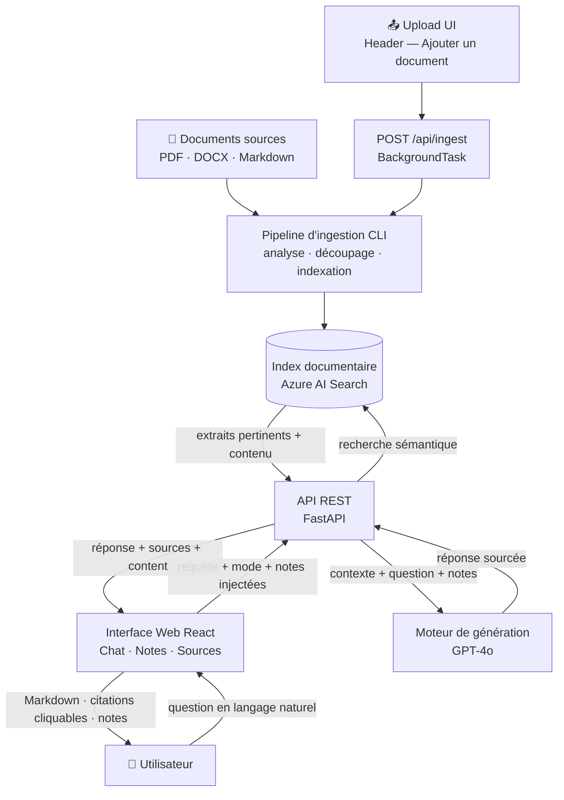

### Parcours utilisateur

**1. Ingestion — deux modes possibles**

*Mode CLI (lot de documents) :*
- L'administrateur dépose des documents dans le dossier `documents/`
- Lance le script `ingest.py`
- Les documents sont analysés, découpés, transformés en vecteurs et indexés
- Les documents déjà indexés sont automatiquement ignorés (déduplication par hash SHA-256)

*Mode UI (document à la volée) :*
- L'utilisateur clique sur **"Ajouter un document"** dans le bandeau supérieur
- Sélectionne un fichier PDF, DOCX ou Markdown (max 50 Mo)
- L'upload part immédiatement ; un toast de progression apparaît en bas à droite
- L'ingestion tourne en arrière-plan (`BackgroundTask`) : extraction → chunks → embeddings → indexation
- Toast final : nombre de chunks indexés, ou message d'erreur si échec

**2. Interrogation (usage quotidien)**
- L'utilisateur ouvre l'interface web
- Choisit un mode d'analyse : Rapide / Standard / Approfondi
- Pose sa question en langage naturel
- Reçoit une réponse structurée avec badges de citation `[N]` cliquables
- Peut cliquer sur un badge `[N]` ou une fiche source pour lire le passage exact extrait du document
- Peut **enregistrer une réponse** comme note dans le rail droit, ou **créer une note manuelle**
- Peut **épingler des notes** pour les injecter dans le contexte des prochaines questions
- Peut copier le Markdown brut pour Notion, Confluence ou tout éditeur

---

## 3. Architecture technique

### Vue d'ensemble des composants

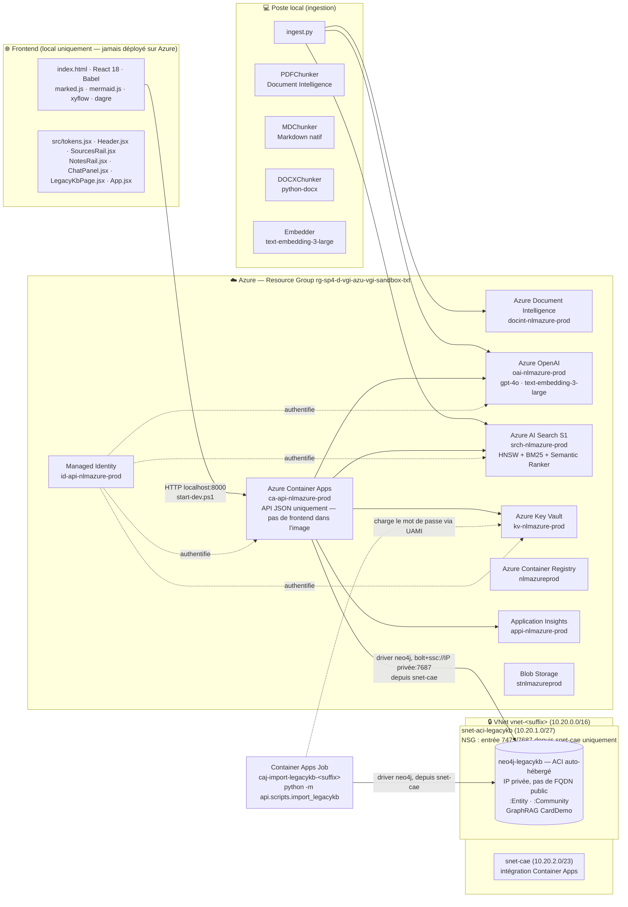

### Stack technologique

| Couche | Technologie | Version |
|---|---|---|
| **Framework UI** | React 18 (CDN, sans étape de build) | 18.x |
| **Transpilation JSX** | Babel Standalone (CDN) | — |
| **Rendu Markdown** | marked.js | 9.x |
| **Rendu diagrammes** | mermaid.js | 11.x |
| **Rendu graphe Legacy KB** | React Flow (`@xyflow/react`) + dagre | vendorisés en UMD |
| **Sanitisation HTML** | DOMPurify | — |
| **Police + design tokens** | Hanken Grotesk + objet `T` centralisé | — |
| **Persistence client** | localStorage (notes + session_id) | — |
| **Upload fichier** | FormData + polling SSE simplifié | — |
| **API backend** | FastAPI | 0.11x |
| **Upload multipart** | python-multipart | — |
| **Serveur ASGI** | Uvicorn | — |
| **SDK Azure** | azure-sdk-for-python | dernière stable |
| **Authentification** | azure-identity (DefaultAzureCredential) | — |
| **Embeddings** | Azure OpenAI text-embedding-3-large | dim. 3072 |
| **LLM** | Azure OpenAI GPT-4o | 2024-11-20 |
| **Recherche** | Azure AI Search (SDK Python) | — |
| **Extraction PDF** | Azure Document Intelligence prebuilt-layout | — |
| **Tokenisation** | tiktoken cl100k_base | — |
| **Base de connaissances Legacy KB** | Neo4j auto-hébergé sur Azure Container Instances (`neo4j-legacykb`, driver Python `neo4j`), réseau privé (VNet) | golden source, lecture seule |
| **Persistance des sessions** | SQLite (`api/data/chat_history.db`) | historique conversationnel durable |
| **Rate limiting** | Fenêtre glissante 60 s, 20 req/IP en mémoire | `api/services/rate_limiter.py` |
| **Infrastructure** | Bicep (IaC) | — |
| **Conteneur** | Docker / Azure Container Apps | — |
| **Monitoring** | Application Insights | — |

---

## 4. Pipeline d'ingestion documentaire

L'ingestion transforme des fichiers bruts en fragments vectorisés indexés dans Azure AI Search.

### Schéma du pipeline

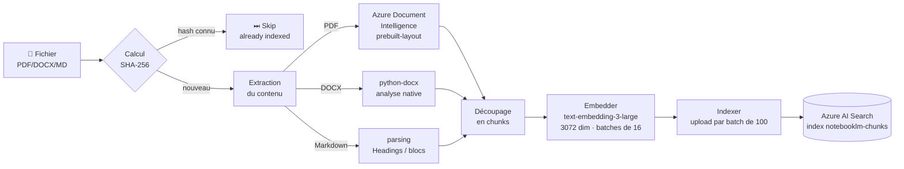

### Stratégie de découpage (chunking)

Le découpage est la clé de la qualité de la recherche. Une stratégie trop grossière noie l'information pertinente ; trop fine, elle perd le contexte.

**Paramètres appliqués :**
- Taille cible : **1 000 tokens** (unité : token tiktoken cl100k_base)
- Recouvrement : **200 tokens** entre chunks consécutifs
- Raison du recouvrement : garantir que les phrases à cheval sur deux chunks restent accessibles par les deux

**Traitement spécifique PDF (Document Intelligence) :**
1. L'API `prebuilt-layout` analyse le PDF et renvoie des paragraphes structurés avec rôles (`title`, `sectionHeading`, `paragraph`)
2. Le chunker regroupe les paragraphes consécutifs jusqu'à 1 000 tokens
3. Il suit les headings pour propager `section` et `title` à chaque chunk
4. Un paragraphe > 1 000 tokens est lui-même subdivisé avec recouvrement

**Métadonnées indexées par chunk :**

| Champ | Type | Usage |
|---|---|---|
| `id` | `{file_hash}_{chunk_index}` | Clé unique, idempotente |
| `content` | texte brut | Recherche BM25 + affichage |
| `content_vector` | float[3072] | Recherche vectorielle HNSW |
| `source_file` | nom du fichier | Citation dans les réponses |
| `page_number` | entier | Citation précise page |
| `section` | texte | Citation section + reranking |
| `title` | texte | Reranking sémantique |
| `file_hash` | SHA-256 | Déduplication |
| `created_at` | datetime | Audit, gestion des versions |

### Déduplication

À chaque lancement, `ingest.py` récupère l'ensemble des `file_hash` déjà présents dans l'index. Si le hash d'un fichier est connu, le fichier est ignoré. Cela permet de relancer l'ingestion sans doublon même si de nouveaux fichiers sont ajoutés au dossier.

Pour forcer la réingestion d'un fichier (après modification), utiliser `--force-reindex`.

---

## 5. Pipeline de requête (RAG)

RAG = **Retrieval-Augmented Generation** — le modèle de langage ne répond pas depuis sa mémoire mais depuis des extraits retrouvés en temps réel dans l'index.

### Schéma du pipeline

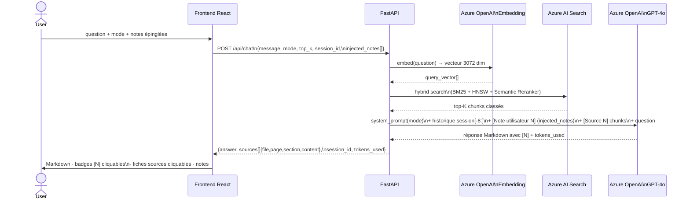

### Endpoints API

| Méthode | Route | Description | Corps / Paramètres |
|---|---|---|---|
| `POST` | `/api/chat` | Requête RAG — génère une réponse sourcée | `{message, mode, top_k, session_id?, injected_notes[]}` |
| `GET` | `/api/chat/history/{session_id}` | Ré-hydrate l'historique complet d'une session (frontend reload) | — → `{messages[], summary}` |
| `POST` | `/api/chat/clear` | Purge l'historique d'une session | `{session_id}` |
| `POST` | `/api/ingest` | Upload + lancement de l'ingestion (202) | `multipart/form-data` — champ `file` (PDF/DOCX/PPTX/XLSX/MD/TXT/code, max 50 Mo) |
| `GET` | `/api/ingest/{job_id}` | Polling du statut d'un job d'ingestion | — → `{job_id, status, filename, message, chunks}` |
| `GET` | `/api/legacykb/*` | Lecture du graphe `neo4j-legacykb` (santé, stats, domaines, recherche, voisinage) — voir F7 | — |
| `GET` | `/health` | Health check | — → `{status: "ok"}` |

### Tool-calling Legacy KB

En complément de la recherche RAG dans Azure AI Search, GPT-4o dispose de trois tools function-calling (`LEGACYKB_TOOL_DEFINITIONS`, `api/services/graph_tools.py`) donnant un accès en lecture au graphe `neo4j-legacykb` : `legacykb_search`, `legacykb_get_entity`, `legacykb_get_relations`. Le modèle les invoque lui-même (`tool_choice="auto"`) lorsque la question porte sur un programme, copybook, batch job ou domaine fonctionnel CardDemo. Chaque appel de tool est tracé et renvoyé au frontend dans `ChatResponse.graph_references` pour traçabilité.

### Recherche hybride dans Azure AI Search

La recherche combine trois mécanismes complémentaires fusionnés par **RRF (Reciprocal Rank Fusion)** :

```
Score final = RRF(BM25_score, HNSW_score) → reranking sémantique → top-K
```

| Mécanisme | Principe | Force |
|---|---|---|
| **BM25** | Correspondance lexicale (mots-clés exacts, fréquence) | Acronymes, noms propres, termes techniques |
| **HNSW** | Similarité cosinus entre vecteurs 3072 dim | Synonymes, paraphrases, intentions |
| **Semantic Ranker** | Modèle de reranking Microsoft sur le texte brut | Pertinence contextuelle fine |

L'index HNSW est configuré avec :
- `m = 4` (connexions par nœud) — compromis mémoire/précision
- `ef_construction = 400` — précision à la construction
- `ef_search = 500` — précision à la recherche
- Métrique : **cosinus** (standard pour embeddings de texte normalisés)

### Modes d'analyse

Les trois modes ajustent simultanément le comportement du LLM et la quantité de contexte injectée :

| Mode | top_k | max_tokens | temperature | Usage typique |
|---|---|---|---|---|
| ⚡ **Rapide** | 5 | 600 | 0.2 | Question factuelle simple ("c'est quoi X ?") |
| 📋 **Standard** | 10 | 2 000 | 0.3 | Usage quotidien, réponses structurées sourcées |
| 🔬 **Approfondi** | 20 | 4 000 | 0.3 | Inventaires, corrélations multi-sources, diagrammes |

### Mémoire conversationnelle

Chaque session est identifiée par un `session_id` UUID généré côté serveur. L'historique est **persisté dans SQLite** (`api/data/chat_history.db`) et survit aux redémarrages de l'application. Les sessions inactives depuis plus de 24 h sont automatiquement purgées (`SESSION_TTL_SECONDS = 86 400`).

À chaque requête, tous les messages **non compactés** de la session sont envoyés au LLM. Un mécanisme de **compaction glissante** (`api/services/compactor.py`) évite la croissance illimitée du contexte :

- Déclenchement : dès que la session dépasse **12 tours non compactés** (24 messages)
- Compaction : les **4 tours les plus anciens** (8 messages) sont résumés par le LLM (mode peu coûteux) et fusionnés dans `sessions.summary_text`
- Les messages compactés restent en base (affichage UI / export) mais ne sont plus envoyés au LLM
- Échec silencieux : la compaction est best-effort et ne bloque jamais une requête de chat

L'historique complet d'une session peut être ré-hydraté par le frontend après un reload de page via `GET /api/chat/history/{session_id}`.

**Rate limiting** : l'endpoint `/api/chat` est limité à **20 requêtes par IP sur 60 secondes** (fenêtre glissante en mémoire, `api/services/rate_limiter.py`). Dépassement → HTTP 429.

---

## 6. Interface utilisateur

### Structure de l'application web

L'UI est une **Single Page Application React 18** servie statiquement par le même Container App que l'API. Elle utilise React via CDN avec Babel Standalone pour transpiler le JSX à la volée — **aucune étape de build** (`npm`, `webpack`, `vite`) n'est nécessaire.

```
frontend/
├── index.html          — point d'entrée : dépendances vendorisées (React/ReactDOM/Babel/
│                          marked/mermaid/DOMPurify/xyflow/dagre), CSS global (design
│                          tokens, .nlaz-md, .nlaz-cite, mermaid)
├── vendor/             — dépendances JS vendorisées localement (SEC-008, pas de CDN)
└── src/
    ├── tokens.jsx      — design tokens (objet T), icônes SVG (Ic.*), Logo,
    │                      composant MarkdownContent
    ├── Header.jsx      — bandeau supérieur : nouvelle conversation, bascule de vue
    │                      (Chat / Legacy KB)
    ├── SourcesRail.jsx — rail gauche : sources indexées, upload, suivi d'ingestion
    ├── NotesRail.jsx   — rail droit : NoteCard (hover → supprimer/épingler),
    │                      NoteModal (portal plein écran), bouton "Nouvelle note"
    ├── ChatPanel.jsx   — panneau chat : messages, saisie, ModeSelector,
    │                      CitationModal (portal), bandeau notes injectées
    ├── LegacyKbPage.jsx — vue Legacy KB : graphe React Flow/dagre du dump
    │                      GraphRAG `neo4j-legacykb` (golden source, lecture seule)
    └── App.jsx         — état global, vue active (chat|legacykb), logique
                           sendMessage/notes/ingestion, IngestToast (portal)
```

> **Pattern cross-scripts** : chaque fichier `.jsx` exporte ses symboles vers `window` via `Object.assign(window, {...})`. Les scripts chargés ensuite y accèdent comme globals. Ce pattern contourne la limitation de Babel Standalone qui transpile chaque `<script>` dans un scope isolé.

### Architecture des composants React

```
App
├── IngestToast (portal → document.body)
├── Header
│   └── bascule de vue (Chat / Legacy KB)
├── (vue "chat")
│   ├── SourcesRail
│   │   └── <input type="file"> caché — upload + suivi d'ingestion
│   ├── ChatPanel
│   │   ├── AssistantMessage
│   │   │   ├── CitationModal (portal → document.body, conditionnel)
│   │   │   ├── MarkdownContent  ← event delegation sur .nlaz-cite,
│   │   │   │     surlignage du passage cité (highlightText)
│   │   │   └── SourceCard (regroupée par source, badges [N] multiples)
│   │   ├── ModeSelector
│   │   └── barre notes injectées (pinnedNotes)
│   └── NotesRail
│       ├── NoteCard (hover state au niveau carte)
│       └── NoteModal (portal → document.body, conditionnel)
└── (vue "legacykb")
    └── LegacyKbPage
        ├── LegacyKbCanvas (React Flow — nœuds :Entity/:Community, layout force-directed d3-force)
        ├── NodeContextMenu (recentrer la vue, recentrer la disposition, retirer)
        ├── NodeDetailPanel (résumé, relations, tags techniques)
        └── DomainBreadcrumb (navigation par domaine fonctionnel)
```

### Fonctionnalités

| Fonctionnalité | Implémentation |
|---|---|
| Rendu Markdown complet | `MarkdownContent` → marked.js (GFM : headers, tables, listes, code, blockquotes) |
| Diagrammes Mermaid | `useEffect` post-render — détecte `code.language-mermaid`, appelle `mermaid.render()` |
| 3 modes d'analyse | `ModeSelector` — ajuste `top_k` (5/10/20) et `max_tokens` (600/2000/4000) |
| Indicateur du mode utilisé | Tag coloré sur chaque message utilisateur |
| Citations filtrées et regroupées | Seules les sources dont le numéro `[N]` apparaît dans le texte sont affichées ; une même source citée sous plusieurs `[N]` n'apparaît qu'une fois, avec un badge par numéro |
| Badges de citation inline | Les références `[N]` du texte sont converties en vignettes `.nlaz-cite` cliquables après le rendu Markdown |
| Viewer de citation | Clic sur un badge `[N]` ou une fiche source → `CitationModal` avec texte complet du chunk, passage cité surligné et centré |
| Legacy KB | Vue graphe (React Flow/dagre) du dump GraphRAG `neo4j-legacykb` — exploration par domaine, recherche, recentrage/redisposition de la vue (voir F7) |
| Copie Markdown brut | Bouton "Copier" — clipboard API |
| Rail de notes | Enregistrement d'une réponse + création manuelle ; survol → bouton supprimer |
| Modale de note | Clic sur une note → overlay Notion-style (portal) avec texte complet |
| Injection de notes | Épingler une note → `injected_notes[]` envoyé dans chaque requête suivante |
| Bandeau notes actives | Rappel visuel des notes épinglées au-dessus de la saisie, clic pour désépingler |
| Upload de document | Bouton "Ajouter un document" → `FormData POST /api/ingest` → polling `GET /api/ingest/{job_id}` |
| Toast d'ingestion | Progression temps réel (pending → running → done/error) avec auto-dismiss succès 6s |
| Persistance locale | Notes et `session_id` conservés dans `localStorage` (survie au reload) |
| Nouvelle conversation | Purge l'historique serveur (`POST /api/chat/clear`) + reset état local |

---

## 7. Sécurité et identité

### Principe : zéro secret dans le code ou les images Docker

**Aucune clé secrète n'est stockée dans le code, les images Docker, ni les variables d'environnement de production.** Deux couches de sécurité coexistent :

1. **Authentification inter-services Azure** : Managed Identity — zéro clé d'API Azure dans le code
2. **Authentification client → API** : clé partagée `API_KEY` stockée dans Key Vault, chargée au démarrage

### Architecture d'identité

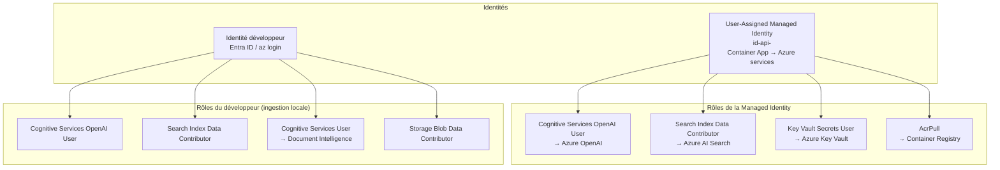

### DefaultAzureCredential — chaîne de credentials

En local, le SDK Azure utilise `DefaultAzureCredential` qui essaie les providers dans cet ordre :

1. `EnvironmentCredential` — variables d'env (non configurées → skip)
2. `ManagedIdentityCredential` — IMDS endpoint (non disponible en local → skip)
3. `AzureCliCredential` ✅ — token `az login` — **utilisé en local**
4. En production (Container Apps) : `ManagedIdentityCredential` ✅ via `AZURE_CLIENT_ID`

### Chargement des secrets depuis Key Vault (lifespan)

Au démarrage de l'API (lifespan FastAPI), `_load_secrets_from_keyvault()` charge les secrets Key Vault dans les variables d'environnement du processus :

| Secret Key Vault | Variable d'environnement |
|------------------|--------------------------|
| `openai-endpoint` | `AZURE_OPENAI_ENDPOINT` |
| `search-endpoint` | `AZURE_SEARCH_ENDPOINT` |
| `docint-endpoint` | `AZURE_DOCINT_ENDPOINT` |
| `storage-account-name` | `AZURE_STORAGE_ACCOUNT_NAME` |
| `neo4j-legacykb-password` | `NEO4J_LEGACYKB_PASSWORD` |
| `api-key` | `API_KEY` |

Ce chargement ne se déclenche que si `AZURE_KEYVAULT_URI` est défini (injecté par Bicep dans les variables d'environnement du Container App). En local, les variables sont lues directement depuis `.env`.

### Authentification client → API (`APIKeyMiddleware`)

Tous les endpoints `/api/*` sont protégés par une clé partagée. Le middleware lit `API_KEY` **lazily** à chaque requête (pas à l'initialisation), ce qui garantit que la valeur chargée depuis Key Vault au startup est bien utilisée.

- Header accepté : `X-API-Key: <key>` ou `Authorization: Bearer <key>`
- Si `API_KEY` est vide : accès libre (mode développement local non configuré)
- Routes exclues : `/health` (probe de liveness)

**Livraison de l'API Key au frontend** : en local, la clé est injectée dynamiquement à la volée dans `index.html` sous forme d'une balise `<meta name="nlaz-api-key" content="…">` (endpoint `GET /`). Cette route et le mount `StaticFiles` ne sont actifs qu'en local — l'image Docker déployée sur Azure ne contient pas `frontend/` (cf. `api/Dockerfile`), donc en production le Container App ne sert que l'API JSON, sans page web ni injection de clé dans du HTML public (cf. [docs/specs/SECURITY_AUDIT.md](docs/specs/SECURITY_AUDIT.md)).

### Headers de sécurité HTTP (`SecurityHeadersMiddleware`)

Ajouté sur toutes les réponses de l'API :

| Header | Valeur | Objectif |
|--------|--------|----------|
| `X-Content-Type-Options` | `nosniff` | Prévenir le MIME-sniffing |
| `X-Frame-Options` | `DENY` | Bloquer le clickjacking |
| `Referrer-Policy` | `strict-origin-when-cross-origin` | Limiter les fuites d'URL |
| `Permissions-Policy` | `geolocation=(), microphone=(), camera=()` | Désactiver les APIs navigateur non utilisées |
| `Content-Security-Policy` | `default-src 'self'; script-src 'self' 'unsafe-inline' 'unsafe-eval'…` | Bloquer les injections XSS ; `unsafe-eval`/`unsafe-inline` requis par Babel Standalone |
| `Strict-Transport-Security` | `max-age=31536000; includeSubDomains` | Forcer HTTPS (ignoré silencieusement sur HTTP local) |

### CORS — accès cross-origin du frontend local à `ca-api`

Depuis que `neo4j-legacykb` n'a plus d'IP publique (réseau privé, voir section 8), le backend local
(`start-dev.ps1`) ne peut plus l'atteindre — seul `ca-api` (intégré au VNet) le peut. Le frontend
local appelle donc `ca-api` **directement, en cross-origin**, pour les routes `/api/legacykb/*`
(c'est aussi le seul moyen de parcourir visuellement le graphe : l'image Docker déployée ne contient
jamais le frontend). Ce contournement nécessite trois ajustements :

- **`CORSMiddleware`** activé sur `ca-api` uniquement si le paramètre Bicep `corsAllowedOrigins`
  (défaut `http://127.0.0.1:8000`) est non vide — `os.environ["CORS_ALLOWED_ORIGINS"]`, liste
  d'origines séparées par des virgules
- **Requêtes `OPTIONS` (préflight CORS) laissées passer sans authentification** dans
  `APIKeyMiddleware` — sans ce contournement, Starlette retourne 401 au préflight et le navigateur
  bloque la vraie requête avant même qu'elle ne parte
- **CSP `connect-src`** ajustée pour inclure l'origine `NOTEBOOKLM_API_URL` (FQDN de `ca-api`)
  quand cette variable est définie — sinon le navigateur bloque l'appel cross-origin même avec
  CORS correct (politique distincte). N'a d'effet qu'en local — cette route ne s'exécute jamais en
  production
- **Balise `<meta name="nlaz-legacykb-api-url">`** injectée par `api/main.py` (route locale
  uniquement, depuis `NOTEBOOKLM_API_URL`) et lue par `Header.jsx`/`LegacyKbPage.jsx` pour
  construire l'URL de base des appels `/api/legacykb/*` — fallback sur l'origine locale (same-origin)
  si la variable n'est pas définie

### Contrôle d'accès Azure OpenAI

`disableLocalAuth: true` est configuré sur le compte Azure OpenAI — les clés d'API Azure sont désactivées au niveau du service. Seule l'authentification Entra ID (tokens Bearer) est acceptée.

### Isolation des secrets dans l'image Docker

Le fichier `.dockerignore` exclut `**/.env` du contexte de build. L'image ne contient donc aucun secret. En production, les variables d'environnement proviennent exclusivement de la configuration du Container App (injectée par Bicep) et de Key Vault (chargé au startup).

---

## 8. Infrastructure Azure

### Ressources déployées

Convention de nommage : `{type}-{projectName}-{env}`. Région par défaut : `swedencentral`.

| Ressource | Nom (exemple `nlmavgi-prod`) | SKU/Tier | Rôle |
|---|---|---|---|
| Azure OpenAI | `oai-nlmavgi-prod` | S0 | Embeddings (text-embedding-3-large) + Chat (gpt-4o) |
| Azure AI Search | `srch-nlmavgi-prod` | Standard S1 | Index vectoriel + BM25 + Semantic Ranker |
| Azure Document Intelligence | `di-nlmavgi-prod` | S0 | Extraction et analyse structurelle des PDF |
| Azure Key Vault | `kv-nlmavgi-prod` | Standard | Secrets (endpoints, api-key, neo4j-password) |
| Azure Container Registry | `acrnlmavgiprod` | Basic | Images Docker de l'API |
| VNet | `vnet-nlmavgi-prod` | 10.20.0.0/16 | Réseau privé — sous-réseaux `snet-aci-legacykb` (10.20.1.0/27) et `snet-cae` (10.20.2.0/23) |
| NSG | `nsg-aci-legacykb-nlmavgi-prod` | — | Sur `snet-aci-legacykb` — autorise uniquement `snet-cae` en entrée (7473/7687), deny-all sinon |
| Container Apps Environment | `cae-nlmavgi-prod` | — | Environnement managé hébergeant le Container App, intégré au VNet (`snet-cae`) |
| Azure Container App | `ca-api-nlmavgi-prod` | 0.5 vCPU / 1Gi | API FastAPI uniquement (JSON) — pas de frontend, pas de page web publique. Ingress externe public inchangé (FQDN) |
| Container Apps Job | `caj-import-legacykb-nlmavgi-prod` | 0.5 vCPU / 1Gi | Exécution ponctuelle de l'import GraphML (`python -m api.scripts.import_legacykb`), déclenchée par `import-neo4j-legacykb.ps1` — seul process autorisé (avec `ca-api`) à atteindre `neo4j-legacykb` |
| Blob Storage | `stnlmavgiprod` | Standard LRS | Documents sources |
| Application Insights | `appi-nlmavgi-prod` | — | Monitoring, traces, logs |
| Managed Identity | `id-api-nlmavgi-prod` | User-Assigned | Identité du Container App (et du Job) pour les appels Azure |
| ACI neo4j-legacykb | `aci-neo4j-legacykb-nlmavgi-prod` | (ACI) | Base graphe GraphRAG CardDemo (golden source), déployée dans `snet-aci-legacykb` — IP privée uniquement, aucune IP publique ni FQDN |

> L'ACI neo4j-legacykb est déployé conditionnellement (`deployLegacyKb=true`). Si une instance externe est fournie via `-Neo4jUri`, l'ACI n'est pas créé.

### Déploiements Azure OpenAI

| Modèle | Deployment name | Capacité | Usage |
|---|---|---|---|
| `gpt-4o` (2024-11-20) | `gpt-4o` | 30K TPM | Génération des réponses |
| `text-embedding-3-large` (v1) | `text-embedding-3-large` | 100K TPM | Vectorisation des chunks et des requêtes |

### Infrastructure as Code (Bicep)

```
infra/
├── main.bicep                  — orchestration, params, rôles IAM, secrets KV, tags obligatoires
├── main.parameters.json        — valeurs par défaut (non commité en prod)
└── modules/
    ├── network.bicep           — VNet + sous-réseaux snet-aci-legacykb/snet-cae + NSG
    ├── containerapp.bicep      — Container Apps (env managé, intégré VNet) + UAMI + Container App
    │                             ca-api + Container Apps Job caj-import-legacykb + variables d'env
    │                             (KV URI, neo4j URI, CORS…)
    ├── openai.bicep            — Azure OpenAI + déploiements GPT-4o + Embeddings
    ├── search.bicep            — Azure AI Search S1 + semantic search
    ├── keyvault.bicep          — Key Vault RBAC + accès déployeur
    ├── neo4j-legacykb.bicep    — ACI neo4j (déploiement conditionnel), réseau privé (snet-aci-legacykb)
    ├── docint.bicep            — Document Intelligence
    ├── storage.bicep           — Blob Storage
    ├── registry.bicep          — Container Registry
    └── monitoring.bicep        — Application Insights + Log Analytics
```

**Paramètres Bicep principaux :**

| Paramètre | Défaut | Description |
|-----------|--------|-------------|
| `projectName` | `nlmazure` | Préfixe de nommage (3-8 chars lowercase) |
| `environment` | `prod` | Suffixe d'environnement |
| `location` | région du RG | Région Azure |
| `deployerObjectId` | *(requis)* | Object ID AAD du déployeur — droits Key Vault |
| `apiImageTag` | placeholder | Image Docker du Container App |
| `deployLegacyKb` | `true` | Crée l'ACI neo4j-legacykb |
| `neo4jLegacyKbPassword` | `''` | Mot de passe neo4j (→ KV secret) |
| `neo4jLegacyKbUri` | `''` | URI `bolt+ssc://` externe si `deployLegacyKb=false`, ou IP privée de l'ACI sinon (sortie du module `neo4j-legacykb.bicep`) |
| `apiKey` | `''` | Clé API (→ KV secret `api-key`) |
| `corsAllowedOrigins` | `http://127.0.0.1:8000` | Origines CORS autorisées sur `ca-api`, séparées par des virgules — permet au frontend local d'appeler `/api/legacykb/*` en cross-origin (voir section 7, CORS) |

**Déploiement via `deploy.ps1` (recommandé) :**
```powershell
.\deploy.ps1 -SkipSSL
```

**Déploiement manuel (avancé) :**
```powershell
$deployerObjectId = az ad signed-in-user show --query id -o tsv
az deployment group create `
  --resource-group rg-nlmazure-prod `
  --template-file infra/main.bicep `
  --parameters infra/main.parameters.json `
              deployerObjectId=$deployerObjectId `
              neo4jLegacyKbPassword="monMotDePasse" `
              apiKey="maClefApi"
```

---

## 9. Choix techniques et justifications

### Pourquoi Azure AI Search S1 (et non S0) ?

Le **Semantic Ranker** n'est disponible qu'à partir du tier **Standard S1**. Ce composant est critique : il reranke les résultats de la recherche hybride (BM25 + HNSW) avec un modèle de langage léger, ce qui améliore significativement la pertinence des chunks transmis au LLM.

Sans Semantic Ranker, les chunks récupérés correspondraient aux mots-clés et aux vecteurs les plus proches, mais pas nécessairement aux extraits les plus utiles pour répondre à la question.

### Pourquoi text-embedding-3-large avec 3072 dimensions ?

`text-embedding-3-large` est le modèle d'embedding le plus performant d'OpenAI sur les benchmarks MTEB (Massive Text Embedding Benchmark). Les 3 072 dimensions (vs 1 536 pour `text-embedding-3-small`) capturent des nuances sémantiques plus fines, ce qui est important pour des documents techniques avec un vocabulaire métier spécialisé.

Contrepartie : les vecteurs sont 2× plus lourds en stockage et la recherche HNSW est légèrement plus lente.

### Pourquoi la recherche hybride (BM25 + HNSW) ?

- **BM25 seul** : échoue sur les synonymes et paraphrases ("flux financier" ≠ "transfert d'argent")
- **Vectoriel seul** : échoue sur les termes exacts rares (codes, acronymes, noms de modules)
- **Hybride RRF** : combine les deux — les termes exacts sont trouvés par BM25, les intentions par les vecteurs

### Pourquoi Azure Container Apps et non App Service ?

Le projet a d'abord utilisé App Service for Containers (`Microsoft.Web/serverFarms` + `sites`) car la souscription sandbox initiale ne pouvait pas enregistrer le fournisseur `Microsoft.App`. Sur la souscription lab actuelle, `Microsoft.App` est enregistré et la policy locations l'autorise — mais l'App Service Plan (B-series puis S-series) a rencontré une pénurie de capacité persistante (`Conflict — No available instances`) spécifique à ce resource group/région, indépendante du SKU. Container Apps repose sur un pool de capacité serverless/Consumption distinct de la flotte App Service, ce qui contourne le problème.

### Pourquoi un system prompt en 3 variantes (modes) ?

Un LLM puissant comme GPT-4o adapte sa stratégie de réponse aux instructions système. Un prompt trop restrictif ("réponds uniquement depuis les extraits") inhibe la synthèse et produit des réponses pauvres. Un prompt trop libre génère des hallucinations.

Les 3 modes permettent d'optimiser le ratio qualité/coût :
- **Rapide** : prompt minimaliste, peu de tokens → vérification factuelle rapide
- **Standard** : équilibre synthèse + citations
- **Approfondi** : instructions analytiques complètes, invitant à corréler et inférer

---

## 10. Limites et axes d'amélioration

### Limites actuelles

| Limite | Statut | Explication |
|---|---|---|
| **Contexte partiel** | Structurel | Le LLM ne voit que 5 à 20 extraits par requête. Pour les questions transversales ("tous les flux"), certains éléments peuvent être manqués si les chunks correspondants ne sont pas dans le top-K récupéré. |
| **Sessions volatiles** | Résolu ✅ | L'historique est persisté en SQLite (`api/data/chat_history.db`). Les sessions survivent aux redémarrages ; elles expirent après 24 h d'inactivité. |
| **Ingestion manuelle** | Partiellement résolu ✅ | L'upload via l'interface UI permet d'ajouter des documents à la volée. L'ingestion automatique sur nouveau blob (Azure Function) n'est pas encore en place. |
| **Pas de streaming** | Structurel | La réponse est affichée en une seule fois après génération complète (pas de streaming token-by-token). |
| **Formats non supportés** | Partiellement résolu ✅ | PDF, DOCX, PPTX, XLSX, Markdown, TXT et code source sont supportés via l'upload UI. Le script CLI `ingest.py` supporte actuellement uniquement PDF, DOCX et Markdown. Les images scannées (sans couche texte) ne sont pas ingérées. |
| **Viewer document original** | Connu | Le viewer de citation affiche le texte extrait du chunk (déjà dans l'index). Le fichier original (PDF visuel, mise en page) n'est pas accessible car supprimé après ingestion. |

### Axes d'amélioration prioritaires

1. **Streaming de la réponse** — Server-Sent Events (SSE) côté API + rendu progressif côté frontend → meilleure expérience pour les réponses longues en mode Approfondi

2. **Extension CLI ingest** — Ajouter le support PPTX, XLSX et TXT/code au script `ingest.py` (les chunkers existent déjà, seule la liste `SUPPORTED_EXTENSIONS` doit être étendue)

3. **Ingestion automatisée** — Azure Function déclenchée sur nouveau blob dans le Storage Account → ingestion en continu sans intervention manuelle (complémentaire à l'upload UI existant)

4. **Viewer PDF natif** — Conserver le fichier original après ingestion (Azure Blob Storage), exposer un endpoint `GET /api/document/{hash}`, intégrer PDF.js → affichage du document à la page citée

5. **Feedback utilisateur** — Boutons 👍/👎 sur les réponses, stockés dans Cosmos DB → données pour évaluer et améliorer la qualité du RAG

6. **Évaluation RAG** — Mettre en place des métriques (faithfulness, context precision) via Azure AI Evaluation ou Ragas pour mesurer objectivement la qualité des réponses

---

## 11. Spécifications des fonctionnalités

> Chaque fonctionnalité est documentée selon quatre axes : **I. Contexte métier**, **II. Spécifications fonctionnelles**, **III. Architecture technique**, **IV. Exploitation et résilience**.

---

### F1 — Chat RAG

#### I. Contexte et Vision Métier

**Objectif et Valeur Ajoutée**

Permet à tout membre de l'équipe d'interroger en langage naturel l'ensemble du corpus documentaire sans chercher manuellement dans des dizaines de fichiers. La réponse est sourcée, reproductible et corrélée entre plusieurs documents.

**Acteurs**

| Persona | Usage |
|---|---|
| Consultant / Analyste | Questions métier sur les spécifications et règles de gestion |
| Développeur | Questions techniques sur l'architecture, les APIs, les flux |
| Chef de projet | Synthèses, inventaires, comparaisons inter-documents |

**Indicateurs de succès**
- Taux de réponses avec au moins une citation (`sources.length > 0`)
- Taux de réponses s'appuyant sur la base de connaissances legacy quand l'index vectoriel ne renvoie rien de pertinent
- Temps de réponse < 8s en mode Standard (P95)

---

#### II. Spécifications Fonctionnelles

**Périmètre**

| ✅ In Scope | ❌ Out of Scope |
|---|---|
| Questions en langage naturel (français) | Réponses depuis la mémoire générale du LLM |
| Réponses Markdown structurées avec citations `[N]` | Streaming token-by-token |
| Historique conversationnel persistant (SQLite) avec compaction | Modes personnalisés par utilisateur |
| 3 modes d'analyse (voir F2) | — |

**Parcours Utilisateur**

```gherkin
Given l'utilisateur est sur l'interface et des documents sont indexés
When il saisit une question et appuie sur Entrée
Then un indicateur de chargement s'affiche
And une réponse Markdown structurée apparaît avec des badges [N] dans le texte
And seules les sources effectivement citées apparaissent dans "Références"

Given l'utilisateur a reçu une réponse
When il pose une question de suivi implicite ("Et pour le module B ?")
Then la requête inclut l'historique non compacté de la session (SQLite)
And la réponse tient compte du contexte conversationnel

Given aucun chunk pertinent n'est trouvé dans l'index vectoriel
When l'utilisateur pose une question
Then le Generator est appelé malgré tout, avec un contexte documentaire vide
And il peut répondre via les tools legacykb_* (base de connaissances legacy CardDemo)
And s'il n'a ni chunk ni résultat legacykb pertinent, il le signale en texte libre
```

**Règles de Gestion**
- Message : 1 à 32 000 caractères (validation Pydantic)
- `top_k` : 5 / 10 / 20 selon le mode
- `max_tokens` : 600 / 2 000 / 4 000 selon le mode
- Historique envoyé au LLM : tous les messages non compactés (compaction automatique au-delà de 12 tours)
- Sessions persistées en SQLite ; expiration après 24 h d'inactivité
- Rate limit : 20 requêtes par IP sur 60 secondes (HTTP 429 en cas de dépassement)

**Cas Limites et Gestion des Erreurs**

| Cas | Comportement |
|---|---|
| Azure OpenAI indisponible (503) | Message d'erreur dans le chat |
| Azure AI Search indisponible | HTTP 503 → message d'erreur dans le chat |
| Quota TPM dépassé (429) | Retry backoff exponentiel — tenacity, 3 essais |
| Rate limit dépassé (20 req/60s) | HTTP 429 → message d'erreur côté front |
| Message vide soumis | Bouton désactivé côté front + validation Pydantic (`min_length=1`) |
| Réponse tronquée par `max_tokens` | Comportement GPT-4o attendu en mode Rapide |

---

#### III. Architecture Technique

**Composants impactés** : `ChatPanel.jsx` · `App.jsx` · `api/routers/chat.py` · `api/services/retriever.py` · `api/services/generator.py` · `api/services/session_store.py` · `api/services/compactor.py` · `api/services/rate_limiter.py`

**Contrat d'Interface**

```
POST /api/chat
Body: { message, session_id?, top_k, mode, injected_notes[] }
Response 200: { answer, session_id, sources[]{file,page,section,score,content}, tokens_used }

GET  /api/chat/history/{session_id}   → ré-hydratation frontend : { messages[], summary }
POST /api/chat/clear                  → purge historique : Body { session_id }
```

**Diagramme d'états — message**

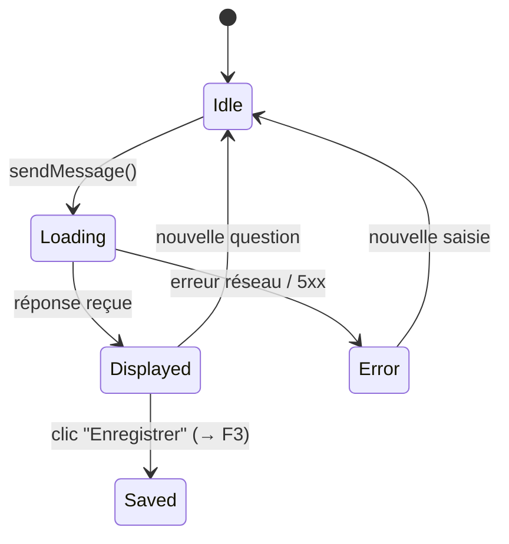

**Performance**
- Budget tokens LLM : system_prompt + historique (8 msg) + contexte (top_k × ~1 000 tokens) + question → rester sous 128k tokens (limite GPT-4o)
- Cible P95 : < 4s (Rapide) · < 8s (Standard) · < 15s (Approfondi)

---

#### IV. Exploitation et Résilience

**Observabilité** : Application Insights trace chaque appel `/api/chat` avec `tokens_used` et `session_id`. Surveiller : `tokens_used` moyen (dérive = prompt trop long) · taux d'erreurs 5xx.

**Troubleshooting**

| Symptôme | Cause probable | Action |
|---|---|---|
| "Aucun document pertinent" systématique | Index vide | Vérifier `$count` sur l'index AI Search ; réindexer |
| Réponses sans badges `[N]` | LLM ignore format numérique | Vérifier system prompt dans `generator.py` |
| Timeout > 30s | Quota TPM dépassé | Passer en mode Rapide ; vérifier quotas Azure OpenAI |

---

### F2 — Modes d'analyse

#### I. Contexte et Vision Métier

**Objectif et Valeur Ajoutée**

Un mode unique forcerait un compromis sous-optimal. Les 3 modes permettent à l'utilisateur de choisir explicitement le ratio qualité / coût / vitesse selon la nature de sa question.

**Acteurs** : Tous les utilisateurs du chat.

**Indicateurs de succès**
- Distribution d'usage : > 50% Standard, < 20% Rapide, < 30% Approfondi
- Corrélation Approfondi ↔ questions longues (> 100 caractères)

---

#### II. Spécifications Fonctionnelles

**Périmètre**

| ✅ In Scope | ❌ Out of Scope |
|---|---|
| 3 modes fixes | Modes personnalisés par utilisateur |
| Sélecteur persistant pendant la session | Persistance du mode choisi entre sessions |
| Tag coloré sur chaque message utilisateur | Modification du mode d'un message déjà envoyé |

**Règles de Gestion**

| Mode | top_k | max_tokens | temperature | Orientation du prompt |
|---|---|---|---|---|
| ⚡ Rapide | 5 | 600 | 0.2 | Réponse directe et concise |
| 📋 Standard | 10 | 2 000 | 0.3 | Synthèse structurée + citations |
| 🔬 Approfondi | 20 | 4 000 | 0.3 | Corrélations, inventaires, diagrammes |

**Parcours Utilisateur**

```gherkin
Given l'interface est ouverte (mode par défaut : Standard)
When l'utilisateur clique sur "Rapide"
Then le sélecteur affiche "Rapide" actif (fond vert)
And le prochain envoi utilise top_k=5, max_tokens=600

Given un message a été envoyé en mode "Approfondi"
When la réponse s'affiche
Then un tag violet "Approfondi" est visible au-dessus du message utilisateur
```

**Cas Limites** : changement de mode pendant le chargement → le mode en cours de requête ne change pas ; le nouveau mode s'applique à la suivante.

---

#### III. Architecture Technique

**Composants impactés** : `ChatPanel.jsx` (`ModeSelector`, `MODE_CONFIG`, `MODE_TOP_K`) · `App.jsx` (state `mode`) · `api/models/schemas.py` · `api/services/generator.py` (`SYSTEM_PROMPTS`, `max_tokens` par mode)

**Diagramme d'activité — sélection de mode**


---

#### IV. Exploitation et Résilience

**Observabilité** : Loguer le mode dans chaque trace Application Insights pour corréler coût (tokens) ↔ mode utilisé.

**Troubleshooting** : Réponse vide ou tronquée → vérifier que `max_tokens` n'est pas inférieur à la longueur naturelle de la réponse pour la question posée.

---

### F3 — Rail de notes

#### I. Contexte et Vision Métier

**Objectif et Valeur Ajoutée**

Lors d'une session de recherche intensive, l'utilisateur accumule des insights dans différentes réponses. Le rail de notes permet de **capitaliser ces insights en temps réel** : sauvegarder une réponse pertinente, la relire, l'annoter et la réutiliser dans les questions suivantes (voir F4).

**Acteurs**

| Persona | Usage |
|---|---|
| Analyste / Consultant | Construire une analyse par accumulation progressive d'extraits |
| Chef de projet | Préparer un compte-rendu à partir de réponses sourcées |

**Indicateurs de succès**
- Taux de sessions avec ≥ 1 note créée
- Taux de rétention des notes entre sessions (localStorage → survie au reload)

---

#### II. Spécifications Fonctionnelles

**Périmètre**

| ✅ In Scope | ❌ Out of Scope |
|---|---|
| Enregistrer une réponse AI comme note | Édition du contenu après création |
| Créer une note manuelle (texte libre) | Organisation en dossiers / tags |
| Afficher la note complète (modale) | Export (PDF, Notion, etc.) |
| Supprimer une note | Partage entre utilisateurs |
| Persistence `localStorage` | Synchronisation serveur |

**Parcours Utilisateur**

```gherkin
# Enregistrement d'une réponse
Given l'utilisateur a reçu une réponse
When il clique sur "Enregistrer"
Then le bouton passe en "Enregistré" (fond bleu, non re-cliquable)
And une note apparaît en tête du rail droit
And la note est persistée en localStorage

# Note manuelle
Given l'utilisateur clique sur "Nouvelle note"
When la zone de saisie apparaît et il confirme le texte
Then une note manuelle apparaît en tête du rail

# Consultation
Given une note existe dans le rail
When l'utilisateur clique dessus
Then une modale plein écran s'ouvre avec le texte complet rendu en Markdown
And la modale se ferme sur Échap ou clic en dehors

# Suppression
Given l'utilisateur survole une note
When il clique sur le bouton × (visible au survol)
Then la note est supprimée du rail et du localStorage
And si elle était épinglée (F4), elle est retirée de pinnedNotes
```

**Règles de Gestion**
- Notes triées anti-chronologiquement (nouvelle note en tête)
- Texte extrait en texte brut depuis le Markdown de la réponse
- Première citation de la réponse attachée comme `source` (optionnel)
- `messageId` mémorisé pour empêcher le double enregistrement d'une même réponse

**Cas Limites**

| Cas | Comportement |
|---|---|
| localStorage saturé | Écriture silencieusement échoue ; les notes peuvent ne pas être sauvegardées |
| Suppression d'une note épinglée | Retrait automatique de `pinnedNotes` via `handleDeleteNote()` |

---

#### III. Architecture Technique

**Composants impactés** : `NotesRail.jsx` (`NoteCard`, `NoteModal`) · `App.jsx` (`notes`, `handleSaveNote()`, `handleDeleteNote()`, `handleBlankConfirm()`)

**Modèle de données (localStorage — clé `nlaz-notes`)**

```typescript
interface Note {
  id: string;           // uid() — 8 chars aléatoires
  text: string;         // texte brut extrait du Markdown
  source?: string;      // nom du fichier de la première citation
  messageId?: string;   // id du message d'origine
  timestamp: string;    // ISO 8601
}
```

**Diagramme d'états — note**

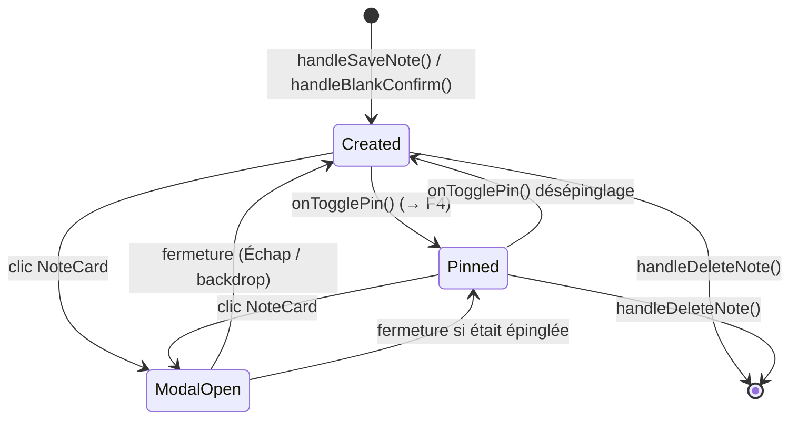

**Sécurité** : Les notes transitent sur le réseau uniquement si épinglées (incluses dans `injected_notes[]` du corps de requête HTTPS).

---

#### IV. Exploitation et Résilience

**Limite connue** : Notes liées au navigateur — pas de synchronisation multi-appareils. Pour une persistance partagée : API de stockage des notes côté serveur (axe d'amélioration futur).

**Troubleshooting**

| Symptôme | Cause | Action |
|---|---|---|
| Notes disparaissent au reload | localStorage désactivé ou mode privé | Vérifier `localStorage.getItem('nlaz-notes')` en console |
| Bouton × non visible | Survol de la carte requis (opacity 0 → 1 on hover) | Comportement attendu |

---

### F4 — Injection de notes dans le contexte

#### I. Contexte et Vision Métier

**Objectif et Valeur Ajoutée**

La recherche RAG est stateless par nature : chaque question repart de zéro. L'injection de notes permet de **construire un raisonnement itératif** : l'utilisateur épingle les conclusions d'une première analyse et les injecte dans les questions suivantes, orientant le LLM sans avoir à tout reformuler.

**Acteurs** : Utilisateurs avancés construisant des analyses en plusieurs étapes.

**Indicateurs de succès**
- Taux de sessions avec ≥ 1 note injectée
- Amélioration perçue de la pertinence des réponses avec notes injectées (qualitatif)

---

#### II. Spécifications Fonctionnelles

**Périmètre**

| ✅ In Scope | ❌ Out of Scope |
|---|---|
| Épingler / désépingler une note depuis le rail ou la modale | Injection automatique de toutes les notes |
| Bandeau de rappel des notes actives au-dessus de la saisie | Pondération ou priorité entre notes injectées |
| Notes injectées visibles dans le contexte LLM | Persistance de l'état épinglé entre sessions |
| Désépinglage depuis le bandeau (clic sur le chip) | Édition du texte avant injection |

**Parcours Utilisateur**

```gherkin
# Épinglage depuis la modale de note
Given une note est ouverte dans sa modale
When l'utilisateur clique sur "Injecter dans le contexte"
Then la note est ajoutée à pinnedNotes
And un bandeau bleu "N note(s) dans le contexte" apparaît au-dessus de la saisie
And le bouton devient "Retirer du contexte"

# Question avec note injectée
Given une note est épinglée
When l'utilisateur envoie une question
Then la requête inclut injected_notes: [texte de la note]
And le contexte LLM contient "[Note utilisateur 1]: <texte>"
And la réponse peut référencer le contenu de la note

# Désépinglage depuis le bandeau
Given le bandeau est visible avec une note
When l'utilisateur clique sur son chip
Then la note est retirée de pinnedNotes
And le bandeau disparaît si pinnedNotes est vide
```

**Règles de Gestion**
- Notes labelisées `[Note utilisateur N]` dans le contexte LLM (N = index dans la liste)
- Insérées **avant** les chunks RAG dans le contexte (signale leur priorité au LLM)
- Aucune limite en nombre, mais chaque note contribue au budget tokens
- `pinnedNotes` en état React session — perdues à la fermeture du tab

**Cas Limites**

| Cas | Comportement |
|---|---|
| Note longue (> 2 000 tokens) + mode Rapide | Notes s'ajoutent même si elles dépassent le budget tokens → risque de troncature GPT-4o |
| Note supprimée pendant qu'elle est épinglée | `handleDeleteNote()` la retire automatiquement de `pinnedNotes` |
| Reload de la page | Notes épinglées perdues (state React, non persisté) |

---

#### III. Architecture Technique

**Composants impactés** : `NotesRail.jsx` (`NoteModal` — bouton injecter/retirer, `NoteCard` — icône inject) · `ChatPanel.jsx` (bandeau pinnedNotes) · `App.jsx` (state `pinnedNotes`, `togglePinNote()`) · `api/models/schemas.py` · `api/services/generator.py` (`_build_context()`)

**Construction du contexte LLM**

```
[Note utilisateur 1]
<texte de la note 1>

[Note utilisateur 2]
<texte de la note 2>

[Source 1] — fichier.pdf, p.12
<contenu chunk 1>

[Source 2] — autre.pdf, p.3
<contenu chunk 2>
```

**Diagramme d'activité — épinglage**

```mermaid
flowchart TD
    A([Clic "Injecter dans le contexte"]) --> B{Note déjà\népinglée ?}
    B -->|Oui| C[Retirer de pinnedNotes]
    B -->|Non| D[Ajouter à pinnedNotes]
    C --> E([Bandeau mis à jour · Bouton → Injecter])
    D --> F([Bandeau mis à jour · Bouton → Retirer])
```

---

#### IV. Exploitation et Résilience

**Limite connue** : L'injection augmente la consommation de tokens proportionnellement à la longueur des notes. Pour de très longues notes (> 3 000 tokens), préférer le mode Approfondi.

---

### F5 — Viewer de citation

#### I. Contexte et Vision Métier

**Objectif et Valeur Ajoutée**

Les agents RAG sont sujets à la sur-interprétation ou à l'hallucination. La possibilité de **vérifier en un clic le passage exact** qui a fondé une affirmation renforce la confiance et permet de détecter immédiatement les erreurs d'attribution.

**Acteurs** : Tous les utilisateurs souhaitant valider les affirmations de l'agent.

**Indicateurs de succès**
- Taux de clics sur les badges `[N]` ou les fiches source
- Réduction du temps de vérification manuelle des sources

---

#### II. Spécifications Fonctionnelles

**Périmètre**

| ✅ In Scope | ❌ Out of Scope |
|---|---|
| Afficher le texte brut du chunk indexé | Afficher le PDF original mis en page |
| Ouvrir depuis badge `[N]` dans le texte | Naviguer entre chunks adjacents |
| Ouvrir depuis la fiche source "Références" | Surligner le passage dans un viewer PDF |
| Modale avec fichier, page, section, contenu | Télécharger le document source |
| Regroupement des fiches par source (badges multiples) | Tri/filtrage des références |
| Surlignage et centrage du passage cité dans la modale | Surlignage multi-occurrences |

**Parcours Utilisateur**

```gherkin
Given une réponse contient des références textuelles [N]
When le Markdown est rendu
Then chaque [N] devient une vignette .nlaz-cite cliquable

Given une réponse contient des badges [N] cliquables
When l'utilisateur clique sur [3]
Then une modale s'ouvre : nom fichier, numéro page, titre section, texte du chunk en Markdown
And le passage correspondant à la section citée est surligné et centré dans la modale

Given une même source est citée sous plusieurs numéros (ex. [3] et [7])
When la liste "Références" est affichée
Then la source n'apparaît qu'une fois, avec un badge par numéro [3] et [7]

Given les fiches "Références" sont affichées
When l'utilisateur clique sur une fiche source
Then la même modale s'ouvre pour le chunk correspondant

Given la modale est ouverte
When l'utilisateur appuie sur Échap ou clique en dehors
Then la modale se ferme
```

**Règles de Gestion**
- Seules les sources dont le numéro `[N]` apparaît dans le texte sont cliquables
- Correspondance badge ↔ source par `id` (1-indexed, ordre des `sources[]` de l'API)
- Contenu affiché = champ `content` du chunk tel qu'indexé (texte brut, pas le PDF)
- Regroupement des fiches "Références" par `source|page` — une fiche peut porter plusieurs badges `[N]`
- Surlignage : recherche de `citation.snippet` (section) dans le texte du chunk via `TreeWalker` + `Range.surroundContents`, première occurrence uniquement

**Cas Limites**

| Cas | Comportement |
|---|---|
| Chunk sans contenu (`content = ""`) | Modale affiche "Contenu non disponible." |
| Réponse sans aucune citation | Badges absents, fiches absentes, viewer inaccessible |

---

#### III. Architecture Technique

**Composants impactés** : `ChatPanel.jsx` (`MarkdownContent`, `_highlightAndScroll`, `CitationModal`, `SourceCard`, `AssistantMessage`) · `index.html` (`.nlaz-cite`, `mark.nlaz-highlight` CSS) · `api/models/schemas.py` · `api/routers/chat.py`

**Conversion des références `[N]` en vignettes**

Avant le rendu Markdown, `MarkdownContent` remplace chaque référence textuelle `\[(\d+)\]` par `<sup class="nlaz-cite" data-cite="N">N</sup>`. Le résultat passe par `marked.parse()` puis `DOMPurify.sanitize()` (qui autorise `sup`/`class`/`data-*`), avant `dangerouslySetInnerHTML`. Un `useEffect` attache ensuite un `onclick` à chaque `.nlaz-cite` du DOM rendu (`onCitationClick(Number(data-cite))`).

**Surlignage du passage cité**

À l'ouverture de `CitationModal`, `MarkdownContent` reçoit `highlightText={citation.snippet}`. `_highlightAndScroll` parcourt le texte rendu (`TreeWalker`), entoure la première occurrence d'un `<mark class="nlaz-highlight">` et appelle `scrollIntoView({ block: 'center' })`.

**Diagramme de séquence — ouverture du viewer**

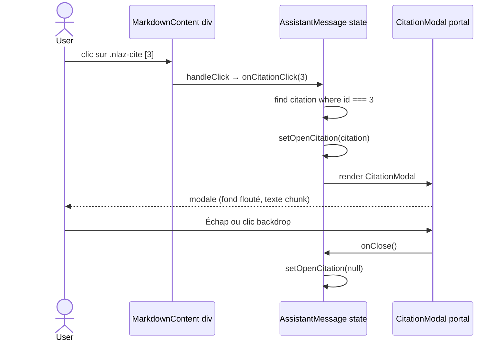

**Diagramme d'états — CitationModal**

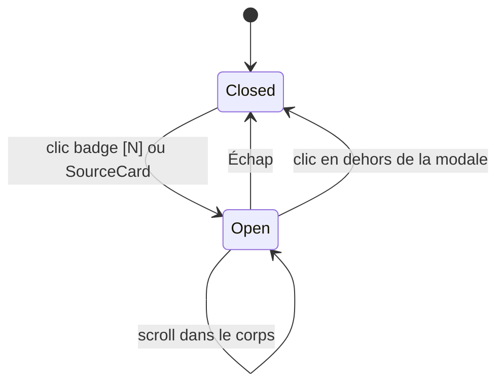

**Sécurité** : Contenu des chunks affiché via `dangerouslySetInnerHTML` après `marked.parse()` + `DOMPurify.sanitize()` (SEC-002).

---

#### IV. Exploitation et Résilience

**Limite connue** : Le viewer affiche le texte extrait lors de l'indexation. Si un document source a été modifié depuis, le contenu affiché peut différer du fichier actuel.

**Troubleshooting**

| Symptôme | Cause | Action |
|---|---|---|
| Badges `[N]` non cliquables | `onCitationClick` non passé | Vérifier `hasCitations` dans `AssistantMessage` |
| Modale vide | `content` vide dans la réponse API | Vérifier `content=c.content` dans `chat.py` |
| Badges sans hover visuel | Cache CSS | `Ctrl+Shift+R` hard refresh |

---

### F6 — Upload de document

#### I. Contexte et Vision Métier

**Objectif et Valeur Ajoutée**

L'ingestion documentaire était une opération CLI réservée aux administrateurs. L'upload UI **démocratise cette opération** : n'importe quel utilisateur enrichit le corpus depuis l'interface, sans accès SSH ni connaissance Python.

**Acteurs**

| Persona | Usage |
|---|---|
| Utilisateur final | Ajouter un document fraîchement reçu avant de l'interroger |
| Administrateur | Enrichissement ponctuel sans accès serveur |

**Indicateurs de succès**
- Taux de succès des uploads (`done` / total)
- Temps de traitement moyen (chunks/minute)
- Taux d'erreur lié à des dépendances manquantes = 0 en production

---

#### II. Spécifications Fonctionnelles

**Périmètre**

| ✅ In Scope | ❌ Out of Scope |
|---|---|
| Upload fichier unique (PDF, DOCX, Markdown, max 50 Mo) | Upload multiple / batch |
| Toast de progression temps réel | Barre de progression par chunk |
| Déduplication automatique (hash SHA-256) | Suppression ou mise à jour d'un document indexé |
| Message d'erreur si format / taille invalide | Prévisualisation avant ingestion |

**Parcours Utilisateur**

```gherkin
# Upload réussi
Given l'utilisateur clique sur "Ajouter un document"
When il sélectionne un fichier PDF
Then le fichier est uploadé (POST /api/ingest)
And un toast "Envoi du fichier…" apparaît en bas à droite
And le toast progresse : "Analyse…" → "Découpage…" → "Embeddings…" → "Indexation…"
And le toast final affiche "42 chunks indexés avec succès"
And le toast disparaît automatiquement après 6 secondes

# Fichier déjà indexé
Given le même fichier a déjà été ingéré (hash SHA-256 identique)
When l'utilisateur le re-uploade
Then le toast affiche "Document déjà indexé — aucune action nécessaire"

# Format non supporté
Given l'utilisateur sélectionne un .xlsx
Then le file picker HTML accepte uniquement .pdf,.md,.docx
And si contourné, l'API retourne 400 avec un message d'erreur clair

# Dépendance manquante
Given python-multipart n'est pas installé
When le serveur démarre
Then FastAPI lève RuntimeError et refuse de démarrer (erreur visible dans les logs)
```

**Règles de Gestion**
- Formats acceptés : `.pdf` · `.md` · `.docx`
- Taille max : 50 Mo (validé côté API — HTTP 413 sinon)
- Déduplication : `file_hash` déjà dans l'index → status `done`, chunks = 0
- Un seul job suivi à la fois côté front (nouvel upload annule l'intervalle précédent)
- API retourne `202 Accepted` immédiatement ; traitement asynchrone (BackgroundTask)
- Fichier temporaire supprimé après traitement (succès ou erreur)

**Cas Limites**

| Cas | Comportement |
|---|---|
| Fichier > 50 Mo | API retourne 413 ; toast d'erreur rouge |
| Format non supporté (contournement) | API retourne 400 ; toast d'erreur rouge |
| Réseau coupé pendant l'upload | `fetch` rejette ; toast d'erreur |
| Azure Document Intelligence indisponible | BackgroundTask échoue ; toast d'erreur avec message |
| API redémarrée pendant l'ingestion | Job perdu en mémoire ; polling retourne 404 ; toast d'erreur |
| Deuxième upload lancé pendant le premier | Polling du premier annulé (`clearInterval`) ; seul le second est suivi |

---

#### III. Architecture Technique

**Composants impactés** : `Header.jsx` (bouton, `<input type="file">` caché) · `App.jsx` (`IngestToast`, state `ingestJob`, `handleFileUpload()`, `ingestPollRef`) · `api/routers/ingest.py` (endpoints, `_run_ingest()`, `_jobs` dict)

**Contrats d'Interface**

```
POST /api/ingest  (multipart/form-data, champ: file)
→ 202: { job_id, status:"pending", filename, message, chunks:0 }
→ 400: format non supporté
→ 413: fichier trop volumineux

GET /api/ingest/{job_id}
→ 200: { job_id, status, filename, message, chunks }
→ 404: job inconnu (API redémarrée)
```

**Diagramme d'états — job d'ingestion**

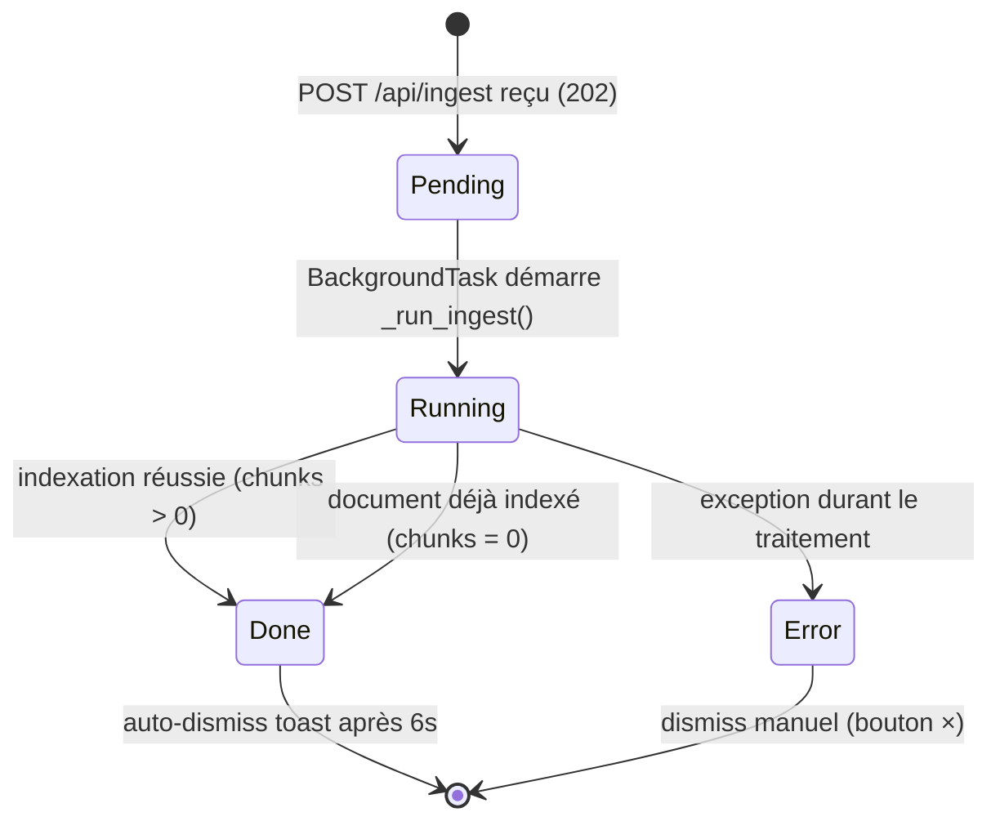

**Diagramme de séquence — flux complet**

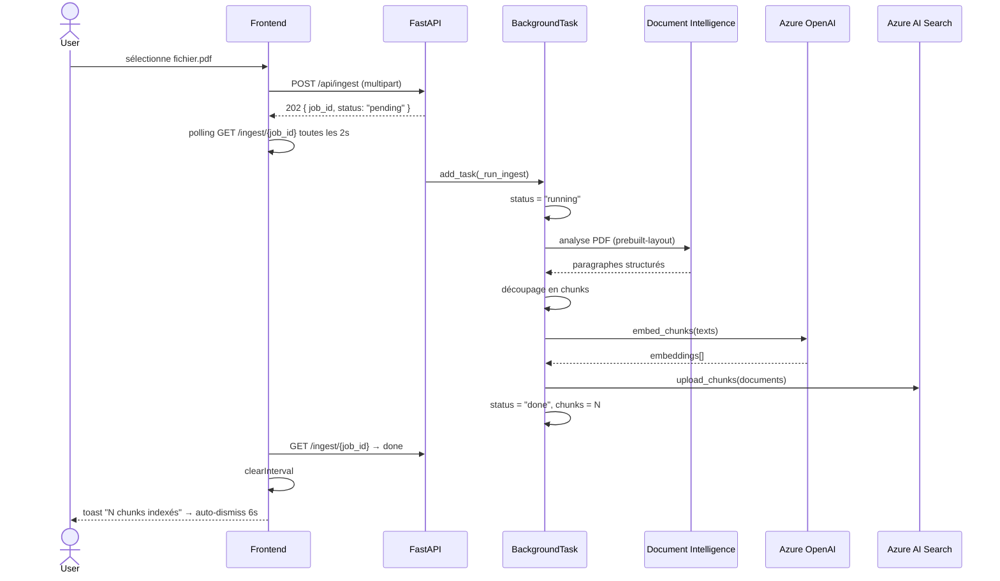

**Sécurité et Conformité**
- Fichier écrit dans `tempfile.gettempdir()` et supprimé après traitement — ne persiste pas sur disque
- Validation extension + taille côté API ; le contenu du fichier n'est pas inspecté au-delà

**Performance**
- Temps estimé : PDF 50 pages ≈ 2-4 min (Document Intelligence ~1-2 min + embeddings ~30s)
- Polling toutes les 2s : réactif sans surcharger l'API

---

#### IV. Exploitation et Résilience

**Observabilité** : `_jobs` dict en mémoire — les jobs sont perdus au redémarrage. Logger les erreurs des BackgroundTasks avec `logger.error()` pour Application Insights.

**Stratégie de déploiement** : `python-multipart` **obligatoire** dans `api/requirements.txt` (FastAPI refuse de démarrer sans lui). `tiktoken`, `azure-ai-documentintelligence`, `python-docx` requis pour que l'ingestion fonctionne en arrière-plan.

**Troubleshooting**

| Symptôme | Cause | Action |
|---|---|---|
| `RuntimeError: Form data requires "python-multipart"` au démarrage | Package absent | `pip install python-multipart` |
| Toast bloqué sur "En file d'attente…" | ImportError silencieuse dans BackgroundTask | Vérifier logs uvicorn pour `ImportError` |
| Toast d'erreur "Dépendance manquante" | tiktoken / azure-ai-documentintelligence / python-docx absent | `pip install tiktoken azure-ai-documentintelligence python-docx` |
| Polling retourne 404 après redémarrage | `_jobs` dict réinitialisé | Comportement attendu — toast passe en erreur |

---

### F7 — Legacy KB

#### I. Vue d'ensemble

La **Legacy KB** ajoute une deuxième vue à l'interface (`LegacyKbPage.jsx`, bascule depuis le `Header`). Elle donne un accès en lecture, sous forme de graphe interactif, à l'intégralité du dump GraphRAG `repartition_cleaned_export.graphml` importé dans une instance Neo4j auto-hébergée séparée (`neo4j-legacykb`, conteneur Azure Container Instances — jamais AuraDB) : 5 812 nœuds `:Entity`/`:Community` et 19 368 relations décrivant l'application mainframe **CardDemo** (programmes COBOL, copybooks, batch jobs, fichiers, domaines fonctionnels).

Depuis une migration réseau (audit sécurité, finding CVSS 8.3 : la base était joignable directement depuis Internet), `neo4j-legacykb` n'a plus d'IP publique ni de FQDN — elle est déployée dans un VNet privé, joignable uniquement depuis le sous-réseau de l'environnement Container Apps (`ca-api`). En conséquence, **le backend local (`start-dev.ps1`) ne peut plus atteindre `neo4j-legacykb` directement** (pas de VPN/Bastion mis en place) : seuls `ca-api` (intégré au VNet) et le Container Apps Job d'import peuvent l'atteindre. C'est pourquoi l'exploration visuelle du graphe en local appelle `ca-api` en cross-origin pour les routes `/api/legacykb/*` (voir section 7, CORS) — c'est aussi le seul moyen de parcourir visuellement le graphe, car l'image Docker déployée ne contient jamais le frontend.

Cette base est la **golden source** de référence pour le legacy CardDemo. Elle est consultée de deux façons :
- **Exploration visuelle** — l'onglet "Legacy KB" (`LegacyKbPage.jsx`), graphe React Flow/dagre
- **Tool-calling depuis le Chat** — GPT-4o interroge directement `neo4j-legacykb` via les tools `legacykb_*` (cf. section 5, "Tool-calling Legacy KB") pour répondre aux questions sur CardDemo

L'instance ADG-M (Function App `fn-adgm-graph`, Cytoscape) qui exploitait auparavant une partie de ce dump a été retirée le 2026-06-13 ; `azure-functions/` est conservé "au repos" mais n'est plus consommé par l'application (voir `CLAUDE.md`).

#### II. Architecture de la fonctionnalité

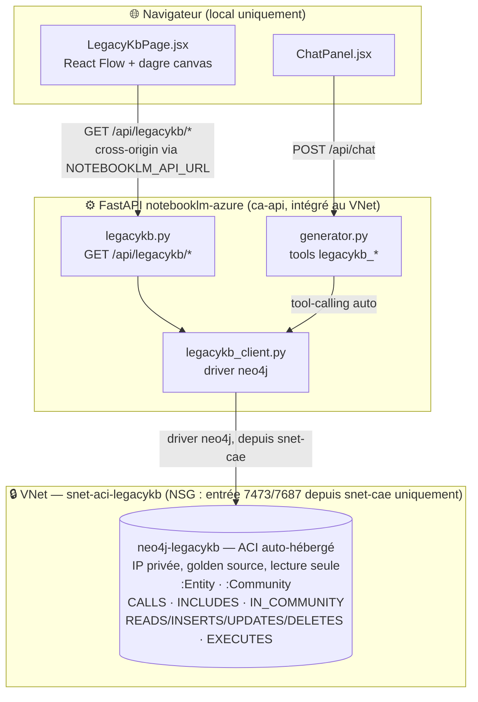

> **Pourquoi cross-origin en local** : `neo4j-legacykb` n'a plus d'IP publique et l'image Docker déployée ne contient jamais le frontend (aucune UI en production) — le seul moyen de parcourir visuellement le graphe est donc le frontend local appelant `ca-api` directement pour `/api/legacykb/*` (CORS + CSP `connect-src` ajustés en conséquence, cf. section 7).

#### III. Composants et responsabilités

**`frontend/src/LegacyKbPage.jsx`**

Composant React (Babel standalone, React Flow + d3-force vendorisés en UMD) gérant la vue complète :
- `LegacyKbCanvas` — canvas React Flow (`Background`, `Controls`, `MiniMap`), nœud custom unique `LegacyNode` (carré 90×90, entités et communautés confondues — couleur par `type`/niveau de domaine)
- `_prepareSimulation` — prépare la topologie (nœuds/liens, amorçage concentrique par distance BFS depuis le centre) ; la disposition finale est calculée en continu par une simulation `d3-force` (liens, répulsion, anti-collision) lancée dans le composant, pas par un layout statique
- Recherche (`legacykb_search`), navigation par domaine fonctionnel (`DomainBreadcrumb`, communautés niveau 2)
- Exploration progressive : double-clic sur un nœud → charge son voisinage (`/legacykb/nodes/{id}/neighbors`) et le fusionne dans le bundle
- `NodeDetailPanel` — résumé exécutif dépliable (`ExpandableText`), compteurs de relations par type (`RelationBars`), tags techniques détectés (`TechTagList`)
- `NodeContextMenu` (clic droit sur un nœud) : recentrer la vue sur ce nœud (réinitialise le bundle), **recentrer la disposition sur ce nœud** (redispose la hiérarchie `dagre` sans réinitialiser le bundle), retirer le nœud de la vue
- Menu "Affichage" (icône roue crantée) — filtre les types d'entités et niveaux de communautés visibles dans le graphe (`VISIBILITY_OPTIONS`)

**`api/routers/legacykb.py`**

Router de lecture exposant `neo4j-legacykb` au frontend :

| Méthode | Route | Description |
|---|---|---|
| GET | `/api/legacykb/health` | Joignabilité de l'instance Neo4j |
| GET | `/api/legacykb/stats` | Comptage des nœuds par type `:Entity` et niveau `:Community` |
| GET | `/api/legacykb/domains` | Domaines fonctionnels (`:Community` niveau 2) |
| GET | `/api/legacykb/search?q=&limit=&types=&descriptions=` | Recherche sur le nom des `:Entity` / titre des `:Community` |
| GET | `/api/legacykb/nodes/{node_id}` | Détail complet d'un nœud (`:Entity` ou `:Community`) |
| GET | `/api/legacykb/nodes/{node_id}/neighbors?limit=` | Voisinage direct (toutes relations) — exploration au clic |

**`api/services/legacykb_client.py`**

Driver Neo4j Python partagé par le router et par les tools function-calling. Identifiants de nœuds construits côté client (`:Entity` n'a pas de propriété `id` native) :
- Entité : `e|{type}|{name}` (ex. `e|Program|RE1570C`)
- Communauté : `c|{id}` (ex. `c|12`)

Lève `LegacyKbError` (instance injoignable, 502) ou `LegacyKbNotFound` (404).

**`api/services/graph_tools.py`**

Tools function-calling pour GPT-4o (`LEGACYKB_TOOL_DEFINITIONS`, exécutés par `execute_legacykb_tool`) — voir section 5.

#### IV. Modèle de données Neo4j (`neo4j-legacykb`)

```
(:Entity {
    type,           -- Program | BatchJob | Copybook | GenericFile | ...
    name,
    file_location,
    description_functional,
    description_technical
})

(:Community {
    id, level,      -- level 1 = sous-domaine, level 2 = domaine fonctionnel
    title,
    summary_functional,
    summary_technical
})

(:Entity)     -[:IN_COMMUNITY]->     (:Community)
(:Community)  -[:SUBCOMMUNITY_OF]->  (:Community)
(:Entity)     -[:CALLS]->            (:Entity)        -- appel de programme
(:Entity)     -[:INCLUDES]->         (:Entity)        -- inclusion de copybook
(:Entity)     -[:READS|INSERTS|UPDATES|DELETES|CREATES]-> (:Entity)  -- accès fichier
(:Entity)     -[:EXECUTES]->         (:Entity)        -- exécution par un batch job
```

#### V. Pipeline d'alimentation de la base Neo4j

La base `neo4j-legacykb` est peuplée à partir d'un dump GraphML généré par le pipeline GraphRAG (extraction des entités et relations depuis le corpus CardDemo). Ce pipeline est **externe** à NotebookLM Azure — il produit le fichier `repartition_cleaned_export.graphml`.

```mermaid
flowchart LR
    A[🗂️ Corpus CardDemo\nCOBOL · JCL · copybooks] --> B[Pipeline GraphRAG\nextraction entités + relations]
    B --> C[repartition_cleaned_export.graphml\ndocs/extract/]
    C --> D[import-neo4j-legacykb.ps1\nautomatique via deploy.ps1]
    D --> E[az storage file upload\nAzure Files neo4j-import\ncontrol-plane, fonctionne malgré le VNet]
    E --> F[Container Apps Job\ncaj-import-legacykb-&lt;suffix&gt;\ndepuis snet-cae]
    F --> G2[apoc.import.graphml\nvia driver neo4j, réseau privé]
    G2 --> G[(neo4j-legacykb\n5 812 nœuds\n19 368 relations)]
    G -->|automatique| H[fix_utf8.cypher\ncorrection double-encodage\ndes nœuds :Community]
    F -->|dépose le résultat JSON| E
```

> **Pourquoi un Job intermédiaire** : `neo4j-legacykb` n'a plus d'IP publique — le poste de l'opérateur ne peut plus s'y connecter en HTTPS/Bolt directement. `import-neo4j-legacykb.ps1` se limite donc à de l'upload control-plane (Azure Files par clé de compte, toujours accessible) puis déclenche le Container Apps Job `caj-import-legacykb-<suffix>` (`python -m api.scripts.import_legacykb`), qui s'exécute lui-même dans `snet-cae` — seul sous-réseau autorisé par le NSG de `neo4j-legacykb` — pour effectuer l'import. Le mot de passe Neo4j n'est plus manipulé par l'opérateur : le Job le charge depuis Key Vault via sa Managed Identity.

**Étapes du script `import-neo4j-legacykb.ps1` :**

| Étape | Description |
|-------|-------------|
| **1. Upload** | Upload de `repartition_cleaned_export.graphml` dans le partage Azure Files monté en `/var/lib/neo4j/import/` via `az storage file upload` (clé de compte — control-plane Azure Storage, fonctionne même si `neo4j-legacykb` est en réseau privé) |
| **2. Déclenchement du Job** | `az containerapp job update --set-env-vars DUMP_FILENAME=... PURGE_BEFORE_IMPORT=...` puis `az containerapp job start` sur `caj-import-legacykb-<suffix>` |
| **3. Exécution du Job (dans le VNet)** | Le Job attend que Neo4j soit joignable, exécute `CALL apoc.import.graphml('file:///var/lib/neo4j/import/...', {readLabels: true})` puis le correctif UTF-8, et dépose un résultat JSON dans le partage Azure Files |
| **4. Lecture du résultat** | `import-neo4j-legacykb.ps1` attend la fin de l'exécution (`az containerapp job execution show`, jusqu'à 10 min) puis relit le résultat via `az storage file download` |

**Relancer l'import sans redéploiement :**

```powershell
.\import-neo4j-legacykb.ps1 -ResourceGroup rg-<ProjectName>-prod
```

`-StorageAccountName` et `-JobName` sont découverts automatiquement depuis `-ResourceGroup` ; le mot de passe Neo4j n'est plus demandé (chargé par le Job depuis Key Vault).

Voir **[GUIDE-DEPLOIEMENT.md § Mettre à jour le dump GraphML](GUIDE-DEPLOIEMENT.md#mettre-à-jour-le-dump-graphml-dans-neo4j-sans-redéploiement-complet)** pour le détail.

#### VI. Recentrage et redisposition de la vue

| Action | Déclencheur | Effet |
|---|---|---|
| **Recentrer la vue** | `NodeContextMenu` → "Réinitialiser la vue et la recentrer sur ce nœud" (`recenterOnNode`) | Vide le bundle, recharge le voisinage du nœud sélectionné, relance le layout `dagre` depuis ce centre |
| **Recentrer la disposition** | `NodeContextMenu` → "Recentrer la disposition sur ce nœud" (`relayoutOnNode`) | Conserve le bundle (nœuds déjà chargés/explorés), recalcule uniquement le layout `dagre` en hiérarchie BFS depuis ce nœud — ne perd pas l'exploration en cours |

Les deux actions mettent à jour `centerId`/`selectedId` ; `_layout` reconstruit l'arbre couvrant (BFS) depuis `centerId` pour ordonner les rangs `dagre`.

#### VI. Vendoring React Flow / dagre

`@xyflow/react` (build UMD, expose `window.ReactFlow`) et `@dagrejs/dagre` (`dagre.min.js`, expose `window.dagre`) sont copiés dans `frontend/vendor/`, avec un shim `jsx-runtime-shim.js` fournissant `window.jsxRuntime` requis par le wrapper UMD de `@xyflow/react`. Même pattern sans-build que `mermaid.min.js`/`marked.min.js` — détails et procédure de montée de version dans `CLAUDE.md`.

#### VII. Troubleshooting

| Symptôme | Cause | Action |
|---|---|---|
| `GET /api/legacykb/*` → 502 (depuis `ca-api`) | `neo4j-legacykb` injoignable ou `NEO4J_LEGACYKB_PASSWORD` absent | Vérifier que l'ACI est démarré et joignable depuis `snet-cae` (NSG), et la configuration Key Vault |
| `GET /api/legacykb/*` → erreur réseau (depuis le backend local, `start-dev.ps1`) | `neo4j-legacykb` n'a plus d'IP publique — le poste local ne peut pas l'atteindre directement (pas de VPN/Bastion) | Comportement attendu ; vérifier que `NOTEBOOKLM_API_URL` est défini dans `.env` (le frontend local doit appeler `ca-api` en cross-origin, pas le backend local) |
| Page Legacy KB locale bloquée par CORS/CSP | `CORS_ALLOWED_ORIGINS` non configuré sur `ca-api`, ou CSP `connect-src` n'autorise pas `NOTEBOOKLM_API_URL` | Vérifier le paramètre Bicep `corsAllowedOrigins` sur `ca-api` et que `.env` local définit `NOTEBOOKLM_API_URL` |
| Graphe vide — aucun nœud affiché | Import GraphML non exécuté ou échoué | Relancer `import-neo4j-legacykb.ps1` ; vérifier que `repartition_cleaned_export.graphml` est dans `docs/extract/` |
| Import échoue avec `ManagedEnvironmentCannotAddVnetToExistingEnv` ou `SubnetIdCannotChange` | Tentative d'appliquer cette architecture réseau à un déploiement Container Apps/ACI préexistant | Voir GUIDE-DEPLOIEMENT.md § Réseau privé — recréation forcée nécessaire (RG vierge non affecté) |
| Titres Community illisibles (`é` au lieu de `é`) | Double-encodage UTF-8/Latin-1 lors de l'import APOC | Le correctif `fix_utf8.cypher` est appliqué automatiquement par le Job d'import (`caj-import-legacykb-<suffix>`) |
| `GET /api/legacykb/nodes/{id}` → 404 | Identifiant mal formé ou nœud absent du dump | Vérifier le format `e|{type}|{name}` ou `c|{id}` (cf. `legacykb_client.parse_node_id`) |
| Réponses du Chat sans `graph_references` sur une question CardDemo | GPT-4o n'a pas invoqué les tools `legacykb_*` | Vérifier le system prompt (`_LEGACYKB_TOOLS_BLOCK` dans `generator.py`) et le mode (Rapide a un prompt tools réduit) |
| `window.ReactFlow` / `window.dagre` undefined | Script vendor non chargé ou ordre incorrect dans `index.html` | Vérifier `jsx-runtime-shim.js` → `xyflow-react.umd.js` → `dagre.min.js` avant `LegacyKbPage.jsx` |
| "Recentrer la disposition" ne change rien | Bundle ne contient pas le nœud sélectionné dans son arbre couvrant | Explorer le nœud (double-clic) avant de redisposer |
