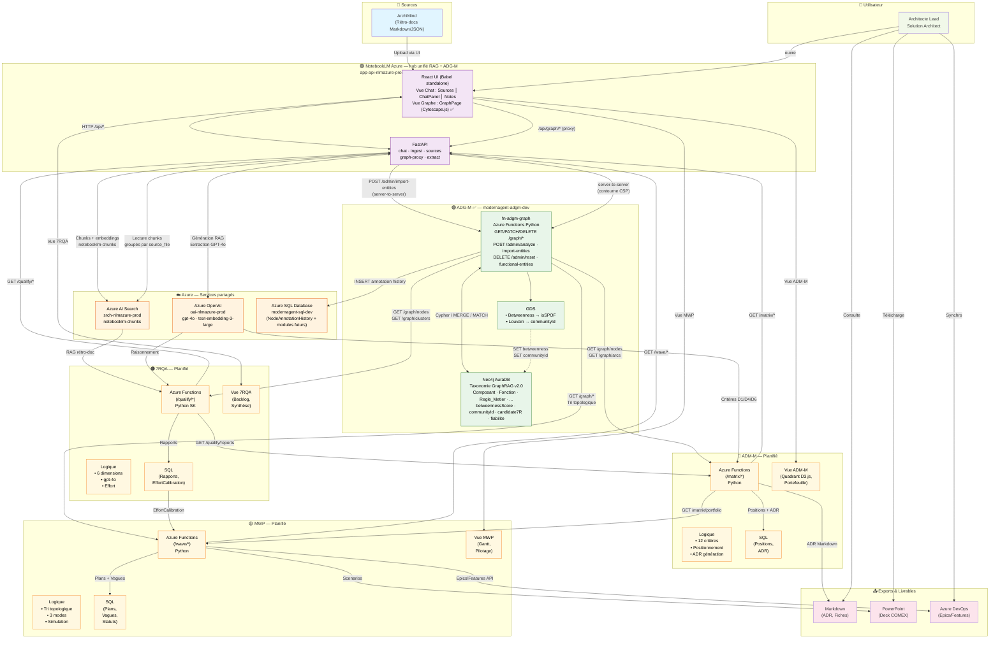
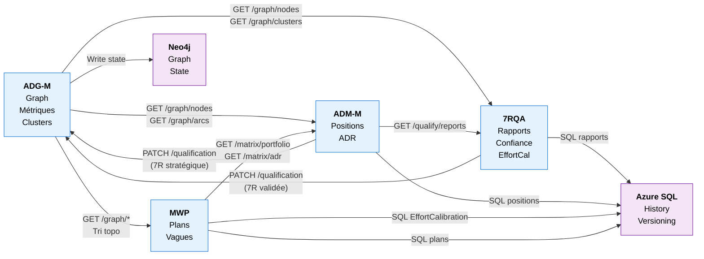
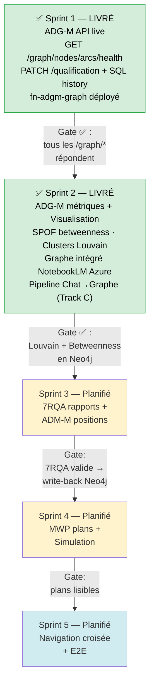

# Architecture cible — Modernization Agent v1

## Diagramme d'architecture générale

> **Décision d'intégration ADG-M** : la vue graphe est intégrée dans NotebookLM Azure
> (toggle Chat ⇄ Graphe) plutôt que comme application standalone. Cela évite un second
> outil à maintenir et exploite le corpus documentaire déjà indexé dans AI Search.



---

## Vue logique par flux

### Flux 1 : Ingestion et Cartographie (ADG-M) ✅
```
ArchiMind Rétro-docs
  ↓ [Upload via NotebookLM Azure UI]
Pipeline d'ingestion — NotebookLM Azure
  ├→ Extraction : Azure Document Intelligence (PDF) / chunkers natifs
  ├→ Embeddings : text-embedding-3-large
  └→ Index : Azure AI Search notebooklm-chunks (déduplication SHA-256)
  ↓
Architecte lance "Mettre à jour le graphe"
  ↓ [POST /api/extract/graph → BackgroundTask — extract.py]
Pipeline Chat→Graphe (Track C)
  ├→ DELETE /admin/functional-entities : vide tout le graphe SAUF Composant/System
  │   (préserve la qualification candidate7R et les propriétés calculées par GDS)
  ├→ Azure AI Search : lecture complète (top 5000 chunks, groupés par source_file)
  ├→ GPT-4o : extraction JSON structurée par document
  │   (taxonomie GraphRAG v2.0 : {nodes:[{id,label,properties}], relations:[{from,to,type,properties}]})
  └→ fn-adgm-graph POST /admin/import-entities : MERGE nœuds + arcs dans Neo4j (fiabilite upgrade-only)
  ↓
POST /graph/admin/analyze (déclenché séparément)
  ├→ GDS Betweenness → isSpof sur Composant/Store_Donnees
  └→ GDS Louvain → communityId par nœud de la projection structurelle (clusters candidats)
  ↓
Graphe bi-plan live dans NotebookLM Azure
  ↓ [Vue Graphe ADG-M — GraphPage.jsx, Cytoscape.js]
Architecte voit : domaines fonctionnels | composants techniques | SPOF | clusters
```

### Flux 2 : Qualification composant par composant (7RQA)
```
Architecte clique "Qualifier" sur un nœud ADG-M
  ↓
7RQA Pipeline (F2.1)
  ├→ Charge nœud + rétro-doc (RAG)
  ├→ Évalue 6 dimensions (o4-mini)
  ├→ Estime effort (calibration Arkéa/Retail)
  └→ Génère rapport + alternatives écartées
  ↓ [SQL : rapports versionnés]
Architecte valide → 7R propagée dans Neo4j
  ↓
Backlog de qualification (composants FAIBLE confiance)
```

### Flux 3 : Positionnement stratégique (ADM-M)
```
Architecte positionne un composant sur le quadrant
  ↓
ADM-M Pipeline (F3.1)
  ├→ Calcule 12 critères (D1-D6, C1-C6)
  ├→ Applique profil de pondération
  └→ Place sur quadrant + dérive palette 7R
  ↓ [SQL : positions versionnées]
Architecte valide positionnement
  ↓
Génération ADR (F3.5)
  ├→ Gabarit structuré
  ├→ Lien 7RQA (alternatives écartées)
  └→ Export Markdown → Blob
```

### Flux 4 : Planification de vagues (MWP)
```
Architecte demande "Générer plan"
  ↓
MWP Pipeline (F4.1 → F4.4)
  ├→ Tri topologique du graphe
  ├→ Détecte cycles → propose couches interop
  ├→ Priorise (3 modes : Valeur / Risque / Budget)
  ├→ Estime effort/durée par vague
  └→ Simule 3 scénarios
  ↓ [SQL : plans + vagues]
Architecte compare variantes (3 indicateurs)
  ↓
Valide plan → Exports
  ├→ Gantt Markdown
  ├→ Deck PowerPoint (COMEX)
  └→ Epics/Features Azure DevOps
  ↓
Post-lancement : dashboard pilotage (F4.5)
  └→ Statuts composants + dérive + alertes
```

---

## Principes d'hébergement — Cloud-first

> **Règle** : Le PC Windows est uniquement IDE + browser + az CLI. Aucun serveur local.

| Composant | Hébergement Azure | Type | Coût estimé dev |
|---|---|---|---|
| **NotebookLM Azure ✅** | `app-api-nlmazure-prod` (App Service, hub Chat + ADG-M) | Réutilisé | ~0 € additionnel (partagé) |
| **Neo4j AuraDB + GDS** | Neo4j AuraDB (cloud géré, Free tier dev) | SaaS | ~0 € (Free Tier) |
| **ADG-M `fn-adgm-graph` ✅** | Azure Functions (Python 3.11) | Serverless | ~0 € (Free Tier 1M exec) |
| **7RQA** | Azure Functions (Python 3.11) | Serverless | ~0 € |
| **ADM-M** | Azure Functions (Python 3.11) | Serverless | ~0 € |
| **MWP** | Azure Functions (Python 3.11) | Serverless | ~0 € |
| **Azure SQL Database** | Azure SQL Basic — `modernagent-sql-dev` | PaaS | ~5 €/mois |
| **Azure Blob Storage** | StorageV2 LRS — `modernagentstgdev` (exports futurs ADM-M/MWP) | PaaS | ~1 €/mois |
| **Azure OpenAI** | `oai-nlmazure-prod` — gpt-4o + text-embedding-3-large, Managed Identity | Réutilisé | ~0 € additionnel (partagé) |
| **Azure AI Search** | `srch-nlmazure-prod` (Standard S1) | Réutilisé | ~0 € additionnel (partagé) |
| **Azure Key Vault** | Standard, mode RBAC | PaaS | ~0 € (opérations) |
| **Application Insights** | Workspace-based | PaaS | ~0 € (5 Go gratuits) |

**Coût total estimé (dev solo, 4h/jour)** : ~10-15 €/mois — l'essentiel des
coûts IA (OpenAI, Search, ArchiMind) est absorbé par les comptes de
production partagés et ne s'ajoute pas au budget de ce projet.

> ⚠️ **Écart identifié au Sprint 0** : `oai-nlmazure-prod` n'expose que deux
> déploiements — `gpt-4o` et `text-embedding-3-large`. Le modèle `o4-mini`,
> présent dans la conception de 7RQA (raisonnement sur les 6 dimensions, cf.
> diagrammes ci-dessous), **n'y est pas déployé**. À trancher avant le sprint
> 7RQA : soit demander l'ajout d'un déploiement `o4-mini` sur le compte
> partagé (hors périmètre de `v.gicquiau`, qui n'a aucun rôle au niveau
> abonnement), soit adapter la logique 7RQA pour utiliser `gpt-4o`.

**Neo4j** : migré sur **Neo4j AuraDB** (cloud géré, Free Tier) — les commandes `az container stop/start` ne s'appliquent plus. La connexion passe par `NEO4J_URI` (neo4j+s://...) configurée dans `local.settings.json` de `fn-adgm-graph`.

---

## Flux de données inter-modules



---

## Conventions de nommage Azure

Tous les services respectent le format : `{prefixe}-{composant}-{env}`

```
modernagent-adgm-dev              # Azure Functions ADG-M ✅ déployé
modernagent-sevenrqa-dev          # Azure Functions 7RQA (planifié)
modernagent-admm-dev              # Azure Functions ADM-M (planifié)
modernagent-mwp-dev               # Azure Functions MWP (planifié)
modernagent-sql-dev               # SQL Server (base modernagent_db)
modernagentstgdev                 # Blob Storage (exports futurs ADM-M/MWP)
modernagent-ai-dev                # Application Insights
modernagent-kv-dev                # Key Vault (mode RBAC)
                                  # Neo4j : Neo4j AuraDB cloud (pas d'ACI)
                                  # Frontend : intégré dans app-api-nlmazure-prod (pas de Static Web Apps)
```

**Ressources de production réutilisées** (hors convention `modernagent-*`,
comptes partagés notebooklm-azure existants — RBAC Managed Identity) :
```
oai-nlmazure-prod                 # Azure OpenAI (gpt-4o, text-embedding-3-large)
srch-nlmazure-prod                # Azure AI Search (notebooklm-chunks)
app-api-nlmazure-prod             # NotebookLM Azure — hub RAG + ADG-M (App Service) ✅
```

---

## Points de synchronisation (gates)


