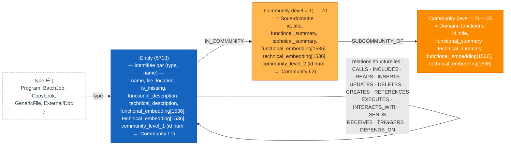

# Métamodèle de `neo4j-legacykb`

> Golden source en lecture seule — dump GraphRAG brut
> (`repartition_cleaned_export.graphml`, 5812 nœuds, 19368 relations).
> Référence : [`api/services/legacykb_client.py`](../../api/services/legacykb_client.py).

## Diagramme

## Lecture du modèle

- **`:Entity`** — un élément du code/des données mainframe analysé (programme
  COBOL, job batch JCL, copybook, fichier générique, ou référence externe à de
  la documentation). N'a pas de propriété `id` : identifiée par le couple
  `(type, name)` — cf. `entity_id()` dans `legacykb_client.py`, qui encode cet
  identifiant composite en `e|<type>|<name>`.
- **`:Community`** — regroupement issu de la détection de communautés GraphRAG,
  sur deux niveaux hiérarchiques :
  - **niveau 1** = sous-domaine fonctionnel — relié à ses `:Entity` membres par
    `IN_COMMUNITY` ;
  - **niveau 2** = domaine fonctionnel — regroupe plusieurs communautés de
    niveau 1 via `SUBCOMMUNITY_OF`.
  Identifiée par sa propriété native `id`, encodée `c|<id>` côté API
  (`community_id()`).
- **Relations structurelles `:Entity → :Entity`** — liens techniques/fonctionnels
  extraits du code (appels de programmes, inclusions de copybooks, accès
  fichiers/DB2, flux MQ, déclenchements de jobs, etc.). Type de relation porté
  par la propriété `type(r)` de l'arête, libellé en français côté frontend via
  `RELATION_LABELS`.

## Propriétés détaillées

### `:Entity`

| Propriété | Rôle | Détail |
| --- | --- | --- |
| `type` | Identité (1/2) | `Program` · `BatchJob` · `Copybook` · `GenericFile` · `External/Doc` — cf. `ENTITY_TYPE_LABELS` |
| `name` | Identité (2/2) | Nom de l'élément (ex. nom de programme COBOL, de copybook, de fichier) |
| `file_location` | Source | Chemin/emplacement du fichier source |
| `file_name` | Source | Nom du fichier source |
| `repo_name` | Source | Dépôt d'origine |
| `updated_at` | Métadonnée | Date de dernière mise à jour |
| `is_missing` | Métadonnée | `true` si l'entité est référencée mais son fichier source est absent du corpus (défaut `false`) |
| `functional_description` | Contenu GraphRAG | Résumé fonctionnel généré (recherchable via `search_descriptions`) |
| `technical_description` | Contenu GraphRAG | Résumé technique généré — source des tags `TECH_TAGS` (VSAM, CICS, DB2, SQL, MQ, IMS, KSDS, JCL, COPY, PACBASE, GOBACK) |

### `:Community`

| Propriété | Rôle | Détail |
| --- | --- | --- |
| `id` | Identité | Identifiant natif GraphRAG, encodé `c\|<id>` côté API (`community_id()`) |
| `level` | Hiérarchie | `1` = sous-domaine · `2` = domaine fonctionnel — cf. `COMMUNITY_LEVEL_LABELS` |
| `title` | Libellé | Nom affiché de la communauté |
| `functional_summary` | Contenu GraphRAG | Synthèse fonctionnelle du regroupement (recherchable via `search_descriptions`) |
| `technical_summary` | Contenu GraphRAG | Synthèse technique du regroupement |

### Relations

| Relation | Entre | Sens | Rôle |
| --- | --- | --- | --- |
| `IN_COMMUNITY` | `:Entity` → `:Community` (level 1) | entité → sous-domaine | Rattachement direct d'une entité à son sous-domaine |
| `SUBCOMMUNITY_OF` | `:Community` (level 1) → `:Community` (level 2) | sous-domaine → domaine | Hiérarchie des communautés |
| `CALLS`, `INCLUDES`, `READS`, `INSERTS`, `UPDATES`, `DELETES`, `CREATES`, `REFERENCES`, `EXECUTES`, `INTERACTS_WITH`, `SENDS`, `RECEIVES`, `TRIGGERS`, `DEPENDS_ON` | `:Entity` → `:Entity` | variable | Relations structurelles extraites du code (appels, accès fichiers/DB2, flux MQ, déclenchements…) — libellées via `RELATION_LABELS` |

## Toutes les propriétés observées sur les nœuds (instance réelle)

Relevé effectué directement sur `neo4j-legacykb` (`UNWIND keys(n)` sur chaque
label, 5713 `:Entity` / 96 `:Community`). Diffère légèrement de ce qu'expose
`legacykb_client.py` — voir colonne « API ».

### `:Entity` (5713 nœuds)

| Propriété | Type | Description | API (`get_node`) |
| --- | --- | --- | --- |
| `type` | string | `Program` / `BatchJob` / `Copybook` / `GenericFile` / `External/Doc` — fait partie de l'identité | ✅ |
| `name` | string | Nom de l'élément — fait partie de l'identité | ✅ |
| `file_location` | string | Chemin du fichier source (ex. `repartition_cleaned/cbl_pacbase/RFI049D.cbl`) | ✅ |
| `is_missing` | bool | `true` pour 529 entités référencées sans fichier source dans le corpus | ✅ |
| `functional_description` | string | Résumé fonctionnel généré par GraphRAG | ✅ |
| `technical_description` | string | Résumé technique généré par GraphRAG (source des `TECH_TAGS`) | ✅ |
| `functional_embedding` | float[1536] | Vecteur d'embedding de `functional_description` | ❌ (non exposé) |
| `technical_embedding` | float[1536] | Vecteur d'embedding de `technical_description` | ❌ (non exposé) |
| `community_level_1` | int | Identifiant numérique de la communauté de niveau 1 (ex. `42` ↔ `Community.id = "L1_42"`) — redondant avec la relation `IN_COMMUNITY` | ❌ (l'API recalcule le domaine via `IN_COMMUNITY`/`SUBCOMMUNITY_OF`) |
| ~~`file_name`~~ | — | Lu via `e.get("file_name")` dans le client mais **absent de tous les nœuds** → toujours `null` | ✅ (mais toujours `null`) |
| ~~`repo_name`~~ | — | Idem, lu via `.get("repo_name")` → toujours `null` | ✅ (mais toujours `null`) |
| ~~`updated_at`~~ | — | Idem, lu via `.get("updated_at")` → toujours `null` | ✅ (mais toujours `null`) |

### `:Community` (96 nœuds — 70 niveau 1, 26 niveau 2)

| Propriété | Type | Description | API (`get_node`) |
| --- | --- | --- | --- |
| `id` | string | Identifiant natif, ex. `"L1_42"` / `"L2_2"` | ✅ |
| `level` | int | `1` = sous-domaine · `2` = domaine fonctionnel | ✅ |
| `title` | string | Libellé de la communauté | ✅ |
| `functional_summary` | string | Synthèse fonctionnelle GraphRAG | ✅ |
| `technical_summary` | string | Synthèse technique GraphRAG | ✅ |
| `functional_embedding` | float[1536] | Vecteur d'embedding de `functional_summary` | ❌ (non exposé) |
| `technical_embedding` | float[1536] | Vecteur d'embedding de `technical_summary` | ❌ (non exposé) |
| `community_level_2` | int (présent uniquement sur les communautés de niveau 1) | Identifiant numérique de la communauté de niveau 2 parente (ex. `2` ↔ `Community.id = "L2_2"`) — redondant avec `SUBCOMMUNITY_OF` | ❌ (l'API recalcule le domaine parent via `SUBCOMMUNITY_OF`) |

## Correspondance avec la vue Legacy KB

Dans [`LegacyKbPage.jsx`](../../frontend/src/LegacyKbPage.jsx) :

- chaque `:Entity` est coloriée selon `ENTITY_COLORS`/`ENTITY_TYPE_LABELS`
  (un code couleur par valeur de `type`) ;
- chaque `:Community` est coloriée selon `COMMUNITY_COLORS` (orange clair =
  niveau 1 / sous-domaine, orange foncé = niveau 2 / domaine) ;
- les communautés de niveau 1 ayant ≥ 2 membres `:Entity` dans le bundle
  affiché sont représentées par une **zone** englobant ces membres (le nœud
  `:Community` correspondant et ses arêtes `IN_COMMUNITY`/`SUBCOMMUNITY_OF`
  sont alors masqués comme redondants, et redirigés vers la zone) ;
- les relations structurelles parallèles entre une même paire de nœuds sont
  fusionnées en une seule arête à labels combinés, pour limiter le nombre de
  flux affichés.
