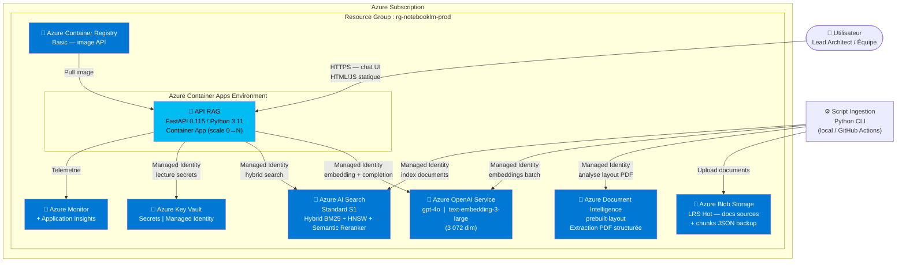

# Guide : NotebookLM Azure — Implémentation complète

## 1. Architecture cible

### Diagramme C4 L2



### Services retenus — justification

| Service Azure | SKU | Justification |
|---|---|---|
| **Azure OpenAI Service** | S0 | Seul service Azure permettant d'exécuter gpt-4o et text-embedding-3-large avec data residency EU, SLA Entreprise et conformité RGPD sans proxy tiers. |
| **Azure AI Search** | Standard S1 | Gère nativement le hybrid search BM25+HNSW via RRF en un seul appel API, sans orchestrateur externe. Le Semantic Ranker L2 intégré améliore la pertinence sur du texte FR sans modèle supplémentaire. S1 = 25 Go d'index + 3 répliques incluses. |
| **Azure Document Intelligence** | S0 (pay-per-page) | Le modèle `prebuilt-layout` extrait la structure logique des PDFs (paragraphes, sections, tableaux, numéros de page) avec une précision supérieure à PyPDF2 sur des documents métier complexes (en-têtes multi-colonnes, tableaux imbriqués). |
| **Azure Blob Storage** | LRS Hot | Stockage durable et versionné des documents sources à 0,02 €/Go/mois. Sert de source of truth et trigger d'ingestion si Event Grid est ajouté. |
| **Azure Container Apps** | Consumption | Scale-to-zero élimine le coût compute hors des heures d'utilisation. Simpler qu'AKS pour un monorepo API — pas de cluster à gérer. |
| **Azure Container Registry** | Basic | Registre privé pour l'image API. Managed Identity évite toute credential dans le pipeline CI/CD. |
| **Azure Key Vault** | Standard | Centralise tous les secrets et chaînes de connexion. Managed Identity garantit zéro credential en dur dans le code ou les variables d'environnement de prod. |
| **Azure Monitor + App Insights** | Pay-as-you-go | Traces distribuées, métriques latence RAG, alertes token usage. |

---

## 2. Prérequis et setup initial

### Outils locaux requis

```bash
# Azure CLI + extensions
az --version          # >= 2.60.0
az extension add --name containerapp --upgrade
az extension add --name ai-examples --upgrade

# Outils de build
python --version      # >= 3.11.0
pip --version         # >= 24.0
docker --version      # >= 24.0
bicep --version       # >= 0.28.0  (az bicep install)
```

### Installation bootstrap

```bash
az bicep install
az extension add --name containerapp
az extension add --name monitor-control-service

# Login
az login
az account set --subscription "<SUBSCRIPTION_ID>"
```

### Variables shell à définir une fois

```bash
export PROJECT="notebooklm"
export ENV="prod"
export LOCATION="francecentral"
export RG="rg-${PROJECT}-${ENV}"
export AZURE_SUBSCRIPTION=$(az account show --query id -o tsv)
export AZURE_TENANT=$(az account show --query tenantId -o tsv)
```

### Création du Resource Group

```bash
az group create \
  --name "$RG" \
  --location "$LOCATION" \
  --tags project="$PROJECT" environment="$ENV" managed-by="bicep"
```

### Rôles IAM minimaux pour le déploiement

Le principal qui déploie le Bicep (compte développeur ou Service Principal CI/CD) doit avoir :

```bash
# Rôle minimum pour déployer tous les services
az role assignment create \
  --assignee $(az account show --query user.name -o tsv) \
  --role "Contributor" \
  --scope "/subscriptions/$AZURE_SUBSCRIPTION/resourceGroups/$RG"

# Pour les role assignments (Managed Identity → services)
az role assignment create \
  --assignee $(az account show --query user.name -o tsv) \
  --role "User Access Administrator" \
  --scope "/subscriptions/$AZURE_SUBSCRIPTION/resourceGroups/$RG"
```

---

## 3. Infrastructure as Code — Bicep

### Structure des fichiers Bicep

```
infra/
├── main.bicep
├── main.parameters.json
└── modules/
    ├── openai.bicep
    ├── search.bicep
    ├── storage.bicep
    ├── docint.bicep
    ├── keyvault.bicep
    ├── registry.bicep
    ├── containerapp.bicep
    └── monitoring.bicep
```

### `infra/main.bicep`

```bicep
targetScope = 'resourceGroup'

@description('Préfixe unique pour nommer les ressources (3-8 chars lowercase)')
@minLength(3)
@maxLength(8)
param projectName string = 'nlmazure'

@description('Environnement de déploiement')
@allowed(['dev', 'staging', 'prod'])
param environment string = 'prod'

@description('Région Azure')
param location string = resourceGroup().location

@description('Object ID AAD de l\'identité qui déploie (pour Key Vault access policy)')
param deployerObjectId string

@description('Image Docker initiale du Container App (placeholder pour premier déploiement)')
param apiImageTag string = 'mcr.microsoft.com/azuredocs/containerapps-helloworld:latest'

var suffix = '${projectName}-${environment}'
var tags = {
  project: projectName
  environment: environment
  managedBy: 'bicep'
}

// ── Monitoring (déployé en premier pour avoir l'instrumentation key) ──────────
module monitoring 'modules/monitoring.bicep' = {
  name: 'monitoring'
  params: {
    suffix: suffix
    location: location
    tags: tags
  }
}

// ── Key Vault ──────────────────────────────────────────────────────────────────
module keyvault 'modules/keyvault.bicep' = {
  name: 'keyvault'
  params: {
    suffix: suffix
    location: location
    tags: tags
    deployerObjectId: deployerObjectId
  }
}

// ── Azure OpenAI ──────────────────────────────────────────────────────────────
module openai 'modules/openai.bicep' = {
  name: 'openai'
  params: {
    suffix: suffix
    location: location
    tags: tags
  }
}

// ── Azure AI Search ───────────────────────────────────────────────────────────
module search 'modules/search.bicep' = {
  name: 'search'
  params: {
    suffix: suffix
    location: location
    tags: tags
  }
}

// ── Storage ───────────────────────────────────────────────────────────────────
module storage 'modules/storage.bicep' = {
  name: 'storage'
  params: {
    suffix: suffix
    location: location
    tags: tags
  }
}

// ── Document Intelligence ─────────────────────────────────────────────────────
module docint 'modules/docint.bicep' = {
  name: 'docint'
  params: {
    suffix: suffix
    location: location
    tags: tags
  }
}

// ── Container Registry ────────────────────────────────────────────────────────
module registry 'modules/registry.bicep' = {
  name: 'registry'
  params: {
    suffix: suffix
    location: location
    tags: tags
  }
}

// ── Container Apps (API) ──────────────────────────────────────────────────────
module containerapp 'modules/containerapp.bicep' = {
  name: 'containerapp'
  params: {
    suffix: suffix
    location: location
    tags: tags
    apiImageTag: apiImageTag
    appInsightsConnectionString: monitoring.outputs.appInsightsConnectionString
    registryLoginServer: registry.outputs.loginServer
    registryName: registry.outputs.name
  }
}

// ── Role Assignments : Managed Identity → Services ───────────────────────────
// API Container App → Azure OpenAI
resource roleApiOpenAI 'Microsoft.Authorization/roleAssignments@2022-04-01' = {
  name: guid(resourceGroup().id, containerapp.outputs.principalId, 'CognitiveServicesOpenAIUser')
  scope: resourceGroup()
  properties: {
    roleDefinitionId: subscriptionResourceId('Microsoft.Authorization/roleDefinitions', '5e0bd9bd-7b93-4f28-af87-19fc36ad61bd')
    principalId: containerapp.outputs.principalId
    principalType: 'ServicePrincipal'
  }
}

// API Container App → Azure AI Search (Data Contributor)
resource roleApiSearch 'Microsoft.Authorization/roleAssignments@2022-04-01' = {
  name: guid(resourceGroup().id, containerapp.outputs.principalId, 'SearchIndexDataContributor')
  scope: resourceGroup()
  properties: {
    roleDefinitionId: subscriptionResourceId('Microsoft.Authorization/roleDefinitions', '8ebe5a00-799e-43f5-93ac-243d3dce84a7')
    principalId: containerapp.outputs.principalId
    principalType: 'ServicePrincipal'
  }
}

// API Container App → Key Vault (Secrets User)
resource roleApiKV 'Microsoft.Authorization/roleAssignments@2022-04-01' = {
  name: guid(resourceGroup().id, containerapp.outputs.principalId, 'KeyVaultSecretsUser')
  scope: resourceGroup()
  properties: {
    roleDefinitionId: subscriptionResourceId('Microsoft.Authorization/roleDefinitions', '4633458b-17de-408a-b874-0445c86b69e6')
    principalId: containerapp.outputs.principalId
    principalType: 'ServicePrincipal'
  }
}

// ── Secrets dans Key Vault ───────────────────────────────────────────────────
resource kvOpenAIEndpoint 'Microsoft.KeyVault/vaults/secrets@2023-07-01' = {
  name: '${keyvault.outputs.name}/openai-endpoint'
  properties: {
    value: openai.outputs.endpoint
  }
}

resource kvSearchEndpoint 'Microsoft.KeyVault/vaults/secrets@2023-07-01' = {
  name: '${keyvault.outputs.name}/search-endpoint'
  properties: {
    value: search.outputs.endpoint
  }
}

resource kvDocIntEndpoint 'Microsoft.KeyVault/vaults/secrets@2023-07-01' = {
  name: '${keyvault.outputs.name}/docint-endpoint'
  properties: {
    value: docint.outputs.endpoint
  }
}

resource kvStorageAccount 'Microsoft.KeyVault/vaults/secrets@2023-07-01' = {
  name: '${keyvault.outputs.name}/storage-account-name'
  properties: {
    value: storage.outputs.accountName
  }
}

// ── Outputs ───────────────────────────────────────────────────────────────────
output apiUrl string = containerapp.outputs.apiUrl
output registryLoginServer string = registry.outputs.loginServer
output keyVaultName string = keyvault.outputs.name
output openAIEndpoint string = openai.outputs.endpoint
output searchEndpoint string = search.outputs.endpoint
output storageAccountName string = storage.outputs.accountName
output docIntEndpoint string = docint.outputs.endpoint
```

### `infra/modules/openai.bicep`

```bicep
param suffix string
param location string
param tags object

resource openai 'Microsoft.CognitiveServices/accounts@2024-10-01' = {
  name: 'oai-${suffix}'
  location: location
  tags: tags
  kind: 'OpenAI'
  sku: {
    name: 'S0'
  }
  properties: {
    customSubDomainName: 'oai-${suffix}'
    publicNetworkAccess: 'Enabled'
    disableLocalAuth: true
  }
}

resource gpt4oDeployment 'Microsoft.CognitiveServices/accounts/deployments@2024-10-01' = {
  parent: openai
  name: 'gpt-4o'
  sku: {
    name: 'Standard'
    capacity: 30
  }
  properties: {
    model: {
      format: 'OpenAI'
      name: 'gpt-4o'
      version: '2024-11-20'
    }
    versionUpgradeOption: 'NoAutoUpgrade'
  }
}

resource embeddingDeployment 'Microsoft.CognitiveServices/accounts/deployments@2024-10-01' = {
  parent: openai
  name: 'text-embedding-3-large'
  dependsOn: [gpt4oDeployment]
  sku: {
    name: 'Standard'
    capacity: 120
  }
  properties: {
    model: {
      format: 'OpenAI'
      name: 'text-embedding-3-large'
      version: '1'
    }
    versionUpgradeOption: 'NoAutoUpgrade'
  }
}

output endpoint string = openai.properties.endpoint
output name string = openai.name
```

### `infra/modules/search.bicep`

```bicep
param suffix string
param location string
param tags object

resource search 'Microsoft.Search/searchServices@2024-06-01-preview' = {
  name: 'srch-${suffix}'
  location: location
  tags: tags
  sku: {
    name: 'standard'
  }
  properties: {
    replicaCount: 1
    partitionCount: 1
    hostingMode: 'default'
    publicNetworkAccess: 'enabled'
    authOptions: {
      aadOrApiKey: {
        aadAuthFailureMode: 'http401WithBearerChallenge'
      }
    }
    semanticSearch: 'standard'
  }
}

output endpoint string = 'https://${search.name}.search.windows.net'
output name string = search.name
```

### `infra/modules/storage.bicep`

```bicep
param suffix string
param location string
param tags object

var storageName = replace('st${suffix}', '-', '')

resource storage 'Microsoft.Storage/storageAccounts@2023-05-01' = {
  name: length(storageName) > 24 ? substring(storageName, 0, 24) : storageName
  location: location
  tags: tags
  kind: 'StorageV2'
  sku: {
    name: 'Standard_LRS'
  }
  properties: {
    accessTier: 'Hot'
    supportsHttpsTrafficOnly: true
    minimumTlsVersion: 'TLS1_2'
    allowBlobPublicAccess: false
    allowSharedKeyAccess: false
  }
}

resource docsContainer 'Microsoft.Storage/storageAccounts/blobServices/containers@2023-05-01' = {
  name: '${storage.name}/default/documents'
  properties: {
    publicAccess: 'None'
  }
}

output accountName string = storage.name
output blobEndpoint string = storage.properties.primaryEndpoints.blob
```

### `infra/modules/docint.bicep`

```bicep
param suffix string
param location string
param tags object

resource docint 'Microsoft.CognitiveServices/accounts@2024-10-01' = {
  name: 'di-${suffix}'
  location: location
  tags: tags
  kind: 'FormRecognizer'
  sku: {
    name: 'S0'
  }
  properties: {
    customSubDomainName: 'di-${suffix}'
    publicNetworkAccess: 'Enabled'
    disableLocalAuth: true
  }
}

output endpoint string = docint.properties.endpoint
output name string = docint.name
```

### `infra/modules/keyvault.bicep`

```bicep
param suffix string
param location string
param tags object
param deployerObjectId string

resource kv 'Microsoft.KeyVault/vaults@2023-07-01' = {
  name: 'kv-${suffix}'
  location: location
  tags: tags
  properties: {
    tenantId: subscription().tenantId
    sku: {
      family: 'A'
      name: 'standard'
    }
    enableRbacAuthorization: true
    enableSoftDelete: true
    softDeleteRetentionInDays: 7
    enablePurgeProtection: false
    publicNetworkAccess: 'Enabled'
  }
}

resource roleDeployerKV 'Microsoft.Authorization/roleAssignments@2022-04-01' = {
  name: guid(kv.id, deployerObjectId, 'KeyVaultSecretsOfficer')
  scope: kv
  properties: {
    roleDefinitionId: subscriptionResourceId('Microsoft.Authorization/roleDefinitions', 'b86a8fe4-44ce-4948-aee5-eccb2c155cd7')
    principalId: deployerObjectId
    principalType: 'User'
  }
}

output name string = kv.name
output uri string = kv.properties.vaultUri
```

### `infra/modules/registry.bicep`

```bicep
param suffix string
param location string
param tags object

var acrName = replace('acr${suffix}', '-', '')

resource registry 'Microsoft.ContainerRegistry/registries@2023-11-01-preview' = {
  name: length(acrName) > 50 ? substring(acrName, 0, 50) : acrName
  location: location
  tags: tags
  sku: {
    name: 'Basic'
  }
  properties: {
    adminUserEnabled: false
    anonymousPullEnabled: false
  }
}

output loginServer string = registry.properties.loginServer
output name string = registry.name
```

### `infra/modules/containerapp.bicep`

```bicep
param suffix string
param location string
param tags object
param apiImageTag string
param appInsightsConnectionString string
param registryLoginServer string
param registryName string

resource logAnalytics 'Microsoft.OperationalInsights/workspaces@2023-09-01' = {
  name: 'law-${suffix}'
  location: location
  tags: tags
  properties: {
    sku: {
      name: 'PerGB2018'
    }
    retentionInDays: 30
  }
}

resource cae 'Microsoft.App/managedEnvironments@2024-03-01' = {
  name: 'cae-${suffix}'
  location: location
  tags: tags
  properties: {
    appLogsConfiguration: {
      destination: 'log-analytics'
      logAnalyticsConfiguration: {
        customerId: logAnalytics.properties.customerId
        sharedKey: logAnalytics.listKeys().primarySharedKey
      }
    }
  }
}

resource apiIdentity 'Microsoft.ManagedIdentity/userAssignedIdentities@2023-01-31' = {
  name: 'id-api-${suffix}'
  location: location
  tags: tags
}

resource roleAcrPull 'Microsoft.Authorization/roleAssignments@2022-04-01' = {
  name: guid(resourceGroup().id, apiIdentity.id, 'AcrPull')
  scope: resourceGroup()
  properties: {
    roleDefinitionId: subscriptionResourceId('Microsoft.Authorization/roleDefinitions', '7f951dda-4ed3-4680-a7ca-43fe172d538d')
    principalId: apiIdentity.properties.principalId
    principalType: 'ServicePrincipal'
  }
}

resource api 'Microsoft.App/containerApps@2024-03-01' = {
  name: 'ca-api-${suffix}'
  location: location
  tags: tags
  identity: {
    type: 'UserAssigned'
    userAssignedIdentities: {
      '${apiIdentity.id}': {}
    }
  }
  properties: {
    environmentId: cae.id
    configuration: {
      ingress: {
        external: true
        targetPort: 8000
        transport: 'http'
        corsPolicy: {
          allowedOrigins: ['*']
          allowedMethods: ['GET', 'POST', 'OPTIONS']
          allowedHeaders: ['*']
        }
      }
      registries: [
        {
          server: registryLoginServer
          identity: apiIdentity.id
        }
      ]
    }
    template: {
      containers: [
        {
          name: 'api'
          image: apiImageTag
          resources: {
            cpu: json('0.5')
            memory: '1Gi'
          }
          env: [
            {
              name: 'AZURE_CLIENT_ID'
              value: apiIdentity.properties.clientId
            }
            {
              name: 'APPLICATIONINSIGHTS_CONNECTION_STRING'
              value: appInsightsConnectionString
            }
          ]
        }
      ]
      scale: {
        minReplicas: 0
        maxReplicas: 5
        rules: [
          {
            name: 'http-scaling'
            http: {
              metadata: {
                concurrentRequests: '20'
              }
            }
          }
        ]
      }
    }
  }
  dependsOn: [roleAcrPull]
}

output apiUrl string = 'https://${api.properties.configuration.ingress.fqdn}'
output principalId string = apiIdentity.properties.principalId
output name string = api.name
```

### `infra/modules/monitoring.bicep`

```bicep
param suffix string
param location string
param tags object

resource appInsights 'Microsoft.Insights/components@2020-02-02' = {
  name: 'appi-${suffix}'
  location: location
  tags: tags
  kind: 'web'
  properties: {
    Application_Type: 'web'
    RetentionInDays: 30
    publicNetworkAccessForIngestion: 'Enabled'
    publicNetworkAccessForQuery: 'Enabled'
  }
}

output appInsightsConnectionString string = appInsights.properties.ConnectionString
output instrumentationKey string = appInsights.properties.InstrumentationKey
```

### `infra/main.parameters.json`

```json
{
  "$schema": "https://schema.management.azure.com/schemas/2019-04-01/deploymentParameters.json#",
  "contentVersion": "1.0.0.0",
  "parameters": {
    "projectName": {
      "value": "nlmazure"
    },
    "environment": {
      "value": "prod"
    },
    "location": {
      "value": "francecentral"
    },
    "deployerObjectId": {
      "value": "<REMPLACER_PAR_VOTRE_OBJECT_ID_AAD>"
    },
    "apiImageTag": {
      "value": "mcr.microsoft.com/azuredocs/containerapps-helloworld:latest"
    }
  }
}
```

### Commandes de déploiement Bicep

```bash
# Récupérer son Object ID AAD
DEPLOYER_OID=$(az ad signed-in-user show --query id -o tsv)

# Valider le template (what-if)
az deployment group what-if \
  --resource-group "$RG" \
  --template-file infra/main.bicep \
  --parameters infra/main.parameters.json \
  --parameters deployerObjectId="$DEPLOYER_OID"

# Déployer
az deployment group create \
  --resource-group "$RG" \
  --template-file infra/main.bicep \
  --parameters infra/main.parameters.json \
  --parameters deployerObjectId="$DEPLOYER_OID" \
  --name "notebooklm-$(date +%Y%m%d%H%M)" \
  --output table

# Récupérer les outputs dans des variables shell
OPENAI_ENDPOINT=$(az deployment group show -g "$RG" -n "notebooklm-*" --query properties.outputs.openAIEndpoint.value -o tsv)
SEARCH_ENDPOINT=$(az deployment group show -g "$RG" -n "notebooklm-*" --query properties.outputs.searchEndpoint.value -o tsv)
STORAGE_ACCOUNT=$(az deployment group show -g "$RG" -n "notebooklm-*" --query properties.outputs.storageAccountName.value -o tsv)
DOCINT_ENDPOINT=$(az deployment group show -g "$RG" -n "notebooklm-*" --query properties.outputs.docIntEndpoint.value -o tsv)
ACR_SERVER=$(az deployment group show -g "$RG" -n "notebooklm-*" --query properties.outputs.registryLoginServer.value -o tsv)
KV_NAME=$(az deployment group show -g "$RG" -n "notebooklm-*" --query properties.outputs.keyVaultName.value -o tsv)
```

---

## 4. Pipeline d'ingestion documentaire

### Stratégie de chunking par type de document

| Type | Outil d'extraction | chunk_size | chunk_overlap | Stratégie de split |
|---|---|---|---|---|
| **PDF** | Azure Document Intelligence `prebuilt-layout` | **1 000 tokens** | **200 tokens** | Split par paragraphes (unités logiques du layout model). Si paragraphe > chunk_size, split par phrase. Titre de section propagé dans les métadonnées de chaque chunk. |
| **Markdown** | Lecture directe Python | **800 tokens** | **150 tokens** | Split primaire par heading (`#`, `##`, `###`). Si section > chunk_size, split par ligne vide (paragraphe Markdown). Le heading parent est préservé dans les métadonnées. |
| **DOCX** | python-docx | **1 000 tokens** | **200 tokens** | Split par paragraphes Word. Heading styles (`Heading 1/2/3`) identifient les sections. Tables converties en texte tabulaire puis chunked. |

**Paramètre global** : token counting via `tiktoken` avec encodeur `cl100k_base` (compatible gpt-4o et text-embedding-3-large). Un chunk de 1 000 tokens correspond à environ 750 mots en français.

### `ingest/requirements.txt`

```text
azure-ai-documentintelligence==1.0.0
azure-search-documents==11.6.0b8
azure-storage-blob==12.22.0
azure-identity==1.19.0
openai==1.57.0
tiktoken==0.8.0
python-docx==1.1.2
pypdf==4.3.1
click==8.1.7
tenacity==9.0.0
python-dotenv==1.0.1
tqdm==4.67.0
```

### `ingest/chunkers/base.py`

```python
from dataclasses import dataclass, field
from typing import Optional


@dataclass
class Chunk:
    content: str
    source_file: str
    page_number: int
    chunk_index: int
    doc_type: str
    section: str = ""
    title: str = ""
    file_hash: str = ""
```

### `ingest/chunkers/pdf_chunker.py`

```python
import hashlib
import os
from typing import Iterator

import tiktoken
from azure.ai.documentintelligence import DocumentIntelligenceClient
from azure.ai.documentintelligence.models import AnalyzeDocumentRequest
from azure.identity import DefaultAzureCredential
from tenacity import retry, stop_after_attempt, wait_exponential

from .base import Chunk

CHUNK_SIZE = 1000
CHUNK_OVERLAP = 200
ENCODER = tiktoken.get_encoding("cl100k_base")


def _token_count(text: str) -> int:
    return len(ENCODER.encode(text))


def _split_by_tokens(text: str, chunk_size: int, overlap: int) -> list[str]:
    tokens = ENCODER.encode(text)
    chunks = []
    start = 0
    while start < len(tokens):
        end = min(start + chunk_size, len(tokens))
        chunk_tokens = tokens[start:end]
        chunks.append(ENCODER.decode(chunk_tokens))
        if end == len(tokens):
            break
        start += chunk_size - overlap
    return chunks


class PDFChunker:
    def __init__(self, endpoint: str, credential: DefaultAzureCredential):
        self.client = DocumentIntelligenceClient(endpoint, credential)

    @retry(
        stop=stop_after_attempt(3),
        wait=wait_exponential(multiplier=2, min=4, max=30),
    )
    def _analyze(self, file_bytes: bytes) -> object:
        poller = self.client.begin_analyze_document(
            "prebuilt-layout",
            AnalyzeDocumentRequest(bytes_source=file_bytes),
        )
        return poller.result()

    def chunk_file(self, file_path: str) -> Iterator[Chunk]:
        with open(file_path, "rb") as f:
            file_bytes = f.read()

        file_hash = hashlib.sha256(file_bytes).hexdigest()
        source_file = os.path.basename(file_path)

        result = self._analyze(file_bytes)

        paragraphs_with_meta: list[dict] = []
        current_section = ""
        current_title = ""

        if result.paragraphs:
            for para in result.paragraphs:
                role = para.role or "paragraph"
                content = para.content.strip()
                if not content:
                    continue

                page_num = 1
                if para.bounding_regions:
                    page_num = para.bounding_regions[0].page_number

                if role in ("sectionHeading", "title"):
                    current_section = content
                    if role == "title":
                        current_title = content

                paragraphs_with_meta.append({
                    "content": content,
                    "page_number": page_num,
                    "section": current_section,
                    "title": current_title,
                    "role": role,
                })

        chunk_buffer: list[str] = []
        buffer_tokens = 0
        chunk_index = 0
        page_number = 1
        section = ""
        title = ""

        def flush_buffer() -> Chunk | None:
            nonlocal chunk_index
            if not chunk_buffer:
                return None
            content = "\n\n".join(chunk_buffer)
            c = Chunk(
                content=content,
                source_file=source_file,
                page_number=page_number,
                chunk_index=chunk_index,
                doc_type="pdf",
                section=section,
                title=title,
                file_hash=file_hash,
            )
            chunk_index += 1
            return c

        for para in paragraphs_with_meta:
            para_tokens = _token_count(para["content"])

            if para_tokens > CHUNK_SIZE:
                c = flush_buffer()
                if c:
                    yield c
                chunk_buffer = []
                buffer_tokens = 0

                sub_chunks = _split_by_tokens(para["content"], CHUNK_SIZE, CHUNK_OVERLAP)
                for sub in sub_chunks:
                    yield Chunk(
                        content=sub,
                        source_file=source_file,
                        page_number=para["page_number"],
                        chunk_index=chunk_index,
                        doc_type="pdf",
                        section=para["section"],
                        title=para["title"],
                        file_hash=file_hash,
                    )
                    chunk_index += 1
                continue

            if buffer_tokens + para_tokens > CHUNK_SIZE and chunk_buffer:
                c = flush_buffer()
                if c:
                    yield c

                overlap_buffer: list[str] = []
                overlap_tokens = 0
                for p in reversed(chunk_buffer):
                    t = _token_count(p)
                    if overlap_tokens + t <= CHUNK_OVERLAP:
                        overlap_buffer.insert(0, p)
                        overlap_tokens += t
                    else:
                        break

                chunk_buffer = overlap_buffer
                buffer_tokens = overlap_tokens

            chunk_buffer.append(para["content"])
            buffer_tokens += para_tokens
            page_number = para["page_number"]
            section = para["section"]
            title = para["title"]

        c = flush_buffer()
        if c:
            yield c
```

### `ingest/chunkers/md_chunker.py`

```python
import hashlib
import os
import re
from typing import Iterator

import tiktoken

from .base import Chunk

CHUNK_SIZE = 800
CHUNK_OVERLAP = 150
ENCODER = tiktoken.get_encoding("cl100k_base")


def _token_count(text: str) -> int:
    return len(ENCODER.encode(text))


def _split_by_tokens(text: str, chunk_size: int, overlap: int) -> list[str]:
    tokens = ENCODER.encode(text)
    chunks = []
    start = 0
    while start < len(tokens):
        end = min(start + chunk_size, len(tokens))
        chunks.append(ENCODER.decode(tokens[start:end]))
        if end == len(tokens):
            break
        start += chunk_size - overlap
    return chunks


class MDChunker:
    def chunk_file(self, file_path: str) -> Iterator[Chunk]:
        with open(file_path, "r", encoding="utf-8") as f:
            raw = f.read()

        file_hash = hashlib.sha256(raw.encode()).hexdigest()
        source_file = os.path.basename(file_path)

        heading_pattern = re.compile(r'^(#{1,3})\s+(.+)$', re.MULTILINE)
        sections: list[dict] = []
        matches = list(heading_pattern.finditer(raw))

        if not matches:
            for i, chunk_text in enumerate(_split_by_tokens(raw, CHUNK_SIZE, CHUNK_OVERLAP)):
                yield Chunk(
                    content=chunk_text,
                    source_file=source_file,
                    page_number=1,
                    chunk_index=i,
                    doc_type="md",
                    section="",
                    title=source_file,
                    file_hash=file_hash,
                )
            return

        if matches[0].start() > 0:
            preamble = raw[:matches[0].start()].strip()
            if preamble:
                sections.append({"heading": "", "level": 0, "content": preamble})

        for i, match in enumerate(matches):
            start = match.end()
            end = matches[i + 1].start() if i + 1 < len(matches) else len(raw)
            content = raw[start:end].strip()
            sections.append({
                "heading": match.group(2).strip(),
                "level": len(match.group(1)),
                "content": content,
            })

        chunk_index = 0
        heading_stack: list[str] = ["", "", ""]

        for section in sections:
            if section["level"] > 0:
                heading_stack[section["level"] - 1] = section["heading"]
                for j in range(section["level"], 3):
                    heading_stack[j] = ""

            section_header = " > ".join(h for h in heading_stack if h)
            full_content = (
                f"{section['heading']}\n\n{section['content']}"
                if section["heading"]
                else section["content"]
            )

            if _token_count(full_content) <= CHUNK_SIZE:
                yield Chunk(
                    content=full_content,
                    source_file=source_file,
                    page_number=1,
                    chunk_index=chunk_index,
                    doc_type="md",
                    section=section_header,
                    title=heading_stack[0] or source_file,
                    file_hash=file_hash,
                )
                chunk_index += 1
            else:
                paragraphs = re.split(r'\n{2,}', full_content)
                buffer = ""
                for para in paragraphs:
                    candidate = f"{buffer}\n\n{para}".strip() if buffer else para
                    if _token_count(candidate) <= CHUNK_SIZE:
                        buffer = candidate
                    else:
                        if buffer:
                            yield Chunk(
                                content=buffer,
                                source_file=source_file,
                                page_number=1,
                                chunk_index=chunk_index,
                                doc_type="md",
                                section=section_header,
                                title=heading_stack[0] or source_file,
                                file_hash=file_hash,
                            )
                            chunk_index += 1
                        if _token_count(para) > CHUNK_SIZE:
                            for sub in _split_by_tokens(para, CHUNK_SIZE, CHUNK_OVERLAP):
                                yield Chunk(
                                    content=sub,
                                    source_file=source_file,
                                    page_number=1,
                                    chunk_index=chunk_index,
                                    doc_type="md",
                                    section=section_header,
                                    title=heading_stack[0] or source_file,
                                    file_hash=file_hash,
                                )
                                chunk_index += 1
                            buffer = ""
                        else:
                            buffer = para

                if buffer:
                    yield Chunk(
                        content=buffer,
                        source_file=source_file,
                        page_number=1,
                        chunk_index=chunk_index,
                        doc_type="md",
                        section=section_header,
                        title=heading_stack[0] or source_file,
                        file_hash=file_hash,
                    )
                    chunk_index += 1
```

### `ingest/chunkers/docx_chunker.py`

```python
import hashlib
import os
from typing import Iterator

import tiktoken
from docx import Document

from .base import Chunk

CHUNK_SIZE = 1000
CHUNK_OVERLAP = 200
ENCODER = tiktoken.get_encoding("cl100k_base")
HEADING_STYLES = {"Heading 1", "Heading 2", "Heading 3", "Titre 1", "Titre 2", "Titre 3"}


def _token_count(text: str) -> int:
    return len(ENCODER.encode(text))


def _split_by_tokens(text: str, chunk_size: int, overlap: int) -> list[str]:
    tokens = ENCODER.encode(text)
    chunks = []
    start = 0
    while start < len(tokens):
        end = min(start + chunk_size, len(tokens))
        chunks.append(ENCODER.decode(tokens[start:end]))
        if end == len(tokens):
            break
        start += chunk_size - overlap
    return chunks


def _table_to_text(table) -> str:
    rows = []
    for row in table.rows:
        cells = [cell.text.strip() for cell in row.cells]
        rows.append(" | ".join(cells))
    return "\n".join(rows)


class DOCXChunker:
    def chunk_file(self, file_path: str) -> Iterator[Chunk]:
        with open(file_path, "rb") as f:
            raw_bytes = f.read()

        file_hash = hashlib.sha256(raw_bytes).hexdigest()
        source_file = os.path.basename(file_path)

        doc = Document(file_path)

        elements: list[dict] = []
        body = doc.element.body
        for child in body:
            tag = child.tag.split('}')[-1] if '}' in child.tag else child.tag
            if tag == 'p':
                for para in doc.paragraphs:
                    if para._element is child:
                        text = para.text.strip()
                        style = para.style.name if para.style else ""
                        if text:
                            elements.append({
                                "type": "paragraph",
                                "content": text,
                                "is_heading": style in HEADING_STYLES,
                                "style": style,
                            })
                        break
            elif tag == 'tbl':
                for table in doc.tables:
                    if table._element is child:
                        text = _table_to_text(table)
                        if text.strip():
                            elements.append({
                                "type": "table",
                                "content": text,
                                "is_heading": False,
                                "style": "Table",
                            })
                        break

        chunk_index = 0
        chunk_buffer: list[str] = []
        buffer_tokens = 0
        current_section = ""
        current_title = ""

        def flush() -> Chunk | None:
            nonlocal chunk_index
            if not chunk_buffer:
                return None
            c = Chunk(
                content="\n\n".join(chunk_buffer),
                source_file=source_file,
                page_number=1,
                chunk_index=chunk_index,
                doc_type="docx",
                section=current_section,
                title=current_title,
                file_hash=file_hash,
            )
            chunk_index += 1
            return c

        for elem in elements:
            if elem["is_heading"]:
                if "Heading 1" in elem["style"] or "Titre 1" in elem["style"]:
                    current_title = elem["content"]
                current_section = elem["content"]

            tokens = _token_count(elem["content"])

            if tokens > CHUNK_SIZE:
                c = flush()
                if c:
                    yield c
                chunk_buffer = []
                buffer_tokens = 0
                for sub in _split_by_tokens(elem["content"], CHUNK_SIZE, CHUNK_OVERLAP):
                    yield Chunk(
                        content=sub,
                        source_file=source_file,
                        page_number=1,
                        chunk_index=chunk_index,
                        doc_type="docx",
                        section=current_section,
                        title=current_title,
                        file_hash=file_hash,
                    )
                    chunk_index += 1
                continue

            if buffer_tokens + tokens > CHUNK_SIZE and chunk_buffer:
                c = flush()
                if c:
                    yield c
                overlap_buf: list[str] = []
                ot = 0
                for p in reversed(chunk_buffer):
                    t = _token_count(p)
                    if ot + t <= CHUNK_OVERLAP:
                        overlap_buf.insert(0, p)
                        ot += t
                    else:
                        break
                chunk_buffer = overlap_buf
                buffer_tokens = ot

            chunk_buffer.append(elem["content"])
            buffer_tokens += tokens

        c = flush()
        if c:
            yield c
```

### `ingest/embedder.py`

```python
import os
import time
from typing import Any

from openai import AzureOpenAI
from azure.identity import DefaultAzureCredential, get_bearer_token_provider
from tenacity import retry, stop_after_attempt, wait_exponential, retry_if_exception_type
from openai import RateLimitError, APITimeoutError

EMBEDDING_MODEL = os.environ["AZURE_OPENAI_EMBEDDING_DEPLOYMENT"]
EMBEDDING_DIMENSIONS = 3072
BATCH_SIZE = 16


class Embedder:
    def __init__(self, endpoint: str, credential: DefaultAzureCredential):
        token_provider = get_bearer_token_provider(
            credential, "https://cognitiveservices.azure.com/.default"
        )
        self.client = AzureOpenAI(
            azure_endpoint=endpoint,
            azure_ad_token_provider=token_provider,
            api_version="2024-10-21",
        )

    @retry(
        stop=stop_after_attempt(5),
        wait=wait_exponential(multiplier=1, min=4, max=60),
        retry=retry_if_exception_type((RateLimitError, APITimeoutError)),
    )
    def _embed_batch(self, texts: list[str]) -> list[list[float]]:
        response = self.client.embeddings.create(
            input=texts,
            model=EMBEDDING_MODEL,
            dimensions=EMBEDDING_DIMENSIONS,
        )
        return [item.embedding for item in response.data]

    def embed_chunks(self, texts: list[str]) -> list[list[float]]:
        all_embeddings = []
        for i in range(0, len(texts), BATCH_SIZE):
            batch = texts[i : i + BATCH_SIZE]
            embeddings = self._embed_batch(batch)
            all_embeddings.extend(embeddings)
            if i + BATCH_SIZE < len(texts):
                time.sleep(0.1)
        return all_embeddings
```

### `ingest/indexer.py`

```python
import os
from datetime import datetime, timezone

from azure.identity import DefaultAzureCredential
from azure.search.documents import SearchClient
from azure.search.documents.indexes import SearchIndexClient
from azure.search.documents.indexes.models import (
    HnswAlgorithmConfiguration,
    HnswParameters,
    SearchField,
    SearchFieldDataType,
    SearchIndex,
    SemanticConfiguration,
    SemanticField,
    SemanticPrioritizedFields,
    SemanticSearch,
    SimpleField,
    VectorSearch,
    VectorSearchProfile,
)

INDEX_NAME = "notebooklm-chunks"
VECTOR_DIMENSIONS = 3072


def _build_index_definition() -> SearchIndex:
    vector_search = VectorSearch(
        profiles=[
            VectorSearchProfile(
                name="default-profile",
                algorithm_configuration_name="default-hnsw",
            )
        ],
        algorithms=[
            HnswAlgorithmConfiguration(
                name="default-hnsw",
                parameters=HnswParameters(
                    m=4,
                    ef_construction=400,
                    ef_search=500,
                    metric="cosine",
                ),
            )
        ],
    )

    semantic_search = SemanticSearch(
        configurations=[
            SemanticConfiguration(
                name="default-semantic-config",
                prioritized_fields=SemanticPrioritizedFields(
                    title_field=SemanticField(field_name="title"),
                    content_fields=[SemanticField(field_name="content")],
                    keywords_fields=[SemanticField(field_name="section")],
                ),
            )
        ]
    )

    fields = [
        SimpleField(name="id", type=SearchFieldDataType.String, key=True, filterable=True),
        SearchField(
            name="content",
            type=SearchFieldDataType.String,
            searchable=True,
            analyzer_name="standard.lucene",
        ),
        SearchField(
            name="content_vector",
            type=SearchFieldDataType.Collection(SearchFieldDataType.Single),
            searchable=True,
            vector_search_dimensions=VECTOR_DIMENSIONS,
            vector_search_profile_name="default-profile",
        ),
        SimpleField(name="source_file", type=SearchFieldDataType.String, filterable=True, facetable=True),
        SimpleField(name="page_number", type=SearchFieldDataType.Int32, filterable=True, sortable=True),
        SimpleField(name="chunk_index", type=SearchFieldDataType.Int32, filterable=True, sortable=True),
        SimpleField(name="doc_type", type=SearchFieldDataType.String, filterable=True, facetable=True),
        SearchField(name="section", type=SearchFieldDataType.String, searchable=True, filterable=True),
        SearchField(name="title", type=SearchFieldDataType.String, searchable=True),
        SimpleField(name="file_hash", type=SearchFieldDataType.String, filterable=True),
        SimpleField(
            name="created_at",
            type=SearchFieldDataType.DateTimeOffset,
            filterable=True,
            sortable=True,
        ),
    ]

    return SearchIndex(
        name=INDEX_NAME,
        fields=fields,
        vector_search=vector_search,
        semantic_search=semantic_search,
    )


class Indexer:
    def __init__(self, endpoint: str, credential: DefaultAzureCredential):
        self.index_client = SearchIndexClient(endpoint, credential)
        self.search_client = SearchClient(endpoint, INDEX_NAME, credential)

    def ensure_index(self) -> None:
        self.index_client.create_or_update_index(_build_index_definition())
        print(f"Index '{INDEX_NAME}' prêt.")

    def get_indexed_hashes(self) -> set[str]:
        results = self.search_client.search(
            search_text="*",
            select=["file_hash"],
            top=10000,
        )
        return {r["file_hash"] for r in results if r.get("file_hash")}

    def upload_chunks(self, documents: list[dict]) -> None:
        BATCH = 100
        for i in range(0, len(documents), BATCH):
            batch = documents[i : i + BATCH]
            result = self.search_client.upload_documents(documents=batch)
            failed = [r for r in result if not r.succeeded]
            if failed:
                for f in failed:
                    print(f"Erreur indexation : {f.key} — {f.error_message}")
```

### `ingest/ingest.py`

```python
#!/usr/bin/env python3
"""
Script d'ingestion documentaire pour NotebookLM Azure.
Usage : python ingest.py --docs-dir ./documents --force-reindex
"""

import os
import sys
from pathlib import Path

import click
from azure.identity import DefaultAzureCredential
from dotenv import load_dotenv
from tqdm import tqdm

load_dotenv()

from chunkers.pdf_chunker import PDFChunker
from chunkers.md_chunker import MDChunker
from chunkers.docx_chunker import DOCXChunker
from embedder import Embedder
from indexer import Indexer

SUPPORTED_EXTENSIONS = {".pdf", ".md", ".docx"}


@click.command()
@click.option("--docs-dir", required=True, type=click.Path(exists=True))
@click.option("--force-reindex", is_flag=True, default=False)
@click.option("--dry-run", is_flag=True, default=False)
def main(docs_dir: str, force_reindex: bool, dry_run: bool):
    required_env = [
        "AZURE_OPENAI_ENDPOINT",
        "AZURE_OPENAI_EMBEDDING_DEPLOYMENT",
        "AZURE_SEARCH_ENDPOINT",
        "AZURE_DOCINT_ENDPOINT",
    ]
    missing = [e for e in required_env if not os.environ.get(e)]
    if missing:
        click.echo(f"Variables manquantes : {', '.join(missing)}", err=True)
        sys.exit(1)

    credential = DefaultAzureCredential()

    embedder = Embedder(endpoint=os.environ["AZURE_OPENAI_ENDPOINT"], credential=credential)
    indexer = Indexer(endpoint=os.environ["AZURE_SEARCH_ENDPOINT"], credential=credential)
    pdf_chunker = PDFChunker(endpoint=os.environ["AZURE_DOCINT_ENDPOINT"], credential=credential)
    md_chunker = MDChunker()
    docx_chunker = DOCXChunker()

    docs_path = Path(docs_dir)
    files = [
        f for f in docs_path.rglob("*")
        if f.suffix.lower() in SUPPORTED_EXTENSIONS and f.is_file()
    ]

    click.echo(f"\nDocuments trouvés : {len(files)}")
    for f in files:
        click.echo(f"  {f.relative_to(docs_path)}")

    if dry_run:
        click.echo("\nDry-run : aucune ingestion effectuée.")
        return

    indexer.ensure_index()

    indexed_hashes: set[str] = set()
    if not force_reindex:
        indexed_hashes = indexer.get_indexed_hashes()
        click.echo(f"Documents déjà indexés : {len(indexed_hashes)} hashes connus.")

    for file_path in tqdm(files, desc="Ingestion"):
        suffix = file_path.suffix.lower()
        chunker = {".pdf": pdf_chunker, ".md": md_chunker, ".docx": docx_chunker}[suffix]

        try:
            raw_chunks = list(chunker.chunk_file(str(file_path)))
        except Exception as e:
            tqdm.write(f"ERREUR chunking {file_path.name}: {e}")
            continue

        if not raw_chunks:
            tqdm.write(f"Aucun chunk extrait de {file_path.name}")
            continue

        file_hash = raw_chunks[0].file_hash
        if file_hash in indexed_hashes and not force_reindex:
            tqdm.write(f"Skipped (déjà indexé) : {file_path.name}")
            continue

        texts = [c.content for c in raw_chunks]
        try:
            embeddings = embedder.embed_chunks(texts)
        except Exception as e:
            tqdm.write(f"ERREUR embedding {file_path.name}: {e}")
            continue

        from datetime import datetime, timezone
        now_iso = datetime.now(timezone.utc).isoformat()

        documents = []
        for chunk, embedding in zip(raw_chunks, embeddings):
            doc_id = f"{chunk.file_hash}_{chunk.chunk_index}"
            documents.append({
                "id": doc_id,
                "content": chunk.content,
                "content_vector": embedding,
                "source_file": chunk.source_file,
                "page_number": chunk.page_number,
                "chunk_index": chunk.chunk_index,
                "doc_type": chunk.doc_type,
                "section": chunk.section,
                "title": chunk.title,
                "file_hash": chunk.file_hash,
                "created_at": now_iso,
            })

        indexer.upload_chunks(documents)
        indexed_hashes.add(file_hash)
        tqdm.write(f"Indexé : {file_path.name} ({len(documents)} chunks)")

    click.echo("\nIngestion terminée.")


if __name__ == "__main__":
    main()
```

---

## 5. Backend RAG — API FastAPI

### `api/requirements.txt`

```text
fastapi==0.115.5
uvicorn[standard]==0.32.1
azure-search-documents==11.6.0b8
azure-identity==1.19.0
azure-keyvault-secrets==4.9.0
openai==1.57.0
python-dotenv==1.0.1
pydantic==2.10.3
tenacity==9.0.0
opencensus-ext-azure==1.1.13
```

### `api/models/schemas.py`

```python
from pydantic import BaseModel, Field
from typing import Optional


class ChatRequest(BaseModel):
    message: str = Field(..., min_length=1, max_length=4000)
    session_id: Optional[str] = Field(default=None)
    top_k: int = Field(default=5, ge=1, le=20)


class SourceReference(BaseModel):
    file: str
    page: int
    section: str
    score: float


class ChatResponse(BaseModel):
    answer: str
    session_id: str
    sources: list[SourceReference]
    tokens_used: int
```

### `api/services/retriever.py`

```python
import os
from dataclasses import dataclass

from azure.identity import DefaultAzureCredential, get_bearer_token_provider
from azure.search.documents import SearchClient
from azure.search.documents.models import VectorizedQuery, QueryType
from openai import AzureOpenAI
from tenacity import retry, stop_after_attempt, wait_exponential


@dataclass
class RetrievedChunk:
    content: str
    source_file: str
    page_number: int
    section: str
    title: str
    score: float


class Retriever:
    def __init__(self, credential: DefaultAzureCredential):
        self.search_client = SearchClient(
            endpoint=os.environ["AZURE_SEARCH_ENDPOINT"],
            index_name="notebooklm-chunks",
            credential=credential,
        )

        token_provider = get_bearer_token_provider(
            credential, "https://cognitiveservices.azure.com/.default"
        )
        self.openai_client = AzureOpenAI(
            azure_endpoint=os.environ["AZURE_OPENAI_ENDPOINT"],
            azure_ad_token_provider=token_provider,
            api_version="2024-10-21",
        )
        self.embedding_model = os.environ["AZURE_OPENAI_EMBEDDING_DEPLOYMENT"]

    @retry(stop=stop_after_attempt(3), wait=wait_exponential(multiplier=1, min=2, max=10))
    def _get_query_embedding(self, query: str) -> list[float]:
        response = self.openai_client.embeddings.create(
            input=query,
            model=self.embedding_model,
            dimensions=3072,
        )
        return response.data[0].embedding

    def retrieve(self, query: str, top_k: int = 5) -> list[RetrievedChunk]:
        query_embedding = self._get_query_embedding(query)

        vector_query = VectorizedQuery(
            vector=query_embedding,
            k_nearest_neighbors=top_k * 3,
            fields="content_vector",
        )

        results = self.search_client.search(
            search_text=query,
            vector_queries=[vector_query],
            query_type=QueryType.SEMANTIC,
            semantic_configuration_name="default-semantic-config",
            top=top_k,
            select=["id", "content", "source_file", "page_number", "section", "title", "chunk_index"],
        )

        chunks = []
        for r in results:
            chunks.append(
                RetrievedChunk(
                    content=r["content"],
                    source_file=r["source_file"],
                    page_number=r.get("page_number", 1),
                    section=r.get("section", ""),
                    title=r.get("title", ""),
                    score=r.get("@search.reranker_score") or r.get("@search.score", 0.0),
                )
            )

        return chunks
```

### `api/services/generator.py`

```python
import os
from typing import Any

from azure.identity import DefaultAzureCredential, get_bearer_token_provider
from openai import AzureOpenAI
from tenacity import retry, stop_after_attempt, wait_exponential

from .retriever import RetrievedChunk

SYSTEM_PROMPT = """Tu es un assistant expert en analyse documentaire pour une équipe de modernisation d'applications métier.
Tu as accès à un corpus de documents techniques et fonctionnels : spécifications, règles métier, documentation legacy, notes d'analyse.

Règles strictes :
1. Réponds UNIQUEMENT à partir des extraits documentaires fournis dans le contexte.
2. Cite systématiquement tes sources avec la notation [NomFichier, p.X] après chaque information factuelle.
3. Si une information demandée n'est pas dans les documents, dis-le explicitement : "Je n'ai pas trouvé cette information dans les documents fournis."
4. Si des documents se contredisent, présente les deux positions avec leurs sources respectives et signale la contradiction.
5. Pour les synthèses, structure la réponse avec des titres H2 (##) et des listes à puces.
6. Réponds en français sauf si les documents sources sont en anglais — dans ce cas, traduis les citations clés."""


class Generator:
    def __init__(self, credential: DefaultAzureCredential):
        token_provider = get_bearer_token_provider(
            credential, "https://cognitiveservices.azure.com/.default"
        )
        self.client = AzureOpenAI(
            azure_endpoint=os.environ["AZURE_OPENAI_ENDPOINT"],
            azure_ad_token_provider=token_provider,
            api_version="2024-10-21",
        )
        self.model = os.environ["AZURE_OPENAI_GPT4O_DEPLOYMENT"]

    def _build_context(self, chunks: list[RetrievedChunk]) -> str:
        parts = []
        for i, chunk in enumerate(chunks, 1):
            header = f"--- [Source {i}] {chunk.source_file}, page {chunk.page_number}"
            if chunk.section:
                header += f" | Section : {chunk.section}"
            header += " ---"
            parts.append(f"{header}\n{chunk.content}")
        return "\n\n".join(parts)

    @retry(stop=stop_after_attempt(3), wait=wait_exponential(multiplier=1, min=2, max=20))
    def generate(
        self,
        query: str,
        chunks: list[RetrievedChunk],
        conversation_history: list[dict[str, Any]],
    ) -> tuple[str, int]:
        context = self._build_context(chunks)

        user_message = f"""Contexte documentaire :
{context}

---
Question : {query}"""

        messages = [
            {"role": "system", "content": SYSTEM_PROMPT},
            *conversation_history[-8:],
            {"role": "user", "content": user_message},
        ]

        response = self.client.chat.completions.create(
            model=self.model,
            messages=messages,
            temperature=0.1,
            max_tokens=2000,
            seed=42,
        )

        answer = response.choices[0].message.content
        total_tokens = response.usage.total_tokens
        return answer, total_tokens
```

### `api/routers/chat.py`

```python
import uuid
from typing import Any

from fastapi import APIRouter, HTTPException

from api.models.schemas import ChatRequest, ChatResponse, SourceReference
from api.services.retriever import Retriever
from api.services.generator import Generator

router = APIRouter()

_sessions: dict[str, list[dict[str, Any]]] = {}
MAX_SESSION_TURNS = 20


def get_or_create_session(session_id: str | None) -> tuple[str, list]:
    sid = session_id or str(uuid.uuid4())
    if sid not in _sessions:
        _sessions[sid] = []
    return sid, _sessions[sid]


def setup_router(retriever: Retriever, generator: Generator) -> APIRouter:

    @router.post("/chat", response_model=ChatResponse)
    async def chat(request: ChatRequest):
        session_id, history = get_or_create_session(request.session_id)

        try:
            chunks = retriever.retrieve(request.message, top_k=request.top_k)
        except Exception as e:
            raise HTTPException(status_code=503, detail=f"Retrieval error: {e}")

        if not chunks:
            return ChatResponse(
                answer="Aucun document pertinent trouvé pour cette question. Vérifiez que l'ingestion a bien été effectuée.",
                session_id=session_id,
                sources=[],
                tokens_used=0,
            )

        try:
            answer, tokens_used = generator.generate(
                query=request.message,
                chunks=chunks,
                conversation_history=history,
            )
        except Exception as e:
            raise HTTPException(status_code=503, detail=f"Generation error: {e}")

        history.append({"role": "user", "content": request.message})
        history.append({"role": "assistant", "content": answer})

        if len(history) > MAX_SESSION_TURNS * 2:
            _sessions[session_id] = history[-(MAX_SESSION_TURNS * 2):]

        sources = [
            SourceReference(
                file=c.source_file,
                page=c.page_number,
                section=c.section,
                score=round(c.score, 4),
            )
            for c in chunks
        ]

        return ChatResponse(
            answer=answer,
            session_id=session_id,
            sources=sources,
            tokens_used=tokens_used,
        )

    @router.delete("/chat/{session_id}")
    async def clear_session(session_id: str):
        _sessions.pop(session_id, None)
        return {"status": "cleared", "session_id": session_id}

    return router
```

### `api/main.py`

```python
import logging
import os
from contextlib import asynccontextmanager

from azure.identity import DefaultAzureCredential, ManagedIdentityCredential
from azure.keyvault.secrets import SecretClient
from dotenv import load_dotenv
from fastapi import FastAPI
from fastapi.middleware.cors import CORSMiddleware
from fastapi.staticfiles import StaticFiles

from api.routers.chat import router as chat_router, setup_router
from api.services.retriever import Retriever
from api.services.generator import Generator

load_dotenv()

logging.basicConfig(level=logging.INFO)
logger = logging.getLogger(__name__)


def _load_secrets_from_keyvault():
    kv_uri = os.environ.get("AZURE_KEYVAULT_URI")
    if not kv_uri:
        logger.info("AZURE_KEYVAULT_URI non défini — utilisation des variables d'environnement locales.")
        return

    try:
        credential = ManagedIdentityCredential(client_id=os.environ.get("AZURE_CLIENT_ID"))
        kv_client = SecretClient(vault_url=kv_uri, credential=credential)

        secret_map = {
            "openai-endpoint": "AZURE_OPENAI_ENDPOINT",
            "search-endpoint": "AZURE_SEARCH_ENDPOINT",
            "docint-endpoint": "AZURE_DOCINT_ENDPOINT",
            "storage-account-name": "AZURE_STORAGE_ACCOUNT_NAME",
        }

        for secret_name, env_var in secret_map.items():
            if not os.environ.get(env_var):
                try:
                    value = kv_client.get_secret(secret_name).value
                    os.environ[env_var] = value
                    logger.info(f"Secret '{secret_name}' chargé depuis Key Vault.")
                except Exception as e:
                    logger.warning(f"Impossible de charger '{secret_name}': {e}")
    except Exception as e:
        logger.warning(f"Key Vault non accessible: {e}")


retriever_instance: Retriever | None = None
generator_instance: Generator | None = None


@asynccontextmanager
async def lifespan(app: FastAPI):
    global retriever_instance, generator_instance
    _load_secrets_from_keyvault()

    client_id = os.environ.get("AZURE_CLIENT_ID")
    if client_id and (os.environ.get("WEBSITE_INSTANCE_ID") or os.environ.get("CONTAINER_APP_NAME")):
        credential = ManagedIdentityCredential(client_id=client_id)
    else:
        credential = DefaultAzureCredential()

    retriever_instance = Retriever(credential)
    generator_instance = Generator(credential)
    logger.info("API NotebookLM Azure démarrée.")
    yield
    logger.info("Arrêt de l'API.")


app = FastAPI(title="NotebookLM Azure — API RAG", version="1.0.0", lifespan=lifespan)

app.add_middleware(
    CORSMiddleware,
    allow_origins=["*"],
    allow_credentials=True,
    allow_methods=["*"],
    allow_headers=["*"],
)


@app.get("/health")
async def health():
    return {"status": "ok", "service": "notebooklm-api"}


@app.on_event("startup")
async def register_routes():
    if retriever_instance and generator_instance:
        configured_router = setup_router(retriever_instance, generator_instance)
        app.include_router(configured_router, prefix="/api")


frontend_dir = os.path.join(os.path.dirname(__file__), "..", "frontend")
if os.path.exists(frontend_dir):
    app.mount("/", StaticFiles(directory=frontend_dir, html=True), name="frontend")


if __name__ == "__main__":
    import uvicorn
    uvicorn.run("api.main:app", host="0.0.0.0", port=8000, reload=True)
```

### `api/Dockerfile`

```dockerfile
FROM python:3.11-slim

WORKDIR /app

RUN apt-get update && apt-get install -y --no-install-recommends \
    curl \
    && rm -rf /var/lib/apt/lists/*

COPY api/requirements.txt ./requirements.txt
RUN pip install --no-cache-dir -r requirements.txt

COPY api/ ./api/
COPY frontend/ ./frontend/

RUN useradd -m -u 1000 appuser && chown -R appuser:appuser /app
USER appuser

EXPOSE 8000

HEALTHCHECK --interval=30s --timeout=10s --start-period=30s --retries=3 \
    CMD curl -f http://localhost:8000/health || exit 1

CMD ["uvicorn", "api.main:app", "--host", "0.0.0.0", "--port", "8000", "--workers", "2"]
```

---

## 6. Interface de chat

### `frontend/index.html`

```html
<!DOCTYPE html>
<html lang="fr">
<head>
  <meta charset="UTF-8" />
  <meta name="viewport" content="width=device-width, initial-scale=1.0" />
  <title>NotebookLM Azure</title>
  <link rel="stylesheet" href="styles.css" />
</head>
<body>
  <div class="app">
    <header class="header">
      <div class="header-content">
        <h1>📚 NotebookLM Azure</h1>
        <p class="subtitle">Interrogez votre corpus documentaire</p>
        <button id="btn-clear" class="btn-secondary" title="Nouvelle conversation">
          ↺ Nouvelle conversation
        </button>
      </div>
    </header>

    <main class="chat-container" id="chat-container">
      <div class="welcome-message" id="welcome">
        <p>Posez une question sur vos documents métier, spécifications techniques ou règles métier.</p>
        <p class="hint">Exemples : <em>"Quelles sont les règles de gestion du module de facturation ?"</em>
          · <em>"Résume les contradictions entre les specs v1 et v2"</em></p>
      </div>
    </main>

    <footer class="input-area">
      <div class="input-wrapper">
        <textarea
          id="user-input"
          placeholder="Posez votre question ici… (Entrée pour envoyer, Maj+Entrée pour sauter une ligne)"
          rows="2"
          maxlength="4000"
        ></textarea>
        <div class="input-actions">
          <span id="char-count" class="char-count">0 / 4000</span>
          <button id="btn-send" class="btn-primary">Envoyer →</button>
        </div>
      </div>
    </footer>
  </div>
  <script src="app.js"></script>
</body>
</html>
```

### `frontend/styles.css`

```css
*, *::before, *::after { box-sizing: border-box; margin: 0; padding: 0; }

:root {
  --bg: #0f1117;
  --bg-card: #1a1d27;
  --bg-input: #1e2130;
  --border: #2e3147;
  --accent: #4f8ef7;
  --text: #e8eaf0;
  --text-dim: #8890a8;
  --user-bubble: #1e3a5f;
  --radius: 12px;
  --font: 'Segoe UI', system-ui, sans-serif;
}

body { background: var(--bg); color: var(--text); font-family: var(--font); height: 100vh; display: flex; flex-direction: column; }

.app { display: flex; flex-direction: column; height: 100vh; max-width: 900px; margin: 0 auto; width: 100%; }

.header { padding: 16px 24px; border-bottom: 1px solid var(--border); flex-shrink: 0; }
.header-content { display: flex; align-items: center; gap: 16px; }
.header h1 { font-size: 1.2rem; font-weight: 600; flex: 1; }
.subtitle { font-size: 0.8rem; color: var(--text-dim); margin-top: 2px; }

.chat-container { flex: 1; overflow-y: auto; padding: 24px; display: flex; flex-direction: column; gap: 16px; }

.welcome-message { text-align: center; color: var(--text-dim); padding: 48px 24px; }
.welcome-message .hint { margin-top: 12px; font-size: 0.85rem; }

.message { display: flex; flex-direction: column; gap: 8px; max-width: 85%; animation: fadeIn 0.2s ease; }
@keyframes fadeIn { from { opacity: 0; transform: translateY(8px); } to { opacity: 1; transform: translateY(0); } }

.message.user { align-self: flex-end; }
.message.assistant { align-self: flex-start; }

.bubble { padding: 12px 16px; border-radius: var(--radius); line-height: 1.6; font-size: 0.92rem; }
.message.user .bubble { background: var(--user-bubble); border-bottom-right-radius: 4px; }
.message.assistant .bubble { background: var(--bg-card); border: 1px solid var(--border); border-bottom-left-radius: 4px; white-space: pre-wrap; }

.bubble h2 { font-size: 1rem; margin: 12px 0 6px; color: var(--accent); }
.bubble h3 { font-size: 0.95rem; margin: 10px 0 4px; }
.bubble ul, .bubble ol { padding-left: 20px; margin: 6px 0; }
.bubble li { margin: 4px 0; }
.bubble code { background: #252840; padding: 2px 6px; border-radius: 4px; font-family: monospace; font-size: 0.85em; }
.bubble pre { background: #252840; padding: 12px; border-radius: 8px; overflow-x: auto; margin: 8px 0; }
.bubble pre code { background: none; padding: 0; }

.sources { font-size: 0.78rem; color: var(--text-dim); padding: 6px 12px; background: var(--bg-card); border: 1px solid var(--border); border-radius: 8px; }
.sources strong { color: var(--text); }
.source-item { display: inline-block; margin: 2px 4px 2px 0; background: #252840; padding: 2px 8px; border-radius: 12px; }

.loading { display: flex; align-items: center; gap: 8px; color: var(--text-dim); font-size: 0.85rem; padding: 12px 16px; background: var(--bg-card); border-radius: var(--radius); border: 1px solid var(--border); }
.dots span { animation: blink 1.2s infinite; }
.dots span:nth-child(2) { animation-delay: 0.2s; }
.dots span:nth-child(3) { animation-delay: 0.4s; }
@keyframes blink { 0%, 80%, 100% { opacity: 0; } 40% { opacity: 1; } }

.input-area { padding: 16px 24px; border-top: 1px solid var(--border); flex-shrink: 0; }
.input-wrapper { display: flex; flex-direction: column; gap: 8px; background: var(--bg-input); border: 1px solid var(--border); border-radius: var(--radius); padding: 12px; }
textarea { background: none; border: none; color: var(--text); font-family: var(--font); font-size: 0.92rem; resize: none; outline: none; width: 100%; line-height: 1.5; }
textarea::placeholder { color: var(--text-dim); }
.input-actions { display: flex; justify-content: space-between; align-items: center; }
.char-count { font-size: 0.75rem; color: var(--text-dim); }

.btn-primary { background: var(--accent); color: #fff; border: none; padding: 8px 20px; border-radius: 8px; cursor: pointer; font-size: 0.9rem; font-weight: 600; transition: background 0.15s; }
.btn-primary:hover:not(:disabled) { background: #6ba3ff; }
.btn-primary:disabled { opacity: 0.5; cursor: not-allowed; }
.btn-secondary { background: none; color: var(--text-dim); border: 1px solid var(--border); padding: 6px 14px; border-radius: 8px; cursor: pointer; font-size: 0.82rem; transition: color 0.15s, border-color 0.15s; }
.btn-secondary:hover { color: var(--text); border-color: var(--text-dim); }
```

### `frontend/app.js`

```javascript
const API_BASE = window.location.origin + '/api';

let sessionId = null;

const chatContainer = document.getElementById('chat-container');
const userInput = document.getElementById('user-input');
const btnSend = document.getElementById('btn-send');
const btnClear = document.getElementById('btn-clear');
const charCount = document.getElementById('char-count');

userInput.addEventListener('input', () => {
  charCount.textContent = `${userInput.value.length} / 4000`;
});

userInput.addEventListener('keydown', (e) => {
  if (e.key === 'Enter' && !e.shiftKey) {
    e.preventDefault();
    sendMessage();
  }
});

btnSend.addEventListener('click', sendMessage);
btnClear.addEventListener('click', clearSession);

function appendMessage(role, content, sources = []) {
  document.getElementById('welcome')?.remove();

  const msg = document.createElement('div');
  msg.className = `message ${role}`;

  const bubble = document.createElement('div');
  bubble.className = 'bubble';
  bubble.innerHTML = role === 'assistant' ? renderMarkdown(content) : escapeHtml(content);
  msg.appendChild(bubble);

  if (sources.length > 0) {
    const srcDiv = document.createElement('div');
    srcDiv.className = 'sources';
    srcDiv.innerHTML = `<strong>Sources :</strong> ` +
      sources.map(s =>
        `<span class="source-item">📄 ${escapeHtml(s.file)} p.${s.page}${s.section ? ` — ${escapeHtml(s.section.substring(0, 40))}` : ''}</span>`
      ).join('');
    msg.appendChild(srcDiv);
  }

  chatContainer.appendChild(msg);
  chatContainer.scrollTop = chatContainer.scrollHeight;
  return msg;
}

function appendLoading() {
  const div = document.createElement('div');
  div.className = 'message assistant';
  div.id = 'loading-indicator';
  div.innerHTML = `<div class="loading">
    <div class="dots"><span>●</span><span>●</span><span>●</span></div>
    Recherche en cours…
  </div>`;
  chatContainer.appendChild(div);
  chatContainer.scrollTop = chatContainer.scrollHeight;
}

function removeLoading() {
  document.getElementById('loading-indicator')?.remove();
}

async function sendMessage() {
  const text = userInput.value.trim();
  if (!text || btnSend.disabled) return;

  userInput.value = '';
  charCount.textContent = '0 / 4000';
  btnSend.disabled = true;

  appendMessage('user', text);
  appendLoading();

  try {
    const response = await fetch(`${API_BASE}/chat`, {
      method: 'POST',
      headers: { 'Content-Type': 'application/json' },
      body: JSON.stringify({ message: text, session_id: sessionId, top_k: 5 }),
    });

    if (!response.ok) {
      const err = await response.json().catch(() => ({ detail: response.statusText }));
      throw new Error(err.detail || `HTTP ${response.status}`);
    }

    const data = await response.json();
    sessionId = data.session_id;

    removeLoading();
    appendMessage('assistant', data.answer, data.sources);

  } catch (err) {
    removeLoading();
    appendMessage('assistant', `❌ Erreur : ${err.message}`);
  } finally {
    btnSend.disabled = false;
    userInput.focus();
  }
}

async function clearSession() {
  if (sessionId) {
    await fetch(`${API_BASE}/chat/${sessionId}`, { method: 'DELETE' }).catch(() => {});
    sessionId = null;
  }
  chatContainer.innerHTML = `
    <div class="welcome-message" id="welcome">
      <p>Posez une question sur vos documents métier, spécifications techniques ou règles métier.</p>
      <p class="hint">Exemples : <em>"Quelles sont les règles de gestion du module de facturation ?"</em></p>
    </div>`;
}

function escapeHtml(str) {
  return str.replace(/&/g,'&amp;').replace(/</g,'&lt;').replace(/>/g,'&gt;');
}

function renderMarkdown(text) {
  return escapeHtml(text)
    .replace(/^### (.+)$/gm, '<h3>$1</h3>')
    .replace(/^## (.+)$/gm, '<h2>$1</h2>')
    .replace(/^# (.+)$/gm, '<h2>$1</h2>')
    .replace(/\*\*(.+?)\*\*/g, '<strong>$1</strong>')
    .replace(/\*(.+?)\*/g, '<em>$1</em>')
    .replace(/`([^`]+)`/g, '<code>$1</code>')
    .replace(/^[-•] (.+)$/gm, '<li>$1</li>')
    .replace(/(<li>.*<\/li>)/s, '<ul>$1</ul>')
    .replace(/\n\n/g, '<br><br>')
    .replace(/\n/g, '<br>');
}
```

---

## 7. Structure du projet

```
notebooklm-azure/
├── .env.example                   # Variables d'environnement (jamais committé)
├── .gitignore
│
├── infra/                         # Infrastructure as Code — Bicep
│   ├── main.bicep                 # Orchestrateur — déploie tous les modules
│   ├── main.parameters.json       # Paramètres de déploiement
│   └── modules/
│       ├── openai.bicep           # Azure OpenAI (gpt-4o + embeddings)
│       ├── search.bicep           # Azure AI Search S1 + Semantic Ranker
│       ├── storage.bicep          # Blob Storage (container documents)
│       ├── docint.bicep           # Document Intelligence S0
│       ├── keyvault.bicep         # Key Vault + RBAC
│       ├── registry.bicep         # Azure Container Registry Basic
│       ├── containerapp.bicep     # Container Apps Env + API + Managed Identity
│       └── monitoring.bicep       # App Insights + Log Analytics
│
├── ingest/                        # Pipeline d'ingestion documentaire (CLI)
│   ├── __init__.py
│   ├── ingest.py                  # Point d'entrée CLI (click)
│   ├── embedder.py                # Génération embeddings (text-embedding-3-large)
│   ├── indexer.py                 # Création index + upload Azure AI Search
│   ├── requirements.txt
│   └── chunkers/
│       ├── __init__.py
│       ├── base.py                # Dataclass Chunk partagée
│       ├── pdf_chunker.py         # PDF via Document Intelligence Layout
│       ├── md_chunker.py          # Markdown par heading puis paragraphe
│       └── docx_chunker.py        # DOCX via python-docx
│
├── api/                           # Backend FastAPI
│   ├── __init__.py
│   ├── main.py                    # App FastAPI + lifespan + static files
│   ├── Dockerfile
│   ├── requirements.txt
│   ├── models/
│   │   └── schemas.py             # Pydantic models (ChatRequest, ChatResponse)
│   ├── routers/
│   │   └── chat.py                # Endpoint POST /api/chat
│   └── services/
│       ├── retriever.py           # Hybrid search (BM25 + vector + semantic)
│       └── generator.py           # Appel gpt-4o avec contexte + historique
│
├── frontend/                      # Interface chat (HTML/JS vanilla)
│   ├── index.html
│   ├── styles.css
│   └── app.js
│
└── documents/                     # Répertoire local des documents à ingérer
    └── .gitkeep
```

---

## 8. Variables d'environnement

### `.env.example`

```bash
# ─────────────────────────────────────────────────────────────
# NotebookLM Azure — Variables d'environnement
# Copier en .env pour le développement local.
# En production, ces valeurs sont injectées depuis Key Vault
# via Managed Identity (sauf AZURE_CLIENT_ID et AZURE_KEYVAULT_URI).
# JAMAIS committer le fichier .env.
# ─────────────────────────────────────────────────────────────

# ── Azure OpenAI ──────────────────────────────────────────────
# Portail Azure → votre ressource Azure OpenAI → "Keys and Endpoint" → Endpoint
AZURE_OPENAI_ENDPOINT=https://oai-nlmazure-prod.openai.azure.com/

# Nom du déploiement gpt-4o dans Azure OpenAI Studio
AZURE_OPENAI_GPT4O_DEPLOYMENT=gpt-4o

# Nom du déploiement text-embedding-3-large
AZURE_OPENAI_EMBEDDING_DEPLOYMENT=text-embedding-3-large

# ── Azure AI Search ───────────────────────────────────────────
# Portail Azure → votre ressource Azure AI Search → "Overview" → Url
AZURE_SEARCH_ENDPOINT=https://srch-nlmazure-prod.search.windows.net

# ── Azure Document Intelligence ───────────────────────────────
# Portail Azure → votre ressource Document Intelligence → "Keys and Endpoint" → Endpoint
AZURE_DOCINT_ENDPOINT=https://di-nlmazure-prod.cognitiveservices.azure.com/

# ── Azure Blob Storage ────────────────────────────────────────
# Portail Azure → votre compte de stockage → "Overview" → Storage account name
AZURE_STORAGE_ACCOUNT_NAME=stnlmazureprod

# ── Azure Key Vault (production uniquement) ───────────────────
# Portail Azure → votre Key Vault → "Overview" → Vault URI
# Laisser vide en local (les variables ci-dessus sont utilisées directement)
AZURE_KEYVAULT_URI=https://kv-nlmazure-prod.vault.azure.net/

# ── Managed Identity (production — injecté par Container Apps) ─
# Portail Azure → votre Container App → "Identity" → Client ID de l'identité assignée
# En local : laisser vide (DefaultAzureCredential utilise az login)
AZURE_CLIENT_ID=

# ── Application Insights (optionnel en local) ─────────────────
# Portail Azure → App Insights → "Overview" → Connection String
APPLICATIONINSIGHTS_CONNECTION_STRING=
```

---

## 9. Guide de démarrage (Getting Started)

### Étape 1 — Cloner le projet

```bash
git clone <URL_REPO> notebooklm-azure
cd notebooklm-azure
```

### Étape 2 — Configurer l'environnement local

```bash
cp .env.example .env
# Éditer .env avec vos valeurs après le déploiement Bicep
```

### Étape 3 — Connexion Azure et variables shell

```bash
az login
export PROJECT="notebooklm" ENV="prod" LOCATION="francecentral" RG="rg-notebooklm-prod"
export DEPLOYER_OID=$(az ad signed-in-user show --query id -o tsv)
```

### Étape 4 — Créer le Resource Group

```bash
az group create --name "$RG" --location "$LOCATION"
```

### Étape 5 — Déployer l'infrastructure Bicep

```bash
sed -i "s/<REMPLACER_PAR_VOTRE_OBJECT_ID_AAD>/$DEPLOYER_OID/" infra/main.parameters.json

az deployment group create \
  --resource-group "$RG" \
  --template-file infra/main.bicep \
  --parameters infra/main.parameters.json \
  --parameters deployerObjectId="$DEPLOYER_OID" \
  --name "deploy-$(date +%Y%m%d%H%M)"
```

### Étape 6 — Récupérer les outputs et remplir `.env`

```bash
DEPLOY=$(az deployment group list -g "$RG" --query "[0].name" -o tsv)

sed -i "s|AZURE_OPENAI_ENDPOINT=.*|AZURE_OPENAI_ENDPOINT=$(az deployment group show -g $RG -n $DEPLOY --query properties.outputs.openAIEndpoint.value -o tsv)|" .env
sed -i "s|AZURE_SEARCH_ENDPOINT=.*|AZURE_SEARCH_ENDPOINT=$(az deployment group show -g $RG -n $DEPLOY --query properties.outputs.searchEndpoint.value -o tsv)|" .env
sed -i "s|AZURE_DOCINT_ENDPOINT=.*|AZURE_DOCINT_ENDPOINT=$(az deployment group show -g $RG -n $DEPLOY --query properties.outputs.docIntEndpoint.value -o tsv)|" .env
sed -i "s|AZURE_STORAGE_ACCOUNT_NAME=.*|AZURE_STORAGE_ACCOUNT_NAME=$(az deployment group show -g $RG -n $DEPLOY --query properties.outputs.storageAccountName.value -o tsv)|" .env
```

### Étape 7 — Assigner les rôles pour l'ingestion locale

```bash
SCOPE="/subscriptions/$(az account show --query id -o tsv)/resourceGroups/$RG"

az role assignment create --assignee "$DEPLOYER_OID" --role "Cognitive Services OpenAI User" --scope "$SCOPE"
az role assignment create --assignee "$DEPLOYER_OID" --role "Search Index Data Contributor" --scope "$SCOPE"
az role assignment create --assignee "$DEPLOYER_OID" --role "Cognitive Services User" --scope "$SCOPE"
az role assignment create --assignee "$DEPLOYER_OID" --role "Storage Blob Data Contributor" --scope "$SCOPE"
```

### Étape 8 — Installer les dépendances et ingérer les documents

```bash
cd ingest
python -m venv .venv && source .venv/bin/activate
pip install -r requirements.txt

# Copier vos documents dans ../documents/
python ingest.py --docs-dir ../documents --dry-run   # Vérification
python ingest.py --docs-dir ../documents             # Ingestion réelle
cd ..
```

### Étape 9 — Lancer l'API en local

```bash
cd api
python -m venv .venv && source .venv/bin/activate
pip install -r requirements.txt
cp ../.env .env
uvicorn api.main:app --reload --port 8000
```

### Étape 10 — Tester l'API

```bash
curl http://localhost:8000/health

curl -s -X POST http://localhost:8000/api/chat \
  -H "Content-Type: application/json" \
  -d '{"message": "Quelles sont les principales règles métier documentées ?", "top_k": 5}' \
  | python -m json.tool
```

Ouvrir `http://localhost:8000` dans un navigateur pour l'interface graphique.

### Étape 11 — Builder et pusher l'image Docker

```bash
ACR_SERVER=$(az deployment group show -g "$RG" -n "$DEPLOY" --query properties.outputs.registryLoginServer.value -o tsv)
az acr login --name "${ACR_SERVER%%.*}"

docker build -f api/Dockerfile -t "${ACR_SERVER}/notebooklm-api:latest" .
docker push "${ACR_SERVER}/notebooklm-api:latest"
```

### Étape 12 — Déployer l'image réelle sur le Container App

```bash
CA_NAME=$(az containerapp list -g "$RG" --query "[0].name" -o tsv)

az containerapp update \
  --name "$CA_NAME" \
  --resource-group "$RG" \
  --image "${ACR_SERVER}/notebooklm-api:latest"
```

### Étape 13 — Vérifier le déploiement en production

```bash
API_URL=$(az containerapp show -g "$RG" -n "$CA_NAME" --query properties.configuration.ingress.fqdn -o tsv)

curl -s "https://${API_URL}/health"

curl -s -X POST "https://${API_URL}/api/chat" \
  -H "Content-Type: application/json" \
  -d '{"message": "Test de connexion", "top_k": 3}' \
  | python -m json.tool

echo "Interface disponible sur : https://${API_URL}"
```

---

## 10. Points de vigilance

### Sécurité

**Managed Identity — rôles minimum pour le Container App**

| Rôle | Scope | Justification |
|---|---|---|
| `Cognitive Services OpenAI User` | Resource Group | Appels embedding + completion |
| `Search Index Data Contributor` | Resource Group | Lecture + écriture index |
| `Key Vault Secrets User` | Key Vault | Lecture des secrets uniquement |
| `AcrPull` | Resource Group | Pull de l'image Docker |

**Zéro clé API en dur.** Les ressources Bicep incluent `disableLocalAuth: true` sur Azure OpenAI et Document Intelligence. Pour forcer Azure AI Search en AAD-only, passer `aadAuthFailureMode` à `http401`.

**CORS.** En production, remplacer `allow_origins=["*"]` dans `api/main.py` par le domaine réel de votre frontend.

**Réseau.** Pour une posture enterprise, ajouter des Private Endpoints sur chaque service et injecter le Container Apps Environment dans un VNet dédié. Budget additionnel : ~80 €/mois pour les Private DNS Zones.

### Estimation des coûts Azure

| Service | SKU | Coût mensuel estimé |
|---|---|---|
| Azure AI Search | Standard S1 | ~245 €/mois |
| Azure Container Apps | Consumption (0.5 vCPU, 1Gi) | ~15 €/mois |
| Azure Container Registry | Basic | ~5 €/mois |
| Azure Blob Storage | LRS Hot, ~10 Go | <1 €/mois |
| Azure Document Intelligence | S0, ~1 000 pages/mois | ~1,50 €/mois |
| Azure Key Vault | Standard | <1 €/mois |
| Azure Monitor / App Insights | ~1 Go logs/mois | ~3 €/mois |
| **Total hors tokens OpenAI** | | **~270 €/mois** |

**Tokens Azure OpenAI (variables) :**
- Ingestion embeddings : ~0,13 $/1M tokens. Corpus de 500 pages ≈ 250K tokens → ~0,03 $.
- Chat : gpt-4o à ~$5/1M input + $15/1M output. 100 questions/jour × 6K tokens contexte ≈ ~$90/mois.

**Leviers d'optimisation :**
- Descendre Azure AI Search en `basic` (~73 €/mois) si corpus < 2 Go — mais le Semantic Ranker n'est pas disponible.
- Réduire `top_k` de 5 à 3 → −40 % tokens contexte dans gpt-4o.
- Cache Redis sur les questions fréquentes (Azure Cache for Redis Basic : ~15 €/mois).
- `gpt-4o-mini` pour les questions simples (~20× moins cher).

### Limites de scalabilité

| Limite | Valeur par défaut | Levier |
|---|---|---|
| Historique conversationnel | En mémoire, perdu au restart | Migrer vers Azure Cosmos DB Serverless (~5 €/mois) |
| Throughput embedding | 120K TPM (déploiement configuré) | Augmenter la capacité ou ajouter des PTU |
| Taille max PDF par appel | ~500 pages | Paginer via le paramètre `pages` de Document Intelligence |
| Index Azure AI Search | 25 Go (S1, 1 partition) | Ajouter des partitions S1 (~245 €/partition) |
| Répliques Container App | 5 max (configuré) | Augmenter `maxReplicas` dans le Bicep |

---

## 11. Prêt pour Claude Code

### Arborescence complète du projet

```
notebooklm-azure/
├── .env.example
├── .gitignore
├── infra/
│   ├── main.bicep
│   ├── main.parameters.json
│   └── modules/
│       ├── containerapp.bicep
│       ├── docint.bicep
│       ├── keyvault.bicep
│       ├── monitoring.bicep
│       ├── openai.bicep
│       ├── registry.bicep
│       ├── search.bicep
│       └── storage.bicep
├── ingest/
│   ├── __init__.py
│   ├── ingest.py
│   ├── embedder.py
│   ├── indexer.py
│   ├── requirements.txt
│   └── chunkers/
│       ├── __init__.py
│       ├── base.py
│       ├── docx_chunker.py
│       ├── md_chunker.py
│       └── pdf_chunker.py
├── api/
│   ├── __init__.py
│   ├── main.py
│   ├── Dockerfile
│   ├── requirements.txt
│   ├── models/
│   │   └── schemas.py
│   ├── routers/
│   │   └── chat.py
│   └── services/
│       ├── generator.py
│       └── retriever.py
├── frontend/
│   ├── index.html
│   ├── styles.css
│   └── app.js
└── documents/
    └── .gitkeep
```

### 10 commandes bootstrap dans l'ordre exact d'exécution

```bash
# 1. Connexion Azure et variables shell
az login && \
export PROJECT=notebooklm ENV=prod LOCATION=francecentral RG="rg-notebooklm-prod" && \
export DEPLOYER_OID=$(az ad signed-in-user show --query id -o tsv)

# 2. Créer le Resource Group
az group create --name "$RG" --location "$LOCATION"

# 3. Déployer l'infrastructure Bicep (placeholder image pour premier déploiement)
sed -i "s/<REMPLACER_PAR_VOTRE_OBJECT_ID_AAD>/$DEPLOYER_OID/" infra/main.parameters.json && \
az deployment group create -g "$RG" --template-file infra/main.bicep \
  --parameters infra/main.parameters.json --parameters deployerObjectId="$DEPLOYER_OID" \
  --name "deploy-init"

# 4. Remplir .env depuis les outputs Bicep
cp .env.example .env && \
DEPLOY=$(az deployment group list -g "$RG" --query "[0].name" -o tsv) && \
sed -i "s|AZURE_OPENAI_ENDPOINT=.*|AZURE_OPENAI_ENDPOINT=$(az deployment group show -g $RG -n $DEPLOY --query properties.outputs.openAIEndpoint.value -o tsv)|" .env && \
sed -i "s|AZURE_SEARCH_ENDPOINT=.*|AZURE_SEARCH_ENDPOINT=$(az deployment group show -g $RG -n $DEPLOY --query properties.outputs.searchEndpoint.value -o tsv)|" .env && \
sed -i "s|AZURE_DOCINT_ENDPOINT=.*|AZURE_DOCINT_ENDPOINT=$(az deployment group show -g $RG -n $DEPLOY --query properties.outputs.docIntEndpoint.value -o tsv)|" .env && \
sed -i "s|AZURE_STORAGE_ACCOUNT_NAME=.*|AZURE_STORAGE_ACCOUNT_NAME=$(az deployment group show -g $RG -n $DEPLOY --query properties.outputs.storageAccountName.value -o tsv)|" .env

# 5. Assigner les rôles Azure pour l'ingestion locale
SCOPE="/subscriptions/$(az account show --query id -o tsv)/resourceGroups/$RG" && \
az role assignment create --assignee "$DEPLOYER_OID" --role "Cognitive Services OpenAI User" --scope "$SCOPE" && \
az role assignment create --assignee "$DEPLOYER_OID" --role "Search Index Data Contributor" --scope "$SCOPE" && \
az role assignment create --assignee "$DEPLOYER_OID" --role "Cognitive Services User" --scope "$SCOPE" && \
az role assignment create --assignee "$DEPLOYER_OID" --role "Storage Blob Data Contributor" --scope "$SCOPE"

# 6. Ingérer les documents (après avoir copié les docs dans ./documents/)
cd ingest && python -m venv .venv && source .venv/bin/activate && \
pip install -r requirements.txt && \
python ingest.py --docs-dir ../documents && \
deactivate && cd ..

# 7. Lancer l'API en local et vérifier
cd api && python -m venv .venv && source .venv/bin/activate && \
pip install -r requirements.txt && cp ../.env .env && \
uvicorn api.main:app --port 8000 &
sleep 5 && curl -s http://localhost:8000/health

# 8. Tester le chat de bout en bout
curl -s -X POST http://localhost:8000/api/chat \
  -H "Content-Type: application/json" \
  -d '{"message":"Résume les règles métier principales","top_k":5}' | python -m json.tool

# 9. Builder et pusher l'image en production
ACR_SERVER=$(az deployment group show -g "$RG" -n "$DEPLOY" --query properties.outputs.registryLoginServer.value -o tsv) && \
az acr login --name "${ACR_SERVER%%.*}" && \
docker build -f api/Dockerfile -t "${ACR_SERVER}/notebooklm-api:latest" . && \
docker push "${ACR_SERVER}/notebooklm-api:latest"

# 10. Déployer l'image réelle sur le Container App et afficher l'URL de production
CA_NAME=$(az containerapp list -g "$RG" --query "[0].name" -o tsv) && \
az containerapp update -g "$RG" -n "$CA_NAME" --image "${ACR_SERVER}/notebooklm-api:latest" && \
API_URL=$(az containerapp show -g "$RG" -n "$CA_NAME" --query properties.configuration.ingress.fqdn -o tsv) && \
curl -s "https://${API_URL}/health" && \
echo "Interface disponible sur : https://${API_URL}"
```

---

*Guide produit pour une implémentation one-shot par Claude Code. Chaque section est autonome et exécutable dans l'ordre. Stack : Azure OpenAI (gpt-4o + text-embedding-3-large) · Azure AI Search S1 · Document Intelligence · Container Apps · Bicep · FastAPI 0.115 · Python 3.11.*
