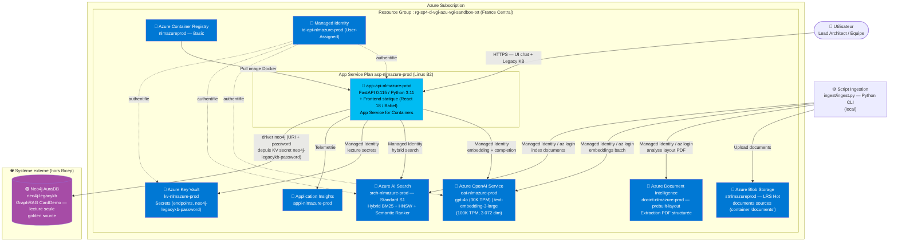

# Guide : NotebookLM Azure — Implémentation complète

## 1. Architecture cible

### Diagramme C4 L2



### Services retenus — justification

| Service Azure | SKU | Justification |
|---|---|---|
| **Azure OpenAI Service** | S0 (`oai-nlmazure-prod`) | Seul service Azure permettant d'exécuter `gpt-4o` (30K TPM) et `text-embedding-3-large` (100K TPM, 3072 dim) avec data residency EU, SLA Entreprise et conformité RGPD sans proxy tiers. |
| **Azure AI Search** | Standard S1 (`srch-nlmazure-prod`) | Gère nativement le hybrid search BM25+HNSW via RRF en un seul appel API, sans orchestrateur externe. Le **Semantic Ranker** n'est disponible qu'à partir du tier S1 — il est critique pour la pertinence sur du texte FR. |
| **Azure Document Intelligence** | S0 (`docint-nlmazure-prod`, pay-per-page) | Le modèle `prebuilt-layout` extrait la structure logique des PDFs (paragraphes, sections, tableaux, numéros de page) avec une précision supérieure à PyPDF2 sur des documents métier complexes. |
| **Azure Blob Storage** | Standard LRS Hot (`stnlmazureprod`) | Stockage durable des documents sources (container `documents`). Source of truth pour l'ingestion. |
| **App Service for Containers** | Linux B2 (`asp-nlmazure-prod` / `app-api-nlmazure-prod`) | Héberge le conteneur Docker FastAPI + frontend statique. Choisi **à la place d'Azure Container Apps** : la souscription Azure sandbox (`rg-sp4-d-vgi-azu-vgi-sandbox-txt`) n'a pas les droits pour enregistrer le fournisseur de ressources `Microsoft.App` (requis par Container Apps), alors que `Microsoft.Web` (App Service) est déjà enregistré. App Service for Containers offre les mêmes capacités essentielles (Docker, Managed Identity, HTTPS, variables d'environnement) sur `Microsoft.Web`. |
| **Azure Container Registry** | Basic (`nlmazureprod`) | Registre privé pour l'image Docker de l'API. Managed Identity (`AcrPull`) évite toute credential dans le pipeline CI/CD. |
| **Azure Key Vault** | Standard (`kv-nlmazure-prod`) | Centralise tous les secrets (endpoints Azure + `neo4j-legacykb-password`). Managed Identity garantit zéro credential en dur dans le code ou les variables d'environnement de prod. |
| **Application Insights** | Pay-as-you-go (`appi-nlmazure-prod`) | Traces distribuées, métriques latence RAG, alertes token usage. |
| **Managed Identity (User-Assigned)** | — (`id-api-nlmazure-prod`) | Identité unique attribuée à l'App Service pour tous les appels Azure (OpenAI, Search, Key Vault, ACR Pull) — zéro clé/secret stocké côté application. |
| **Neo4j AuraDB `neo4j-legacykb`** | externe — non provisionné par ce repo | Base de connaissances GraphRAG **externe**, hébergée hors Azure (AuraDB managé), contenant le golden source CardDemo (`:Entity`, `:Community`). Accès **lecture seule** depuis l'API via le driver Python `neo4j`, avec `NEO4J_LEGACYKB_URI` et `NEO4J_LEGACYKB_PASSWORD` (ce dernier lu depuis le secret Key Vault `neo4j-legacykb-password`). N'apparaît dans aucun module Bicep — c'est une dépendance externe au déploiement IaC. |

---

## 2. Prérequis et setup initial

### Outils locaux requis

```bash
# Azure CLI
az --version          # >= 2.60.0

# Outils de build
python --version      # >= 3.11.0
pip --version         # >= 24.0
docker --version      # >= 24.0
bicep --version       # >= 0.28.0  (az bicep install)
```

> Remarque : contrairement à un déploiement Azure Container Apps, **aucune extension CLI supplémentaire** n'est nécessaire (pas de `az extension add --name containerapp`). Les commandes App Service (`az webapp`, `az appservice plan`) sont intégrées nativement à l'Azure CLI.

### Installation bootstrap

```bash
az bicep install

# Login
az login
az account set --subscription "<SUBSCRIPTION_ID>"
```

### Variables shell à définir une fois

```bash
export PROJECT="nlmazure"
export ENV="prod"
export LOCATION="francecentral"
export RG="rg-sp4-d-vgi-azu-vgi-sandbox-txt"
export AZURE_SUBSCRIPTION=$(az account show --query id -o tsv)
export AZURE_TENANT=$(az account show --query tenantId -o tsv)
```

> Le resource group `rg-sp4-d-vgi-azu-vgi-sandbox-txt` est un nom de sandbox imposé par l'organisation (convention `rg-<sandbox-id>`) — il préexiste généralement et n'a pas besoin d'être recréé. La convention de nommage des ressources internes au RG est `{type}-${PROJECT}-${ENV}`, ex. `app-api-nlmazure-prod`, `oai-nlmazure-prod`, `srch-nlmazure-prod`.

### Création du Resource Group

```bash
# Si le RG n'existe pas déjà (cas sandbox : généralement déjà créé par l'organisation)
az group create \
  --name "$RG" \
  --location "$LOCATION" \
  --tags project="$PROJECT" environment="$ENV" managed-by="bicep"
```

### Rôles IAM minimaux pour le déploiement

Le principal qui déploie le Bicep (compte développeur ou Service Principal CI/CD) doit avoir :

```bash
# Rôle minimum pour déployer tous les services
az role assignment create \
  --assignee $(az account show --query user.name -o tsv) \
  --role "Contributor" \
  --scope "/subscriptions/$AZURE_SUBSCRIPTION/resourceGroups/$RG"

# Pour les role assignments (Managed Identity → services)
az role assignment create \
  --assignee $(az account show --query user.name -o tsv) \
  --role "User Access Administrator" \
  --scope "/subscriptions/$AZURE_SUBSCRIPTION/resourceGroups/$RG"
```

---

## 3. Infrastructure as Code — Bicep

### Structure des fichiers Bicep

```
infra/
├── main.bicep                  — orchestration, role assignments, secrets KV
├── main.parameters.json        — valeurs de déploiement (non commité)
└── modules/
    ├── monitoring.bicep        — Application Insights
    ├── keyvault.bicep          — Key Vault + accès déployeur
    ├── openai.bicep            — Azure OpenAI + 2 déploiements (gpt-4o, text-embedding-3-large)
    ├── search.bicep            — Azure AI Search S1 + semantic search
    ├── storage.bicep           — Blob Storage + container 'documents'
    ├── docint.bicep            — Document Intelligence
    ├── registry.bicep          — Container Registry
    └── containerapp.bicep      — App Service Plan + App Service + Managed Identity + ACR Pull
```

> **Note sur le nom `containerapp.bicep`** : malgré son nom, ce module provisionne aujourd'hui un **App Service Plan + App Service for Containers** (`Microsoft.Web/serverFarms` + `Microsoft.Web/sites`), pas une Azure Container App. C'est un nom de fichier historique conservé suite à la migration depuis Container Apps — le contenu, lui, est à jour.

### `infra/main.bicep` (extrait — orchestration)

```bicep
targetScope = 'resourceGroup'

@description('Préfixe unique pour nommer les ressources (3-8 chars lowercase)')
@minLength(3)
@maxLength(8)
param projectName string = 'nlmazure'

@description('Environnement de déploiement')
@allowed(['dev', 'staging', 'prod'])
param environment string = 'prod'

@description('Région Azure')
param location string = resourceGroup().location

@description('Object ID AAD de l\'identité qui déploie (pour Key Vault access policy)')
param deployerObjectId string

@description('Image Docker initiale du Container App (placeholder pour premier déploiement)')
param apiImageTag string = 'mcr.microsoft.com/azuredocs/containerapps-helloworld:latest'

var suffix = '${projectName}-${environment}'
var tags = {
  project: projectName
  environment: environment
  managedBy: 'bicep'
}

// ── Monitoring (déployé en premier pour avoir l'instrumentation key) ──────────
module monitoring 'modules/monitoring.bicep' = {
  name: 'monitoring'
  params: {
    suffix: suffix
    location: location
    tags: tags
  }
}

// ── Key Vault ──────────────────────────────────────────────────────────────────
module keyvault 'modules/keyvault.bicep' = {
  name: 'keyvault'
  params: {
    suffix: suffix
    location: location
    tags: tags
    deployerObjectId: deployerObjectId
  }
}

// ── Azure OpenAI / Azure AI Search / Storage / Document Intelligence ──────────
module openai 'modules/openai.bicep' = {
  name: 'openai'
  params: { suffix: suffix, location: location, tags: tags }
}

module search 'modules/search.bicep' = {
  name: 'search'
  params: { suffix: suffix, location: location, tags: tags }
}

module storage 'modules/storage.bicep' = {
  name: 'storage'
  params: { suffix: suffix, location: location, tags: tags }
}

module docint 'modules/docint.bicep' = {
  name: 'docint'
  params: { suffix: suffix, location: location, tags: tags }
}

// ── Container Registry ────────────────────────────────────────────────────────
module registry 'modules/registry.bicep' = {
  name: 'registry'
  params: { suffix: suffix, location: location, tags: tags }
}

// ── App Service for Containers (API + frontend) ───────────────────────────────
module containerapp 'modules/containerapp.bicep' = {
  name: 'containerapp'
  params: {
    suffix: suffix
    location: location
    tags: tags
    apiImageTag: apiImageTag
    appInsightsConnectionString: monitoring.outputs.appInsightsConnectionString
  }
}

// ── Références "existing" pour calculer les role assignments ──────────────────
resource apiIdentity 'Microsoft.ManagedIdentity/userAssignedIdentities@2023-01-31' existing = {
  name: 'id-api-${suffix}'
  dependsOn: [containerapp]
}

resource kv 'Microsoft.KeyVault/vaults@2023-07-01' existing = {
  name: 'kv-${suffix}'
  dependsOn: [keyvault]
}

// ── Role Assignments : Managed Identity → Services ───────────────────────────
// App Service → Azure OpenAI (Cognitive Services OpenAI User)
resource roleApiOpenAI 'Microsoft.Authorization/roleAssignments@2022-04-01' = {
  name: guid(resourceGroup().id, apiIdentity.id, 'CognitiveServicesOpenAIUser')
  scope: resourceGroup()
  properties: {
    roleDefinitionId: subscriptionResourceId('Microsoft.Authorization/roleDefinitions', '5e0bd9bd-7b93-4f28-af87-19fc36ad61bd')
    principalId: apiIdentity.properties.principalId
    principalType: 'ServicePrincipal'
  }
}

// App Service → Azure AI Search (Search Index Data Contributor)
resource roleApiSearch 'Microsoft.Authorization/roleAssignments@2022-04-01' = {
  name: guid(resourceGroup().id, apiIdentity.id, 'SearchIndexDataContributor')
  scope: resourceGroup()
  properties: {
    roleDefinitionId: subscriptionResourceId('Microsoft.Authorization/roleDefinitions', '8ebe5a00-799e-43f5-93ac-243d3dce84a7')
    principalId: apiIdentity.properties.principalId
    principalType: 'ServicePrincipal'
  }
}

// App Service → Key Vault (Key Vault Secrets User)
resource roleApiKV 'Microsoft.Authorization/roleAssignments@2022-04-01' = {
  name: guid(resourceGroup().id, apiIdentity.id, 'KeyVaultSecretsUser')
  scope: resourceGroup()
  properties: {
    roleDefinitionId: subscriptionResourceId('Microsoft.Authorization/roleDefinitions', '4633458b-17de-408a-b874-0445c86b69e6')
    principalId: apiIdentity.properties.principalId
    principalType: 'ServicePrincipal'
  }
}

// ── Secrets dans Key Vault (via "parent" pour un calcul anticipé du nom) ──────
resource kvOpenAIEndpoint 'Microsoft.KeyVault/vaults/secrets@2023-07-01' = {
  parent: kv
  name: 'openai-endpoint'
  properties: { value: openai.outputs.endpoint }
}

resource kvSearchEndpoint 'Microsoft.KeyVault/vaults/secrets@2023-07-01' = {
  parent: kv
  name: 'search-endpoint'
  properties: { value: search.outputs.endpoint }
}

resource kvDocIntEndpoint 'Microsoft.KeyVault/vaults/secrets@2023-07-01' = {
  parent: kv
  name: 'docint-endpoint'
  properties: { value: docint.outputs.endpoint }
}

resource kvStorageAccount 'Microsoft.KeyVault/vaults/secrets@2023-07-01' = {
  parent: kv
  name: 'storage-account-name'
  properties: { value: storage.outputs.accountName }
}

// Note : le secret `neo4j-legacykb-password` (golden source externe) n'est PAS
// géré ici — il est créé/maintenu manuellement dans kv-nlmazure-prod, hors Bicep.

// ── Outputs ───────────────────────────────────────────────────────────────────
output apiUrl string = containerapp.outputs.apiUrl
output registryLoginServer string = registry.outputs.loginServer
output keyVaultName string = keyvault.outputs.name
output openAIEndpoint string = openai.outputs.endpoint
output searchEndpoint string = search.outputs.endpoint
output storageAccountName string = storage.outputs.accountName
output docIntEndpoint string = docint.outputs.endpoint
```

### `infra/modules/openai.bicep`

Provisionne `oai-nlmazure-prod` (kind `OpenAI`, SKU `S0`) avec deux déploiements de modèles : `gpt-4o` (2024-11-20, capacité 30 TPM × 1000) et `text-embedding-3-large` (v1, capacité 100 TPM × 1000, 3072 dimensions).

```bicep
param suffix string
param location string
param tags object

resource openai 'Microsoft.CognitiveServices/accounts@2024-10-01' = {
  name: 'oai-${suffix}'
  location: location
  tags: tags
  kind: 'OpenAI'
  sku: {
    name: 'S0'
  }
  properties: {
    customSubDomainName: 'oai-${suffix}'
    publicNetworkAccess: 'Enabled'
    disableLocalAuth: true
  }
}

resource gpt4oDeployment 'Microsoft.CognitiveServices/accounts/deployments@2024-10-01' = {
  parent: openai
  name: 'gpt-4o'
  sku: {
    name: 'Standard'
    capacity: 30
  }
  properties: {
    model: {
      format: 'OpenAI'
      name: 'gpt-4o'
      version: '2024-11-20'
    }
    versionUpgradeOption: 'NoAutoUpgrade'
  }
}

resource embeddingDeployment 'Microsoft.CognitiveServices/accounts/deployments@2024-10-01' = {
  parent: openai
  name: 'text-embedding-3-large'
  dependsOn: [gpt4oDeployment]
  sku: {
    name: 'Standard'
    capacity: 100
  }
  properties: {
    model: {
      format: 'OpenAI'
      name: 'text-embedding-3-large'
      version: '1'
    }
    versionUpgradeOption: 'NoAutoUpgrade'
  }
}

output endpoint string = openai.properties.endpoint
output name string = openai.name
```

### `infra/modules/search.bicep`

Provisionne `srch-nlmazure-prod` en SKU `standard` (S1), avec `semanticSearch: 'standard'` (Semantic Ranker activé — requis pour le reranking hybride) et authentification AAD/RBAC (`aadAuthFailureMode: 'http401WithBearerChallenge'`).

```bicep
param suffix string
param location string
param tags object

resource search 'Microsoft.Search/searchServices@2024-06-01-preview' = {
  name: 'srch-${suffix}'
  location: location
  tags: tags
  sku: {
    name: 'standard'
  }
  properties: {
    replicaCount: 1
    partitionCount: 1
    hostingMode: 'default'
    publicNetworkAccess: 'enabled'
    authOptions: {
      aadOrApiKey: {
        aadAuthFailureMode: 'http401WithBearerChallenge'
      }
    }
    semanticSearch: 'standard'
  }
}

output endpoint string = 'https://${search.name}.search.windows.net'
output name string = search.name
```

### `infra/modules/storage.bicep`

Provisionne `stnlmazureprod` (StorageV2, `Standard_LRS`, Hot, clés partagées désactivées — `allowSharedKeyAccess: false`) avec un container privé `documents` pour les fichiers sources de l'ingestion.

```bicep
param suffix string
param location string
param tags object

var storageName = replace('st${suffix}', '-', '')

resource storage 'Microsoft.Storage/storageAccounts@2023-05-01' = {
  name: length(storageName) > 24 ? substring(storageName, 0, 24) : storageName
  location: location
  tags: tags
  kind: 'StorageV2'
  sku: {
    name: 'Standard_LRS'
  }
  properties: {
    accessTier: 'Hot'
    supportsHttpsTrafficOnly: true
    minimumTlsVersion: 'TLS1_2'
    allowBlobPublicAccess: false
    allowSharedKeyAccess: false
  }
}

resource docsContainer 'Microsoft.Storage/storageAccounts/blobServices/containers@2023-05-01' = {
  name: '${storage.name}/default/documents'
  properties: {
    publicAccess: 'None'
  }
}

output accountName string = storage.name
output blobEndpoint string = storage.properties.primaryEndpoints.blob
```

### `infra/modules/docint.bicep`

Provisionne `docint-nlmazure-prod` (kind `FormRecognizer`, SKU `S0`) pour l'extraction `prebuilt-layout` des PDFs.

```bicep
param suffix string
param location string
param tags object

resource docint 'Microsoft.CognitiveServices/accounts@2024-10-01' = {
  name: 'di-${suffix}'
  location: location
  tags: tags
  kind: 'FormRecognizer'
  sku: {
    name: 'S0'
  }
  properties: {
    customSubDomainName: 'di-${suffix}'
    publicNetworkAccess: 'Enabled'
    disableLocalAuth: true
  }
}

output endpoint string = docint.properties.endpoint
output name string = docint.name
```

### `infra/modules/keyvault.bicep`

Provisionne `kv-nlmazure-prod` (SKU `standard`, RBAC activé, soft-delete 7 jours) et donne au déployeur le rôle `Key Vault Secrets Officer` pour qu'il puisse écrire les secrets pendant le déploiement.

```bicep
param suffix string
param location string
param tags object
param deployerObjectId string

resource kv 'Microsoft.KeyVault/vaults@2023-07-01' = {
  name: 'kv-${suffix}'
  location: location
  tags: tags
  properties: {
    tenantId: subscription().tenantId
    sku: {
      family: 'A'
      name: 'standard'
    }
    enableRbacAuthorization: true
    enableSoftDelete: true
    softDeleteRetentionInDays: 7
    publicNetworkAccess: 'Enabled'
  }
}

resource roleDeployerKV 'Microsoft.Authorization/roleAssignments@2022-04-01' = {
  name: guid(kv.id, deployerObjectId, 'KeyVaultSecretsOfficer')
  scope: kv
  properties: {
    roleDefinitionId: subscriptionResourceId('Microsoft.Authorization/roleDefinitions', 'b86a8fe4-44ce-4948-aee5-eccb2c155cd7')
    principalId: deployerObjectId
    principalType: 'User'
  }
}

output name string = kv.name
output uri string = kv.properties.vaultUri
```

> Le secret `neo4j-legacykb-password` (mot de passe Neo4j AuraDB pour `neo4j-legacykb`) est ajouté **manuellement** à ce Key Vault après création — il n'est pas produit par un module Bicep car la base AuraDB est externe au déploiement.

### `infra/modules/registry.bicep`

Provisionne l'Azure Container Registry (SKU `Basic`, identifiants admin désactivés, pull anonyme désactivé). Le nom déployé est `acr${suffix}` (ex. `acrnlmazureprod`) ; en pratique le registre utilisé en production est `nlmazureprod`.

```bicep
param suffix string
param location string
param tags object

var acrName = replace('acr${suffix}', '-', '')

resource registry 'Microsoft.ContainerRegistry/registries@2023-11-01-preview' = {
  name: length(acrName) > 50 ? substring(acrName, 0, 50) : acrName
  location: location
  tags: tags
  sku: {
    name: 'Basic'
  }
  properties: {
    adminUserEnabled: false
    anonymousPullEnabled: false
  }
}

output loginServer string = registry.properties.loginServer
output name string = registry.name
```

### `infra/modules/containerapp.bicep` — App Service for Containers

Malgré son nom, ce module provisionne :
1. La Managed Identity utilisateur `id-api-nlmazure-prod`
2. Le rôle `AcrPull` sur le resource group pour cette identité
3. L'App Service Plan `asp-nlmazure-prod` (Linux, SKU `B2`/`Basic`, `reserved: true`)
4. L'App Service `app-api-nlmazure-prod` (kind `app,linux,container`, `linuxFxVersion: 'DOCKER|<image>'`), qui sert à la fois l'API FastAPI **et** le frontend statique sur le port 8000 (`WEBSITES_PORT=8000`)

```bicep
param suffix string
param location string
param tags object
param apiImageTag string
param appInsightsConnectionString string

resource apiIdentity 'Microsoft.ManagedIdentity/userAssignedIdentities@2023-01-31' = {
  name: 'id-api-${suffix}'
  location: location
  tags: tags
}

resource roleAcrPull 'Microsoft.Authorization/roleAssignments@2022-04-01' = {
  name: guid(resourceGroup().id, apiIdentity.id, 'AcrPull')
  scope: resourceGroup()
  properties: {
    roleDefinitionId: subscriptionResourceId('Microsoft.Authorization/roleDefinitions', '7f951dda-4ed3-4680-a7ca-43fe172d538d')
    principalId: apiIdentity.properties.principalId
    principalType: 'ServicePrincipal'
  }
}

resource appServicePlan 'Microsoft.Web/serverFarms@2023-12-01' = {
  name: 'asp-${suffix}'
  location: location
  tags: tags
  kind: 'linux'
  sku: {
    name: 'B2'
    tier: 'Basic'
  }
  properties: {
    reserved: true
  }
}

resource api 'Microsoft.Web/sites@2023-12-01' = {
  name: 'app-api-${suffix}'
  location: location
  tags: tags
  kind: 'app,linux,container'
  identity: {
    type: 'UserAssigned'
    userAssignedIdentities: {
      '${apiIdentity.id}': {}
    }
  }
  properties: {
    serverFarmId: appServicePlan.id
    httpsOnly: true
    siteConfig: {
      linuxFxVersion: 'DOCKER|${apiImageTag}'
      acrUseManagedIdentityCreds: true
      acrUserManagedIdentityID: apiIdentity.properties.clientId
      alwaysOn: true
      appSettings: [
        {
          name: 'AZURE_CLIENT_ID'
          value: apiIdentity.properties.clientId
        }
        {
          name: 'APPLICATIONINSIGHTS_CONNECTION_STRING'
          value: appInsightsConnectionString
        }
        {
          name: 'WEBSITES_PORT'
          value: '8000'
        }
      ]
    }
  }
  dependsOn: [roleAcrPull]
}

output apiUrl string = 'https://${api.properties.defaultHostName}'
output principalId string = apiIdentity.properties.principalId
output name string = api.name
```

> Les variables `NEO4J_LEGACYKB_URI` et `NEO4J_LEGACYKB_PASSWORD` (cette dernière lue depuis le secret Key Vault `neo4j-legacykb-password`) sont à ajouter à `appSettings` de l'App Service — soit directement, soit via une référence Key Vault App Service (`@Microsoft.KeyVault(...)`), au moment de la configuration de l'accès Legacy KB.

### `infra/modules/monitoring.bicep`

Provisionne `appi-nlmazure-prod` (Application Insights, kind `web`, rétention 30 jours).

```bicep
param suffix string
param location string
param tags object

resource appInsights 'Microsoft.Insights/components@2020-02-02' = {
  name: 'appi-${suffix}'
  location: location
  tags: tags
  kind: 'web'
  properties: {
    Application_Type: 'web'
    RetentionInDays: 30
    publicNetworkAccessForIngestion: 'Enabled'
    publicNetworkAccessForQuery: 'Enabled'
  }
}

output appInsightsConnectionString string = appInsights.properties.ConnectionString
output instrumentationKey string = appInsights.properties.InstrumentationKey
```

### `infra/main.parameters.json`

```json
{
  "$schema": "https://schema.management.azure.com/schemas/2019-04-01/deploymentParameters.json#",
  "contentVersion": "1.0.0.0",
  "parameters": {
    "projectName": {
      "value": "nlmazure"
    },
    "environment": {
      "value": "prod"
    },
    "location": {
      "value": "francecentral"
    },
    "deployerObjectId": {
      "value": "<REMPLACER_PAR_VOTRE_OBJECT_ID_AAD>"
    },
    "apiImageTag": {
      "value": "mcr.microsoft.com/azuredocs/containerapps-helloworld:latest"
    }
  }
}
```

> `apiImageTag` n'est qu'un placeholder pour le premier déploiement (l'App Service doit exister avant qu'on puisse y pousser l'image réelle construite depuis le `Dockerfile` du repo).

### Commande de déploiement

```powershell
# Récupérer son Object ID AAD
$DEPLOYER_OID = az ad signed-in-user show --query id -o tsv

# Valider le template (what-if)
az deployment group what-if `
  --resource-group rg-sp4-d-vgi-azu-vgi-sandbox-txt `
  --template-file infra/main.bicep `
  --parameters infra/main.parameters.json `
  --parameters deployerObjectId=$DEPLOYER_OID

# Déployer
az deployment group create `
  --resource-group rg-sp4-d-vgi-azu-vgi-sandbox-txt `
  --template-file infra/main.bicep `
  --parameters projectName=nlmazure environment=prod deployerObjectId=$DEPLOYER_OID `
  --name "nlmazure-$(Get-Date -Format yyyyMMddHHmm)" `
  --output table

# Récupérer les outputs dans des variables shell
$OPENAI_ENDPOINT = az deployment group show -g rg-sp4-d-vgi-azu-vgi-sandbox-txt -n "<nom-du-déploiement>" --query properties.outputs.openAIEndpoint.value -o tsv
$SEARCH_ENDPOINT = az deployment group show -g rg-sp4-d-vgi-azu-vgi-sandbox-txt -n "<nom-du-déploiement>" --query properties.outputs.searchEndpoint.value -o tsv
$STORAGE_ACCOUNT = az deployment group show -g rg-sp4-d-vgi-azu-vgi-sandbox-txt -n "<nom-du-déploiement>" --query properties.outputs.storageAccountName.value -o tsv
$DOCINT_ENDPOINT = az deployment group show -g rg-sp4-d-vgi-azu-vgi-sandbox-txt -n "<nom-du-déploiement>" --query properties.outputs.docIntEndpoint.value -o tsv
$ACR_SERVER = az deployment group show -g rg-sp4-d-vgi-azu-vgi-sandbox-txt -n "<nom-du-déploiement>" --query properties.outputs.registryLoginServer.value -o tsv
$KV_NAME = az deployment group show -g rg-sp4-d-vgi-azu-vgi-sandbox-txt -n "<nom-du-déploiement>" --query properties.outputs.keyVaultName.value -o tsv
```

---

## 4. Pipeline d'ingestion documentaire

### Stratégie de chunking par type de document

L'application supporte 6 familles de formats. Chaque famille a son propre chunker dans `ingest/chunkers/`, mais tous partagent les mêmes constantes (`CHUNK_SIZE`, `CHUNK_OVERLAP`) et le même comptage de tokens via `tiktoken`.

| Format | Outil d'extraction | chunk_size | chunk_overlap | Stratégie de split |
|---|---|---|---|---|
| **PDF** | Azure Document Intelligence `prebuilt-layout` (sortie Markdown) | **1 000 tokens** | **200 tokens** | Le document est analysé en Markdown, puis découpé par saut de page (`<!-- PageBreak -->`). Une page = un chunk si elle tient sous 1 000 tokens, sinon split par tokens avec recouvrement. Les headings Markdown détectés par page alimentent `title`/`section`. |
| **DOCX** | python-docx | **1 000 tokens** | **200 tokens** | Split par paragraphes Word. Les styles `Heading 1/2/3` (et `Titre 1/2/3`) sont convertis en préfixes Markdown (`#`, `##`, `###`) et identifient les sections. Les tableaux sont convertis en tables Markdown puis chunkés comme le reste. |
| **PPTX** | python-pptx | **800 tokens** | **150 tokens** | Une slide = un chunk. Le texte du placeholder titre devient `title`/`section`, le reste des formes texte forme le corps. Si une slide dépasse 800 tokens, elle est subdivisée par tokens avec recouvrement. |
| **XLSX** | openpyxl | **800 tokens** | **150 tokens** | Les lignes de chaque feuille sont regroupées en tables Markdown jusqu'à 800 tokens (en-tête répété dans chaque chunk pour qu'il reste autonome). `section` = nom de la feuille. Recouvrement par lignes complètes. |
| **Markdown** | Lecture directe Python | **800 tokens** | **150 tokens** | Split primaire par heading (`#`, `##`, `###`). Si section > chunk_size, split par ligne vide (paragraphe Markdown). Le heading parent est préservé dans les métadonnées. |
| **TXT / Code** | Lecture directe Python (UTF-8, fallback latin-1) | **800 tokens** | **150 tokens** | Sliding window pure sur les tokens, sans découpage sémantique : adapté au code source et au texte brut sans structure de headings. |

**Paramètre global** : token counting via `tiktoken` avec encodeur `cl100k_base` (compatible gpt-4o et text-embedding-3-large). Un chunk de 1 000 tokens correspond à environ 750 mots en français.

### `ingest/requirements.txt`

```text
azure-ai-documentintelligence==1.0.0
azure-search-documents==12.0.0
azure-storage-blob==12.22.0
azure-identity==1.19.0
openai==1.57.0
tiktoken==0.8.0
python-docx==1.1.2
python-pptx==1.0.2
openpyxl==3.1.5
pypdf==4.3.1
click==8.1.7
tenacity==9.0.0
python-dotenv==1.0.1
tqdm==4.67.0

# graphrag_to_adgm.py — lecture du graphe neo4j-legacykb (script annexe,
# sans lien avec le pipeline d'ingestion ci-dessous)
neo4j==6.2.0
```

### `ingest/chunkers/base.py`

```python
from dataclasses import dataclass, field
from typing import Optional


@dataclass
class Chunk:
    content: str
    source_file: str
    page_number: int
    chunk_index: int
    doc_type: str
    section: str = ""
    title: str = ""
    file_hash: str = ""
```

### `ingest/chunkers/pdf_chunker.py`

Le chunker PDF appelle Azure Document Intelligence en lui demandant une sortie **Markdown** (`output_content_format=DocumentContentFormat.MARKDOWN`) plutôt que la liste brute de paragraphes : cela conserve nativement la structure (headings, listes, tableaux) dans le texte du chunk. Le document Markdown résultant est ensuite découpé par saut de page (`<!-- PageBreak -->`), ce qui permet de garder un `page_number` fiable par chunk. Les headings Markdown (`#`...`######`) rencontrés sur chaque page mettent à jour `title` (premier heading du document) et `section` (dernier heading de la page).

```python
import hashlib
import os
import re
from typing import Iterator

import tiktoken
from azure.ai.documentintelligence import DocumentIntelligenceClient
from azure.ai.documentintelligence.models import AnalyzeDocumentRequest, DocumentContentFormat
from azure.identity import DefaultAzureCredential
from tenacity import retry, stop_after_attempt, wait_exponential

from .base import Chunk

CHUNK_SIZE = 1000
CHUNK_OVERLAP = 200
ENCODER = tiktoken.get_encoding("cl100k_base")

# ADI insère ce commentaire entre chaque page en mode Markdown
PAGE_BREAK_RE = re.compile(r'<!--\s*PageBreak\s*-->', re.IGNORECASE)
HEADING_RE    = re.compile(r'^#{1,6}\s+(.+)$', re.MULTILINE)


def _token_count(text: str) -> int:
    return len(ENCODER.encode(text))


def _split_by_tokens(text: str, chunk_size: int, overlap: int) -> list[str]:
    tokens = ENCODER.encode(text)
    chunks = []
    start = 0
    while start < len(tokens):
        end = min(start + chunk_size, len(tokens))
        chunks.append(ENCODER.decode(tokens[start:end]))
        if end == len(tokens):
            break
        start += chunk_size - overlap
    return chunks


class PDFChunker:
    def __init__(self, endpoint: str, credential: DefaultAzureCredential):
        self.client = DocumentIntelligenceClient(endpoint, credential)

    @retry(
        stop=stop_after_attempt(3),
        wait=wait_exponential(multiplier=2, min=4, max=30),
    )
    def _analyze(self, file_bytes: bytes) -> object:
        poller = self.client.begin_analyze_document(
            "prebuilt-layout",
            AnalyzeDocumentRequest(bytes_source=file_bytes),
            output_content_format=DocumentContentFormat.MARKDOWN,
        )
        return poller.result()

    def chunk_file(self, file_path: str) -> Iterator[Chunk]:
        with open(file_path, "rb") as f:
            file_bytes = f.read()

        file_hash = hashlib.sha256(file_bytes).hexdigest()
        source_file = os.path.basename(file_path)

        result = self._analyze(file_bytes)
        markdown = result.content or ""

        # Découpe par saut de page pour conserver les numéros de page
        pages = PAGE_BREAK_RE.split(markdown)

        chunk_index  = 0
        current_title   = ""
        current_section = ""

        for page_num, page_md in enumerate(pages, start=1):
            page_md = page_md.strip()
            if not page_md:
                continue

            # Mise à jour titre/section depuis les headings de cette page
            headings = HEADING_RE.findall(page_md)
            if headings:
                if not current_title:
                    current_title = headings[0]
                current_section = headings[-1]

            if _token_count(page_md) <= CHUNK_SIZE:
                yield Chunk(
                    content=page_md,
                    source_file=source_file,
                    page_number=page_num,
                    chunk_index=chunk_index,
                    doc_type="pdf",
                    section=current_section,
                    title=current_title,
                    file_hash=file_hash,
                )
                chunk_index += 1
            else:
                for sub in _split_by_tokens(page_md, CHUNK_SIZE, CHUNK_OVERLAP):
                    yield Chunk(
                        content=sub,
                        source_file=source_file,
                        page_number=page_num,
                        chunk_index=chunk_index,
                        doc_type="pdf",
                        section=current_section,
                        title=current_title,
                        file_hash=file_hash,
                    )
                    chunk_index += 1
```

### `ingest/chunkers/md_chunker.py`

```python
import hashlib
import os
import re
from typing import Iterator

import tiktoken

from .base import Chunk

CHUNK_SIZE = 800
CHUNK_OVERLAP = 150
ENCODER = tiktoken.get_encoding("cl100k_base")


def _token_count(text: str) -> int:
    return len(ENCODER.encode(text))


def _split_by_tokens(text: str, chunk_size: int, overlap: int) -> list[str]:
    tokens = ENCODER.encode(text)
    chunks = []
    start = 0
    while start < len(tokens):
        end = min(start + chunk_size, len(tokens))
        chunks.append(ENCODER.decode(tokens[start:end]))
        if end == len(tokens):
            break
        start += chunk_size - overlap
    return chunks


class MDChunker:
    def chunk_file(self, file_path: str) -> Iterator[Chunk]:
        with open(file_path, "r", encoding="utf-8") as f:
            raw = f.read()

        file_hash = hashlib.sha256(raw.encode()).hexdigest()
        source_file = os.path.basename(file_path)

        heading_pattern = re.compile(r'^(#{1,3})\s+(.+)$', re.MULTILINE)
        sections: list[dict] = []
        matches = list(heading_pattern.finditer(raw))

        if not matches:
            for i, chunk_text in enumerate(_split_by_tokens(raw, CHUNK_SIZE, CHUNK_OVERLAP)):
                yield Chunk(
                    content=chunk_text,
                    source_file=source_file,
                    page_number=1,
                    chunk_index=i,
                    doc_type="md",
                    section="",
                    title=source_file,
                    file_hash=file_hash,
                )
            return

        if matches[0].start() > 0:
            preamble = raw[:matches[0].start()].strip()
            if preamble:
                sections.append({"heading": "", "level": 0, "content": preamble})

        for i, match in enumerate(matches):
            start = match.end()
            end = matches[i + 1].start() if i + 1 < len(matches) else len(raw)
            content = raw[start:end].strip()
            sections.append({
                "heading": match.group(2).strip(),
                "level": len(match.group(1)),
                "content": content,
            })

        chunk_index = 0
        heading_stack: list[str] = ["", "", ""]

        for section in sections:
            if section["level"] > 0:
                heading_stack[section["level"] - 1] = section["heading"]
                for j in range(section["level"], 3):
                    heading_stack[j] = ""

            section_header = " > ".join(h for h in heading_stack if h)
            full_content = (
                f"{section['heading']}\n\n{section['content']}"
                if section["heading"]
                else section["content"]
            )

            if _token_count(full_content) <= CHUNK_SIZE:
                yield Chunk(
                    content=full_content,
                    source_file=source_file,
                    page_number=1,
                    chunk_index=chunk_index,
                    doc_type="md",
                    section=section_header,
                    title=heading_stack[0] or source_file,
                    file_hash=file_hash,
                )
                chunk_index += 1
            else:
                paragraphs = re.split(r'\n{2,}', full_content)
                buffer = ""
                for para in paragraphs:
                    candidate = f"{buffer}\n\n{para}".strip() if buffer else para
                    if _token_count(candidate) <= CHUNK_SIZE:
                        buffer = candidate
                    else:
                        if buffer:
                            yield Chunk(
                                content=buffer,
                                source_file=source_file,
                                page_number=1,
                                chunk_index=chunk_index,
                                doc_type="md",
                                section=section_header,
                                title=heading_stack[0] or source_file,
                                file_hash=file_hash,
                            )
                            chunk_index += 1
                        if _token_count(para) > CHUNK_SIZE:
                            for sub in _split_by_tokens(para, CHUNK_SIZE, CHUNK_OVERLAP):
                                yield Chunk(
                                    content=sub,
                                    source_file=source_file,
                                    page_number=1,
                                    chunk_index=chunk_index,
                                    doc_type="md",
                                    section=section_header,
                                    title=heading_stack[0] or source_file,
                                    file_hash=file_hash,
                                )
                                chunk_index += 1
                            buffer = ""
                        else:
                            buffer = para

                if buffer:
                    yield Chunk(
                        content=buffer,
                        source_file=source_file,
                        page_number=1,
                        chunk_index=chunk_index,
                        doc_type="md",
                        section=section_header,
                        title=heading_stack[0] or source_file,
                        file_hash=file_hash,
                    )
                    chunk_index += 1
```

### `ingest/chunkers/docx_chunker.py`

Comme pour le PDF, le chunker DOCX normalise sa sortie en **Markdown** : les styles `Heading 1/2/3` (et leurs équivalents français `Titre 1/2/3`) sont convertis en préfixes `#`/`##`/`###`, et les tableaux Word sont convertis en tables Markdown via `_table_to_md`. Cela donne aux chunks DOCX le même format que les chunks PDF et Markdown, ce qui simplifie l'affichage des citations côté frontend.

```python
import hashlib
import os
from typing import Iterator

import tiktoken
from docx import Document

from .base import Chunk

CHUNK_SIZE = 1000
CHUNK_OVERLAP = 200
ENCODER = tiktoken.get_encoding("cl100k_base")
HEADING_STYLES = {"Heading 1", "Heading 2", "Heading 3", "Titre 1", "Titre 2", "Titre 3"}
HEADING_PREFIX = {
    "Heading 1": "#",  "Titre 1": "#",
    "Heading 2": "##", "Titre 2": "##",
    "Heading 3": "###","Titre 3": "###",
}


def _token_count(text: str) -> int:
    return len(ENCODER.encode(text))


def _split_by_tokens(text: str, chunk_size: int, overlap: int) -> list[str]:
    tokens = ENCODER.encode(text)
    chunks = []
    start = 0
    while start < len(tokens):
        end = min(start + chunk_size, len(tokens))
        chunks.append(ENCODER.decode(tokens[start:end]))
        if end == len(tokens):
            break
        start += chunk_size - overlap
    return chunks


def _table_to_md(table) -> str:
    """Convertit un tableau Word en table Markdown (première ligne = en-tête)."""
    rows = []
    for i, row in enumerate(table.rows):
        cells = [
            cell.text.strip().replace("\n", " ").replace("|", "\\|")
            for cell in row.cells
        ]
        rows.append("| " + " | ".join(cells) + " |")
        if i == 0:
            rows.append("| " + " | ".join("---" for _ in cells) + " |")
    return "\n".join(rows)


class DOCXChunker:
    def chunk_file(self, file_path: str) -> Iterator[Chunk]:
        with open(file_path, "rb") as f:
            raw_bytes = f.read()

        file_hash = hashlib.sha256(raw_bytes).hexdigest()
        source_file = os.path.basename(file_path)

        doc = Document(file_path)

        elements: list[dict] = []
        body = doc.element.body
        for child in body:
            tag = child.tag.split('}')[-1] if '}' in child.tag else child.tag
            if tag == 'p':
                for para in doc.paragraphs:
                    if para._element is child:
                        text = para.text.strip()
                        style = para.style.name if para.style else ""
                        if text:
                            prefix = HEADING_PREFIX.get(style, "")
                            content = f"{prefix} {text}" if prefix else text
                            elements.append({
                                "type": "paragraph",
                                "content": content,
                                "is_heading": style in HEADING_STYLES,
                                "style": style,
                            })
                        break
            elif tag == 'tbl':
                for table in doc.tables:
                    if table._element is child:
                        text = _table_to_md(table)
                        if text.strip():
                            elements.append({
                                "type": "table",
                                "content": text,
                                "is_heading": False,
                                "style": "Table",
                            })
                        break

        chunk_index = 0
        chunk_buffer: list[str] = []
        buffer_tokens = 0
        current_section = ""
        current_title = ""

        def flush() -> Chunk | None:
            nonlocal chunk_index
            if not chunk_buffer:
                return None
            c = Chunk(
                content="\n\n".join(chunk_buffer),
                source_file=source_file,
                page_number=1,
                chunk_index=chunk_index,
                doc_type="docx",
                section=current_section,
                title=current_title,
                file_hash=file_hash,
            )
            chunk_index += 1
            return c

        for elem in elements:
            if elem["is_heading"]:
                if "Heading 1" in elem["style"] or "Titre 1" in elem["style"]:
                    current_title = elem["content"]
                current_section = elem["content"]

            tokens = _token_count(elem["content"])

            if tokens > CHUNK_SIZE:
                c = flush()
                if c:
                    yield c
                chunk_buffer = []
                buffer_tokens = 0
                for sub in _split_by_tokens(elem["content"], CHUNK_SIZE, CHUNK_OVERLAP):
                    yield Chunk(
                        content=sub,
                        source_file=source_file,
                        page_number=1,
                        chunk_index=chunk_index,
                        doc_type="docx",
                        section=current_section,
                        title=current_title,
                        file_hash=file_hash,
                    )
                    chunk_index += 1
                continue

            if buffer_tokens + tokens > CHUNK_SIZE and chunk_buffer:
                c = flush()
                if c:
                    yield c
                overlap_buf: list[str] = []
                ot = 0
                for p in reversed(chunk_buffer):
                    t = _token_count(p)
                    if ot + t <= CHUNK_OVERLAP:
                        overlap_buf.insert(0, p)
                        ot += t
                    else:
                        break
                chunk_buffer = overlap_buf
                buffer_tokens = ot

            chunk_buffer.append(elem["content"])
            buffer_tokens += tokens

        c = flush()
        if c:
            yield c
```

### `ingest/chunkers/pptx_chunker.py`

Le chunker PPTX traite **une slide comme un chunk**. Pour chaque slide, `_extract_slide_text` distingue le placeholder titre (`shape.is_placeholder and shape.placeholder_format.idx == 0`) du reste des formes texte, qui forment le corps. Le titre de la slide devient à la fois `section` et `title` du chunk — c'est la granularité naturelle pour des présentations, où chaque diapositive porte une idée autonome. Si le contenu d'une slide dépasse `CHUNK_SIZE`, il est sous-découpé par tokens comme pour les autres formats.

```python
import hashlib
import os
from typing import Iterator

import tiktoken
from pptx import Presentation

from .base import Chunk

CHUNK_SIZE = 800
CHUNK_OVERLAP = 150
ENCODER = tiktoken.get_encoding("cl100k_base")


def _token_count(text: str) -> int:
    return len(ENCODER.encode(text))


def _split_by_tokens(text: str, chunk_size: int, overlap: int) -> list[str]:
    tokens = ENCODER.encode(text)
    chunks = []
    start = 0
    while start < len(tokens):
        end = min(start + chunk_size, len(tokens))
        chunks.append(ENCODER.decode(tokens[start:end]))
        if end == len(tokens):
            break
        start += chunk_size - overlap
    return chunks


def _extract_slide_text(slide) -> tuple[str, str]:
    """Retourne (titre, corps) pour une slide."""
    title = ""
    body_parts = []

    for shape in slide.shapes:
        if not shape.has_text_frame:
            continue
        text = shape.text_frame.text.strip()
        if not text:
            continue
        if shape.is_placeholder and shape.placeholder_format.idx == 0:
            title = text
        else:
            body_parts.append(text)

    return title, "\n\n".join(body_parts)


class PPTXChunker:
    def chunk_file(self, file_path: str) -> Iterator[Chunk]:
        with open(file_path, "rb") as f:
            raw_bytes = f.read()

        file_hash = hashlib.sha256(raw_bytes).hexdigest()
        source_file = os.path.basename(file_path)
        prs = Presentation(file_path)

        chunk_index = 0
        for slide_num, slide in enumerate(prs.slides, start=1):
            title, body = _extract_slide_text(slide)

            if not title and not body:
                continue

            content = f"{title}\n\n{body}".strip() if title and body else (title or body)

            if _token_count(content) <= CHUNK_SIZE:
                yield Chunk(
                    content=content,
                    source_file=source_file,
                    page_number=slide_num,
                    chunk_index=chunk_index,
                    doc_type="pptx",
                    section=title,
                    title=title or source_file,
                    file_hash=file_hash,
                )
                chunk_index += 1
            else:
                for sub in _split_by_tokens(content, CHUNK_SIZE, CHUNK_OVERLAP):
                    yield Chunk(
                        content=sub,
                        source_file=source_file,
                        page_number=slide_num,
                        chunk_index=chunk_index,
                        doc_type="pptx",
                        section=title,
                        title=title or source_file,
                        file_hash=file_hash,
                    )
                    chunk_index += 1
```

`page_number` est ici réutilisé pour stocker le numéro de slide (1-indexé) : la citation `[1]` dans le chat pourra donc afficher « Slide 3 » par exemple.

### `ingest/chunkers/xlsx_chunker.py`

Le chunker XLSX parcourt chaque feuille (`wb.sheetnames`) et reconstruit une table Markdown par groupe de lignes. La première ligne de la feuille est traitée comme en-tête si elle contient au moins une valeur non vide ; sinon des en-têtes génériques `Col1`, `Col2`… sont générés. Le coût en tokens de l'en-tête (`header_overhead`) est calculé une fois et compté dans chaque chunk, puisque l'en-tête est **répété dans chaque chunk** pour que la table reste lisible et autonome — c'est la principale différence avec les autres chunkers, qui ne répètent pas de préambule.

```python
import hashlib
import os
from typing import Iterator

import openpyxl
import tiktoken

from .base import Chunk

CHUNK_SIZE = 800
CHUNK_OVERLAP = 150
ENCODER = tiktoken.get_encoding("cl100k_base")


def _token_count(text: str) -> int:
    return len(ENCODER.encode(text))


def _row_to_cells(cells) -> list[str]:
    def _clean(v) -> str:
        if v is None:
            return ""
        # Newlines (Alt+Entrée dans Excel) et pipes cassent les tables Markdown
        return str(v).replace("\r\n", " ").replace("\n", " ").replace("\r", " ").replace("|", "\\|").strip()
    return [_clean(c.value) for c in cells]


def _is_empty_row(cells: list[str]) -> bool:
    return not any(v for v in cells)


def _fmt_row(cells: list[str], width: int) -> str:
    padded = [cells[i] if i < len(cells) else "" for i in range(width)]
    return "| " + " | ".join(padded) + " |"


def _build_md_table(headers: list[str], rows: list[list[str]]) -> str:
    w = len(headers)
    separator = "| " + " | ".join("---" for _ in headers) + " |"
    lines = [_fmt_row(headers, w), separator] + [_fmt_row(r, w) for r in rows]
    return "\n".join(lines)


class XLSXChunker:
    def chunk_file(self, file_path: str) -> Iterator[Chunk]:
        with open(file_path, "rb") as f:
            raw_bytes = f.read()

        file_hash = hashlib.sha256(raw_bytes).hexdigest()
        source_file = os.path.basename(file_path)

        wb = openpyxl.load_workbook(file_path, read_only=True, data_only=True)
        chunk_index = 0

        for sheet_name in wb.sheetnames:
            ws = wb[sheet_name]
            rows = list(ws.iter_rows())
            if not rows:
                continue

            raw_headers = _row_to_cells(rows[0])
            has_headers = any(h and not h.startswith("None") for h in raw_headers)
            headers = raw_headers if has_headers else [f"Col{i+1}" for i in range(len(raw_headers))]
            data_rows = rows[1:] if has_headers else rows

            # Coût fixe du header (répété à chaque chunk pour qu'il soit autonome)
            header_overhead = _token_count(
                _fmt_row(headers, len(headers)) + "\n" +
                "| " + " | ".join("---" for _ in headers) + " |"
            )

            buffer: list[list[str]] = []
            buffer_tokens = header_overhead

            def _emit(buf: list[list[str]]) -> Chunk:
                nonlocal chunk_index
                c = Chunk(
                    content=_build_md_table(headers, buf),
                    source_file=source_file,
                    page_number=1,
                    chunk_index=chunk_index,
                    doc_type="xlsx",
                    section=sheet_name,
                    title=source_file,
                    file_hash=file_hash,
                )
                chunk_index += 1
                return c

            for row in data_rows:
                cells = _row_to_cells(row)
                if _is_empty_row(cells):
                    continue

                row_tokens = _token_count(_fmt_row(cells, len(headers)))

                if buffer_tokens + row_tokens > CHUNK_SIZE and buffer:
                    yield _emit(buffer)

                    # Overlap : dernières lignes jusqu'à CHUNK_OVERLAP tokens
                    overlap: list[list[str]] = []
                    ot = 0
                    for prev in reversed(buffer):
                        lt = _token_count(_fmt_row(prev, len(headers)))
                        if ot + lt <= CHUNK_OVERLAP:
                            overlap.insert(0, prev)
                            ot += lt
                        else:
                            break
                    buffer = overlap
                    buffer_tokens = header_overhead + ot

                buffer.append(cells)
                buffer_tokens += row_tokens

            if buffer:
                yield _emit(buffer)

        wb.close()
```

`section` reçoit le nom de la feuille Excel, ce qui permet de filtrer ou d'identifier visuellement les chunks par feuille dans les citations.

### `ingest/chunkers/text_chunker.py`

Pour les fichiers texte brut et le code source (`.txt`, `.py`, `.js`, `.json`, `.yaml`, etc. — voir la liste `_CODE_EXTENSIONS` dans `api/routers/ingest.py`), il n'y a pas de structure de headings exploitable. `TextChunker` applique donc directement une fenêtre glissante par tokens, sans tentative de découpage sémantique. Le paramètre `doc_type` est injecté par l'appelant (l'extension du fichier sans le point), ce qui permet de retrouver le langage d'un chunk de code dans l'index.

```python
import hashlib
import os
from typing import Iterator

import tiktoken

from .base import Chunk

CHUNK_SIZE = 800
CHUNK_OVERLAP = 150
ENCODER = tiktoken.get_encoding("cl100k_base")


def _token_count(text: str) -> int:
    return len(ENCODER.encode(text))


def _split_by_tokens(text: str, chunk_size: int, overlap: int) -> list[str]:
    tokens = ENCODER.encode(text)
    chunks = []
    start = 0
    while start < len(tokens):
        end = min(start + chunk_size, len(tokens))
        chunks.append(ENCODER.decode(tokens[start:end]))
        if end == len(tokens):
            break
        start += chunk_size - overlap
    return chunks


class TextChunker:
    """Chunker générique pour texte brut et code source."""

    def __init__(self, doc_type: str = "txt"):
        self.doc_type = doc_type

    def chunk_file(self, file_path: str) -> Iterator[Chunk]:
        try:
            with open(file_path, "r", encoding="utf-8") as f:
                raw = f.read()
        except UnicodeDecodeError:
            with open(file_path, "r", encoding="latin-1") as f:
                raw = f.read()

        if not raw.strip():
            return

        file_hash = hashlib.sha256(raw.encode("utf-8", errors="replace")).hexdigest()
        source_file = os.path.basename(file_path)

        for i, chunk_text in enumerate(_split_by_tokens(raw, CHUNK_SIZE, CHUNK_OVERLAP)):
            yield Chunk(
                content=chunk_text,
                source_file=source_file,
                page_number=1,
                chunk_index=i,
                doc_type=self.doc_type,
                section="",
                title=source_file,
                file_hash=file_hash,
            )
```

### `ingest/embedder.py`

```python
import os
import time

from openai import AzureOpenAI, RateLimitError, APITimeoutError
from azure.identity import DefaultAzureCredential, get_bearer_token_provider
from tenacity import retry, stop_after_attempt, wait_exponential, retry_if_exception_type

EMBEDDING_MODEL = os.environ["AZURE_OPENAI_EMBEDDING_DEPLOYMENT"]
EMBEDDING_DIMENSIONS = 3072
BATCH_SIZE = 16


class Embedder:
    def __init__(self, endpoint: str, credential: DefaultAzureCredential):
        token_provider = get_bearer_token_provider(
            credential, "https://cognitiveservices.azure.com/.default"
        )
        self.client = AzureOpenAI(
            azure_endpoint=endpoint,
            azure_ad_token_provider=token_provider,
            api_version="2024-10-21",
        )

    @retry(
        stop=stop_after_attempt(5),
        wait=wait_exponential(multiplier=1, min=4, max=60),
        retry=retry_if_exception_type((RateLimitError, APITimeoutError)),
    )
    def _embed_batch(self, texts: list[str]) -> list[list[float]]:
        response = self.client.embeddings.create(
            input=texts,
            model=EMBEDDING_MODEL,
            dimensions=EMBEDDING_DIMENSIONS,
        )
        return [item.embedding for item in response.data]

    def embed_chunks(self, texts: list[str]) -> list[list[float]]:
        all_embeddings = []
        for i in range(0, len(texts), BATCH_SIZE):
            batch = texts[i : i + BATCH_SIZE]
            embeddings = self._embed_batch(batch)
            all_embeddings.extend(embeddings)
            if i + BATCH_SIZE < len(texts):
                time.sleep(0.1)
        return all_embeddings
```

### `ingest/indexer.py`

```python
import os
from datetime import datetime, timezone

from azure.identity import DefaultAzureCredential
from azure.search.documents import SearchClient
from azure.search.documents.indexes import SearchIndexClient
from azure.search.documents.indexes.models import (
    HnswAlgorithmConfiguration,
    HnswParameters,
    SearchField,
    SearchFieldDataType,
    SearchIndex,
    SemanticConfiguration,
    SemanticField,
    SemanticPrioritizedFields,
    SemanticSearch,
    SimpleField,
    VectorSearch,
    VectorSearchProfile,
)

INDEX_NAME = "notebooklm-chunks"
VECTOR_DIMENSIONS = 3072


def _build_index_definition() -> SearchIndex:
    vector_search = VectorSearch(
        profiles=[
            VectorSearchProfile(
                name="default-profile",
                algorithm_configuration_name="default-hnsw",
            )
        ],
        algorithms=[
            HnswAlgorithmConfiguration(
                name="default-hnsw",
                parameters=HnswParameters(
                    m=4,
                    ef_construction=400,
                    ef_search=500,
                    metric="cosine",
                ),
            )
        ],
    )

    semantic_search = SemanticSearch(
        configurations=[
            SemanticConfiguration(
                name="default-semantic-config",
                prioritized_fields=SemanticPrioritizedFields(
                    title_field=SemanticField(field_name="title"),
                    content_fields=[SemanticField(field_name="content")],
                    keywords_fields=[SemanticField(field_name="section")],
                ),
            )
        ]
    )

    fields = [
        SimpleField(name="id", type=SearchFieldDataType.String, key=True, filterable=True),
        SearchField(
            name="content",
            type=SearchFieldDataType.String,
            searchable=True,
            analyzer_name="standard.lucene",
        ),
        SearchField(
            name="content_vector",
            type=SearchFieldDataType.Collection(SearchFieldDataType.Single),
            searchable=True,
            vector_search_dimensions=VECTOR_DIMENSIONS,
            vector_search_profile_name="default-profile",
        ),
        SimpleField(name="source_file", type=SearchFieldDataType.String, filterable=True, facetable=True),
        SimpleField(name="page_number", type=SearchFieldDataType.Int32, filterable=True, sortable=True),
        SimpleField(name="chunk_index", type=SearchFieldDataType.Int32, filterable=True, sortable=True),
        SimpleField(name="doc_type", type=SearchFieldDataType.String, filterable=True, facetable=True),
        SearchField(name="section", type=SearchFieldDataType.String, searchable=True, filterable=True),
        SearchField(name="title", type=SearchFieldDataType.String, searchable=True),
        SimpleField(name="file_hash", type=SearchFieldDataType.String, filterable=True),
        SimpleField(
            name="created_at",
            type=SearchFieldDataType.DateTimeOffset,
            filterable=True,
            sortable=True,
        ),
    ]

    return SearchIndex(
        name=INDEX_NAME,
        fields=fields,
        vector_search=vector_search,
        semantic_search=semantic_search,
    )


class Indexer:
    def __init__(self, endpoint: str, credential: DefaultAzureCredential):
        self.index_client = SearchIndexClient(endpoint, credential)
        self.search_client = SearchClient(endpoint, INDEX_NAME, credential)

    def ensure_index(self) -> None:
        self.index_client.create_or_update_index(_build_index_definition())
        print(f"Index '{INDEX_NAME}' prêt.")

    def get_indexed_hashes(self) -> set[str]:
        results = self.search_client.search(
            search_text="*",
            select=["file_hash"],
            top=10000,
        )
        return {r["file_hash"] for r in results if r.get("file_hash")}

    def upload_chunks(self, documents: list[dict]) -> None:
        BATCH = 100
        for i in range(0, len(documents), BATCH):
            batch = documents[i : i + BATCH]
            result = self.search_client.upload_documents(documents=batch)
            failed = [r for r in result if not r.succeeded]
            if failed:
                for f in failed:
                    print(f"Erreur indexation : {f.key} — {f.error_message}")
```

### `api/routers/ingest.py` — ingestion via l'API (flux principal)

Dans la version actuelle de l'application, l'ingestion n'est **plus pilotée par un script CLI exécuté manuellement** : elle est déclenchée depuis l'interface web via `POST /api/ingest`, qui accepte n'importe quel fichier parmi les 6 formats supportés (PDF, DOCX, PPTX, XLSX, Markdown, TXT/code). L'upload est traité de façon **asynchrone** : la requête répond immédiatement (`202 Accepted`) avec un `job_id`, et le frontend interroge `GET /api/ingest/{job_id}` jusqu'à ce que le statut passe à `done` ou `error`.

**Étapes du flux :**

1. **Validation à l'upload** — extension autorisée (`ALLOWED_EXTENSIONS` = formats documentaires + extensions de code/texte), taille max 50 Mo, puis vérification des **magic bytes** (`_check_magic_bytes`) pour s'assurer que le contenu correspond réellement à l'extension déclarée (`%PDF` pour les PDF, signature ZIP `PK\x03\x04` pour DOCX/PPTX/XLSX, décodage UTF-8 pour le texte/code).
2. **Création du job** — le fichier est écrit dans un répertoire temporaire, un `job_id` (UUID) est généré, et `_run_ingest` est planifié en `BackgroundTask`.
3. **`_run_ingest`** — exécuté en arrière-plan : sélectionne le chunker selon l'extension (`PDFChunker`, `MDChunker`, `DOCXChunker`, `PPTXChunker`, `XLSXChunker`, ou `TextChunker` pour le code/texte), produit les chunks, vérifie la déduplication par `file_hash`, génère les embeddings via `Embedder`, puis indexe via `Indexer.upload_chunks`. Le fichier temporaire est supprimé dans le `finally`, que l'ingestion réussisse ou échoue.
4. **Polling** — `GET /api/ingest/{job_id}` retourne `{job_id, status, filename, message, chunks}` ; `status` évolue `pending → running → done | error`, et `message` donne une indication lisible de l'étape en cours (« Découpage en chunks… », « Génération des embeddings (N chunks)… », « Indexation dans Azure AI Search… »).

```python
# Formats documentaires
_DOC_EXTENSIONS = {".pdf", ".md", ".docx", ".pptx", ".xlsx"}

# Formats texte brut et code source
_CODE_EXTENSIONS = {
    ".txt",
    ".py", ".js", ".ts", ".jsx", ".tsx",
    ".java", ".cpp", ".c", ".h", ".cs",
    ".go", ".rs", ".rb", ".php",
    ".sh", ".bash",
    ".yaml", ".yml", ".json", ".xml",
    ".html", ".css", ".sql",
    ".r", ".scala", ".kt", ".swift",
}

ALLOWED_EXTENSIONS = _DOC_EXTENSIONS | _CODE_EXTENSIONS
MAX_FILE_MB = 50

# Formats ZIP (DOCX, PPTX, XLSX partagent la même signature PK)
_ZIP_EXTENSIONS = {".docx", ".pptx", ".xlsx"}


def _check_magic_bytes(content: bytes, suffix: str) -> bool:
    """Vérifie les magic bytes du fichier pour prévenir les uploads déguisés."""
    if suffix == ".pdf":
        return content[:4] == b"%PDF"
    elif suffix in _ZIP_EXTENSIONS:
        return content[:4] == b"PK\x03\x04"
    else:
        # Texte brut / code : doit être décodable en UTF-8 (ou presque)
        try:
            content[:512].decode("utf-8")
            return True
        except (UnicodeDecodeError, ValueError):
            return False


def _run_ingest(job_id: str, filepath: Path, filename: str, credential) -> None:
    """Ingestion synchrone exécutée dans un thread de fond (BackgroundTasks)."""
    _jobs[job_id].update(status="running", message="Analyse du document…")

    try:
        from ingest.embedder import Embedder
        from ingest.indexer import Indexer

        suffix = filepath.suffix.lower()

        if suffix == ".pdf":
            from ingest.chunkers.pdf_chunker import PDFChunker
            chunker = PDFChunker(
                endpoint=os.environ["AZURE_DOCINT_ENDPOINT"],
                credential=credential,
            )
        elif suffix == ".md":
            from ingest.chunkers.md_chunker import MDChunker
            chunker = MDChunker()
        elif suffix == ".docx":
            from ingest.chunkers.docx_chunker import DOCXChunker
            chunker = DOCXChunker()
        elif suffix == ".pptx":
            from ingest.chunkers.pptx_chunker import PPTXChunker
            chunker = PPTXChunker()
        elif suffix == ".xlsx":
            from ingest.chunkers.xlsx_chunker import XLSXChunker
            chunker = XLSXChunker()
        elif suffix in _CODE_EXTENSIONS:
            from ingest.chunkers.text_chunker import TextChunker
            chunker = TextChunker(doc_type=suffix.lstrip("."))
        else:
            raise ValueError(f"Format non supporté : {suffix}")

        _jobs[job_id]["message"] = "Découpage en chunks…"
        raw_chunks = list(chunker.chunk_file(str(filepath)))

        if not raw_chunks:
            raise ValueError("Aucun contenu extrait du document.")

        indexer = Indexer(
            endpoint=os.environ["AZURE_SEARCH_ENDPOINT"],
            credential=credential,
        )
        indexer.ensure_index()
        indexed_hashes = indexer.get_indexed_hashes()
        file_hash = raw_chunks[0].file_hash

        if file_hash in indexed_hashes:
            _jobs[job_id].update(
                status="done",
                message="Document déjà indexé — aucune action nécessaire.",
                chunks=0,
            )
            return

        n = len(raw_chunks)
        _jobs[job_id]["message"] = f"Génération des embeddings ({n} chunks)…"
        embedder = Embedder(
            endpoint=os.environ["AZURE_OPENAI_ENDPOINT"],
            credential=credential,
        )
        texts = [c.content for c in raw_chunks]
        embeddings = embedder.embed_chunks(texts)

        _jobs[job_id]["message"] = "Indexation dans Azure AI Search…"
        now_iso = datetime.now(timezone.utc).isoformat()
        documents = []
        for chunk, embedding in zip(raw_chunks, embeddings):
            documents.append({
                "id":             f"{chunk.file_hash}_{chunk.chunk_index}",
                "content":        chunk.content,
                "content_vector": embedding,
                "source_file":    filename,
                "page_number":    chunk.page_number,
                "chunk_index":    chunk.chunk_index,
                "doc_type":       chunk.doc_type,
                "section":        chunk.section,
                "title":          chunk.title,
                "file_hash":      chunk.file_hash,
                "created_at":     now_iso,
            })

        indexer.upload_chunks(documents)

        _jobs[job_id].update(
            status="done",
            message=f"{len(documents)} chunks indexés avec succès.",
            chunks=len(documents),
        )

    except ImportError as e:
        logger.exception("Dépendance manquante : %s", e)
        _jobs[job_id].update(
            status="error",
            message="Dépendance manquante dans le venv API. Consultez les logs serveur.",
        )
    except Exception as e:
        logger.exception("Erreur lors de l'ingestion du document '%s' : %s", filename, e)
        _jobs[job_id].update(status="error", message="Erreur lors du traitement du document.")
    finally:
        filepath.unlink(missing_ok=True)


@router.post("/ingest", response_model=IngestStatus, status_code=202)
async def start_ingest(
    background_tasks: BackgroundTasks,
    request: Request,
    file: UploadFile = File(...),
):
    suffix = Path(file.filename).suffix.lower()
    if suffix not in ALLOWED_EXTENSIONS:
        raise HTTPException(
            400,
            detail=f"Format non supporté. Formats acceptés : {', '.join(sorted(ALLOWED_EXTENSIONS))}",
        )

    content = await file.read()
    if len(content) > MAX_FILE_MB * 1024 * 1024:
        raise HTTPException(413, detail=f"Fichier trop volumineux (max {MAX_FILE_MB} Mo).")

    if not _check_magic_bytes(content, suffix):
        raise HTTPException(
            400,
            detail=f"Le contenu du fichier ne correspond pas au format {suffix}.",
        )

    job_id = str(uuid.uuid4())
    tmp = Path(tempfile.gettempdir()) / f"nlaz_{job_id}{suffix}"
    tmp.write_bytes(content)

    _jobs[job_id] = {
        "status": "pending",
        "filename": file.filename,
        "message": "En file d'attente…",
        "chunks": 0,
    }

    background_tasks.add_task(
        _run_ingest, job_id, tmp, file.filename, request.app.state.credential
    )

    return IngestStatus(job_id=job_id, **_jobs[job_id])


@router.get("/ingest/{job_id}", response_model=IngestStatus)
async def get_ingest_status(job_id: str):
    if job_id not in _jobs:
        raise HTTPException(404, detail="Job introuvable.")
    return IngestStatus(job_id=job_id, **_jobs[job_id])
```

La déduplication fonctionne exactement comme dans l'ancien script CLI : `file_hash` (SHA-256 du contenu brut) est comparé à `indexer.get_indexed_hashes()` avant de lancer les embeddings — un fichier déjà indexé n'est pas réingéré, ce qui évite les doublons en cas de double upload.

### `ingest/ingest.py` — alternative CLI (ingestion par lot)

Le script `ingest/ingest.py` existe toujours dans le dépôt et reste utilisable pour une ingestion par lot depuis un dossier local (`python ingest.py --docs-dir ./documents [--force-reindex] [--dry-run]`). Il réutilise les mêmes briques (`Embedder`, `Indexer`, déduplication par `file_hash`), mais **ne couvre que 3 formats** (`SUPPORTED_EXTENSIONS = {".pdf", ".md", ".docx"}`) — il n'a pas été étendu aux chunkers PPTX, XLSX et texte/code ajoutés depuis. Pour ces formats, ou pour un usage courant, privilégiez l'upload via l'interface web (`POST /api/ingest`), qui couvre les 6 formats et offre un suivi de progression.

---

## 5. Backend RAG — API FastAPI

L'API a beaucoup grossi depuis la version initiale : en plus du couple retriever/generator vu en section 4, elle expose désormais la persistance des sessions de chat (SQLite), un mécanisme de compaction de l'historique, la gestion CRUD des sources indexées, et un accès en lecture à une base de connaissances « legacy » (`neo4j-legacykb`) — à la fois via des endpoints HTTP dédiés et via du **tool-calling** directement dans la boucle de génération du Chat. L'ingestion (`api/routers/ingest.py`) a été traitée en section 4 et n'est pas reprise ici.

### `api/requirements.txt`

```text
fastapi==0.115.5
uvicorn[standard]==0.32.1
python-multipart==0.0.20
azure-search-documents==12.0.0
azure-identity==1.19.0
azure-keyvault-secrets==4.9.0
openai==1.57.0
python-dotenv==1.0.1
pydantic==2.10.3
tenacity==9.0.0
azure-monitor-opentelemetry==1.8.8

# Dépendance transitive d'openai/neo4j, épinglée explicitement pour fixer la version
# (évite une résolution incohérente entre les deux SDK).
httpx==0.28.1

# Lecture directe de l'instance Neo4j neo4j-legacykb (api/routers/legacykb.py,
# api/services/legacykb_client.py, api/services/graph_tools.py)
neo4j==6.2.0
```

Quelques ajouts par rapport à la version initiale :

- **`python-multipart`** — requis par FastAPI pour parser les uploads `multipart/form-data` (`POST /api/ingest`, section 4).
- **`azure-search-documents==12.0.0`** — montée de version depuis la préversion `11.6.0b8` utilisée au départ.
- **`azure-monitor-opentelemetry`** — remplace `opencensus-ext-azure` pour l'instrumentation (traces/metrics/logs) envoyée à Application Insights.
- **`httpx`** — n'est plus utilisé directement par du code applicatif dans `api/` (un ancien proxy `api/routers/graph.py` vers une Function `fn-adgm-graph` qui en dépendait a été retiré) ; il reste épinglé en direct car c'est une dépendance transitive partagée par `openai` et `neo4j`, et l'épingler évite les incompatibilités de version entre les deux.
- **`neo4j`** — le driver officiel, utilisé par `api/services/legacykb_client.py` pour interroger l'instance `neo4j-legacykb` (graphe GraphRAG brut sur CardDemo), exposée via `api/routers/legacykb.py` et via les tools function-calling du Chat (`api/services/graph_tools.py`).

### `api/models/schemas.py`

```python
from pydantic import BaseModel, Field
from typing import Literal, Optional


class ChatRequest(BaseModel):
    message: str = Field(..., min_length=1, max_length=32000)
    session_id: Optional[str] = Field(default=None)
    top_k: int = Field(default=10, ge=1, le=20)
    mode: Literal["rapide", "standard", "approfondi"] = Field(default="standard")
    injected_notes: list[str] = Field(default_factory=list)


class SourceReference(BaseModel):
    file: str
    page: int
    section: str
    score: float
    content: str = ""


class GraphReference(BaseModel):
    id: str
    kind: Literal["entity", "community"]
    type: Optional[str] = None
    nom: str


class ChatResponse(BaseModel):
    answer: str
    session_id: str
    sources: list[SourceReference]
    tokens_used: int
    graph_references: list[GraphReference] = Field(default_factory=list)
```

Par rapport à la version initiale :

- `ChatRequest.message` accepte désormais jusqu'à **32 000 caractères** (au lieu de 4 000), `top_k` par défaut passe à `10`, et deux nouveaux champs apparaissent :
  - `mode` — l'un des trois modes d'analyse (`rapide` / `standard` / `approfondi`), voir `api/services/generator.py` ci-dessous.
  - `injected_notes` — liste de textes que l'utilisateur épingle depuis le panneau de notes et qui sont injectés dans le contexte au même titre que les chunks récupérés.
- `SourceReference` gagne un champ `content` (texte intégral du chunk), utilisé par le frontend pour afficher l'extrait complet dans la modale de citation, sans round-trip supplémentaire.
- `GraphReference` est un nouveau modèle : il représente un nœud (`entity` ou `community`) de la base de connaissances legacy effectivement consulté par le LLM via un tool, pour traçabilité.
- `ChatResponse` gagne `graph_references: list[GraphReference]` — la liste dédupliquée des nœuds `neo4j-legacykb` consultés pendant la génération de la réponse.

### `api/services/retriever.py`

`Retriever` n'a pas changé depuis la section 4 : recherche hybride (BM25 + HNSW + reranking sémantique) sur l'index `notebooklm-chunks`, embeddings via `AZURE_OPENAI_EMBEDDING_DEPLOYMENT` (3072 dimensions), retry exponentiel sur l'appel d'embedding. Il reste le point d'entrée unique pour la récupération de chunks, quel que soit le mode d'analyse choisi.

```python
@dataclass
class RetrievedChunk:
    content: str
    source_file: str
    page_number: int
    section: str
    title: str
    score: float


class Retriever:
    def __init__(self, credential: DefaultAzureCredential):
        self.search_client = SearchClient(
            endpoint=os.environ["AZURE_SEARCH_ENDPOINT"],
            index_name="notebooklm-chunks",
            credential=credential,
        )
        # ... client d'embedding AzureOpenAI (token provider Entra ID)

    def retrieve(self, query: str, top_k: int = 5) -> list[RetrievedChunk]:
        query_embedding = self._get_query_embedding(query)
        vector_query = VectorizedQuery(
            vector=query_embedding, k_nearest_neighbors=top_k * 3, fields="content_vector",
        )
        results = self.search_client.search(
            search_text=query,
            vector_queries=[vector_query],
            query_type=QueryType.SEMANTIC,
            semantic_configuration_name="default-semantic-config",
            top=top_k,
            select=["id", "content", "source_file", "page_number", "section", "title", "chunk_index"],
        )
        return [
            RetrievedChunk(
                content=r["content"], source_file=r["source_file"],
                page_number=r.get("page_number", 1), section=r.get("section", ""),
                title=r.get("title", ""),
                score=r.get("@search.reranker_score") or r.get("@search.score", 0.0),
            )
            for r in results
        ]
```

### `api/services/generator.py`

Le `Generator` initial (un seul prompt système, un seul appel `chat.completions.create`) a été remplacé par une version beaucoup plus riche :

1. **Trois modes d'analyse** (`rapide` / `standard` / `approfondi`), chacun avec son propre prompt système, son `max_tokens` et sa `temperature` (`_MODE_CONFIG`).
2. **Tool-calling Legacy KB** — dans chaque mode, le LLM peut appeler les tools `legacykb_search` / `legacykb_get_entity` / `legacykb_get_relations` (définis dans `api/services/graph_tools.py`) pour interroger la base de connaissances `neo4j-legacykb` sur le système CardDemo.
3. **Pipeline d'extraction multi-passes** pour le mode `approfondi` sur les requêtes de type « liste / inventaire / recense-moi tous les... ».
4. **Résumé de conversation** (`summarize`), utilisé par `api/services/compactor.py`.

#### Les trois modes d'analyse

```python
_MODE_CONFIG = {
    "rapide":     {"prompt": _PROMPT_RAPIDE,     "max_tokens": 600,  "temperature": 0.2},
    "standard":   {"prompt": _PROMPT_STANDARD,   "max_tokens": 2000, "temperature": 0.3},
    "approfondi": {"prompt": _PROMPT_APPROFONDI, "max_tokens": 4000, "temperature": 0.3},
}
```

- **Rapide** — prompt très contraint (« 2-4 phrases maximum, sans introduction ni conclusion »), `max_tokens=600`. Pour les questions factuelles ponctuelles.
- **Standard** — le prompt « par défaut » de la version initiale, enrichi : synthèse et raisonnement, citations `[n]` (numéro de source plutôt que nom de fichier), structuration en listes/sections.
- **Approfondi** — prompt long qui pousse le modèle vers une posture analytique (exhaustivité, corrélation entre sources, structuration adaptée, signalement des inférences et des contradictions). C'est ce mode qui, sur une requête « extraction », bascule vers le pipeline multi-passes décrit plus bas.

Chaque prompt système se termine par un bloc `_LEGACYKB_TOOLS_BLOCK` (ou sa variante courte `_LEGACYKB_TOOLS_BLOCK_RAPIDE`) qui explique au modèle quand et comment utiliser les tools de la base de connaissances legacy :

```python
_LEGACYKB_TOOLS_BLOCK = """

## Base de connaissances legacy (outils)

En complément des documents fournis en contexte, tu as accès en lecture à la base de
connaissances legacy du système CardDemo (graphe issu d'une analyse GraphRAG du code COBOL) :
programmes, copybooks, batch jobs, fichiers/tables, et domaines fonctionnels, avec leurs
descriptions et leurs relations [...]

Utilise les outils `legacykb_search`, `legacykb_get_entity` et `legacykb_get_relations` quand
l'utilisateur mentionne un nom (même partiel) de programme/copybook/job/fichier, ou pose une
question sur des dépendances, chaînes d'appel, accès aux données ou domaines fonctionnels du
système CardDemo. Commence par `legacykb_search` pour retrouver l'identifiant, puis
`legacykb_get_entity`/`legacykb_get_relations` pour le détail.

Quand un fait provient de cette base de connaissances, signale-le par `(base de connaissances : NOM)`
— ne le numérote pas comme une source documentaire `[n]`."""
```

#### La boucle de tool-calling — `_complete_with_tools`

C'est le cœur de l'intégration Legacy KB : au lieu d'un simple appel `chat.completions.create`, `_complete_with_tools` boucle jusqu'à `max_rounds` (3) allers-retours, exécute les tools demandés par le modèle via `execute_legacykb_tool`, et accumule les références de nœuds consultés (`graph_refs`) pour les renvoyer au frontend.

```python
def _complete_with_tools(
    self, messages: list[dict[str, Any]], temperature: float, max_tokens: int, max_rounds: int = 3
) -> tuple[str, int, list[dict[str, Any]]]:
    """Comme `_complete`, mais autorise le LLM à appeler les tools de la legacy KB
    (`legacykb_search`/`legacykb_get_entity`/`legacykb_get_relations`) en boucle, jusqu'à
    `max_rounds` aller-retours. Renvoie en plus `graph_refs`, la liste dédupliquée des
    entités/domaines consultés."""
    total_tokens = 0
    graph_refs: dict[str, dict[str, Any]] = {}

    for _ in range(max_rounds):
        response = self.client.chat.completions.create(
            model=self.model,
            messages=messages,
            temperature=temperature,
            max_tokens=max_tokens,
            seed=42,
            tools=LEGACYKB_TOOL_DEFINITIONS,
            tool_choice="auto",
        )
        total_tokens += response.usage.total_tokens
        message = response.choices[0].message

        if not message.tool_calls:
            return message.content, total_tokens, list(graph_refs.values())

        messages.append(message.model_dump(exclude_unset=True))
        for tool_call in message.tool_calls:
            arguments = json.loads(tool_call.function.arguments)
            result = execute_legacykb_tool(tool_call.function.name, arguments)
            messages.append({
                "role": "tool",
                "tool_call_id": tool_call.id,
                "content": json.dumps(result, ensure_ascii=False),
            })
            for ref in _extract_graph_refs(tool_call.function.name, result):
                graph_refs[ref["id"]] = ref

    # Dernier essai sans tools pour forcer une réponse texte si max_rounds est atteint
    response = self.client.chat.completions.create(
        model=self.model, messages=messages, temperature=temperature, max_tokens=max_tokens, seed=42,
    )
    total_tokens += response.usage.total_tokens
    return response.choices[0].message.content, total_tokens, list(graph_refs.values())
```

Points clés :

- `tool_choice="auto"` laisse le modèle décider lui-même s'il a besoin d'interroger `neo4j-legacykb` — pas de routage applicatif préalable.
- Chaque résultat de tool est sérialisé en JSON et renvoyé au modèle comme message `role: "tool"`, ce qui lui permet de l'intégrer dans sa réponse finale.
- `_extract_graph_refs` extrait, pour `legacykb_get_entity` et `legacykb_get_relations`, l'identifiant/type/nom du nœud consulté — ces références alimentent `ChatResponse.graph_references`.
- Si le modèle s'entête à appeler des tools au-delà de `max_rounds`, un dernier appel **sans** `tools` force une réponse textuelle (pas de boucle infinie).

#### `generate` et le routage vers le pipeline d'extraction

```python
def generate(
    self,
    query: str,
    chunks: list[RetrievedChunk],
    conversation_history: list[dict[str, Any]],
    mode: Literal["rapide", "standard", "approfondi"] = "standard",
    injected_notes: Optional[list[str]] = None,
) -> tuple[str, int, list[dict[str, Any]]]:
    if mode == "approfondi" and self.classify_query(query) == "extraction":
        return self.generate_deep_extraction(query, chunks, conversation_history, injected_notes)
    return self._generate_single_pass(query, chunks, conversation_history, mode, injected_notes)
```

`generate` renvoie désormais un triplet `(answer, tokens_used, graph_refs)` — le troisième élément alimente `ChatResponse.graph_references`. En mode `approfondi`, une étape de **classification légère** (`classify_query`, un appel `max_tokens=5`) détermine si la question est une demande d'« extraction » (liste/inventaire exhaustif) ou une « synthèse » classique. Seules les extractions basculent sur `generate_deep_extraction`.

#### Pipeline map-reduce pour les extractions (`generate_deep_extraction`)

Pour une requête d'inventaire en mode `approfondi`, traiter les 20 chunks d'un seul coup dans un prompt risque d'en faire oublier certains. Le pipeline découpe le travail :

```python
_EXTRACTION_BATCH_SIZE = 5
_RELIABILITY_ORDER = {"FAIT": 0, "HYPOTHESE": 1, "SUPPOSE": 2, "MANQUANT": 3}

def generate_deep_extraction(
    self, query, chunks, conversation_history, injected_notes=None,
) -> tuple[str, int, list[dict[str, Any]]]:
    """Pipeline map-reduce : extraction par lots de chunks (avec tag de fiabilité)
    -> fusion -> synthèse finale."""
    total_tokens = 0
    all_items: list[dict[str, Any]] = []

    for offset in range(0, len(chunks), _EXTRACTION_BATCH_SIZE):
        batch = chunks[offset:offset + _EXTRACTION_BATCH_SIZE]
        items, tokens = self._extract_batch(query, batch, offset)
        all_items.extend(items)
        total_tokens += tokens

    # Les notes injectées sont traitées comme une source supplémentaire de fiabilité "FAIT"
    for i, text in enumerate(injected_notes or [], 1):
        all_items.append({"label": f"Note utilisateur {i}", "description": text, "fiabilite": "FAIT", "source": f"Note {i}"})

    merged_items = self._merge_extractions(all_items)
    if not merged_items:
        return self._generate_single_pass(query, chunks, conversation_history, "approfondi", injected_notes)

    answer, tokens = self._synthesize_final(query, merged_items, conversation_history)
    total_tokens += tokens
    return answer, total_tokens, []
```

Trois étapes :

1. **`_extract_batch`** — pour chaque lot de 5 chunks, un appel `response_format={"type": "json_object"}` extrait une liste d'`items` (`{label, description, fiabilite, source}`). Le champ `fiabilite` (`FAIT` / `HYPOTHESE` / `SUPPOSE` / `MANQUANT`) reprend le **bloc de fiabilité** réutilisé du système d'extraction GraphRAG (`_RELIABILITY_BLOCK`), pour distinguer ce qui est écrit noir sur blanc de ce qui est déduit ou supposé.
2. **`_merge_extractions`** — déduplique par label normalisé, en conservant pour chaque élément la fiabilité la plus haute (`FAIT > HYPOTHESE > SUPPOSE > MANQUANT`).
3. **`_synthesize_final`** — un dernier appel rédige la réponse finale à partir de la liste structurée fusionnée (tableau, liste hiérarchique ou sections selon la demande), avec citation des sources `[n]` et regroupement des éléments « MANQUANT » dans une section « Lacunes identifiées ».

Si aucun élément n'a été extrait (corpus hors-sujet), le pipeline retombe sur `_generate_single_pass` en mode `approfondi`.

#### Résumé de session — `summarize`

```python
def summarize(self, messages: list[dict[str, str]], existing_summary: Optional[str]) -> str:
    """Résume un lot de messages, fusionné avec un résumé existant éventuel."""
    transcript = "\n".join(f"{m['role']}: {m['content']}" for m in messages)
    user_content = transcript
    if existing_summary:
        user_content = f"Résumé précédent :\n{existing_summary}\n\nNouvel échange à intégrer :\n{transcript}"

    completion_messages = [
        {"role": "system", "content": _PROMPT_SUMMARY},
        {"role": "user", "content": user_content},
    ]
    summary, _ = self._complete(completion_messages, temperature=0.1, max_tokens=300)
    return summary
```

Cette méthode est appelée par `api/services/compactor.py` (voir plus bas) pour produire un résumé glissant de l'historique de conversation, sans intervention du tool-calling (`_complete`, pas `_complete_with_tools`).

### `api/services/graph_tools.py`

Ce module définit les **trois tools function-calling** exposés au LLM (`LEGACYKB_TOOL_DEFINITIONS`, au format attendu par l'API Chat Completions d'OpenAI) et leur exécution (`execute_legacykb_tool`). Il s'appuie sur `api/services/legacykb_client.py` pour le dialogue avec Neo4j.

```python
"""Tools function-calling (OpenAI) donnant au Chat un accès en lecture à `neo4j-legacykb`.

Base de connaissances legacy CardDemo (dump GraphRAG, cf. api/services/legacykb_client.py) :
- :Entity (Program, BatchJob, Copybook, GenericFile...) avec descriptions fonctionnelle/technique
- :Community (domaines fonctionnels, niveaux 1/2) avec résumés fonctionnel/technique
- Relations : CALLS, INCLUDES, READS/INSERTS/UPDATES/DELETES/CREATES, IN_COMMUNITY, EXECUTES, ...
"""

from . import legacykb_client as kb

LEGACYKB_TOOL_DEFINITIONS = [
    {
        "type": "function",
        "function": {
            "name": "legacykb_search",
            "description": (
                "Recherche dans la base de connaissances legacy CardDemo (graphe GraphRAG) "
                "des programmes COBOL, copybooks, batch jobs ou domaines fonctionnels dont le "
                "nom/titre contient le terme donné (recherche par sous-chaîne, insensible à la "
                "casse). À utiliser dès que l'utilisateur mentionne un nom (même partiel) de "
                "programme, copybook, job ou domaine fonctionnel du système CardDemo."
            ),
            "parameters": {
                "type": "object",
                "properties": {
                    "query": {"type": "string", "description": "Terme ou fragment de nom à rechercher (ex. 'RE1570', 'stock', 'replenishment')."},
                    "limit": {"type": "integer", "description": "Nombre maximum de résultats (défaut 10)."},
                },
                "required": ["query"],
            },
        },
    },
    {
        "type": "function",
        "function": {
            "name": "legacykb_get_entity",
            "description": (
                "Récupère le détail complet d'un élément de la base de connaissances legacy "
                "CardDemo (programme, copybook, batch job ou domaine fonctionnel) à partir de "
                "son identifiant (obtenu via legacykb_search). Pour un programme/copybook/job, "
                "renvoie ses descriptions fonctionnelle et technique. Pour un domaine "
                "fonctionnel (community), renvoie ses résumés fonctionnel et technique."
            ),
            "parameters": {
                "type": "object",
                "properties": {
                    "node_id": {"type": "string", "description": "Identifiant du nœud, tel que retourné par legacykb_search (ex. 'e|Program|RE1570C' ou 'c|12')."},
                },
                "required": ["node_id"],
            },
        },
    },
    {
        "type": "function",
        "function": {
            "name": "legacykb_get_relations",
            "description": (
                "Liste les relations directes (appels de programmes CALLS, inclusions de "
                "copybooks INCLUDES, accès fichiers READS/INSERTS/UPDATES/DELETES/CREATES, "
                "appartenance à un domaine fonctionnel IN_COMMUNITY, exécution par un batch job "
                "EXECUTES, etc.) d'un élément de la base de connaissances legacy CardDemo, dans "
                "les deux sens, avec les éléments voisins. À utiliser pour répondre aux questions "
                "sur les dépendances, chaînes d'appel, accès aux données, ou le domaine "
                "fonctionnel d'un programme/copybook/job."
            ),
            "parameters": {
                "type": "object",
                "properties": {
                    "node_id": {"type": "string", "description": "Identifiant du nœud, tel que retourné par legacykb_search (ex. 'e|Program|RE1570C' ou 'c|12')."},
                    "limit": {"type": "integer", "description": "Nombre maximum de relations renvoyées (défaut 40)."},
                },
                "required": ["node_id"],
            },
        },
    },
]


def execute_legacykb_tool(name: str, arguments: dict) -> dict:
    """Exécute un tool legacykb par son nom. Ne lève jamais d'exception : renvoie {"error": ...}."""
    try:
        if name == "legacykb_search":
            return kb.search(str(arguments.get("query", "")), int(arguments.get("limit", 10)))
        if name == "legacykb_get_entity":
            return kb.get_node(str(arguments.get("node_id", "")))
        if name == "legacykb_get_relations":
            return kb.get_node_neighbors(str(arguments.get("node_id", "")), int(arguments.get("limit", 40)))
        return {"error": f"Tool inconnu : {name!r}"}
    except (kb.LegacyKbNotFound, ValueError) as e:
        return {"error": str(e)}
    except kb.LegacyKbError as e:
        return {"error": str(e)}
    except Exception:
        return {"error": "Erreur interne lors de l'accès à la base de connaissances legacy."}
```

Trois points importants pour la robustesse du tool-calling :

- **`execute_legacykb_tool` ne lève jamais d'exception** — toute erreur (Neo4j injoignable, nœud introuvable, argument invalide) est renvoyée sous la forme `{"error": "..."}`, qui est ensuite sérialisée et transmise au modèle comme résultat de tool. Le LLM peut ainsi décider lui-même de la suite (réessayer avec un autre identifiant, ou l'indiquer à l'utilisateur) sans faire échouer la requête HTTP.
- Les noms de tools (`legacykb_search`, `legacykb_get_entity`, `legacykb_get_relations`) correspondent un-à-un aux fonctions de service `kb.search`, `kb.get_node`, `kb.get_node_neighbors`.
- Les descriptions des tools sont volontairement détaillées : elles indiquent explicitement *quand* les utiliser (« dès que l'utilisateur mentionne un nom... »), ce qui guide `tool_choice="auto"`.

### `api/services/legacykb_client.py`

Ce module encapsule **tout le dialogue avec l'instance Neo4j `neo4j-legacykb`** — une instance séparée du graphe ADG-M, qui héberge le dump GraphRAG complet (`repartition_cleaned_export.graphml`, 5812 nœuds `:Entity`/`:Community`, 19368 relations) issu de l'analyse du code COBOL CardDemo. C'est un **module de service pur** (aucune dépendance FastAPI), réutilisé à la fois par `api/routers/legacykb.py` (endpoints HTTP d'exploration) et par `api/services/graph_tools.py` (tools du Chat).

```python
"""Legacy KB — accès en lecture au graphe GraphRAG brut importé dans `neo4j-legacykb`.

Variables d'environnement :
    NEO4J_LEGACYKB_URI       (défaut bolt://neo4j-legacykb-vgi.francecentral.azurecontainer.io:7687)
    NEO4J_LEGACYKB_PASSWORD  (pas de défaut)
"""

from neo4j import GraphDatabase

_URI = os.environ.get("NEO4J_LEGACYKB_URI", "bolt://neo4j-legacykb-vgi.francecentral.azurecontainer.io:7687")
_driver = None


class LegacyKbError(Exception):
    """Erreur d'accès à la base neo4j-legacykb (config manquante ou instance injoignable)."""


class LegacyKbNotFound(Exception):
    """Le nœud demandé n'existe pas dans neo4j-legacykb."""


def _get_driver():
    global _driver
    if _driver is None:
        password = os.environ.get("NEO4J_LEGACYKB_PASSWORD")
        if not password:
            raise LegacyKbError("NEO4J_LEGACYKB_PASSWORD non configuré.")
        _driver = GraphDatabase.driver(_URI, auth=("neo4j", password))
    return _driver


def _run(query: str, **params):
    try:
        with _get_driver().session() as session:
            return list(session.run(query, **params))
    except (LegacyKbError, LegacyKbNotFound):
        raise
    except Exception as e:
        raise LegacyKbError("Instance Neo4j legacy-kb injoignable.") from e
```

#### Identifiants de nœuds

Contrairement au graphe ADG-M, les nœuds `:Entity` du dump `neo4j-legacykb` n'ont pas de propriété `id` native — ils sont identifiés par la paire `(type, name)`. Les nœuds `:Community`, eux, ont un `id` natif. Le module définit une convention d'identifiant textuel unique pour les deux cas, utilisée dans toute l'API (URLs, tools, `GraphReference.id`) :

```python
def entity_id(entity_type: str, name: str) -> str:
    return f"e|{entity_type}|{name}"


def community_id(community_id_: str) -> str:
    return f"c|{community_id_}"


def parse_node_id(node_id: str) -> tuple[str, ...]:
    parts = node_id.split("|")
    if len(parts) == 3 and parts[0] == "e":
        return ("e", parts[1], parts[2])
    if len(parts) == 2 and parts[0] == "c":
        return ("c", parts[1])
    raise ValueError(f"Identifiant de nœud invalide : {node_id!r}")
```

Exemples : `e|Program|RE1570C` (entité de type `Program`, nom `RE1570C`) ou `c|12` (communauté d'id `12`).

#### Fonctions de service

| Fonction | Rôle |
|---|---|
| `get_health()` | `RETURN 1` — vérifie que l'instance est joignable (voyant de connexion du frontend). |
| `get_stats()` | Comptage des `:Entity` par `type` et des `:Community` par `level`. |
| `search(q, limit, entity_types=None, search_descriptions=False)` | Recherche sur le nom des `:Entity` / titre des `:Community`, avec filtre optionnel par type d'entité et extension optionnelle aux descriptions/résumés. |
| `list_domains()` | Domaines fonctionnels (`:Community` niveau 2) avec leur nombre de sous-domaines. |
| `get_node(node_id)` | Détail complet d'un nœud — descriptions fonctionnelle/technique pour une entité, résumés pour une communauté, domaine de rattachement, compteurs de relations. |
| `get_node_neighbors(node_id, limit=60)` | Voisinage direct (toutes relations, entrantes et sortantes) — pour l'exploration au clic dans le graphe. |

`get_node` lève `LegacyKbNotFound` si le nœud n'existe pas — c'est cette exception que `graph_tools.execute_legacykb_tool` traduit en `{"error": ...}` pour le LLM, et que `api/routers/legacykb.py` traduit en `404`.

### `api/services/session_store.py`

Dans la version initiale, l'historique de conversation vivait dans un simple dictionnaire Python (`_sessions`) — perdu à chaque redémarrage du serveur. `session_store` le remplace par une **persistance SQLite** : l'historique survit aux redémarrages et peut être ré-hydraté par le frontend après un rechargement de page.

```python
"""Persistance des sessions de chat (SQLite).

Remplace le dictionnaire en mémoire `_sessions` : l'historique de
conversation survit aux redémarrages du serveur et peut être ré-hydraté
par le frontend après un reload de page.
"""

_DB_PATH = os.path.join(os.path.dirname(__file__), "..", "data", "chat_history.db")
SESSION_TTL_SECONDS = 86_400  # 24 heures d'inactivité


def init_db() -> None:
    with _connect() as conn:
        conn.executescript(
            """
            CREATE TABLE IF NOT EXISTS sessions (
                session_id TEXT PRIMARY KEY,
                created_at REAL NOT NULL,
                last_access REAL NOT NULL,
                summary_text TEXT
            );
            CREATE TABLE IF NOT EXISTS messages (
                id INTEGER PRIMARY KEY AUTOINCREMENT,
                session_id TEXT NOT NULL,
                role TEXT NOT NULL,
                content TEXT NOT NULL,
                citations_json TEXT,
                mode TEXT,
                tokens_used INTEGER,
                created_at REAL NOT NULL,
                compacted INTEGER NOT NULL DEFAULT 0,
                FOREIGN KEY(session_id) REFERENCES sessions(session_id)
            );
            CREATE INDEX IF NOT EXISTS idx_messages_session ON messages(session_id, id);
            """
        )
```

Deux tables : `sessions` (une ligne par conversation, avec `summary_text` pour le résumé glissant) et `messages` (historique complet, avec citations/mode/tokens et un flag `compacted`). Fonctions principales :

| Fonction | Rôle |
|---|---|
| `get_or_create_session(session_id)` | Crée la session si besoin, met à jour `last_access`. |
| `get_history_for_llm(session_id)` | Messages **non compactés**, format `[{"role", "content"}]` — c'est ce qui est passé à `generator.generate(conversation_history=...)`. |
| `get_full_history_for_ui(session_id)` | Historique complet (compacté ou non), avec citations reformatées pour le frontend — pour `GET /api/chat/history/{session_id}`. |
| `append_message(session_id, role, content, citations=None, mode=None, tokens_used=None)` | Ajoute un message à l'historique. |
| `get_summary` / `set_summary` | Lecture/écriture du résumé glissant de la session. |
| `mark_compacted(session_id, message_ids)` | Marque des messages comme compactés — ils restent en base pour l'UI/export mais ne sont plus envoyés au LLM. |
| `get_uncompacted_message_ids(session_id)` | `(id, role, content)` des messages non compactés, pour `compactor`. |
| `clear_session(session_id)` | Purge complète d'une session (`POST /api/chat/clear`). |
| `cleanup_stale_sessions()` | Purge les sessions inactives depuis plus de `SESSION_TTL_SECONDS` (24h) — appelé à chaque requête `/api/chat`. |

`get_full_history_for_ui` reformate les citations stockées (`{file, page, section, score, content}`) vers la forme attendue par le frontend (`{id, source, snippet, page, content}`), pour que la ré-hydratation après reload produise exactement la même structure que celle générée côté client lors de l'envoi initial du message.

### `api/services/compactor.py`

Pour éviter que l'historique envoyé au LLM ne croisse indéfiniment (et donc le coût/latence), `compactor` implémente une **compaction glissante** : au-delà d'un seuil de messages non compactés, les plus anciens sont résumés par le LLM (via `generator.summarize`) et fusionnés dans `sessions.summary_text`.

```python
"""Compaction de l'historique de conversation ("résumé glissant").

Quand l'historique non compacté dépasse `COMPACT_THRESHOLD_TURNS`, les
`COMPACT_BATCH_TURNS` tours les plus anciens sont résumés par le LLM
(mode peu coûteux) et fusionnés dans `sessions.summary_text`. Les
messages résumés restent en base pour l'affichage/export mais ne sont
plus envoyés au LLM via `session_store.get_history_for_llm`.
"""

from . import session_store
from .generator import Generator

COMPACT_THRESHOLD_TURNS = 12  # 24 messages non compactés
COMPACT_BATCH_TURNS = 4       # résume les 8 plus anciens messages


def should_compact(session_id: str) -> bool:
    uncompacted = session_store.get_uncompacted_message_ids(session_id)
    return len(uncompacted) > COMPACT_THRESHOLD_TURNS * 2


def compact_session(session_id: str, generator: Generator) -> None:
    """Résume le plus ancien lot de messages et marque-les comme compactés.

    Échec silencieux : la compaction est un best-effort, elle ne doit
    jamais faire échouer une requête de chat.
    """
    try:
        uncompacted = session_store.get_uncompacted_message_ids(session_id)
        batch_size = COMPACT_BATCH_TURNS * 2
        if len(uncompacted) <= batch_size:
            return

        batch = uncompacted[:batch_size]
        batch_messages = [{"role": role, "content": content} for (_id, role, content) in batch]

        existing_summary = session_store.get_summary(session_id)
        new_summary = generator.summarize(batch_messages, existing_summary)

        session_store.set_summary(session_id, new_summary)
        session_store.mark_compacted(session_id, [msg_id for (msg_id, _role, _content) in batch])
    except Exception:
        logger.exception("Échec de la compaction pour la session %s — ignoré.", session_id)
```

Le seuil par défaut (`COMPACT_THRESHOLD_TURNS = 12`, soit 24 messages) déclenche la compaction des **8 messages les plus anciens** (`COMPACT_BATCH_TURNS = 4` tours) dès que l'historique non compacté dépasse 24 messages. La compaction est appelée depuis `api/routers/chat.py` après chaque réponse, et son échec est intentionnellement silencieux (`except Exception` + log) — elle ne doit jamais faire échouer une requête de chat.

### `api/routers/chat.py`

Le router `chat` a été entièrement réécrit pour s'appuyer sur `session_store`/`compactor` (au lieu du dictionnaire `_sessions` en mémoire), intégrer le tool-calling Legacy KB (`graph_references`) et exposer l'historique pour la ré-hydratation du frontend.

```python
import logging

from fastapi import APIRouter, HTTPException, Request

from api.models.schemas import ChatRequest, ChatResponse, GraphReference, SourceReference
from api.services import compactor, session_store
from api.services.retriever import Retriever
from api.services.generator import Generator

router = APIRouter()
logger = logging.getLogger(__name__)


@router.post("/chat", response_model=ChatResponse)
async def chat(request_data: ChatRequest, request: Request):
    retriever: Retriever = request.app.state.retriever
    generator: Generator = request.app.state.generator

    session_store.cleanup_stale_sessions()
    session_id = session_store.get_or_create_session(request_data.session_id)
    history = session_store.get_history_for_llm(session_id)

    try:
        chunks = retriever.retrieve(request_data.message, top_k=request_data.top_k)
    except Exception as e:
        logger.exception("Erreur lors de la récupération des chunks : %s", e)
        raise HTTPException(status_code=503, detail="Service de recherche temporairement indisponible.")

    if not chunks:
        return ChatResponse(
            answer="Aucun document pertinent trouvé pour cette question. Vérifiez que l'ingestion a bien été effectuée.",
            session_id=session_id, sources=[], tokens_used=0, graph_references=[],
        )

    try:
        answer, tokens_used, graph_refs = generator.generate(
            query=request_data.message,
            chunks=chunks,
            conversation_history=history,
            mode=request_data.mode,
            injected_notes=request_data.injected_notes,
        )
    except Exception as e:
        logger.exception("Erreur lors de la génération : %s", e)
        raise HTTPException(status_code=503, detail="Service de génération temporairement indisponible.")

    sources = [
        SourceReference(file=c.source_file, page=c.page_number, section=c.section, score=round(c.score, 4), content=c.content)
        for c in chunks
    ]

    session_store.append_message(session_id, "user", request_data.message, mode=request_data.mode)
    session_store.append_message(
        session_id, "assistant", answer,
        citations=[s.model_dump() for s in sources],
        mode=request_data.mode, tokens_used=tokens_used,
    )

    if compactor.should_compact(session_id):
        compactor.compact_session(session_id, generator)

    return ChatResponse(
        answer=answer, session_id=session_id, sources=sources, tokens_used=tokens_used,
        graph_references=[GraphReference(**ref) for ref in graph_refs],
    )


@router.get("/chat/history/{session_id}")
async def get_chat_history(session_id: str):
    """Historique complet d'une session, pour ré-hydrater le frontend après un reload."""
    return {
        "messages": session_store.get_full_history_for_ui(session_id),
        "summary": session_store.get_summary(session_id),
    }


@router.post("/chat/clear")
async def clear_session(request: Request):
    """Purge l'historique d'une session. Le session_id est passé dans le body JSON (SEC-015)."""
    body = await request.json()
    session_id = body.get("session_id", "")
    session_store.clear_session(session_id)
    return {"status": "cleared", "session_id": session_id}
```

Changements notables par rapport à la version initiale :

- Le router n'est plus construit par une factory `setup_router(retriever, generator)` — il accède aux instances via `request.app.state.retriever` / `request.app.state.generator`, peuplées dans le `lifespan` de `api/main.py` (voir plus bas).
- `DELETE /chat/{session_id}` est remplacé par `POST /chat/clear` avec le `session_id` dans le **corps JSON** (et non dans l'URL) — référence SEC-015, pour éviter qu'un identifiant de session sensible se retrouve dans les logs d'accès/proxy.
- Nouvel endpoint `GET /chat/history/{session_id}` : renvoie l'historique complet (y compris les messages compactés) et le résumé glissant courant, pour que le frontend reconstruise la conversation après un rechargement de page.
- `ChatResponse.graph_references` est peuplé à partir du troisième élément renvoyé par `generator.generate`.
- Les erreurs de récupération/génération sont loguées (`logger.exception`) avant d'être traduites en `HTTPException(503)` avec un message générique (pas de détail d'exception exposé au client).

### `api/routers/sources.py`

Nouveau router exposant les opérations **CRUD sur les sources indexées** dans Azure AI Search — utilisé par le panneau `SourcesRail` du frontend pour lister les documents, afficher leur contenu et permettre leur suppression.

```python
import os
from urllib.parse import unquote

from azure.search.documents import SearchClient
from fastapi import APIRouter, HTTPException, Request
from pydantic import BaseModel

router = APIRouter()
INDEX_NAME = "notebooklm-chunks"


class SourceSummary(BaseModel):
    source_file: str
    title: str
    summary: str
    created_at: str | None = None
    chunk_count: int = 0


class SourceChunk(BaseModel):
    chunk_index: int
    page_number: int
    section: str
    content: str


def _odata_escape(value: str) -> str:
    return value.replace("'", "''")


@router.get("/sources", response_model=list[SourceSummary])
async def list_sources(request: Request):
    client = _search_client(request.app.state.credential)
    # Premier chunk de chaque source (chunk_index == 0) pour titre + résumé
    first_chunks: dict[str, dict] = {}
    for r in client.search(
        search_text="*", filter="chunk_index eq 0",
        select=["source_file", "title", "content", "created_at"], top=500,
    ):
        sf = r["source_file"]
        first_chunks[sf] = {
            "title": r.get("title") or sf,
            "summary": (r.get("content") or "")[:160].strip(),
            "created_at": str(r["created_at"]) if r.get("created_at") else None,
        }

    # Nombre de chunks par source via facettes
    facet_iter = client.search(search_text="*", facets=["source_file,count:500"], top=0)
    list(facet_iter)  # consommer l'itérateur pour rendre les facettes disponibles
    counts = {f["value"]: f["count"] for f in (facet_iter.get_facets() or {}).get("source_file", [])}

    sources = [
        SourceSummary(source_file=sf, title=info["title"], summary=info["summary"],
                       created_at=info["created_at"], chunk_count=counts.get(sf, 0))
        for sf, info in first_chunks.items()
    ]
    sources.sort(key=lambda s: s.created_at or "", reverse=True)
    return sources


@router.get("/sources/{source_name}/chunks", response_model=list[SourceChunk])
async def get_source_chunks(source_name: str, request: Request):
    source_name = unquote(source_name)
    client = _search_client(request.app.state.credential)
    return [
        SourceChunk(chunk_index=r.get("chunk_index", 0), page_number=r.get("page_number", 1),
                    section=r.get("section", ""), content=r.get("content", ""))
        for r in client.search(
            search_text="*",
            filter=f"source_file eq '{_odata_escape(source_name)}'",
            select=["chunk_index", "page_number", "section", "content"],
            order_by=["page_number asc", "chunk_index asc"], top=1000,
        )
    ]


@router.delete("/sources/{source_name}")
async def delete_source(source_name: str, request: Request):
    source_name = unquote(source_name)
    client = _search_client(request.app.state.credential)
    ids = [
        {"id": r["id"]}
        for r in client.search(search_text="*", filter=f"source_file eq '{_odata_escape(source_name)}'", select=["id"], top=10000)
    ]
    if not ids:
        raise HTTPException(404, detail="Source introuvable.")
    client.delete_documents(documents=ids)
    return {"status": "deleted", "source_file": source_name, "chunks_deleted": len(ids)}
```

Points d'attention :

- **`GET /api/sources`** liste les sources distinctes en combinant deux requêtes : le chunk d'index 0 de chaque source (pour titre + extrait de résumé) et une requête à facettes (`source_file,count:500`) pour le nombre total de chunks par source.
- **`GET /api/sources/{name}/chunks`** renvoie tous les chunks d'une source, triés par page puis par index — utilisé pour afficher le contenu intégral d'un document dans le frontend.
- **`DELETE /api/sources/{name}`** supprime tous les documents (chunks) correspondant à `source_file` dans l'index, via `delete_documents`. Renvoie `404` si la source n'existe pas.
- **Échappement OData** (`_odata_escape`) — les noms de fichiers peuvent contenir des apostrophes ; le filtre OData de Search exige qu'elles soient doublées (`'` → `''`) pour éviter une injection de filtre.
- `source_name` est `unquote()`-é car transmis dans le chemin de l'URL (encodage `%XX` des caractères spéciaux par le frontend).
- Le `SearchClient` est construit à la demande (`_search_client`) à partir de `request.app.state.credential`, la credential Entra ID partagée initialisée dans le `lifespan`.

### `api/routers/legacykb.py`

Nouveau router exposant en lecture le graphe `neo4j-legacykb` pour la **vue « Legacy KB »** du frontend (exploration visuelle du dump GraphRAG par domaine fonctionnel). Toute la logique Neo4j est déléguée à `api/services/legacykb_client.py` (le même module que celui utilisé par les tools du Chat).

```python
"""Legacy KB — lecture en direct du graphe GraphRAG brut importé dans `neo4j-legacykb`.

Ce router donne un accès en lecture à l'intégralité du dump pour exploration
("Legacy KB"), sans toucher au graphe ADG-M.
"""

from fastapi import APIRouter, HTTPException

from api.services import legacykb_client as kb

router = APIRouter(prefix="/legacykb", tags=["legacykb"])


@router.get("/health")
def get_health():
    """Vérifie que l'instance neo4j-legacykb est joignable (voyant de connexion)."""
    try:
        return kb.get_health()
    except kb.LegacyKbError as e:
        raise HTTPException(502, detail=str(e))


@router.get("/stats")
def get_stats():
    """Comptage des nœuds par type d':Entity et niveau de :Community."""
    try:
        return kb.get_stats()
    except kb.LegacyKbError as e:
        raise HTTPException(502, detail=str(e))


@router.get("/domains")
def list_domains():
    """Domaines fonctionnels (:Community niveau 2) — pour parcourir le graphe par domaine."""
    try:
        return kb.list_domains()
    except kb.LegacyKbError as e:
        raise HTTPException(502, detail=str(e))


@router.get("/search")
def search(q: str, limit: int = 25, types: str | None = None, descriptions: bool = False):
    """Recherche sur le nom des :Entity et le titre des :Community.

    `types` : liste de types d':Entity séparés par des virgules (ex. "Program,BatchJob")
    pour filtrer les résultats — exclut alors les :Community.
    `descriptions` : étend la recherche aux descriptions/résumés fonctionnels et techniques.
    """
    entity_types = [t.strip() for t in types.split(",") if t.strip()] if types else None
    try:
        return kb.search(q, limit, entity_types=entity_types, search_descriptions=descriptions)
    except kb.LegacyKbError as e:
        raise HTTPException(502, detail=str(e))


@router.get("/nodes/{node_id:path}/neighbors")
def get_node_neighbors(node_id: str, limit: int = 60):
    """Voisinage direct (toutes relations) d'un nœud — pour exploration au clic dans le graphe."""
    try:
        return kb.get_node_neighbors(node_id, limit)
    except ValueError as e:
        raise HTTPException(400, detail=str(e))
    except kb.LegacyKbNotFound as e:
        raise HTTPException(404, detail=str(e))
    except kb.LegacyKbError as e:
        raise HTTPException(502, detail=str(e))


@router.get("/nodes/{node_id:path}")
def get_node(node_id: str):
    """Détail complet d'un nœud (:Entity ou :Community)."""
    try:
        return kb.get_node(node_id)
    except ValueError as e:
        raise HTTPException(400, detail=str(e))
    except kb.LegacyKbNotFound as e:
        raise HTTPException(404, detail=str(e))
    except kb.LegacyKbError as e:
        raise HTTPException(502, detail=str(e))
```

Le mapping d'erreurs est cohérent sur tous les endpoints :

| Exception levée par `legacykb_client` | Code HTTP | Cause |
|---|---|---|
| `ValueError` (`parse_node_id`) | `400` | Identifiant de nœud mal formé (ni `e\|type\|name` ni `c\|id`). |
| `LegacyKbNotFound` | `404` | Le nœud n'existe pas dans le dump. |
| `LegacyKbError` | `502` | Instance `neo4j-legacykb` injoignable ou `NEO4J_LEGACYKB_PASSWORD` absent. |

Notez que `{node_id:path}` est nécessaire car les identifiants contiennent des `|` et potentiellement des `/` (ex. `e|GenericFile|some/path`) — un simple `{node_id}` (segment de chemin standard) couperait l'URL.

### `api/main.py`

`main.py` a été restructuré autour de `app.state` (au lieu de variables globales + `setup_router`), et gagne deux middlewares de sécurité, l'enregistrement explicite de MIME types, et l'initialisation de `session_store`.

```python
import logging
import mimetypes
import os
import secrets
from contextlib import asynccontextmanager

# Enregistrement explicite des MIME types — nécessaire sur Windows où le registre
# ne les déclare pas toujours (sans cela, X-Content-Type-Options: nosniff bloque les scripts)
mimetypes.add_type("application/javascript", ".js")
mimetypes.add_type("application/javascript", ".jsx")
mimetypes.add_type("text/css", ".css")
mimetypes.add_type("text/plain", ".md")

from azure.identity import DefaultAzureCredential, ManagedIdentityCredential
from azure.keyvault.secrets import SecretClient
from dotenv import load_dotenv
from fastapi import FastAPI, Request, HTTPException
from fastapi.middleware.cors import CORSMiddleware
from fastapi.responses import Response
from fastapi.staticfiles import StaticFiles
from starlette.middleware.base import BaseHTTPMiddleware

from api.routers.chat import router as chat_router
from api.routers.ingest import router as ingest_router
from api.routers.legacykb import router as legacykb_router
from api.routers.sources import router as sources_router
from api.services.retriever import Retriever
from api.services.generator import Generator
from api.services import session_store

load_dotenv()
logging.basicConfig(level=logging.INFO)
logger = logging.getLogger(__name__)


# ── Middleware : headers de sécurité HTTP ─────────────────────────────────────

class SecurityHeadersMiddleware(BaseHTTPMiddleware):
    async def dispatch(self, request: Request, call_next):
        response: Response = await call_next(request)
        response.headers["X-Content-Type-Options"] = "nosniff"
        response.headers["X-Frame-Options"] = "DENY"
        response.headers["Referrer-Policy"] = "strict-origin-when-cross-origin"
        response.headers["Permissions-Policy"] = "geolocation=(), microphone=(), camera=()"
        response.headers["Content-Security-Policy"] = (
            "default-src 'self'; "
            "script-src 'self' 'unsafe-inline' https://unpkg.com https://cdn.jsdelivr.net; "
            "style-src 'self' 'unsafe-inline' https://fonts.googleapis.com; "
            "font-src 'self' https://fonts.gstatic.com; "
            "img-src 'self' data:; "
            "connect-src 'self'; "
            "frame-ancestors 'none';"
        )
        return response


# ── Middleware : authentification par API Key ─────────────────────────────────

_UNPROTECTED_PREFIXES = ("/health", "/api/config")
_STATIC_PREFIX = "/api/"


class APIKeyMiddleware(BaseHTTPMiddleware):
    def __init__(self, app, api_key: str | None):
        super().__init__(app)
        self.api_key = api_key or ""
        if not self.api_key:
            logger.warning("API_KEY non défini — authentification désactivée. Définir API_KEY en production.")

    async def dispatch(self, request: Request, call_next):
        path = request.url.path
        # Liveness probe et assets statiques ne nécessitent pas d'auth
        if not path.startswith(_STATIC_PREFIX) or any(path.startswith(p) for p in _UNPROTECTED_PREFIXES):
            return await call_next(request)
        if not self.api_key:
            return await call_next(request)

        # Accepte Authorization: Bearer <key> ou X-API-Key: <key>
        auth_header = request.headers.get("Authorization", "")
        x_api_key = request.headers.get("X-API-Key", "")
        provided = auth_header[7:] if auth_header.startswith("Bearer ") else x_api_key

        if not provided or not secrets.compare_digest(provided, self.api_key):
            raise HTTPException(status_code=401, detail="Non autorisé.")
        return await call_next(request)


# ── Lifespan ──────────────────────────────────────────────────────────────────

@asynccontextmanager
async def lifespan(app: FastAPI):
    _load_secrets_from_keyvault()
    session_store.init_db()

    client_id = os.environ.get("AZURE_CLIENT_ID")
    if client_id and (os.environ.get("WEBSITE_INSTANCE_ID") or os.environ.get("CONTAINER_APP_NAME")):
        credential = ManagedIdentityCredential(client_id=client_id)
    else:
        credential = DefaultAzureCredential()

    app.state.credential = credential
    app.state.retriever = Retriever(credential)
    app.state.generator = Generator(credential)
    logger.info("API NotebookLM Azure démarrée.")
    yield
    logger.info("Arrêt de l'API.")


# ── Application ───────────────────────────────────────────────────────────────

app = FastAPI(title="NotebookLM Azure — API RAG", version="1.0.0", lifespan=lifespan)

# Ordre important : SecurityHeaders en premier, puis APIKey, puis CORS
app.add_middleware(SecurityHeadersMiddleware)
app.add_middleware(APIKeyMiddleware, api_key=os.environ.get("API_KEY", ""))

# CORS restreint à l'origine propre du frontend (pas de wildcard)
_allowed_origins = [o.strip() for o in os.environ.get("CORS_ALLOWED_ORIGINS", "").split(",") if o.strip()]
if _allowed_origins:
    app.add_middleware(
        CORSMiddleware,
        allow_origins=_allowed_origins,
        allow_credentials=False,
        allow_methods=["GET", "POST", "DELETE"],
        allow_headers=["Authorization", "Content-Type", "X-API-Key"],
    )

app.include_router(chat_router,        prefix="/api")
app.include_router(ingest_router,      prefix="/api")
app.include_router(legacykb_router,    prefix="/api")
app.include_router(sources_router,     prefix="/api")


@app.get("/health")
async def health():
    return {"status": "ok", "service": "notebooklm-api"}


@app.get("/api/config")
async def frontend_config():
    """Retourne la configuration publique pour le frontend (non protégé)."""
    return {"apiKey": os.environ.get("API_KEY", "")}


frontend_dir = os.path.join(os.path.dirname(__file__), "..", "frontend")
if os.path.exists(frontend_dir):
    app.mount("/", StaticFiles(directory=frontend_dir, html=True), name="frontend")


if __name__ == "__main__":
    import uvicorn
    uvicorn.run("api.main:app", host="127.0.0.1", port=8000, reload=True)
```

Changements clés par rapport à la version initiale :

- **`mimetypes.add_type(...)`** — enregistré tout en haut du fichier, *avant* tout import qui pourrait déclencher la résolution de types MIME. Sur Windows, le registre système ne déclare pas toujours `.js`/`.jsx`/`.css`/`.md` ; sans cet enregistrement, `StaticFiles` peut servir ces fichiers avec un type MIME générique, et l'en-tête `X-Content-Type-Options: nosniff` (voir ci-dessous) bloque alors leur exécution/interprétation par le navigateur.
- **`SecurityHeadersMiddleware`** — ajoute systématiquement les en-têtes de sécurité HTTP standard (`X-Content-Type-Options`, `X-Frame-Options`, `Referrer-Policy`, `Permissions-Policy`, `Content-Security-Policy`). La CSP autorise explicitement les CDN utilisés par le frontend vendorisé (`unpkg.com`, `cdn.jsdelivr.net`, `fonts.googleapis.com`, `fonts.gstatic.com`).
- **`APIKeyMiddleware`** — protège tous les chemins `/api/*` (sauf `/api/config`, qui doit rester accessible pour que le frontend récupère sa propre clé) avec une clé API (`Authorization: Bearer ...` ou `X-API-Key: ...`), comparée via `secrets.compare_digest` (résistant aux attaques temporelles). Si `API_KEY` n'est pas défini, l'authentification est désactivée avec un avertissement au démarrage — pratique en local, à corriger en production.
- **CORS restreint** — `allow_origins=["*"]` est remplacé par une liste explicite issue de `CORS_ALLOWED_ORIGINS` (variable d'environnement, séparée par des virgules), `allow_credentials=False`, et une liste fermée de méthodes/en-têtes autorisés. Si `CORS_ALLOWED_ORIGINS` est vide, le middleware CORS n'est pas ajouté du tout (cas du déploiement où le frontend est servi par la même origine que l'API).
- **`app.state`** remplace les variables globales `retriever_instance`/`generator_instance` et la factory `setup_router` — `credential`, `retriever` et `generator` sont posés sur `app.state` dans le `lifespan` et accédés via `request.app.state.*` dans les routers (voir `chat.py` et `sources.py` ci-dessus). Les routers sont inclus directement avec `app.include_router(...)`, sans passer par `@app.on_event("startup")`.
- **`session_store.init_db()`** — crée le fichier SQLite et ses tables au démarrage si nécessaire.
- **`GET /api/config`** — nouvel endpoint non protégé qui renvoie la configuration publique (la clé API elle-même) pour que le frontend statique puisse s'authentifier auprès de l'API sans configuration manuelle.
- **Quatre routers** sont montés sous `/api` : `chat`, `ingest` (section 4), `legacykb`, `sources`.
- Le `_load_secrets_from_keyvault` gagne une entrée `neo4j-legacykb-password` → `NEO4J_LEGACYKB_PASSWORD` dans `secret_map`.
- En local, `uvicorn.run` écoute désormais sur `127.0.0.1` (et non `0.0.0.0`) — l'exposition réseau large reste réservée au conteneur Docker (`api/Dockerfile`, `--host 0.0.0.0`).

### `api/Dockerfile`

Le `Dockerfile` reste structurellement identique à la version initiale (image slim, installation des dépendances, utilisateur non-root, healthcheck), avec une image de base désormais épinglée par digest pour la reproductibilité des builds :

```dockerfile
# Digest épinglé : python:3.11-slim (amd64, mai 2026)
# Mettre à jour via : docker pull python:3.11-slim && docker inspect --format='{{index .RepoDigests 0}}' python:3.11-slim
FROM python:3.11-slim@sha256:02ebabf8ab1cb440135cdcbb31c81d1ef00e6fbdad12ad1c752a0c047759f495

WORKDIR /app

RUN apt-get update && apt-get install -y --no-install-recommends \
    curl \
    && rm -rf /var/lib/apt/lists/*

COPY api/requirements.txt ./requirements.txt
RUN pip install --no-cache-dir -r requirements.txt

COPY api/ ./api/
COPY frontend/ ./frontend/

RUN useradd -m -u 1000 appuser && chown -R appuser:appuser /app
USER appuser

EXPOSE 8000

HEALTHCHECK --interval=30s --timeout=10s --start-period=30s --retries=3 \
    CMD curl -f http://localhost:8000/health || exit 1

CMD ["uvicorn", "api.main:app", "--host", "0.0.0.0", "--port", "8000", "--workers", "2"]
```

L'épinglage par digest (`@sha256:...`) garantit qu'un rebuild ultérieur utilise exactement la même image de base, même si `python:3.11-slim` est retaggé entre-temps — important pour la reproductibilité et la traçabilité des images en production. Le commentaire au-dessus rappelle la commande pour mettre à jour ce digest lors d'une mise à jour volontaire de l'image de base.

---

## 6. Interface de chat

L'interface est une **Single Page Application React 18** servie statiquement par FastAPI
(`api/main.py` monte `frontend/` comme répertoire statique). Elle utilise **Babel Standalone**
(`<script type="text/babel">`) pour transpiler le JSX directement dans le navigateur — aucune
étape de build (`npm`, `webpack`, `vite`) n'est nécessaire. Toutes les dépendances tierces sont
**vendorisées localement** dans `frontend/vendor/` (SEC-008, pas de CDN sauf Google Fonts).

### `frontend/index.html`

Le point d'entrée charge, dans cet ordre :

1. **Police** — préconnexion à Google Fonts (Hanken Grotesk).
2. **CSS xyflow** — `vendor/xyflow-react.css` (graphe Legacy KB).
3. **Bloc `<style>` inline** — pas de `styles.css` séparé. Contient le reset CSS, les styles
   du rendu Markdown (`.nlaz-md`), les badges de citation inline (`.nlaz-cite`), les blocs
   Mermaid (`.nlaz-mermaid` + modale de zoom) et les tags de mode (`.nlaz-mode-tag`).
4. **Dépendances vendorisées** — `vendor/react.production.min.js`,
   `vendor/react-dom.production.min.js`, `vendor/babel.min.js`, puis
   `vendor/dompurify.min.js`, `vendor/marked.min.js`, `vendor/mermaid.min.js` (configuré en
   `securityLevel: 'strict'` pour SEC-002).
5. **React Flow + dagre** — `vendor/jsx-runtime-shim.js` → `vendor/xyflow-react.umd.js` →
   `vendor/dagre.min.js` (graphe Legacy KB, exposent `window.ReactFlow` / `window.dagre`).
6. **Composants applicatifs**, transpilés via `<script type="text/babel" src="src/...">`,
   dans l'ordre impératif suivant :

```html
<div id="root"></div>

<script src="vendor/react.production.min.js"></script>
<script src="vendor/react-dom.production.min.js"></script>
<script src="vendor/babel.min.js"></script>

<script src="vendor/dompurify.min.js"></script>
<script src="vendor/marked.min.js"></script>
<script src="vendor/mermaid.min.js"></script>

<script src="vendor/jsx-runtime-shim.js"></script>
<script src="vendor/xyflow-react.umd.js"></script>
<script src="vendor/dagre.min.js"></script>

<!-- Ordre impératif : tokens → Header → SourcesRail → NotesRail → ChatPanel → LegacyKbPage → App -->
<script type="text/babel" src="src/tokens.jsx"></script>
<script type="text/babel" src="src/Header.jsx"></script>
<script type="text/babel" src="src/SourcesRail.jsx"></script>
<script type="text/babel" src="src/NotesRail.jsx"></script>
<script type="text/babel" src="src/ChatPanel.jsx"></script>
<script type="text/babel" src="src/LegacyKbPage.jsx"></script>
<script type="text/babel" src="src/App.jsx"></script>
```

Chaque fichier `.jsx` exporte ses composants publics vers `window` via
`Object.assign(window, {...})` en fin de fichier — c'est le seul moyen pour un script suivant
d'utiliser ce qu'un script précédent a défini, Babel Standalone transpilant chaque `<script>`
dans un scope isolé. Si tu ajoutes un composant, place son `<script>` **avant** ceux qui
l'utilisent et **après** ses dépendances.

### `frontend/src/tokens.jsx`

Premier fichier chargé — il définit les **design tokens** partagés (objet `T` : couleurs,
rayons d'arrondi, polices), un jeu d'**icônes SVG** (`Ic.*`, traits fins 1.7px) et le composant
`Logo`. Tous les autres composants consomment `T` et `Ic` plutôt que de hardcoder des couleurs :

```jsx
// src/tokens.jsx — Design tokens, icônes SVG, Logo
const T = {
  white: '#ffffff', panel: '#f6f6f3', panel2: '#f0efeb', railBg: '#fbfbf9',
  border: '#eceae5', borderStrong: '#e1ded7',
  ink: '#1c1b18', sub: '#6b6963', muted: '#9c9990',
  azure: '#2f6df0', azureHover: '#2257d4', azureSoft: '#ecf2fe',
  azureBorder: '#d2e0fc', azureInk: '#2257d4',
  danger: '#dc2626', success: '#16a34a',
  font: '"Hanken Grotesk", -apple-system, BlinkMacSystemFont, "Segoe UI", system-ui, sans-serif',
  mono: '"Cascadia Code", "Consolas", ui-monospace, monospace',
  radiusSm: '8px', radiusMd: '14px', radiusLg: '20px', radiusPill: '999px',
};

const Ic = {
  Plus: ({ s = 18 }) => <svg width={s} height={s} viewBox="0 0 18 18" /* ... */ />,
  Up: ({ s = 18 }) => <svg /* ... */ />,
  // … Mic, Paperclip, Bookmark, Copy, Doc, Close, Check, Refresh, Lightning,
  //    Search, Microscope, Inject, Upload, Edit, Settings
};

const Logo = ({ s = 28 }) => ;

Object.assign(window, { T, Ic, Logo });
```

### Composants React

```
App
├── IngestToast (portal → document.body)
├── Header
│   └── bascule de vue (Chat / Legacy KB)
├── (vue "chat")
│   ├── SourcesRail   — rail gauche
│   ├── ChatPanel     — panneau central
│   └── NotesRail     — rail droit
└── (vue "legacykb")
    └── LegacyKbPage  — graphe React Flow/dagre
```

**`Header.jsx`** — bandeau supérieur. Reçoit `onClearSession()`, `view`, `onViewChange(view)` et
`apiFetch`. Affiche le logo, un bouton "Nouvelle conversation" et le `ViewSwitch` (toggle pill
Chat ⇄ Legacy KB) :

```jsx
// src/Header.jsx — Barre supérieure
// Props: onClearSession(), view, onViewChange(view), apiFetch(url, options)
const VIEW_OPTIONS = [
  { key: 'chat',     label: 'Chat' },
  { key: 'legacykb', label: 'Legacy KB' },
];
const ViewSwitch = ({ view, onChange }) => ( /* pill switch Chat/Legacy KB */ );
// ...
Object.assign(window, { Header });
```

**`SourcesRail.jsx`** — rail gauche : liste des sources indexées dans Azure AI Search (avec
preview des chunks et suppression), bouton "Ajouter un document" relié à un
`<input type="file">` caché, et `IngestCard` qui affiche la progression d'une ingestion
(`pending` → `running` → `done`/`error`) avec un code couleur par statut :

```jsx
// src/SourcesRail.jsx — Rail gauche : sources indexées dans Azure AI Search
const IngestCard = ({ job, onDismiss }) => {
  const STATUS = {
    pending: { color: T.sub,     bg: T.panel,     icon: '⏳' },
    running: { color: T.azureInk, bg: T.azureSoft, icon: '⏳' },
    done:    { color: '#166534', bg: '#f0fdf4',   icon: '✓'  },
    error:   { color: '#991b1b', bg: '#fef2f2',   icon: '✗'  },
  };
  // ...
};
```

**`NotesRail.jsx`** — rail droit : `NoteCard` (survol → boutons supprimer/épingler/éditer),
`NoteModal` (portal plein écran avec édition et bouton "Indexer comme source"), création de
note manuelle ("Nouvelle note"). Les notes sont persistées dans `localStorage`
(`nlaz-notes`) et survivent au rechargement de page :

```jsx
// src/NotesRail.jsx — Rail droit : notes enregistrées
// Props: notes[], onDelete(id), onEditNote(id, text), onAddBlank(), blankActive,
//        onBlankConfirm, onBlankCancel, onIngestNote(note)
const NOTE_MAX_CHARS = 140;
const NoteModal = ({ note, onClose, onIngest, onSave, startInEdit }) => { /* ... */ };
Object.assign(window, { NotesRail });
```

**`ChatPanel.jsx`** — zone de chat centrale : liste de messages, `ModeSelector` (Rapide /
Standard / Approfondi), zone de saisie, et `MarkdownContent` (rendu `marked` + `DOMPurify`,
support Mermaid avec bouton copier, badges de citation `.nlaz-cite` cliquables ouvrant une
`CitationModal` qui surligne le passage exact dans le chunk source) :

```jsx
// src/ChatPanel.jsx — Liste de messages + barre de saisie
// Props: messages[], isLoading, input, onInputChange(), onSend(), onSaveNote(),
//        mode, onModeChange()
const _highlightAndScroll = (container, query) => { /* surlignage + scroll dans CitationModal */ };
Object.assign(window, { ChatPanel, MarkdownContent });
```

**`App.jsx`** — racine de l'application : état global (messages, notes, session, mode),
logique `sendMessage` / gestion des notes / upload-ingestion, chargement de la clé API depuis
`GET /api/config`, et bascule entre la vue "chat" et la vue "legacykb" :

```jsx
// src/App.jsx — État global, logique sendMessage / notes, montage React
const API_BASE = window.location.origin + '/api';
const MODE_TOP_K = { rapide: 5, standard: 10, approfondi: 20 };

// Clé API chargée depuis /api/config au démarrage — incluse dans tous les appels /api/*
let _apiKey = '';
const _apiFetch = (url, options = {}) => {
  const headers = { ...(options.headers || {}) };
  if (_apiKey) headers['X-API-Key'] = _apiKey;
  return fetch(url, { ...options, headers });
};

const loadNotes = () => {
  try { return JSON.parse(localStorage.getItem('nlaz-notes') ?? '[]'); }
  catch { return []; }
};
// ...
ReactDOM.createRoot(document.getElementById('root')).render(<App />);
```

**`LegacyKbPage.jsx`** — vue "Legacy KB" : exploration en lecture seule du graphe GraphRAG
`neo4j-legacykb` (golden source CardDemo) via `api/routers/legacykb.py`. Rendu avec
**React Flow** (`window.ReactFlow`) et mise en page automatique via **dagre**
(`window.dagre`). Recherche par nom/titre, exploration progressive du voisinage par
double-clic sur un nœud, menu contextuel (recentrer la vue, redisposer, retirer), panneau de
détail (résumé fonctionnel, relations, tags techniques) et fil d'Ariane par domaine
fonctionnel :

```jsx
// src/LegacyKbPage.jsx — Vue "Legacy KB" : exploration du graphe GraphRAG brut (neo4j-legacykb)
// Props: apiFetch(url, options)
const API_BASE = window.location.origin + '/api';
const {
  ReactFlow: ReactFlowCanvas, ReactFlowProvider, Background, Controls, MiniMap,
  Handle, Position, MarkerType, applyNodeChanges,
} = window.ReactFlow;
// ...
Object.assign(window, { LegacyKbPage });
```

---

## 7. Structure du projet

```
notebooklm-azure/
├── api/                    # Backend FastAPI
│   ├── main.py             # App, middlewares, lifespan, montage du frontend
│   ├── routers/
│   │   ├── chat.py         # POST /api/chat
│   │   ├── ingest.py       # POST /api/ingest, GET /api/ingest/{job_id}
│   │   ├── legacykb.py     # GET /api/legacykb/* — lecture neo4j-legacykb (golden source)
│   │   └── sources.py      # GET /api/sources, GET /api/sources/{name}/chunks, DELETE /api/sources/{name}
│   └── services/
│       ├── retriever.py    # Recherche vectorielle dans Azure AI Search
│       ├── generator.py    # Génération de réponse avec Azure OpenAI GPT-4o (+ tools legacykb)
│       ├── graph_tools.py  # Tools function-calling Chat → legacykb_search/get_entity/get_relations
│       ├── legacykb_client.py # Client Neo4j pour neo4j-legacykb
│       └── session_store.py   # Persistance SQLite des sessions de chat + compaction
├── ingest/
│   ├── chunkers/           # Un fichier par format (base.py définit Chunk)
│   │   ├── base.py         # Dataclass Chunk
│   │   ├── pdf_chunker.py  # Azure Document Intelligence
│   │   ├── docx_chunker.py # python-docx
│   │   ├── pptx_chunker.py # python-pptx — 1 slide = 1 chunk
│   │   ├── xlsx_chunker.py # openpyxl — lignes groupées par sheet
│   │   ├── md_chunker.py   # Sections par headings Markdown
│   │   └── text_chunker.py # Texte brut + code source (sliding window)
│   ├── embedder.py         # text-embedding-3-large via Azure OpenAI
│   └── indexer.py          # Azure AI Search — index "notebooklm-chunks"
├── frontend/
│   ├── index.html          # Point d'entrée — charge tous les scripts
│   ├── vendor/             # Dépendances JS vendorisées (React, Babel, Mermaid, xyflow, dagre…)
│   └── src/
│       ├── tokens.jsx      # Design tokens (T.azure, T.ink, etc.) + icônes (Ic.*) + Logo
│       ├── Header.jsx
│       ├── SourcesRail.jsx # Rail gauche — sources indexées, upload, ingestion
│       ├── NotesRail.jsx   # Rail droit — notes, indexation comme source
│       ├── ChatPanel.jsx   # Zone de chat centrale
│       ├── LegacyKbPage.jsx # Vue Legacy KB — exploration neo4j-legacykb (golden source)
│       └── App.jsx         # État global, vue active (chat|legacykb), montage React
├── azure-functions/        # fn-adgm-graph/fn-adgm-ingest — non consommés par l'app
│                           # depuis le retrait du graphe ADG-M, conservés "au repos"
├── doc-archimind/           # Corpus de référence CardDemo (architecture mainframe)
├── infra/                   # Infrastructure as Code — Bicep
│   ├── main.bicep           # Orchestrateur — déploie tous les modules
│   ├── main.parameters.json # Paramètres de déploiement (jamais committé avec des valeurs réelles)
│   └── modules/
│       ├── openai.bicep     # Azure OpenAI (gpt-4o + embeddings)
│       ├── search.bicep     # Azure AI Search S1 + Semantic Ranker
│       ├── storage.bicep    # Blob Storage (container documents)
│       ├── docint.bicep     # Document Intelligence S0
│       ├── keyvault.bicep   # Key Vault + RBAC
│       ├── registry.bicep   # Azure Container Registry Basic
│       ├── containerapp.bicep # App Service + Managed Identity + ACR Pull
│       └── monitoring.bicep # App Insights + Log Analytics
├── docs/
│   ├── specs/               # Spécifications produit (SDD_*, ARCHITECTURE.md, plans…)
│   └── archive/sprint0/     # Scripts/templates du bootstrap initial (superseded)
├── .env.example              # Variables d'environnement (jamais committé en .env)
├── deploy.ps1                 # Provisionne Azure (Bicep) + configure l'environnement local
├── start-dev.ps1               # Lance uvicorn en local (active le venv, ouvre le navigateur)
└── teardown.ps1                 # Supprime toutes les ressources Azure du Resource Group
```

---

## 8. Variables d'environnement

### `.env.example`

Le fichier `.env.example` à la racine du projet est le template officiel — `deploy.ps1` en
fait une copie vers `.env` et y injecte automatiquement les endpoints issus du déploiement
Bicep. Ne jamais committer `.env`.

```bash
# ─────────────────────────────────────────────────────────────
# NotebookLM Azure — Variables d'environnement (TEMPLATE)
# Copier ce fichier en .env pour le développement local.
# En production, ces valeurs sont injectées depuis Key Vault
# via Managed Identity (sauf AZURE_CLIENT_ID et AZURE_KEYVAULT_URI).
# JAMAIS committer le fichier .env.
# ─────────────────────────────────────────────────────────────

# ── Azure OpenAI ──────────────────────────────────────────────
# Portail Azure → votre ressource Azure OpenAI → "Keys and Endpoint" → Endpoint
AZURE_OPENAI_ENDPOINT=https://<YOUR_OPENAI_RESOURCE_NAME>.openai.azure.com/

# Nom du déploiement gpt-4o dans Azure OpenAI Studio
AZURE_OPENAI_GPT4O_DEPLOYMENT=gpt-4o

# Déploiement gpt-5.4 (optionnel) — modèle de raisonnement, pour comparaison/migration
# du pipeline d'extraction. _llm_json_call détecte automatiquement les modèles de
# raisonnement (préfixes configurables via AZURE_OPENAI_REASONING_MODELS).
AZURE_OPENAI_GPT5_DEPLOYMENT=gpt-5.4

# Nom du déploiement text-embedding-3-large
AZURE_OPENAI_EMBEDDING_DEPLOYMENT=text-embedding-3-large

# ── Azure AI Search ───────────────────────────────────────────
# Portail Azure → votre ressource Azure AI Search → "Overview" → Url
AZURE_SEARCH_ENDPOINT=https://<YOUR_SEARCH_RESOURCE_NAME>.search.windows.net

# ── Azure Document Intelligence ───────────────────────────────
# Portail Azure → votre ressource Document Intelligence → "Keys and Endpoint" → Endpoint
AZURE_DOCINT_ENDPOINT=https://<YOUR_DOCINT_RESOURCE_NAME>.cognitiveservices.azure.com/

# ── Azure Blob Storage ────────────────────────────────────────
# Portail Azure → votre compte de stockage → "Overview" → Storage account name
AZURE_STORAGE_ACCOUNT_NAME=<YOUR_STORAGE_ACCOUNT_NAME>

# ── Azure Key Vault (production uniquement) ───────────────────
# Portail Azure → votre Key Vault → "Overview" → Vault URI
# Laisser vide en local (les variables ci-dessus sont utilisées directement)
AZURE_KEYVAULT_URI=https://<YOUR_KEYVAULT_NAME>.vault.azure.net/

# ── Managed Identity (production — injecté par App Service) ────
# Portail Azure → votre App Service → "Identity" → Client ID de l'identité assignée
# En local : laisser vide (DefaultAzureCredential utilise az login)
AZURE_CLIENT_ID=

# ── Application Insights (optionnel en local) ─────────────────
# Portail Azure → App Insights → "Overview" → Connection String
APPLICATIONINSIGHTS_CONNECTION_STRING=

# ── Authentification API ──────────────────────────────────────
# Clé API partagée pour protéger les endpoints /api/*
# Générer avec : python -c "import secrets; print(secrets.token_urlsafe(32))"
# Laisser vide en local pour désactiver (NON RECOMMANDÉ en production)
API_KEY=

# ── Base de connaissances legacy (neo4j-legacykb, golden source CardDemo) ──
# URI Neo4j AuraDB de neo4j-legacykb (un défaut est fourni — golden source, lecture seule)
NEO4J_LEGACYKB_URI=neo4j+s://<YOUR_AURADB_ID>.databases.neo4j.io

# Mot de passe Neo4j de neo4j-legacykb — pas de défaut, requis pour la vue Legacy KB
# et le tool-calling du Chat
NEO4J_LEGACYKB_PASSWORD=

# ── Bridge graphe ADG-M (proxy server-to-server vers fn-adgm-graph) ──
# api/routers/graph.py relaie /api/graph/* vers cette URL (Azure Function
# authLevel: anonymous — pas de clé requise). Laisser vide pour utiliser
# la valeur par défaut (instance de dev modernagent-adgm-dev).
ADGM_GRAPH_API_URL=https://modernagent-adgm-dev.azurewebsites.net/api/graph
```

**Points clés :**

- `AZURE_OPENAI_GPT5_DEPLOYMENT` est **optionnel** — utilisé uniquement si vous avez déployé un
  modèle de raisonnement (`gpt-5.x`/`o*`) pour comparer ou migrer le pipeline d'extraction.
- `API_KEY` protège tous les endpoints `/api/*` via le header `X-API-Key` — le frontend le
  récupère au démarrage via `GET /api/config` et l'injecte dans tous ses appels
  (`_apiFetch`, voir section 6).
- `NEO4J_LEGACYKB_URI`/`NEO4J_LEGACYKB_PASSWORD` pointent vers `neo4j-legacykb`, une instance
  Neo4j AuraDB **distincte** du graphe ADG-M (retiré) — golden source en lecture seule pour la
  vue Legacy KB et le tool-calling du Chat sur le système CardDemo.
- `ADGM_GRAPH_API_URL` est un vestige du bridge vers `fn-adgm-graph` (azure-functions/, "au
  repos") — laissez la valeur par défaut sauf si vous redéployez cette Function.

---

## 9. Guide de démarrage (Getting Started)

La majeure partie du flow est automatisée par trois scripts PowerShell à la racine :
`deploy.ps1` (provisionne Azure + configure l'environnement local), `start-dev.ps1` (lance
l'interface en local) et `teardown.ps1` (supprime tout). Toutes les commandes ci-dessous
s'exécutent dans un terminal **PowerShell**, à la racine du projet.

### Étape 1 — Cloner le projet

```powershell
git clone https://github.com/vgicquiau/notebooklm-azure.git
cd notebooklm-azure
```

### Étape 2 — Vérifier les outils et se connecter à Azure

```powershell
az --version
python --version

az login
az account show --query "{nom:name, id:id, tenant:tenantId}" -o table
```

Si plusieurs subscriptions sont disponibles :

```powershell
az account list -o table
az account set --subscription "<ID_DE_VOTRE_SUBSCRIPTION>"
```

### Étape 3 — Lancer le déploiement automatisé

```powershell
.\deploy.ps1
```

`deploy.ps1` enchaîne, sans intervention manuelle :

- création/validation du Resource Group (`rg-sp4-d-vgi-azu-vgi-sandbox-txt` par défaut) ;
- déploiement de l'infrastructure Bicep (`infra/main.bicep`) — Azure OpenAI (gpt-4o +
  text-embedding-3-large), Azure AI Search S1, Document Intelligence, Storage, Key Vault,
  Container Registry, App Service (App Service Plan B2), App Insights ;
- attribution des rôles IAM nécessaires à l'ingestion locale (`Cognitive Services OpenAI
  User`, `Search Index Data Contributor`, `Cognitive Services User`, `Storage Blob Data
  Contributor`) ;
- génération du fichier `.env` à partir de `.env.example` avec les endpoints réels issus des
  outputs Bicep.

Comptez **~15 minutes** (le déploiement des modèles Azure OpenAI est la partie la plus
lente). Sur un poste avec proxy d'entreprise (Zscaler, Forcepoint…) :

```powershell
.\deploy.ps1 -SkipSSL
```

> Voir `GUIDE-DEPLOIEMENT.md` pour le détail étape par étape (commandes `az` individuelles,
> dépannage SSL/proxy, what-if avant déploiement) si vous préférez piloter le processus
> manuellement plutôt que via `deploy.ps1`.

### Étape 4 — Compléter `.env` si nécessaire

`deploy.ps1` remplit automatiquement `AZURE_OPENAI_ENDPOINT`, `AZURE_SEARCH_ENDPOINT`,
`AZURE_DOCINT_ENDPOINT`, `AZURE_STORAGE_ACCOUNT_NAME` et `AZURE_KEYVAULT_URI`. Vérifiez/éditez
manuellement dans `.env` :

- `API_KEY` — générer avec `python -c "import secrets; print(secrets.token_urlsafe(32))"`
  (optionnel en local).
- `NEO4J_LEGACYKB_PASSWORD` — requis pour la vue Legacy KB et le tool-calling CardDemo
  (`NEO4J_LEGACYKB_URI` a une valeur par défaut).
- `AZURE_OPENAI_GPT5_DEPLOYMENT` — optionnel, uniquement si un déploiement `gpt-5.x` existe.

### Étape 5 — Installer les dépendances Python

```powershell
python -m venv api\.venv
api\.venv\Scripts\activate

pip install -r api\requirements.txt
pip install -r ingest\requirements.txt
```

### Étape 6 — Préparer et ingérer des documents

Copiez au moins un fichier (PDF, DOCX, PPTX, XLSX, Markdown, texte/code) dans `documents\`,
puis lancez l'ingestion CLI :

```powershell
Copy-Item "C:\chemin\vers\votre\document.pdf" documents\

cd ingest
python ingest.py --docs-dir ..\documents --dry-run   # Vérification (liste les fichiers)
python ingest.py --docs-dir ..\documents             # Ingestion réelle
cd ..
```

> **Important :** attendez **3-5 minutes** après `deploy.ps1` avant de lancer l'ingestion —
> les rôles IAM Azure ont un délai de propagation (sinon erreur 401).

Le script déduplique par hash SHA256 : relancez-le sans risque pour ajouter de nouveaux
documents (`--force-reindex` pour tout réindexer).

### Étape 7 — Lancer l'interface en local

```powershell
.\start-dev.ps1
```

`start-dev.ps1` active le venv, démarre `uvicorn api.main:app --reload --port 8000` et ouvre
le navigateur sur `http://127.0.0.1:8000`. Le frontend est servi statiquement par FastAPI —
aucun second processus à lancer. Alternative : tâche VS Code **Ctrl+Shift+B**
(`Start NotebookLM Dev`).

### Étape 8 — Vérifier l'API et l'ingestion via UI

```powershell
Invoke-RestMethod -Uri "http://127.0.0.1:8000/health"

$body = '{"message": "Résume les règles métier principales", "top_k": 5}'
$bytes = [System.Text.Encoding]::UTF8.GetBytes($body)
Invoke-RestMethod -Uri "http://127.0.0.1:8000/api/chat" `
  -Method POST -ContentType "application/json; charset=utf-8" -Body $bytes `
  | ConvertTo-Json -Depth 5
```

**Checkpoint :** la réponse contient `answer` (non vide), `sources` (au moins un item avec un
champ `content`) et `tokens_used > 0`.

Dans le navigateur, vérifiez : le chat répond avec des citations `[N]` cliquables, l'upload
d'un document depuis le rail gauche progresse jusqu'à `done`, et la vue **Legacy KB** affiche
le graphe `neo4j-legacykb` (si `NEO4J_LEGACYKB_PASSWORD` est renseigné).

### Étape 9 — Builder et tester l'image Docker (optionnel)

```powershell
$acrServer = az acr show -g $env:RG -n <nom_acr> --query loginServer -o tsv
az acr login --name <nom_acr>

docker build -f api\Dockerfile -t "${acrServer}/notebooklm-api:latest" .
docker run --env-file .env -p 8001:8000 "${acrServer}/notebooklm-api:latest"
Invoke-RestMethod -Uri "http://localhost:8001/health"
```

Builder **depuis la racine du projet** (le `Dockerfile` est dans `api\` mais le contexte de
build doit inclure `frontend\` et `ingest\`).

### Étape 10 — Déployer en production (App Service)

```powershell
docker push "${acrServer}/notebooklm-api:latest"

$appName = az webapp list -g $env:RG --query "[?contains(name,'app-api')].name" -o tsv

az webapp config container set `
  --name $appName --resource-group $env:RG `
  --docker-custom-image-name "${acrServer}/notebooklm-api:latest"

az webapp restart --name $appName --resource-group $env:RG
```

Le déploiement utilise **Azure App Service for Containers** (`app-api-nlmazure-prod`,
App Service Plan B2 Linux) — pas Container Apps. Même image Docker, même Managed Identity.
Voir `GUIDE-DEPLOIEMENT.md` §10-11 pour le détail (ACR login, build, push, mise à jour de
l'App Service, validation de l'URL publique).

### Étape 11 — Valider la production

```powershell
$apiUrl = az webapp show -g $env:RG -n $appName --query defaultHostName -o tsv

Invoke-RestMethod -Uri "https://$apiUrl/health"
Start-Process "https://$apiUrl"
```

**Checkpoint final :** l'interface s'ouvre, le chat répond avec sources, la vue Legacy KB
charge le graphe.

### Étape 12 — Tout supprimer

```powershell
.\teardown.ps1
```

Supprime l'ensemble des ressources Azure provisionnées par `deploy.ps1` (Resource Group
complet).

---

## 10. Points de vigilance

### Sécurité

**Managed Identity — rôles minimum pour l'App Service**

| Rôle | Scope | Justification |
|---|---|---|
| `Cognitive Services OpenAI User` | Resource Group | Appels embedding + completion |
| `Search Index Data Contributor` | Resource Group | Lecture + écriture index |
| `Cognitive Services User` | Resource Group | Appels Document Intelligence |
| `Key Vault Secrets User` | Key Vault | Lecture des secrets uniquement |
| `AcrPull` | Resource Group | Pull de l'image Docker |

**Zéro clé API en dur.** Les ressources Bicep incluent `disableLocalAuth: true` sur Azure
OpenAI et Document Intelligence. Pour forcer Azure AI Search en AAD-only, passer
`aadAuthFailureMode` à `http401`.

**Authentification applicative.** `API_KEY` protège tous les endpoints `/api/*` via le header
`X-API-Key` — le frontend la récupère via `GET /api/config` au chargement (SEC). Laisser
`API_KEY` vide désactive cette protection (acceptable en local, pas en production).

**Sanitisation XSS (SEC-002).** Le contenu Markdown généré par le LLM est rendu via
`marked.parse()` puis passé dans `DOMPurify.sanitize()` avant `dangerouslySetInnerHTML`.
Mermaid est configuré en `securityLevel: 'strict'` (désactive le HTML brut dans les labels).

**Vendoring (SEC-008).** Aucune dépendance JS n'est chargée depuis un CDN (sauf Google Fonts)
— tout est copié dans `frontend/vendor/`, ce qui élimine le risque de compromission d'un CDN
tiers et fonctionne derrière un proxy d'entreprise restrictif.

**CORS.** En production, remplacer `allow_origins=["*"]` dans `api/main.py` par le domaine
réel de votre App Service.

**Legacy KB en lecture seule.** `neo4j-legacykb` (golden source CardDemo) n'est interrogée
qu'en lecture, via `legacykb_client.py` et les tools function-calling — aucune écriture n'est
possible depuis l'application.

**Réseau.** Pour une posture enterprise, ajouter des Private Endpoints sur chaque service et
injecter l'App Service dans un VNet dédié (App Service Plan B2 le permet via VNet
Integration). Budget additionnel : ~80 €/mois pour les Private DNS Zones.

### Estimation des coûts Azure

| Service | SKU | Coût mensuel estimé |
|---|---|---|
| Azure AI Search | Standard S1 | ~245 €/mois |
| App Service Plan | B2 Linux | ~55 €/mois |
| Azure Container Registry | Basic | ~5 €/mois |
| Azure Blob Storage | LRS Hot, ~10 Go | <1 €/mois |
| Azure Document Intelligence | S0, ~1 000 pages/mois | ~1,50 €/mois |
| Azure Key Vault | Standard | <1 €/mois |
| Azure Monitor / App Insights | ~1 Go logs/mois | ~3 €/mois |
| Neo4j AuraDB (`neo4j-legacykb`) | Free/Professional | 0 à ~65 €/mois selon tier |
| **Total hors tokens OpenAI et AuraDB** | | **~310 €/mois** |

**Tokens Azure OpenAI (variables) :**
- Ingestion embeddings : ~0,13 $/1M tokens. Corpus de 500 pages ≈ 250K tokens → ~0,03 $.
- Chat : gpt-4o à ~$5/1M input + $15/1M output. 100 questions/jour × 6K tokens contexte ≈
  ~$90/mois. Le tool-calling Legacy KB ajoute 1-3 aller-retours par question concernée
  (`max_rounds = 3`), donc un surcoût marginal pour les questions CardDemo.

**Leviers d'optimisation :**
- Descendre Azure AI Search en `basic` (~73 €/mois) si corpus < 2 Go — mais le Semantic
  Ranker n'est pas disponible.
- Réduire le mode par défaut de Standard (10 chunks) à Rapide (5 chunks) → −40 % tokens
  contexte dans gpt-4o.
- Descendre l'App Service Plan en B1 si la charge est faible (~13 €/mois), au prix d'une
  capacité mémoire/CPU réduite.
- `gpt-4o-mini` pour les questions simples (~20× moins cher).

### Limites de scalabilité

| Limite | Valeur par défaut | Levier |
|---|---|---|
| Historique conversationnel | Persisté en SQLite (`session_store.py`) — survit aux redémarrages, mais fichier local au conteneur, perdu si le conteneur est recréé | Migrer le fichier SQLite sur un Azure File Share monté, ou vers Azure Cosmos DB Serverless (~5 €/mois) |
| Compaction de l'historique | Déclenchée automatiquement au-delà d'un seuil de messages non compactés | Ajuster le seuil dans `compactor.py` si les conversations longues dégradent la qualité |
| Throughput embedding | 120K TPM (déploiement configuré) | Augmenter la capacité ou ajouter des PTU |
| Taille max PDF par appel | ~500 pages | Paginer via le paramètre `pages` de Document Intelligence |
| Index Azure AI Search | 25 Go (S1, 1 partition) | Ajouter des partitions S1 (~245 €/partition) |
| Jobs d'ingestion (`/api/ingest`) | En mémoire (`_jobs` dans `ingest.py`), perdus au restart | Acceptable pour un usage local ; migrer vers une table SQLite si l'ingestion via UI doit survivre à un redéploiement |
| Instances App Service | 1 (B2, pas d'auto-scale configuré) | Passer en Premium (P1v3+) pour activer l'auto-scale horizontal |

---

## 11. Prêt pour Claude Code

### Arborescence complète du projet

```
notebooklm-azure/
├── .env.example
├── .gitignore
├── CLAUDE.md
├── README.md
├── ARCHITECTURE.md
├── GUIDE-DEPLOIEMENT.md
├── deploy.ps1                  # Provisionne Azure (Bicep) + configure l'environnement local
├── start-dev.ps1                # Lance uvicorn en local (active le venv, ouvre le navigateur)
├── teardown.ps1                  # Supprime toutes les ressources Azure du Resource Group
├── infra/
│   ├── main.bicep
│   ├── main.parameters.json
│   └── modules/
│       ├── containerapp.bicep   # App Service for Containers (nom historique)
│       ├── docint.bicep
│       ├── keyvault.bicep
│       ├── monitoring.bicep
│       ├── openai.bicep
│       ├── registry.bicep
│       ├── search.bicep
│       └── storage.bicep
├── ingest/
│   ├── __init__.py
│   ├── ingest.py               # CLI batch (PDF/MD/DOCX uniquement)
│   ├── embedder.py
│   ├── indexer.py
│   ├── requirements.txt
│   └── chunkers/
│       ├── __init__.py
│       ├── base.py
│       ├── pdf_chunker.py
│       ├── docx_chunker.py
│       ├── pptx_chunker.py
│       ├── xlsx_chunker.py
│       ├── md_chunker.py
│       └── text_chunker.py
├── api/
│   ├── __init__.py
│   ├── main.py
│   ├── Dockerfile
│   ├── requirements.txt
│   ├── models/
│   │   └── schemas.py
│   ├── routers/
│   │   ├── chat.py
│   │   ├── ingest.py
│   │   ├── legacykb.py
│   │   └── sources.py
│   └── services/
│       ├── retriever.py
│       ├── generator.py
│       ├── graph_tools.py
│       ├── legacykb_client.py
│       ├── session_store.py
│       └── compactor.py
├── frontend/
│   ├── index.html
│   ├── vendor/                 # React, Babel, DOMPurify, marked, mermaid, xyflow, dagre (SEC-008)
│   └── src/
│       ├── tokens.jsx
│       ├── Header.jsx
│       ├── SourcesRail.jsx
│       ├── NotesRail.jsx
│       ├── ChatPanel.jsx
│       ├── LegacyKbPage.jsx
│       └── App.jsx
├── azure-functions/             # fn-adgm-graph / fn-adgm-ingest — au repos depuis le retrait d'ADG-M
├── doc-archimind/                # Corpus de référence CardDemo (architecture mainframe)
├── docs/
│   ├── specs/                   # Spécifications produit (SDD_*, plans, audits)
│   └── archive/sprint0/         # Scripts/templates du bootstrap initial (superseded)
└── documents/
    └── .gitkeep
```

### 10 commandes bootstrap dans l'ordre exact d'exécution

```bash
# 1. Connexion Azure et variables shell
az login && \
export PROJECT=notebooklm ENV=prod LOCATION=francecentral RG="rg-notebooklm-prod" && \
export DEPLOYER_OID=$(az ad signed-in-user show --query id -o tsv)

# 2. Créer le Resource Group
az group create --name "$RG" --location "$LOCATION"

# 3. Déployer l'infrastructure Bicep (placeholder image pour premier déploiement)
sed -i "s/<REMPLACER_PAR_VOTRE_OBJECT_ID_AAD>/$DEPLOYER_OID/" infra/main.parameters.json && \
az deployment group create -g "$RG" --template-file infra/main.bicep \
  --parameters infra/main.parameters.json --parameters deployerObjectId="$DEPLOYER_OID" \
  --name "deploy-init"

# 4. Remplir .env depuis les outputs Bicep
cp .env.example .env && \
DEPLOY=$(az deployment group list -g "$RG" --query "[0].name" -o tsv) && \
sed -i "s|AZURE_OPENAI_ENDPOINT=.*|AZURE_OPENAI_ENDPOINT=$(az deployment group show -g $RG -n $DEPLOY --query properties.outputs.openAIEndpoint.value -o tsv)|" .env && \
sed -i "s|AZURE_SEARCH_ENDPOINT=.*|AZURE_SEARCH_ENDPOINT=$(az deployment group show -g $RG -n $DEPLOY --query properties.outputs.searchEndpoint.value -o tsv)|" .env && \
sed -i "s|AZURE_DOCINT_ENDPOINT=.*|AZURE_DOCINT_ENDPOINT=$(az deployment group show -g $RG -n $DEPLOY --query properties.outputs.docIntEndpoint.value -o tsv)|" .env && \
sed -i "s|AZURE_STORAGE_ACCOUNT_NAME=.*|AZURE_STORAGE_ACCOUNT_NAME=$(az deployment group show -g $RG -n $DEPLOY --query properties.outputs.storageAccountName.value -o tsv)|" .env

# 5. Assigner les rôles Azure pour l'ingestion locale
SCOPE="/subscriptions/$(az account show --query id -o tsv)/resourceGroups/$RG" && \
az role assignment create --assignee "$DEPLOYER_OID" --role "Cognitive Services OpenAI User" --scope "$SCOPE" && \
az role assignment create --assignee "$DEPLOYER_OID" --role "Search Index Data Contributor" --scope "$SCOPE" && \
az role assignment create --assignee "$DEPLOYER_OID" --role "Cognitive Services User" --scope "$SCOPE" && \
az role assignment create --assignee "$DEPLOYER_OID" --role "Storage Blob Data Contributor" --scope "$SCOPE"

# 6. Ingérer les documents (après avoir copié les docs dans ./documents/)
cd ingest && python -m venv .venv && source .venv/bin/activate && \
pip install -r requirements.txt && \
python ingest.py --docs-dir ../documents && \
deactivate && cd ..

# 7. Lancer l'API en local et vérifier
cd api && python -m venv .venv && source .venv/bin/activate && \
pip install -r requirements.txt && cp ../.env .env && \
uvicorn api.main:app --port 8000 &
sleep 5 && curl -s http://localhost:8000/health

# 8. Tester le chat de bout en bout
curl -s -X POST http://localhost:8000/api/chat \
  -H "Content-Type: application/json" \
  -d '{"message":"Résume les règles métier principales","top_k":5}' | python -m json.tool

# 9. Builder et pusher l'image en production
ACR_SERVER=$(az deployment group show -g "$RG" -n "$DEPLOY" --query properties.outputs.registryLoginServer.value -o tsv) && \
az acr login --name "${ACR_SERVER%%.*}" && \
docker build -f api/Dockerfile -t "${ACR_SERVER}/notebooklm-api:latest" . && \
docker push "${ACR_SERVER}/notebooklm-api:latest"

# 10. Déployer l'image réelle sur l'App Service et afficher l'URL de production
APP_NAME=$(az webapp list -g "$RG" --query "[?contains(name,'app-api')].name" -o tsv) && \
az webapp config container set -g "$RG" -n "$APP_NAME" \
  --container-image-name "${ACR_SERVER}/notebooklm-api:latest" && \
az webapp restart -g "$RG" -n "$APP_NAME" && \
API_URL=$(az webapp show -g "$RG" -n "$APP_NAME" --query defaultHostName -o tsv) && \
curl -s "https://${API_URL}/health" && \
echo "Interface disponible sur : https://${API_URL}"
```

> En pratique, ces 10 étapes sont déjà automatisées par `.\deploy.ps1` (étapes 1-6, plus le
> remplissage de `.env`) et `.\start-dev.ps1` (étape 7, lancement local). Les étapes 9-10
> (build/push/déploiement de l'image Docker en production) restent manuelles — voir
> `GUIDE-DEPLOIEMENT.md` pour le détail pas-à-pas avec gestion d'erreurs.

---

*Guide produit pour une implémentation one-shot par Claude Code. Chaque section est autonome et exécutable dans l'ordre. Stack : Azure OpenAI (gpt-4o + text-embedding-3-large) · Azure AI Search S1 · Document Intelligence · App Service for Containers · Neo4j AuraDB (`neo4j-legacykb`) · Bicep · FastAPI 0.115 · Python 3.11 · React 18 (Babel standalone).*
